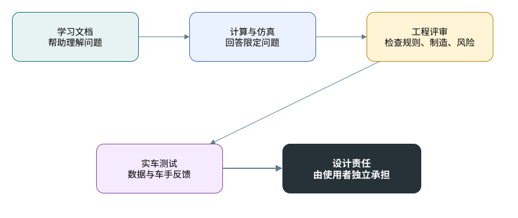
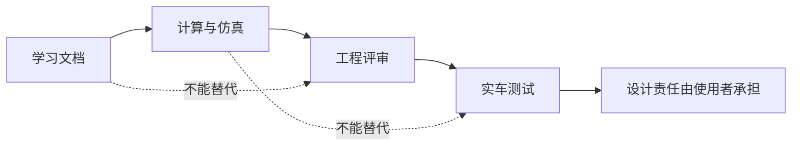

# Disclaimer

本仓库内容仅用于 FSAE / Formula Student 悬架学习、培训和经验整理。

## 责任边界图

本仓库不构成：

- 安全认证；
- 规则合规承诺；
- 最终工程设计建议；
- 结构强度保证；
- 赛事答辩标准答案；
- 对任何车辆、材料、零件或软件模型的适用性保证。

悬架设计涉及车辆安全。任何结构设计、参数选择、仿真结论、制造方案、装配方案、调校建议和赛场使用，都必须结合当年赛事规则、车辆目标、材料工艺、供应链、制造质量、测试条件和实车数据进行独立验证。

软件仿真和学习笔记只能帮助理解问题，不能替代工程评审、实物检查和测试验证。使用本仓库内容造成的设计风险、制造风险、测试风险或比赛风险，由使用者自行承担。
