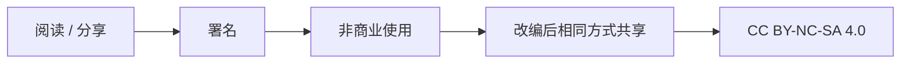

# Creative Commons Attribution-NonCommercial-ShareAlike 4.0 International

Except where otherwise noted, the public documentation, diagrams, HTML/CSS, and self-created assets in this repository are licensed under the Creative Commons Attribution-NonCommercial-ShareAlike 4.0 International License.

License summary:

- You may share and adapt the material.
- You must give appropriate credit.
- You may not use the material for commercial purposes.
- If you remix, transform, or build upon the material, you must distribute your contributions under the same license.

Full license text:

<https://creativecommons.org/licenses/by-nc-sa/4.0/legalcode>

Human-readable summary:

<https://creativecommons.org/licenses/by-nc-sa/4.0/>
