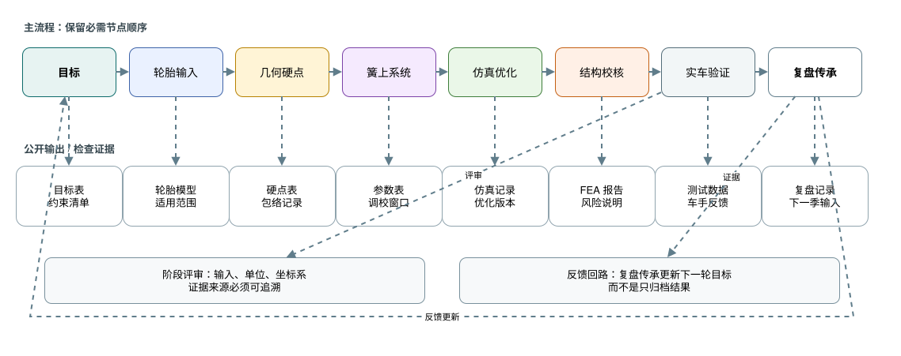

# FSAE 悬架学习路线

FSAE Suspension Learning Roadmap

这是一个面向 FSAE / Formula Student 车队的悬架学习仓库。它的目标不是替代教材、软件手册或车队导师，而是把悬架组新人到主力队员之间最容易断代的学习路径整理成可复核、可迭代、可复用的文档。

仓库内容以 Markdown、图解和轻量 HTML 导航为主，聚焦学习路线、工程方法和评审习惯；原始队内资料、历史参数表、未授权图片和内部记录不放在这里。

## 在线阅读入口

**推荐入口： [GitHub Pages 在线文档站](https://onebulletkick.github.io/suspension_opensource/)**

线上站点带侧边栏、搜索、页内目录和更适合连续阅读的排版。GitHub 仓库页面适合看源码、提交修改或下载文档；第一次阅读建议直接从 GitHub Pages 开始。

| 你想做什么 | 从哪里开始 | 建议读法 |
| --- | --- | --- |
| 快速了解这套资料 | [GitHub Pages 首页](https://onebulletkick.github.io/suspension_opensource/) | 先看“按身份进入”和“阅读路线”，再进入对应章节 |
| 新人入门悬架组 | [01 学习路线](https://onebulletkick.github.io/suspension_opensource/01-learning-roadmap/) | 按阶段建立基础概念、软件任务和交付物意识 |
| 准备做一版设计 | [02 设计目标](https://onebulletkick.github.io/suspension_opensource/02-design-targets/) | 顺着 02-08 章走完整设计链，不要跳过轮胎和输入 |
| 准备评审、答辩或复盘 | [10 检查清单](https://onebulletkick.github.io/suspension_opensource/10-checklists/) | 用清单反查目标、模型、结构校核、测试和资料边界 |
| 想深入技术细节 | [高级悬架工程手册](https://onebulletkick.github.io/suspension_opensource/advanced/) | 按高级手册 01-10 章阅读完整工程逻辑 |

这套资料按“先上手、再深挖、最后复核”的路径组织：`docs/00-10` 给新人建立路线和最小输出，`docs/advanced/` 展开工程推理链与检查方法，`docs/references.md` 只负责来源角色、资产登记和公开边界。读者不需要先从参考资料逐条读起；每章末尾的公开来源会指向它需要复核的依据。

## 视觉总览




## 适合谁

- 刚加入悬架组，需要知道先学什么、后做什么的新人。
- 已经能读懂基础概念，但不知道如何把知识转成设计流程的队员。
- 需要重新梳理悬架培训、软件培训和设计评审流程的车队。
- 想把悬架知识传承从口头经验变成开源文档的维护者。

## 从这里开始

| 章节 | 内容 |
| --- | --- |
| [00 如何使用本手册](docs/00-overview.md) | 阅读顺序、内容边界、图例说明 |
| [01 学习路线](docs/01-learning-roadmap.md) | 新人到主力队员的能力成长 |
| [02 设计目标](docs/02-design-targets.md) | 车辆目标、约束、跨组接口 |
| [03 轮胎与整车输入](docs/03-tire-and-vehicle-inputs.md) | 轮胎选择、模型边界、整车输入 |
| [04 几何与硬点](docs/04-geometry-and-hardpoints.md) | 主销、侧视/正视几何、硬点优化 |
| [05 弹簧阻尼与侧倾](docs/05-spring-damper-and-roll.md) | 偏频、阻尼、运动比、侧倾刚度 |
| [06 仿真与优化](docs/06-simulation-and-optimization.md) | K&C、参数优化、整车模型 |
| [07 载荷与结构校核](docs/07-loads-and-structure-check.md) | 载荷工况、金属件、复合材料件校核 |
| [08 验证与迭代](docs/08-validation-and-iteration.md) | 实车测试、数据对标、复盘答辩 |
| [09 软件路线](docs/09-software-roadmap.md) | 软件职责、最小可用工作流 |
| [10 检查清单](docs/10-checklists.md) | 评审、仿真、校核、测试、答辩清单 |
| [高级悬架工程手册](docs/advanced/README.md) | 更完整的设计逻辑、图解、输出物、常见错误和评审方法 |
| [参考资料](docs/references.md) | 公开资料和来源处理规则 |

也可以打开 [index.html](index.html) 作为本地导航页。

## 本地预览和使用

如果只是阅读，直接使用 [GitHub Pages 在线文档站](https://onebulletkick.github.io/suspension_opensource/) 最方便。

如果需要离线阅读或修改文档，可以克隆仓库后用 MkDocs 本地预览：

本地预览：

```bash
python3 -m venv .venv-docs
. .venv-docs/bin/activate
pip install -r requirements-docs.txt
mkdocs serve
```

## 学习原则

1. 先建立知识体系，再追求软件熟练度。
2. 每个参数都要能说清楚为什么设置、改动后会影响什么、和哪些组存在接口。
3. 软件仿真只回答它能回答的问题，不能替代规则审查、制造约束和实车验证。
4. 设计文档要留下推理过程，而不是只留下最终数值。
5. 传承的重点是让下一位队员能复现思考过程，而不是背诵上一年的方案。

## 免责声明

本仓库用于学习和经验整理，不构成安全认证、规则合规承诺或最终工程建议。悬架结构、强度、制造、装配、调校和赛场使用必须结合当年规则、车辆目标、材料工艺、仿真边界和实车测试进行独立验证。

完整说明见 [DISCLAIMER.md](DISCLAIMER.md)。

## 许可证

除非文件内另有说明，本仓库文档和自制资产采用 [Creative Commons Attribution-NonCommercial-ShareAlike 4.0 International](LICENSE.md) 许可。
