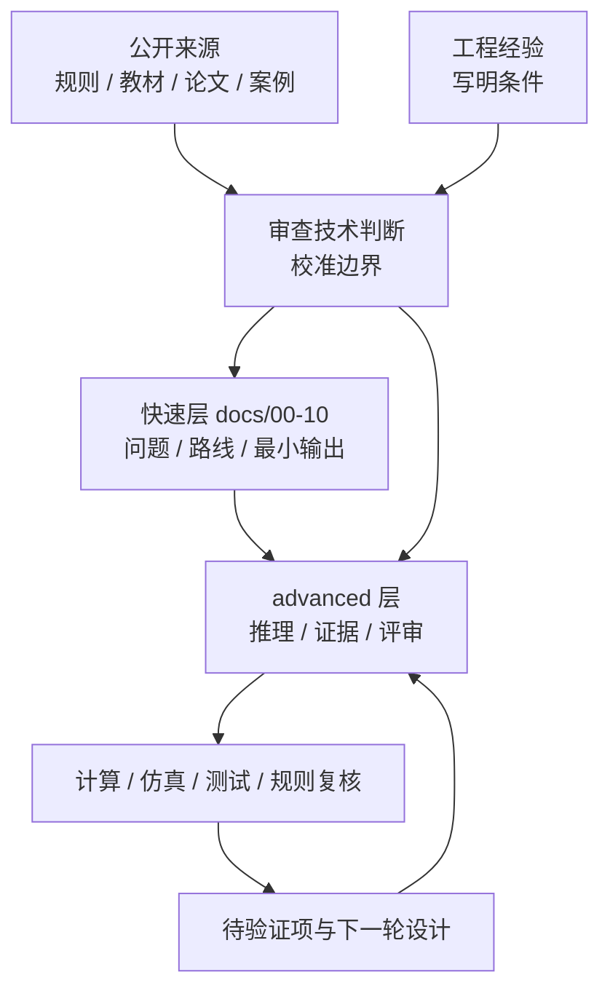

# 00 如何使用本手册

## 目标读者

这份手册写给 FSAE / Formula Student 悬架组新人、培训负责人和准备接手设计工作的队员。默认读者愿意学，但还没有把车辆动力学、轮胎、几何、结构、软件和实车验证连成一条完整的工程链。

## 手册定位

本仓库不是资料索引，也不是软件按钮教程。它是一条悬架学习路线，也是一套工程评审框架：读者应能沿着目标、轮胎、架构、硬点、弹簧阻尼、载荷、结构、验证、软件和答辩的顺序，说明一个悬架方案为什么成立、证据在哪里、哪些结论仍然需要复核。

手册里每个强结论都要能回答四个问题：

- 它来自当年规则、公开资料、计算、仿真、测试，还是有条件的工程经验；
- 输入、单位、坐标系、符号和适用边界是否写清；
- 结论能否被别人复算、复建模、复测或在设计评审中追问；
- 如果证据不足，正文是否已经降级为“待验证”或明确说明边界。

## 公开来源的作用

公开来源不是装饰正文的链接。它们用于审查和改进判断：规则资料决定哪些事情必须复核，教材和论文帮助检查理论链条，软件官方资料约束 workflow 的输入输出，公开案例提醒常见验证通道和误区。公开资料只能支撑它真正能支撑的内容，不能把某篇文章、某个团队报告或某个软件示例写成通用答案。

本仓库允许把工程经验改写成公开安全的学习材料，但必须说明适用条件。不能公开的原始团队内容、可反推历史方案的数据、受限资料、未经授权图表、内部评审记录和私有测试信息，都应留在团队自己的工程包中，而不是进入公开文档。

## 两层阅读结构

`docs/00-10` 是快速预览和学习路线层。它回答“这一阶段要问什么问题、要交付什么练习、要继续读哪里”。这一层不应该塞满细节推导，也不应该把读者淹没在来源表里。

`docs/advanced/` 是高级手册层。它负责展开推理链、模型边界、参数传递、软件 workflow、结构校核、测试相关性和评审清单。读者在快速层建立路线后，应到 advanced 章节里检查每个阶段的证据要求和实现细节。

| 层级 | 读法 | 读完应得到什么 |
| --- | --- | --- |
| 快速层 `docs/00-10` | 按章节顺序读，像教程和操作指南一样边读边做最小练习 | 知道下一步要问什么、交付什么、何时进入高级章节 |
| 高级层 `docs/advanced/` | 按当前设计任务跳读，也可以从 01 到 10 连续读 | 获得推理链、模型边界、证据等级和评审问题 |
| `references.md` | 需要核对来源、资产或公开边界时查阅 | 知道某个来源能支持什么、不能支持什么 |

## 推荐读法

1. 先读 [01 悬架学习路线](01-learning-roadmap.md)，把学习顺序、练习输出和 advanced 延伸章节对齐。
2. 再按 [02 设计目标](02-design-targets.md) 到 [08 验证与迭代](08-validation-and-iteration.md) 读完整工程链。
3. 遇到工具问题时查 [09 软件路线](09-software-roadmap.md)，把软件当成回答工程问题的手段，而不是学习目标本身。
4. 在目标评审、轮胎建模、硬点更新、仿真、结构校核、出车测试和答辩前使用 [10 检查清单](10-checklists.md)。
5. 需要更完整的推理和验证框架时进入 [高级悬架工程手册](advanced/README.md)。

## 证据等级

| 证据类型 | 可以支撑什么 | 使用边界 |
| --- | --- | --- |
| 规则与官方评审文件 | 合法性、提交物、设计答辩证据类型 | 必须按当年赛事和赛区复核，不能把旧文件写成永久规则 |
| 计算 | 单位明确的初步目标、载荷估算、rate 和几何关系 | 需要写清公式、变量、单位、坐标系和简化假设 |
| 仿真 | 参数趋势、模型对比、结构或整车响应 | 需要记录模型版本、输入来源、边界条件和未覆盖工况 |
| 测试 | 实车相关性、结构响应、调校反馈 | 需要说明传感器、校准、滤波、环境和数据质量 |
| 工程经验 | 条件化建议、常见误区、评审习惯 | 不能伪装成普遍真理，必须说明适用阶段和待验证项 |

如果一个结论同时缺少规则、计算、仿真、测试和清楚边界，它就不应写成强结论。

## 实践任务

为一个假想双横臂悬架建立一页学习档案，至少包含：

- 车辆目标和悬架要回答的问题；
- 轮胎与整车输入的来源和限制；
- 几何、硬点、弹簧、阻尼和抗侧倾杆的关键输出；
- 仿真、结构校核和测试计划；
- 每个强结论对应的证据类型；
- 仍需规则复核、实车验证或资料补充的待验证项。

## 注意事项

- 不要把公开来源当成结论本身；它们先用于审查问题和边界。
- 不要把软件输出当成工程事实；软件结果必须回到输入、模型和验证。
- 不要把旧队伍经验写成通用答案；经验必须有条件和风险说明。
- 不要把私有、受限或未经授权的材料带入公开仓库。

## 本章公开来源

- 官方规则与设计评审文件，用于把手册定位为从目标到证据的学习路线和评审框架。
- RCD / RCVD 的章节导航，用于建立车辆动力学、轮胎、悬架几何、ride / roll、载荷和测试的总体顺序。
- DesignJudges 相关文章，用于提醒设计文档应让目标、取舍、证据和验证路径可被评审。
- 完整章节索引见 [参考资料：章节引用索引](references.md#章节引用索引)。
