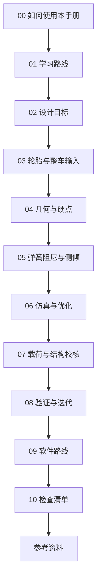

# 00 如何使用本手册

## 目标读者

这份文档写给 FSAE 悬架组的新人、培训负责人和准备接手设计工作的队员。默认读者愿意学习，但可能还没有系统学过车辆动力学、材料力学、有限元、控制、数据分析或专业仿真软件。

## 推荐入口

在线阅读优先使用 [GitHub Pages 文档站](https://onebulletkick.github.io/suspension_opensource/)。站点提供侧边栏、搜索和页内目录，适合按章节连续学习。仓库源码页更适合查看文件、提交修改和追踪版本。

## 手册定位

这不是资料索引，也不是软件教程集合。它是一套开源悬架技术文档：读者应能沿着目标、轮胎、几何、簧上系统、仿真、校核、验证和复盘的顺序理解一套悬架为什么这样设计。

本手册的重点不是给出某支车队、某一年赛车或某个软件模板的答案，而是把悬架设计拆成可讨论、可检查、可复盘的工程链条。每一章都尽量回答三个问题：

- 这一阶段要解决什么工程问题；
- 输入、输出、单位、坐标系和假设是否说清楚；
- 结论应由计算、仿真、测试或设计评审中的哪一种证据支撑。

## 学习目标

读完本仓库后，你应该能够：

- 把整车目标拆成悬架目标、接口约束和验证计划；
- 理解轮胎、几何、弹簧阻尼、载荷、结构校核和实车验证之间的因果关系；
- 说清楚一个参数为什么要设、如何计算、如何仿真、如何在车上验证；
- 判断软件结果的输入假设、边界条件和适用范围；
- 用检查清单把个人经验沉淀成团队可维护的学习文档。

## 视觉总览

## 推荐读法

1. 先读 [学习路线](01-learning-roadmap.md)，明确新人、软件学习、技术路线和主力队员之间的递进关系。
2. 读 [设计目标](02-design-targets.md)，确认悬架设计从车辆目标、规则、接口和约束开始，而不是从画硬点开始。
3. 按 [轮胎与整车输入](03-tire-and-vehicle-inputs.md)、[几何与硬点](04-geometry-and-hardpoints.md)、[弹簧阻尼与侧倾](05-spring-damper-and-roll.md)、[仿真与优化](06-simulation-and-optimization.md)、[载荷与结构校核](07-loads-and-structure-check.md)、[验证与迭代](08-validation-and-iteration.md) 的顺序读完整设计链。
4. 遇到软件问题时查 [软件路线](09-software-roadmap.md)，把软件当作回答工程问题的工具。
5. 每次目标评审、轮胎建模、硬点更新、仿真、结构校核、出车测试和答辩前使用 [检查清单](10-checklists.md)。

## 手册主线

02-08 是悬架设计的核心工程链，09 是穿插使用的工具查询章，10 用来把整条链变成可评审的清单。

| 顺序 | 章节 | 定位 | 要回答的问题 | 典型输出 |
| --- | --- | --- | --- | --- |
| 1 | 02 设计目标 | 核心链 | 今年赛车要什么，悬架受哪些边界约束 | 目标表、接口清单、设计分解 |
| 2 | 03 轮胎与整车输入 | 核心链 | 轮胎和整车输入是否足够支撑设计 | 轮胎选择说明、模型限制、整车参数表 |
| 3 | 04 几何与硬点 | 核心链 | 轮端应怎样运动，硬点是否能实现 | 硬点表、K&C 曲线、干涉检查 |
| 4 | 05 弹簧阻尼与侧倾 | 核心链 | 车身运动和轮胎载荷如何被管理 | 轮端刚度、运动比、阻尼和侧倾刚度说明 |
| 5 | 06 仿真与优化 | 核心链 | 哪些模型能回答当前设计问题 | 模型版本、参数研究、优化记录 |
| 6 | 07 载荷与结构校核 | 核心链 | 零件在定义载荷下是否安全 | 载荷表、FEA 报告、修改建议 |
| 7 | 08 验证与迭代 | 核心链 | 仿真结论是否能在实车上看到 | 测试计划、数据对比、复盘记录 |
| 8 | 09 软件路线 | 支撑章 | 不同软件和文档工具分别回答什么工程问题 | 最小工作流、可信输出、常见错误 |
| 9 | 10 检查清单 | 支撑章 | 设计链是否可以被评审和传承 | 评审问题、风险记录、答辩材料 |

## 内容分级

| 标记 | 含义 |
| --- | --- |
| 基础 | 新人应优先掌握，影响后续所有工作 |
| 进阶 | 主力队员需要理解，通常和仿真、优化、实车验证相关 |
| 研究 | 人手充足时探索，用于答辩、科研或下一代方案储备 |
| 待验证 | 需要结合规则、公开资料、仿真或实车数据继续确认 |

## 进阶阅读

完整技术层见 [高级悬架工程手册](advanced/README.md)。如果你已经读完快速预览，建议按高级手册的 01-10 章继续阅读，并用其中的输出物、常见错误和评审方法检查自己的设计档案。

## 实践任务

为一个假想双横臂悬架建立学习档案，至少包含：

- 车辆目标：例如轻量、稳定、易调校或极限性能；
- 轮胎选择与数据来源；
- 几何参数表；
- 弹簧、阻尼器、抗侧倾杆和运动比目标；
- 仿真、校核和测试模型清单；
- 需要和制动、车架、传动、空气动力学、电控沟通的接口；
- 每个结论当前依赖的是计算、仿真、实车测试还是工程经验。

## 注意事项

- 不要把历年经验直接当成普遍真理。经验需要写明适用条件。
- 不要把软件输出当成结论。软件结果必须回到输入假设、边界条件和实车验证。
- 不要把未经授权的队内资料、供应商资料、比赛文件、截图、表格或原始数据放进仓库。
- 不清楚来源或授权时，先把内容整理成通用工程判断，并标注需要资料或测试数据继续验证。

## 参考来源

本仓库文档来自公开资料和经过整理的工程经验。参考资料、引用建议和来源处理边界见 [references.md](references.md)。

## 本章公开来源

- RCD / RCVD 的章节导航，用于建立车辆动力学、悬架几何、轮胎、调校和测试的总体阅读顺序。
- [DesignJudges: Overall Vehicle Priorities](https://www.designjudges.com/articles/overall-vehicle-priorities)，用于把合法性、可靠性、性能和车手可控性放进同一阅读框架。
- [FSAE Design Judging Score Sheet](https://www.fsaeonline.com/content/fsae%20design%20score%20sheet%20150pt.pdf)，用于说明设计、制造、验证和理解都属于工程证据。
- 完整章节索引见 [参考资料：章节引用索引](references.md#章节引用索引)。
