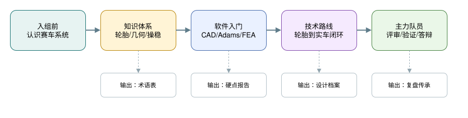
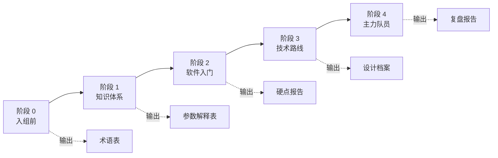

# 悬架学习路线

## 目标读者

这篇文档面向刚入组到准备成为主力队员的悬架成员。它回答一个朴素但很关键的问题：悬架到底应该按什么顺序学，才不会只会打开软件却说不清设计理由。

学习路线不是手册之外的建议，而是进入本手册的阅读路径。每个阶段都要连接到后续章节，并产出可以被别人检查的材料。

## 学习目标

- 建立从书本、软件、设计、校核到实车验证的完整路径。
- 明确每个阶段应该产出什么，而不是只记录读过什么。
- 理解学习路线和设计路线不是两条线，软件只是知识的具象化工具。
- 知道什么时候应该读哪一章、做什么练习、留下什么证据。

## 视觉总览

## 阶段总表

| 阶段 | 主要能力 | 对应章节 | 阶段产出 |
| --- | --- | --- | --- |
| 入组前 | 看懂赛车系统和悬架组成 | 00, 01 | 术语表 |
| 知识体系 | 理解轮胎、几何、操稳、力学基础 | 02-05 | 参数解释表 |
| 软件入门 | 建立可检查的硬点和基础校核 | 04, 06, 07, 09 | 硬点报告 |
| 技术路线 | 完成设计、仿真、校核和实车闭环 | 03-08 | 设计档案 |
| 主力队员 | 组织评审、答辩和传承 | 08, 10 | 复盘报告 |

## 阶段 0：入组前

重点是建立兴趣和最低限度的车辆概念。

对应章节：

- [00 如何使用本手册](00-overview.md)：知道本仓库不是资料堆叠，而是一条设计链。
- 本章：知道学习的阶段、产出和后续阅读顺序。

建议任务：

- 通读一本入门级赛车设计书，理解车辆由哪些系统构成。
- 了解 FSAE 赛事项目、设计答辩、成本答辩和动态赛的关系。
- 学会看简单三视图、硬点表、悬架结构图和基本英文工程词。

阶段产出：

- 一份术语表，至少包含中文名、常用英文名、它属于哪个系统、为什么会影响悬架。
- 能用自己的话解释双横臂悬架的基本组成。
- 能说出轮胎、弹簧、阻尼器、转向节、A 臂、推杆或拉杆分别在做什么。

注意事项：

- 入门书让你知道地图长什么样，不会直接让你完成一套悬架几何。
- 不要急着追软件教程。没有参数理解时，软件只会放大误解。

## 阶段 1：知识体系建立

重点是补车辆动力学和悬架设计的核心概念。

对应章节：

- [02 设计目标](02-design-targets.md)：学习目标、约束和接口如何进入设计。
- [03 轮胎与整车输入](03-tire-and-vehicle-inputs.md)：理解 tire data、tire model 和整车输入。
- [04 几何与硬点](04-geometry-and-hardpoints.md)：理解 hardpoints、K&C 和轮端运动。
- [05 弹簧阻尼与侧倾](05-spring-damper-and-roll.md)：理解 wheel rate、motion ratio、ride frequency 和 roll stiffness。

建议学习：

- 轮胎力学：侧偏角、外倾角、垂向载荷、侧偏刚度、摩擦椭圆。
- 悬架几何：主销内倾 kingpin inclination、主销后倾 caster、机械拖距 mechanical trail、轮距变化 track change、外倾增益 camber gain、侧倾中心 roll center。
- 弹簧阻尼：偏频 ride frequency、阻尼比 damping ratio、运动比 motion ratio、侧倾角刚度 roll stiffness、抗侧倾杆 anti-roll bar。
- 操稳基础：稳态转向、瞬态响应、载荷转移 load transfer、K&C 指标。
- 基础力学：理论力学、材料力学、振动基础的必要概念。

阶段产出：

- 一份参数解释表，说明每个设计参数的目标、约束和验证方式。
- 每个参数至少写清：符号、单位、正负方向、影响对象、对应章节、如何验证。

注意事项：

- 可以先会用工具，再逐步补足工具背后的理论，但不能永远停留在“会点按钮”。
- 不懂的基础力学要标注出来，后续在有限元和动力学模型中补上。

## RCD / RCVD 应读章节与关键知识

这里的 RCD 指 Derek Seward 的 *Race Car Design*，RCVD 指 Milliken & Milliken 的 *Race Car Vehicle Dynamics*。两本书的分工不同：RCD 更适合建立赛车设计和悬架实践的整体框架，RCVD 更适合补车辆动力学、轮胎、操稳和参数计算的理论深度。

章节号用于导航，不代替正式引用。不同版次和印刷的页码可能不同；写设计报告或公开引用时，应按自己手头版本在 [参考资料](references.md) 中补作者、版次、章节和页码。

| 阅读层级 | 推荐章节 | 关键知识 | 对应本仓库章节 |
| --- | --- | --- | --- |
| 入门必读 RCD | Ch.1 Racing Car Basics；Ch.3 Suspension Links；Ch.4 Springs, Dampers and Anti-roll Bars；Ch.5 Tyres and Balance；Ch.6 Front Wheel Assembly and Steering；Ch.11 Set-up and Testing | 赛车系统组成、悬架连杆、弹簧阻尼与防倾杆、轮胎平衡、前轮总成、转向、调校和测试 | 01, 03, 04, 05, 08 |
| 理论必读 RCVD | Ch.2 Tire Behavior；Ch.4 Vehicle Axis Systems；Ch.5 Simplified Steady-State Stability and Control；Ch.14 Tire Data Treatment；Ch.16 Ride and Roll Rates；Ch.17 Suspension Geometry；Ch.18 Wheel Loads；Ch.19 Steering Systems；Ch.21 Suspension Springs；Ch.22 Dampers | 轮胎行为、坐标系、稳态操稳、轮胎数据处理、ride rate / roll rate、悬架几何、轮载、转向系统、弹簧和阻尼 | 02, 03, 04, 05, 06 |
| 进阶选读 RCVD | Ch.6 Transient Stability and Control；Ch.7 Steady-State Pair Analysis；Ch.8 Force-Moment Analysis；Ch.9 g-g Diagram；Ch.20 Driving and Braking；Ch.23 Compliances | 瞬态响应、前后轴配对分析、力-力矩分析、g-g 图、驱动/制动、柔度 compliance 对实车表现的影响 | 06, 07, 08 |
| 接口选读 RCD | Ch.2 Chassis Structure；Ch.8 Brakes；Ch.9 Aerodynamics；Appendix 1 Pacejka Tyre Coefficients；Appendix 2 Tube Properties | 车架接口、制动接口、气动接口、Pacejka-style 轮胎参数入口、管材和结构基础 | 02, 03, 07 |

不要把这张表当成“读完章节就合格”的打卡表。读书的目的，是能把概念转成可检查的工程输出：

| 工程任务 | 必须学会回答的问题 | 建议输出 |
| --- | --- | --- |
| 坐标系与单位 | 车辆坐标轴、轮胎力、侧偏角、外倾角、前束和转向角的正方向是什么？CAD、Adams、脚本和报告是否一致？ | 坐标系与符号约定页 |
| 轮胎理解 | 侧偏角 slip angle、垂向载荷 normal load、外倾 camber、联合滑移 combined slip 和载荷敏感性如何改变可用抓地力？ | 轮胎参数解释表和数据覆盖说明 |
| 几何与硬点 | kingpin、caster、KPI/SAI、scrub radius、trail、roll center、camber gain、toe、bump steer 和 Ackermann 分别影响什么？ | K&C 指标解释表和硬点变更记录 |
| 弹簧阻尼与侧倾 | wheel rate、ride rate、roll rate、motion ratio、damping ratio、anti-roll bar 和轮胎垂向刚度如何连成参数链？ | 偏频、侧倾刚度和运动比计算表 |
| 载荷与操稳 | wheel loads、load transfer、understeer / oversteer、g-g 图、制动和驱动载荷如何影响参数选择和结构校核？ | 简化操稳说明和载荷假设表 |
| 调校与相关性 | set-up、testing、compliance 和 correlation 如何把软件结论带回实车？ | 测试计划、调校记录和仿真-实车差异清单 |

## 阶段 2：软件入门

重点是用最少的软件能力完成一套可讨论的悬架。

对应章节：

- [04 几何与硬点](04-geometry-and-hardpoints.md)：第一版硬点和 K&C 指标。
- [06 仿真与优化](06-simulation-and-optimization.md)：模型版本、参数研究和优化记录。
- [07 载荷与结构校核](07-loads-and-structure-check.md)：载荷、边界条件和基础 FEA。
- [09 软件路线](09-software-roadmap.md)：每类软件回答什么工程问题。

最低软件能力：

- CAD 或 AutoCAD：画出第一版硬点和基本布置。
- Adams Car 或同类多体软件：查看几何和 K&C 指标。
- Abaqus 或 Ansys：对典型金属结构做基础强度校核，理解约束和载荷的影响。
- MATLAB 或 Python：完成参数计算、绘图和简单敏感性分析。
- 表格工具：记录参数、单位、版本、来源和方案对比。

阶段产出：

- 一版可导入仿真的硬点。
- 一份几何参数报告。
- 一个基础 FEA 校核样例。
- 一份说明模型输入来源、单位和限制的硬点报告。

注意事项：

- 每个硬点改动都要记录理由。
- 软件模型必须注明坐标系、单位和输入来源。
- 先做到可复现，再谈优化。

## 阶段 3：技术路线

重点是把悬架从“能建模”推进到“能设计、能解释、能迭代”。

对应章节：

- [03 轮胎与整车输入](03-tire-and-vehicle-inputs.md) 到 [08 验证与迭代](08-validation-and-iteration.md) 是这一阶段的主线。
- [10 检查清单](10-checklists.md) 用于每次评审和阶段交付。

推荐顺序：

| 路线 | 核心问题 | 对应章节 | 典型输出 |
| --- | --- | --- | --- |
| 轮胎阶段 | 轮胎数据如何影响整车模型和参数选择 | 03 | 轮胎数据说明、模型选择、拟合质量记录 |
| 簧下阶段 | 硬点和杆系如何影响轮端运动 | 04 | 硬点表、干涉检查、K&C 报告 |
| 簧上阶段 | 弹簧阻尼和布置如何满足车辆目标 | 05 | 运动比、偏频、阻尼目标、布置约束 |
| 参数设定 | 参数改变会影响哪些指标 | 05, 06 | 参数敏感性记录、仿真对比 |
| 整车仿真 | 单个悬架模型如何进入整车分析 | 06 | 整车模型、轮胎模型、工况结果 |
| 结构校核 | 载荷和边界条件是否支撑制造放行 | 07 | 载荷表、FEA 报告、修改建议 |
| 实车验证 | 仿真结论是否能在车上看到 | 08 | 测试计划、数据分析、调校记录 |

阶段产出：

- 设计方案说明书。
- 关键参数变更日志。
- 仿真和实车验证的差异清单。
- 能追溯输入、输出、版本和评审结论的设计档案。

注意事项：

- 悬架设计不是单组闭门工作。制动、车架、传动、空气动力学、电控和车手反馈都会改变边界。
- 不要只追新结构。简单结构能否调好，常常比复杂结构更考验基本功。
- 任何“优化结果”都要说明优化目标、约束、输入版本和没有覆盖的工况。

## 阶段 4：主力队员

重点是从执行者变成技术路线负责人。

对应章节：

- [08 验证与迭代](08-validation-and-iteration.md)：把测试、数据、问题和下一版设计连起来。
- [10 检查清单](10-checklists.md)：组织评审、答辩和传承。

应具备能力：

- 能把车辆目标转成悬架设计目标。
- 能组织参数评审，并指出每个结论的证据来源。
- 能判断仿真模型是否足够可信。
- 能安排出车测试和数据分析任务。
- 能准备设计答辩，回答“为什么这么设计”和“如何证明有效”。

阶段产出：

- 一套可传承的设计档案。
- 一份赛前调校计划。
- 一份赛后复盘和下一代改进建议。
- 一份面向答辩的设计叙事：目标是什么、为什么这样设计、如何证明有效、还有哪些限制。

## 进阶阅读

学习路线的详细软件阶段、主力队员职责和评审交接逻辑见 [高级手册入口](advanced/README.md)、[09 软件工作流](advanced/09-software-workflows.md) 和 [10 评审清单](advanced/10-review-checklists.md)。

## 实践任务

选择一个参数，例如前悬静态外倾角、主销后倾角、侧倾中心高度或前后侧倾角刚度分配，完成一页说明：

- 参数定义和单位；
- 对应章节；
- 影响的车辆表现；
- 相关软件结果；
- 需要沟通的其他组；
- 实车验证方法；
- 你会如何向新人解释它。

## 参考来源

本路线由公开资料和经过改写的工程经验整理而成。公开参考资料和来源处理方式见 [references.md](references.md)。
