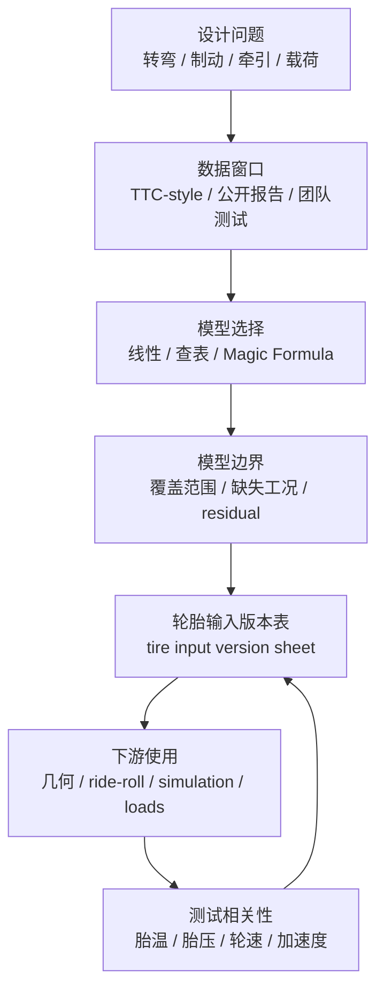

# 03 轮胎与整车输入

## 这章解决什么问题

轮胎数据是悬架设计的第一个真实工程输入，不是硬点画完之后才补上的附件。车辆能获得多少纵向力、侧向力和回正力矩，轮胎在不同轮荷下怎样衰减，外倾 camber、胎压、温度和 slip 工况是否有数据支撑，都会提前限制几何、弹簧阻尼、整车仿真和结构载荷。

本章面向刚开始接触轮胎分析的新队员：先学会把“我想知道什么”转成数据窗口、模型选择和版本记录，再把结论交给后续章节。更完整的坐标、拟合、残差和动态轮荷处理见 [高级 02 轮胎与整车输入](advanced/02-tire-and-vehicle-inputs.md)。

## 初学者先问的五个问题

| 问题 | 最低需要记录 | 不能偷换成 |
| --- | --- | --- |
| 这条轮胎服务哪个设计目标？ | 目标工况：低速弯、制动入弯、加速、耐久、包络或教学 | “峰值 `F_y` 最大所以最好” |
| 数据覆盖哪些窗口？ | `F_z` 轮荷、slip angle、slip ratio、camber、胎压、温度、速度、轮辋 | “有 TTC / 有曲线” |
| 哪些窗口缺失？ | 联合滑移、温度、胎压层级、低载/高载、纵向制动、垂向刚度或高频输入 | 把缺口藏进模型 |
| 需要哪种模型？ | 线性、查表、Magic Formula / Pacejka-style 或只保留待验证假设 | 为了显得高级直接上复杂模型 |
| 结论交给谁？ | 几何、ride/roll、整车仿真、结构载荷、测试和答辩需要的输出 | 只把模型文件发给仿真同学 |

## 从轮胎问题到模型选择

| 设计问题 | 推荐起点 | 可用输出 | 必须写清的模型边界 |
| --- | --- | --- | --- |
| 新队员理解侧偏和 load sensitivity | 线性模型 linear model 或公开教程曲线 | 侧偏刚度、载荷敏感性趋势、单位和符号练习 | 只用于小 slip angle 附近，不解释峰值、联合滑移和温度变化 |
| 候选轮胎比较 | 查表模型 lookup table 与覆盖矩阵 | 同一 `F_z`、camber、胎压和 slip 窗口内的趋势比较 | 不能跨不同测试窗口排名；缺失窗口标成待验证 |
| 整车仿真与参数研究 | Magic Formula / MF-Tyre / Pacejka-style | 软件可读的轮胎模型、残差图、导出版本 | 拟合精度只在数据覆盖窗口内成立；参数不是物理常数 |
| 制动入弯或出弯牵引 | 需要联合滑移 combined slip 数据或明确替代模型 | `F_x` 与 `F_y` 相互削弱的趋势 | 没有联合数据时，只能写成保守假设或待验证推断 |
| 结构载荷和耐久风险 | 轮胎力趋势 + 独立载荷工况 + 实车验证计划 | upright、A 臂、拉杆、摇臂和车架支座的载荷输入边界 | 准静态操稳模型不能证明路肩、坑洼或高频冲击安全 |

这个顺序比“先选软件”更可靠：先确认工程问题，再看数据覆盖，最后选能回答问题的最低复杂度模型。MathWorks MF-Tyre 或类似工具可以帮助拟合和导出 Magic Formula 模型，但公开来源只支持把它写成 workflow，不支持声称某个模型天然准确。

## 轮胎输入版本表

每次轮胎选择、数据清洗、拟合权重或整车输入更新后，都应更新一张 tire input version sheet。它可以是表格、Markdown 或工程库中的记录，但字段要能让后续成员复现“这一版模型为什么能用、不能用在哪里”。

| 字段 | 推荐写法 | 为什么重要 |
| --- | --- | --- |
| 版本号与日期 | `tire-input-v0.3`, 日期、维护人、更新原因 | 后续几何和仿真结论能追溯 |
| 数据来源角色 | TTC-style 授权数据、公开报告结构、团队测试、估算 | 区分受限数据、公开来源和工程假设 |
| 覆盖窗口 | `F_z`、slip angle、slip ratio、camber、胎压、温度、速度、轮辋 | 读者能看见模型边界 |
| 缺失窗口 | 联合滑移、温度、胎压、垂向刚度、高频载荷等 | 避免把 unsupported claim 写成结论 |
| 模型形式 | 线性、查表、Magic Formula / Pacejka-style、替代假设 | 防止模型复杂度超过数据支撑能力 |
| residual 与验证 | 设计窗口 residual、单轮扫描、holdout 或实车 correlation 计划 | 拟合好看不等于设计可信 |
| 下游交付 | 给几何、ride/roll、仿真、结构和测试的具体字段 | 防止每个小组使用不同版本 |
| 更新触发 | 新轮胎、新胎压、新质量/质心、新测试数据、新模型形式 | 让模型随整车状态更新 |

公开文档可以展示字段和判断逻辑，不发布 TTC 数据表、原始曲线、模型拟合参数、模型系数或可反推出历史车辆的信息。

## 数据窗口必须可见

常见公开资料能说明 FSAE / Formula Student 轮胎建模的工作方式：Calspan 和 FSAE TTC 说明了授权轮胎数据生态，MathWorks 说明了 MF-Tyre / Magic Formula 的拟合和导出任务，Formula U、WUSTL 等公开报告说明了数据边界、模型用途和 residual 审查写法，FS Wiki 适合入门术语。但这些公开来源不能替代团队自己的数据授权、坐标定义和验证。

写轮胎章节时，至少把这些边界摆出来：

- TTC-style 数据来自特定测试台架、轮辋、胎压、温度历史、速度和流程；它不是“真实赛道完整答案”。
- load sensitivity 应按设计轮荷窗口讨论，不能只看某一条高载曲线。
- combined slip、温度、胎压、垂向刚度、高频载荷和瞬态响应如果没有覆盖，应写成待验证或替代假设。
- Magic Formula / Pacejka-style 参数只是在给定数据和权重下的模型接口，不是轮胎物理常数。
- 残差 residual 要看设计窗口、低载/高载、camber、slip angle、slip ratio 和 `F_x` / `F_y` / `M_z`，不能只看一个总体误差。

## 轮胎结论如何流向后续章节

| 下游章节 | 需要从本章拿到什么 | 如果边界不清会发生什么 |
| --- | --- | --- |
| [04 几何与硬点](04-geometry-and-hardpoints.md) | 轮胎尺寸、轮心包络、camber 工作窗口、侧偏刚度和回正力矩趋势 | 硬点优化可能追求数据没有支持的外倾或 toe 趋势 |
| [05 弹簧阻尼与侧倾](05-spring-damper-and-roll.md) | 动态轮荷范围、load sensitivity、轮胎垂向刚度假设、胎压敏感性 | 侧倾刚度分配只在静态角重下看起来合理 |
| [06 仿真与优化](06-simulation-and-optimization.md) | 轮胎模型版本、坐标、单位、适用范围、未覆盖工况 | 整车仿真会把外推结果误当成赛道结论 |
| [07 载荷与结构校核](07-loads-and-structure-check.md) | 轮胎力边界、制动/转向组合、动态轮荷、额外冲击工况 | 操稳模型输出被误用为结构耐久载荷 |
| [08 验证与迭代](08-validation-and-iteration.md) | 胎温、胎压、轮速、加速度、方向盘、制动压力和悬架位移计划 | 实车不一致时无法判断是模型、传感器还是车辆状态问题 |

## 实践任务

为当前项目做一版公开安全的轮胎输入版本表。不要填入受限数据和模型系数，只写字段、版本、覆盖窗口、缺失窗口、模型选择理由、下游交付物和待验证事项。完成后问自己三件事：

1. 几何同学能否知道要保护哪些 camber 和轮心包络？
2. ride/roll 同学能否知道主要轮荷范围和载荷敏感性风险？
3. 仿真和结构同学能否知道哪些输出可以定量使用，哪些只能当趋势？

## 常见错误

- 把轮胎数据当作后处理附件，而不是目标、几何和 rates 之前的输入边界。
- 只按峰值侧向力选胎，不看数据覆盖、轮荷窗口、外倾敏感性、胎压和可采购性。
- 把缺失的联合滑移、温度或胎压窗口藏在 Magic Formula 模型里。
- 用不同来源的质量、质心、轮距、气动和轮胎版本组成同一个整车模型。
- 把 residual 平均值写得很漂亮，却不看设计窗口内的局部失真。
- 把拟合参数、原始曲线或受限 TTC 数据带进公开文档。

## 验证方式

- `F_z`、slip angle、slip ratio、camber、胎压和温度覆盖矩阵已经写清。
- 模型边界说明里明确列出联合滑移、温度、压力、垂向刚度和高频载荷是否支持。
- 单轮扫描能解释 `F_x`、`F_y`、`M_z` 的方向、单位和趋势。
- 下游几何、ride/roll、仿真和结构章节使用同一版 tire input version sheet。
- 实车 correlation 计划包含胎温、胎压、轮速、加速度、方向盘、制动压力和悬架位移。

## 本章公开来源

- [Calspan FSAE Tire Test Consortium](https://calspan.com/automotive/fsae-ttc) 和 [Formula SAE Tire Test Consortium](https://www.fsaettc.org/)，用于说明 TTC-style 数据生态、授权价值和覆盖边界。
- [MathWorks: Magic Formula Tire Modeling in Formula Student](https://blogs.mathworks.com/student-lounge/2022/06/07/mf-tyre/)，用于说明 Magic Formula / MF-Tyre 的模型选择、拟合、有效范围检查和导出 workflow。
- [Formula U Racing Tire Model Development](https://uen.pressbooks.pub/range26i1/chapter/cantrell/) 与 [WUSTL Tire Modeling and Data Analysis](https://openscholarship.wustl.edu/cgi/viewcontent.cgi?article=1311&context=mems500)，用于公开报告结构、数据窗口、模型用途和 residual 审查写法。
- [FS Wiki: Tires](https://fswiki.us/Tires)，用于 slip angle、load sensitivity、TTC 和轮胎建模入口的入门术语。
- 完整章节索引见 [参考资料：章节引用索引](references.md#章节引用索引)。
