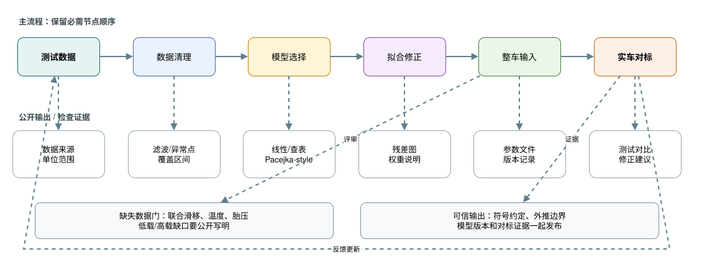
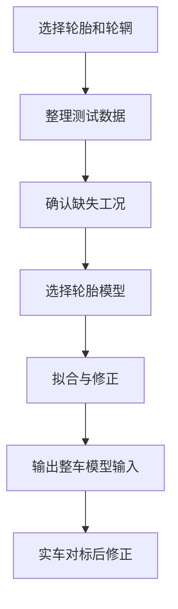

# 03 轮胎与整车输入

## 这章解决什么问题

轮胎决定了悬架设计能不能把力真正传到地面。悬架几何、弹簧阻尼、整车仿真和载荷校核都需要轮胎与整车输入作为边界。本章说明如何选择轮胎、整理数据、选择轮胎模型，并把不确定性公开写进设计记录。

## 设计输入

| 输入项 | 需要记录什么 | 为什么重要 |
| --- | --- | --- |
| 轮胎尺寸/轮辋 | 轮胎规格、轮辋宽度、外径、胎宽、质量、安装包络 | 决定轮心、轮辋内空间、制动布置和簧下质量 |
| 垂向载荷范围 | 静态角重、制动/加速/转弯载荷转移、气动载荷估算 | 轮胎力不是线性随载荷增加，设计必须覆盖真实工作区间 |
| 侧向/纵向/联合工况 | 侧偏角、滑移率、联合滑移数据是否可用 | 决定模型能否支持转弯、制动、牵引和整车仿真 |
| 外倾角/胎压 | 数据覆盖的 camber、pressure、温度或热状态 | 影响峰值力、侧偏刚度、磨耗和实车调校解释 |
| 数据来源/处理 | 数据版本、筛选规则、滤波、单位转换、异常点处理 | 保证拟合结果能追溯，也方便后续成员复核 |

## 判断逻辑

本 quick chapter 只介绍轮胎数据到整车输入的工作流。轮胎模型的坐标边界、数据 / 模型 / 拟合 / residual 区分，以及外推限制，详见 [高级 02 轮胎与整车输入](advanced/02-tire-and-vehicle-inputs.md)。

### 轮胎模型服务设计问题

如果只是做早期方案比较，简化曲线和线性化刚度可能已经足够；如果要做极限操稳、制动入弯或控制耦合，就需要更完整的轮胎模型。模型复杂度应由问题决定，而不是由软件菜单决定。

### 模型选择和拟合骨架

| 模型类型 | 适合回答的问题 | 输入要求 | 使用边界 |
| --- | --- | --- | --- |
| 线性模型 linear model | 早期侧偏刚度估算、简化操稳模型、趋势教学 | 设计载荷附近的小侧偏角数据或公开估算 | 只适合小滑移、近似线性区，不能解释峰值和饱和 |
| 查表模型 lookup table | 比较轮胎候选、做参数扫掠、保留实测曲线形状 | 覆盖载荷、外倾、胎压和滑移范围的数据网格 | 插值范围要写清楚，外推结果只能作为风险提示 |
| Pacejka-style 模型 | 整车仿真、优化、联合工况趋势和软件接口 | 侧向、纵向、联合滑移、垂向载荷、外倾等多工况数据 | 参数有耦合，拟合好看不等于物理真实，需要残差和实车对标 |

严肃初学者可以按这个顺序推进：先用线性模型看懂侧偏刚度和载荷敏感性，再用查表模型保持数据直观，最后在需要整车软件接口或联合工况时拟合 Pacejka-style 参数。

常见公开轮胎数据集会覆盖若干垂向载荷、外倾角、胎压、侧偏角或滑移率组合，但不一定覆盖你的车真实会遇到的全部温度、轮辋、联合制动转弯和低速瞬态工况。写模型说明时应列出“已覆盖区间”和“未覆盖区间”，不要让读者误以为数据天然完整。

拟合记录至少包含：

- 权重 weights：说明更重视峰值力、线性区斜率、过峰后趋势、低载区域还是设计载荷附近误差。
- 残差图 residual plots：按载荷、外倾、侧偏角、滑移率分组画残差，避免一个平均误差掩盖局部失真。
- 符号约定 sign conventions：写明侧偏角、外倾角、纵向滑移、轮胎力和力矩的正方向。
- 版本 versioning：记录原始数据版本、清洗脚本版本、模型形式、参数文件和拟合日期。
- 验证边界 validation boundary：说明模型只在哪些载荷、外倾、胎压、滑移和速度范围内用于设计判断。

### 缺失数据必须写出来

常见缺口包括联合滑移、纵向制动、不同胎压、不同温度、低载或高载区间、不同轮辋宽度。缺失数据可以用保守假设或相近模型启动设计，但必须标注“这是替代假设”，并说明它可能影响哪些结论。

### 拟合要版本化

轮胎模型参数、拟合脚本、筛选后的数据和输出图应有版本号。每次改变数据清洗方法、拟合权重、模型形式或参数边界，都应记录差异。否则整车仿真结论很难复现。

### 关注轮胎动载

静态角重只是起点。制动、加速、转向、路面起伏、气动和弹簧阻尼都会改变轮胎动态垂向载荷。悬架设计需要检查轮胎在主要工况中的工作区间，而不是只看静态工况下的峰值抓地力。

## 输出

| 输出物 | 最低内容 |
| --- | --- |
| 轮胎选择说明 | 候选轮胎比较维度、选择理由、风险和替代方案 |
| 数据覆盖说明 | 已覆盖的载荷、外倾、胎压、侧偏、滑移率和缺失工况 |
| 轮胎模型包 | 模型形式、参数版本、拟合脚本、拟合图和适用范围 |
| 整车输入表 | 质量、质心、轴距、轮距、气动假设、制动/传动边界版本 |
| 对标计划 | 实车如何采集加速、制动、转弯、胎温、胎压和悬架位移数据 |

## 常见错误

- 只按峰值侧向力选胎，不看载荷敏感性、外倾敏感性和可用数据质量。
- 把缺失工况藏在模型里，导致整车仿真看似完整但结论不可追溯。
- 用不同来源的质量、质心、气动和轮胎版本混在同一个模型里。
- 只看拟合误差数字，不看曲线形状是否在设计区间内合理。
- 把轮胎拟合系数当成物理常数，或把未覆盖工况的外推结果当成赛道结论。
- 把模型输出当成真实轮胎行为，忘记它需要实车数据对标。

## 验证方式

- 画出轮胎力和力矩随垂向载荷、外倾、侧偏角、滑移率变化的曲线。
- 对比拟合结果和输入数据，重点看设计工况范围，而不是只看全局误差。
- 做载荷敏感性检查：改变角重、气动载荷或载荷转移后，结论是否改变。
- 用实车测试数据对标：加速度、制动距离、稳态圆、胎温、胎压和车手反馈。
- 在模型更新后，回归检查关键结论是否仍成立。

## 和其它组的接口

| 组别 | 交互重点 |
| --- | --- |
| 车架/总布置 | 轮胎外径、胎宽、轮距、轮跳包络和维护空间 |
| 制动 | 轮辋内空间、制动盘/卡钳包络、制动力需求和制动稳定性 |
| 传动 | 牵引力需求、半轴或链传动空间、驱动轮动态载荷 |
| 气动 | 离地高度、姿态变化、气动载荷随车速变化 |
| 数据/电控 | 轮速、加速度、方向盘、制动压力、悬架位移和数据同步 |
| 测试 | 胎压、胎温、路面、测试顺序、每次调校变量 |

## 进阶阅读

轮胎数据覆盖、模型可信边界、拟合流程、动态轮荷和整车输入版本管理见 [高级 02 轮胎与整车输入](advanced/02-tire-and-vehicle-inputs.md)。
