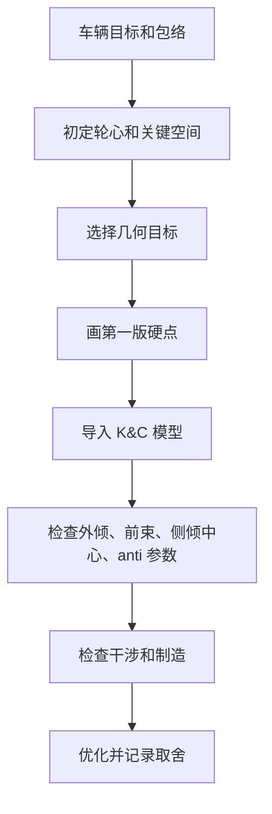

# 04 几何与硬点

## 这章解决什么问题

几何与硬点 hardpoints 决定轮胎在跳动、转向、侧倾、制动和加速时如何运动。新队员最容易误解的一点是：硬点不是把几个变量丢进软件后直接“优化”出来的坐标。它们先来自车辆目标、轮胎工作窗口、规则门槛、轮辋和 upright 包络、车架与传动空间、气动和车身边界、减振器或摇臂布置、制造与测量能力，然后才进入 K&C 和优化。

软件的价值是让取舍可见：它能帮助你发现趋势、干涉、符号错误和敏感变量，但不能替你决定目标，也不能替代真实可制造边界。

## 关键判断

所有几何曲线都必须先说明坐标系、正负方向和输入条件，否则 bump steer、camber gain、roll center migration 的判断很容易反向。几何参数之间高度耦合，不能把某一个曲线或数字当成单独答案。

| 项目 | 不能孤立优化的原因 | 初学者应同时检查 |
| --- | --- | --- |
| camber / camber gain | 外倾变化服务轮胎工作窗口，但过度追求会伤害直线制动、轮胎磨耗、包络和结构路径 | 轮胎模型、侧倾角、静态 camber、turning camber、轮辋空间 |
| toe / bump steer | 前束趋势影响稳定性和响应，但“零 bump steer”不自动等于最佳车 | 转向机位置、拉杆角度、柔性、车手反馈、直线阻力 |
| roll center | 静态高度只是一个点，迁移趋势和 jacking tendency 同样重要 | 外倾、轮距变化、侧倾刚度、车高、气动平台 |
| kingpin / caster / KPI / scrub / trail | 主销几何同时改变回正、方向盘力、制动稳定、轮辋包络和 upright 载荷 | 轮辋 offset、制动件、轴承、转向臂、轮胎 aligning moment |
| anti-dive / anti-squat | anti 参数只是姿态管理的一部分，不是越高越好 | 纵向力路径、质心高度、阻尼、杆件载荷、车架节点 |
| Ackermann | 教材理想转角关系不等于真实轮胎最佳转向策略 | 低速半径、轮胎侧偏、载荷转移、转向系统柔性 |

## 第一版硬点的最低输入

第一版硬点不需要完美，但必须真实。画点之前至少要把下面这些输入放到同一套坐标系里，并标明哪些已经冻结、哪些只是临时假设。

| 输入 | 最低要知道什么 | 会限制什么 |
| --- | --- | --- |
| 轮胎 tire | 外径、宽度、目标工作窗口、轮胎包络和接地点定义 | 轮心、camber / toe 目标、车身开口和行程 |
| 轮辋 rim / wheel | offset、内壁空间、紧固件和工具空间 | 球铰位置、scrub radius、制动和 upright 包络 |
| upright / hub | 轴承、轮毂、上下外点、转向臂、传感器空间 | steering axis、载荷路径、外点可制造性 |
| 制动 brake | 制动盘、卡钳、油管、散热和极限姿态间隙 | 轮辋 clearance、转向角、维护路径 |
| 转向 steering | 齿条位置、行程、内外拉杆点、方向盘力目标 | bump steer、Ackermann、极限转角和拉杆摆角 |
| 车架 frame | 车架管、节点、驾驶员空间、踏板、支座焊接面 | A 臂内点、摇臂/减振器支座、载荷导入路径 |
| 传动 drivetrain | 半轴、差速器、电机或链传动、极限角度 | 后悬内点、anti-squat、轮心路径和包络 |
| 气动/车身 aero / bodywork | 底板、扩散器、翼面、车身开口、目标车高 | 轮胎包络、车高变化、维护和 inspection |
| 减振器/摇臂 damper / rocker | 推杆或拉杆、摇臂、弹簧、限位、传感器 | motion ratio、行程利用、杆件载荷和拆装 |

## 工作流程

1. 先确定坐标系、单位和车辆基准面。硬点表必须让 CAD、多体软件和结构分析使用同一套定义。
2. 依据轮胎、轮辋、制动、转向节和车架空间确定轮心与关键包络。
3. 选择几何目标，例如外倾变化率、前束变化、侧倾中心高度和迁移、主销参数、anti 参数和转向几何。
4. 画第一版硬点，并快速检查杆件是否能真实安装，同时核对 wheel travel、jounce、轮辋间隙和安装点可见性等规则派生门槛。
5. 导入 K&C 模型，跑平行跳动、单轮跳动、转向、侧倾和回弹工况。
6. 对干涉、制造、维护和传感器空间做 CAD 复核。
7. 做优化时记录设计变量、目标函数、约束、权重、退出条件和被放弃方案。

K&C 与 compliance 的边界见 [高级 03 几何与硬点](advanced/03-geometry-and-hardpoints.md)：刚体 K&C 可做第一轮趋势筛选，说明该硬点版本在理想刚体约束下的运动趋势；它不能直接证明实车在制动、侧向力、路肩或驱动载荷下的 toe / camber 行为。要写实车载荷下的 compliance 结论，需要柔性假设、载荷路径、测量或测试证据。

## 硬点优化示例

下面的表不是推荐数值，而是记录方式示例。真正优化时应替换成自己的坐标系、车型目标、包络和验证证据。

| 示例变量 | 约束 | 目标 | 可能被拒绝的取舍 |
| --- | --- | --- | --- |
| 上 A 臂内点高度 | 不与车架管、减振器和驾驶员空间冲突 | 改善外倾增益和侧倾中心迁移 | 曲线更好但支座载荷路径变差，制造不可接受 |
| 下 A 臂内点横向位置 | 保持杆件夹角、轮辋空间和支座可焊性 | 控制轮距变化和 jacking tendency | 轮距变化减小但杆件太短，关节角度过大 |
| 转向拉杆内点 | 转向机行程、拉杆角度和车架空间固定 | 降低 bump steer，保持合理 Ackermann | bump steer 改善但转向机位置侵占踏板或车架节点 |
| Upright 外点布置 | 轮辋、制动卡钳、轴承和紧固件空间 | 平衡 KPI、caster、scrub radius 和机械拖距 | 转向反馈更强但制动稳定性或转向力矩风险增加 |
| 推杆/拉杆点 | 摇臂空间、杆件压屈、行程和传感器空间 | 得到平滑 motion ratio 和可维护布置 | 运动比漂亮但杆件受力、行程或拆装不可接受 |

## 输出

| 输出物 | 最低内容 |
| --- | --- |
| 硬点表 | 坐标系、单位、左右/前后定义、版本、来源 |
| K&C 报告 | 外倾、前束、bump steer、侧倾中心、轮距变化、anti 参数 |
| 包络与干涉记录 | 轮跳、回弹、转向、侧倾、制动和驱动极限姿态 |
| 取舍记录 | 每次硬点变化的目的、影响、代价和评审结论 |
| 接口确认 | 车架、转向、制动、传动、气动和制造的确认状态 |

## 常见错误

- 只优化 K&C 曲线，却没有确认杆件、支座、紧固件和工具空间。
- 坐标系或正负方向混乱，导致 CAD 和多体模型互相对不上。
- 改硬点没有记录原因，下一位队员无法判断哪些限制还存在。
- 只看单个指标，例如侧倾中心高度，而忽略外倾、前束、轮胎和车手感受。
- 在静态装配姿态不干涉，但在跳动、转向或侧倾组合姿态发生碰撞。

## 验证方式

- K&C 基础工况：平行跳动、单轮跳动、转向、侧倾、回弹、制动姿态和驱动姿态。
- 曲线合理性：检查趋势、突变点、左右一致性和单位，不只看最终数值。
- CAD 干涉：轮辋、制动、拉杆、A 臂、车架、车身、气动件和紧固件。
- 规则包络：含车手状态下的可用行程、轮辋内 clearance、安装点检查路径和 wheelbase / track 定义。
- 结构路径：确认硬点能把载荷传到合理的车架节点，并能支持后续 FEA。
- 制造装配：确认支座可加工、可焊接、可定位、可测量、可维护。

## 和其它组的接口

| 组别 | 需要同步 |
| --- | --- |
| 车架 | 内点坐标、支座空间、节点载荷、装配和维护路径 |
| 转向 | 转向机位置、拉杆点、转角范围、bump steer 和 Ackermann |
| 制动 | 盘/卡钳/油管包络、散热空间、极限姿态间隙 |
| 传动 | 半轴角度、链传动或电机包络、驱动工况行程 |
| 气动/车身 | 轮胎包络、车身开口、底板/翼面空间、车高变化 |
| 制造/测试 | 工装定位、测量基准、调整结构和传感器安装位 |

硬点变化不是悬架组内部的小改动。任何主要 geometry change 都应触发簧上系统、整车仿真、载荷提取、结构校核和验证计划复查，否则后续章节可能还在使用旧几何。

## 进阶阅读

主销、侧视/前视几何、硬点初始化、优化、K&C / compliance 边界和 CAD 制造评审见 [高级 03 几何与硬点](advanced/03-geometry-and-hardpoints.md)。几何相关公开来源、采用边界和验证提醒见 [参考资料：章节引用索引](references.md#章节引用索引)。

## 本章公开来源

- [SAE 971584: Introduction to Formula SAE Suspension and Frame Design](https://saemobilus.sae.org/papers/introduction-formula-sae-suspension-frame-design-971584)，用于新车队理解 track、wheelbase、tire / wheel 和 geometry 的设计顺序。
- [SAE 2002-01-3310: Design of Formula SAE Suspension](https://saemobilus.sae.org/papers/design-formula-sae-suspension-2002-01-3310) 与 [SAE 2005-01-3994: Formula SAE Suspension Design](https://saemobilus.sae.org/papers/formula-sae-suspension-design-2005-01-3994)，用于理解 control arm、upright、spindle、hub、pullrod、CAD 包络和多体模型如何组成系统边界。
- [FS Wiki: Suspension Geometry and Kinematics](https://fswiki.us/Suspension_Geometry_and_Kinematics)，用于补充 camber、toe、kingpin、caster、roll center 和 CAD sketch 的入门解释。
- [DesignJudges: Simple Kinematic Philosophies](https://www.designjudges.com/articles/simple-kinematic-philosophies)，用于提醒几何曲线要服务 toe 稳定、camber 工作窗口、制造和调校，而不是追求孤立数字。
- [MIT DSpace: Optimization of a Formula SAE Vehicle's Suspension Kinematics](https://dspace.mit.edu/entities/publication/552bc5c1-9705-4a17-847d-9a9a9ff27b60)，用于理解目标函数、约束和指标如何写清楚，不套用其硬点或权重。
- [Will Harvey: Formula SAE Suspension Kinematics](https://wthprojects.com/fsae-kinematics)、[Monash Motorsport suspension thesis collection](https://www.monashmotorsport.com/blog/2011suspensionthesis) 与 [Design of a suspension system for a Formula Student race car](https://skemman.is/bitstream/1946/31391/1/MSc_Ingi_Niels_Karlsson_2018.pdf)，用于说明硬点约束聚合、CAD 检查、制造验证和报告结构；不复制案例坐标、图表或目标值。
- 完整章节索引见 [参考资料：章节引用索引](references.md#章节引用索引)。
