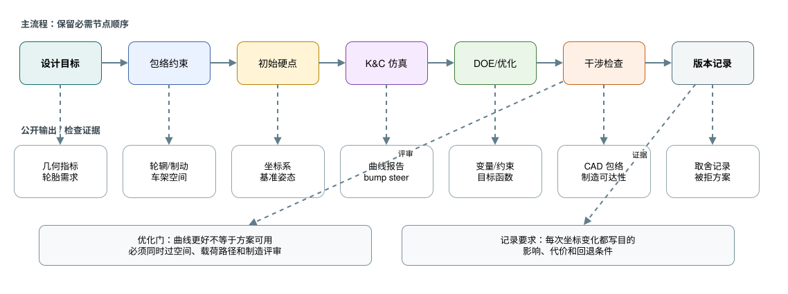
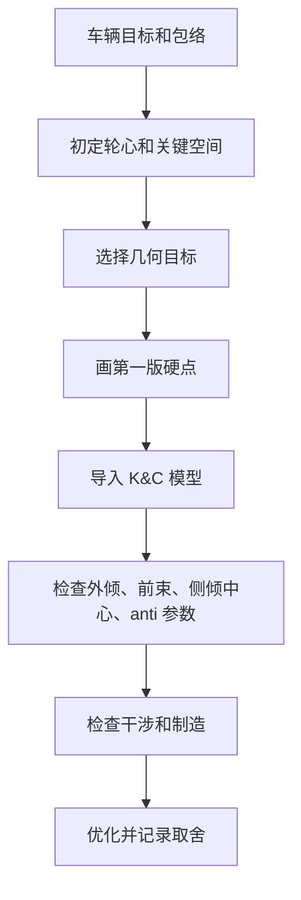

# 04 几何与硬点

## 这章解决什么问题

几何与硬点决定轮胎在跳动、转向、侧倾、制动和加速时如何运动。好的硬点不是软件优化出来的一串坐标，而是在车辆目标、轮胎需求、空间包络、制造能力和可验证指标之间取得的工程方案。

## 关键判断

| 项目 | 主要关注 | 判断方式 |
| --- | --- | --- |
| Kingpin 主销几何 | 主销内倾 KPI、主销后倾 caster、机械拖距、scrub radius、转向回正和转向力矩 | 同时看轮辋空间、转向手感、制动稳定性、轮胎接地点变化 |
| 侧视几何 | Anti-dive、anti-squat、制动/加速姿态、纵向力传递路径 | 不只追求比例数字，要检查车架节点、杆件角度和载荷路径是否合理 |
| 正视几何 | 侧倾中心、外倾增益、轮距变化、jacking effect | 结合轮胎外倾需求、侧倾角、车手反馈和侧向载荷转移判断 |
| 转向拉杆 | Ackermann、bump steer、内外轮转角、拉杆与 A 臂关系 | 跳动、回弹、转向和侧倾组合工况一起检查 |
| A 臂内点 | 杆件夹角、安装空间、节点刚度、制造和装配可达性 | CAD 包络、K&C 曲线、载荷导出和车架接口共同评审 |

## 工作流程

1. 先确定坐标系、单位和车辆基准面。硬点表必须让 CAD、多体软件和结构分析使用同一套定义。
2. 依据轮胎、轮辋、制动、转向节和车架空间确定轮心与关键包络。
3. 选择几何目标，例如外倾变化率、前束变化、侧倾中心高度和迁移、主销参数、anti 参数和转向几何。
4. 画第一版硬点，并快速检查杆件是否能真实安装，同时核对 wheel travel、jounce、轮辋间隙和安装点可见性等规则派生门槛。
5. 导入 K&C 模型，跑平行跳动、单轮跳动、转向、侧倾和回弹工况。
6. 对干涉、制造、维护和传感器空间做 CAD 复核。
7. 做优化时记录设计变量、目标函数、约束和被放弃方案。

## 硬点优化示例

下面的表不是推荐数值，而是记录方式示例。真正优化时应替换成自己的坐标系、车型目标、包络和验证证据。

| 示例变量 | 约束 | 目标 | 可能被拒绝的取舍 |
| --- | --- | --- | --- |
| 上 A 臂内点高度 | 不与车架管、减振器和驾驶员空间冲突 | 改善外倾增益和侧倾中心迁移 | 曲线更好但支座载荷路径变差，制造不可接受 |
| 下 A 臂内点横向位置 | 保持杆件夹角、轮辋空间和支座可焊性 | 控制轮距变化和 jacking tendency | 轮距变化减小但杆件太短，关节角度过大 |
| 转向拉杆内点 | 转向机行程、拉杆角度和车架空间固定 | 降低 bump steer，保持合理 Ackermann | bump steer 改善但转向机位置侵占踏板或车架节点 |
| Upright 外点布置 | 轮辋、制动卡钳、轴承和紧固件空间 | 平衡 KPI、caster、scrub radius 和机械拖距 | 转向反馈更强但制动稳定性或转向力矩风险增加 |
| 推杆/拉杆点 | 摇臂空间、杆件压屈、行程和传感器空间 | 得到平滑 motion ratio 和可维护布置 | 运动比漂亮但杆件受力、行程或拆装不可接受 |

## 输出

| 输出物 | 最低内容 |
| --- | --- |
| 硬点表 | 坐标系、单位、左右/前后定义、版本、来源 |
| K&C 报告 | 外倾、前束、bump steer、侧倾中心、轮距变化、anti 参数 |
| 包络与干涉记录 | 轮跳、回弹、转向、侧倾、制动和驱动极限姿态 |
| 取舍记录 | 每次硬点变化的目的、影响、代价和评审结论 |
| 接口确认 | 车架、转向、制动、传动、气动和制造的确认状态 |

## 常见错误

- 只优化 K&C 曲线，却没有确认杆件、支座、紧固件和工具空间。
- 坐标系或正负方向混乱，导致 CAD 和多体模型互相对不上。
- 改硬点没有记录原因，下一位队员无法判断哪些限制还存在。
- 只看单个指标，例如侧倾中心高度，而忽略外倾、前束、轮胎和车手感受。
- 在静态装配姿态不干涉，但在跳动、转向或侧倾组合姿态发生碰撞。

## 验证方式

- K&C 基础工况：平行跳动、单轮跳动、转向、侧倾、回弹、制动姿态和驱动姿态。
- 曲线合理性：检查趋势、突变点、左右一致性和单位，不只看最终数值。
- CAD 干涉：轮辋、制动、拉杆、A 臂、车架、车身、气动件和紧固件。
- 规则包络：含车手状态下的可用行程、轮辋内 clearance、安装点检查路径和 wheelbase / track 定义。
- 结构路径：确认硬点能把载荷传到合理的车架节点，并能支持后续 FEA。
- 制造装配：确认支座可加工、可焊接、可定位、可测量、可维护。

## 和其它组的接口

| 组别 | 需要同步 |
| --- | --- |
| 车架 | 内点坐标、支座空间、节点载荷、装配和维护路径 |
| 转向 | 转向机位置、拉杆点、转角范围、bump steer 和 Ackermann |
| 制动 | 盘/卡钳/油管包络、散热空间、极限姿态间隙 |
| 传动 | 半轴角度、链传动或电机包络、驱动工况行程 |
| 气动/车身 | 轮胎包络、车身开口、底板/翼面空间、车高变化 |
| 制造/测试 | 工装定位、测量基准、调整结构和传感器安装位 |

## 进阶阅读

主销、侧视/前视几何、硬点初始化、优化、K&C 和 CAD 包络评审见 [高级 03 几何与硬点](advanced/03-geometry-and-hardpoints.md)。
