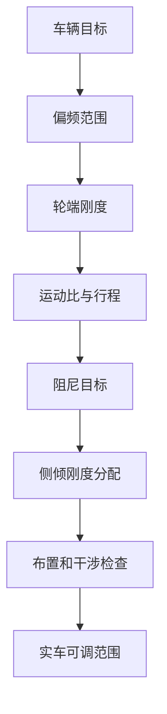

# 05 弹簧阻尼与侧倾

## 这章解决什么问题

弹簧、阻尼器、运动比和抗侧倾结构决定车身姿态、轮胎动态载荷、调校范围和驾驶信心。本章说明如何从车辆目标出发，把偏频、轮端刚度、阻尼目标、运动比和侧倾刚度分配连成一条可复核的参数链。




## 关键判断

spring rate、wheel rate、ride rate（可理解为含轮胎串联后的等效垂向刚度）和 roll stiffness 不是同一个量，必须写清 motion ratio、轮胎刚度和前后分配假设。

| 项目 | 主要关注 | 判断方式 |
| --- | --- | --- |
| Ride frequency 偏频 | 车身响应、路面适应性、气动高度控制、车手信心 | 用角重、轮端刚度和轮胎刚度估算，并结合测试路面与目标赛事 |
| Damping ratio 阻尼比 | 车身振动衰减、轮胎贴地、瞬态响应、热衰退 | 用四分之一车模型和阻尼器速度区间检查，不只看名义阻尼比 |
| Motion ratio 运动比 | 弹簧力、阻尼器速度、行程、非线性、布置空间 | 输出运动比曲线，检查全行程是否平滑、可制造、可调 |
| Roll stiffness distribution 侧倾刚度分配 | 稳态转向、轮胎载荷转移、前后轴平衡、可调窗口 | 结合轮胎载荷敏感性、车手反馈、气动姿态和抗侧倾杆调节范围 |

## 判断逻辑

### 从轮端刚度说起

弹簧刚度本身不能直接说明车辆响应。悬架需要把弹簧刚度通过运动比转换成轮端刚度，并考虑轮胎垂向刚度后得到有效频率。任何弹簧选择都应能追溯到角重、目标偏频、运动比和可用弹簧规格。

### 车身运动越小不一定越好

减少侧倾、俯仰或起伏可以改善驾驶信心和气动姿态，但如果弹簧、阻尼或侧倾刚度过高，轮胎动态载荷可能变差，低附着路面也可能更难驾驶。设计目标应同时看车身姿态和轮胎载荷稳定性。

### 运动比是结构问题，也是调校问题

运动比影响弹簧和阻尼器等效刚度、行程、速度、安装力、摇臂尺寸和调校敏感性。过于激进或变化突兀的运动比可能让调校变得难以解释。

运动比还会影响规则意义上的 usable wheel travel。弹簧、阻尼器、bump stop、droop limiter 和第三弹簧的行程必须一起核对；不能只用静态运动比推断轮端有足够 jounce / rebound。

### 侧倾刚度要留调节余量

抗侧倾杆、弹簧和几何共同决定前后轴载荷转移。设计时应预留实车调整窗口，避免一开始就把结构做到只能使用单一设定。

## 最小计算骨架

下面的关系式用于建立计算表，不是设计结论。使用前要统一单位，并确认左右、前后、轮端和弹簧端的定义一致。

| 符号 | 含义 | 常用单位 |
| --- | --- | --- |
| `m_s` | 单轮对应的簧上质量 sprung mass per corner | kg |
| `k_w` | 轮端刚度 wheel rate | N/m 或 N/mm |
| `k_s` | 弹簧刚度 spring rate | N/m 或 N/mm |
| `k_t` | 轮胎垂向刚度 tire vertical stiffness | N/m 或 N/mm |
| `MR` | 运动比 motion ratio，建议定义为弹簧位移 / 轮端位移 | 无量纲 |
| `f_n` | 车身垂向固有频率 ride frequency | Hz |
| `zeta` | 阻尼比 damping ratio | 无量纲 |
| `c_w` | 轮端等效阻尼 coefficient at wheel | N*s/m |
| `c_d` | 阻尼器端等效阻尼 coefficient at damper | N*s/m |
| `VR` | 阻尼器速度比 velocity ratio，建议定义为阻尼器速度 / 轮端速度 | 无量纲 |
| `K_phi` | 侧倾刚度 roll stiffness | N*m/rad |

基础关系：

```text
k_w = k_s * MR^2

1 / k_eff = 1 / k_w + 1 / k_t

f_n = (1 / 2*pi) * sqrt(k_eff / m_s)

c_w = 2 * zeta * sqrt(k_eff * m_s)

c_w = c_d * VR^2
```

其中 `k_eff` 是轮胎和悬架串联后的等效垂向刚度，单位要与 `m_s` 保持一致。如果 `MR` 定义为轮端位移 / 弹簧位移，上式中的 `MR^2` 需要倒过来使用。`VR` 也必须和阻尼器位移、速度的定义一致，否则会把轮端阻尼换算错。文档里必须写清楚采用哪一种定义。

侧倾刚度分配可用比例先记录：

```text
roll stiffness distribution front = K_phi_front / (K_phi_front + K_phi_rear)
```

`K_phi_front` 和 `K_phi_rear` 应说明是否只包含弹簧贡献，还是已经包含抗侧倾杆、轮胎垂向刚度和悬架几何影响。早期计算可以做简化，但结论必须写明“用于初筛”，后续还要用 K&C、整车模型和实车测试修正。

## 输出

| 输出物 | 最低内容 |
| --- | --- |
| 角重和偏频表 | 角重、轮端刚度、轮胎刚度假设、目标频率和单位 |
| 弹簧/阻尼目标 | 弹簧规格、阻尼目标、速度区间、可调档位或阀系假设 |
| 运动比曲线 | 全行程曲线、关键姿态数值、行程裕度和干涉说明 |
| 行程规则检查 | 含车手状态、轮端可用行程、jounce / rebound 分配、阻尼器 stroke 和限位策略 |
| 侧倾刚度分配 | 前后分配、抗侧倾杆方案、调节孔位或替换方案 |
| 调校计划 | 初始设定、可调范围、测试顺序和记录表 |

## 常见错误

- 只讨论弹簧刚度，不说明轮端刚度、运动比和角重。
- 为了减小车身姿态，把弹簧或抗侧倾杆做得过硬，导致轮胎动载恶化。
- 只看车身侧倾角变小，却没有检查轮胎载荷敏感性、调校余量和实车路面。
- 阻尼器行程或速度区间没有检查，实车容易顶死、过热或调不出差异。
- 运动比曲线突变，却只报告某一个静态值。
- 抗侧倾结构布置成功，但没有说明它解决什么操稳问题。
- 没有预留可调范围，测试时只能靠猜测或临时改件。

## 验证方式

- 一阶计算：角重、轮端刚度、偏频、侧倾刚度、轮胎垂向刚度。
- 简化模型：四分之一车、半车 pitch/roll 模型、阻尼速度检查。
- K&C 和 CAD：运动比曲线、极限行程、摇臂/推杆/拉杆干涉、维护空间。
- 参数扫掠：改变弹簧、阻尼、抗侧倾杆后观察轮胎动载和姿态变化。
- 实车测试：静态车高、角重、预载、悬架位移、胎温胎压、车手反馈和数据日志。

## 和其它组的接口

| 组别 | 需要同步 |
| --- | --- |
| 气动 | 车高窗口、俯仰/侧倾敏感性、底板保护和调校优先级 |
| 车架 | 摇臂、减振器、推杆/拉杆安装点和载荷路径 |
| 车身/总布置 | 拆装空间、维护路径、行程包络和防护 |
| 制造 | 摇臂、抗侧倾杆、支座和调节结构的加工可行性 |
| 测试 | 初始设定、调校变量、传感器、每轮测试记录格式 |

## 进阶阅读

偏频、轮端刚度、轮胎垂向刚度、阻尼、运动比、侧倾/俯仰和调校范围见 [高级 04 弹簧、阻尼、侧倾与车身姿态](advanced/04-spring-damper-roll-and-ride.md)。
