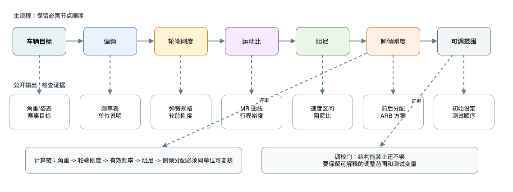
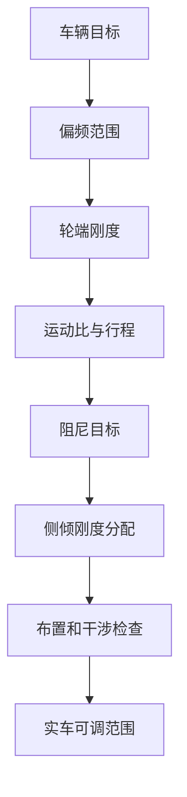

# 05 弹簧阻尼与侧倾

## 这章解决什么问题

弹簧、阻尼器、运动比和抗侧倾结构决定车身姿态、轮胎动态载荷、调校范围和驾驶信心。本章说明如何从车辆目标出发，把偏频、轮端刚度、阻尼目标、运动比和侧倾刚度分配连成一条可复核的参数链。

这章不是“调参数清单”。更合理的入口是：先明确车辆目标、轮胎工作窗口、悬架几何、角重和可用行程，再把它们转成能被计算、仿真、采购、装车和测试复核的参数。若只从某个弹簧刚度或阻尼档位开始，后续很难判断问题来自轮胎、几何、气动车高、路面、车手反馈，还是参数本身。





## 关键判断

spring rate、wheel rate、ride rate、roll stiffness、damping ratio 和 motion ratio 不是同一个量。每一张计算表都应写清单位、质量状态、轮胎刚度、运动比定义和前后分配假设。

| 术语 | 初学者应先记住 | 常见误区 |
| --- | --- | --- |
| spring rate 弹簧刚度 | 弹簧本体的力-位移斜率，通常沿弹簧轴线定义 | 不能直接当成轮胎接地点看到的刚度 |
| wheel rate 轮端刚度 | 弹簧路径通过机构换算到轮端的悬架刚度 | 受 motion ratio、安装角和局部行程影响 |
| ride rate 车身垂向等效刚度 | 常用于描述轮端刚度与轮胎垂向刚度串联后的 ground-to-body 简化刚度 | 不能把它当真实四分之一车 2-DOF 模型的全部 |
| roll stiffness 侧倾刚度 | 弹簧、防倾杆、轮距、几何和轮胎共同形成的侧倾恢复力矩 | 不等于“越大越快”，要看轮胎载荷敏感性和路面 |
| damping ratio 阻尼比 | 线性模型里的无量纲衰减指标 | 不能替代阻尼器速度-力曲线、温度和调节区间 |
| motion ratio 运动比 | 轮端位移/速度与弹簧或阻尼器位移/速度之间的关系 | 定义反了会让 `MR^2` 或 `VR^2` 的位置倒置 |

| 项目 | 主要关注 | 判断方式 |
| --- | --- | --- |
| Ride frequency 偏频 | 车身响应、路面适应性、气动高度控制、车手信心 | 用角重、轮端刚度和轮胎刚度估算，并结合测试路面与目标赛事 |
| Damping ratio 阻尼比 | 车身振动衰减、轮胎贴地、瞬态响应、热衰退 | 用四分之一车模型、阻尼器台架曲线和速度直方图检查，不只看名义阻尼比 |
| Motion ratio 运动比 | 弹簧力、阻尼器速度、行程、非线性、布置空间 | 输出全行程位移/速度比曲线，检查是否平滑、可制造、可调 |
| Roll stiffness distribution 侧倾刚度分配 | 稳态转向、轮胎载荷转移、前后轴平衡、可调窗口 | 结合轮胎载荷敏感性、车手反馈、roll center、气动姿态和抗侧倾杆调节范围 |

## 最小输入清单

开始选弹簧、阻尼或 anti-roll bar 之前，至少先收齐这些输入。缺项时可以做早期假设，但应在表中标成“待验证”，不要把估算结果写成最终目标。

| 输入 | 为什么需要 |
| --- | --- |
| 角重 corner weight 和质量状态 | 决定每个角的静态载荷、簧上质量和目标频率计算基准 |
| 簧上/簧下质量 sprung / unsprung mass | 区分简化簧上频率、真实 quarter-car 模型和轮胎动载判断 |
| 轮胎垂向刚度 tire vertical stiffness | 判断 ride rate、轮胎压缩、动态轮荷和车高变化；缺可靠数据时必须标注待验证 |
| 硬点、推杆/拉杆、摇臂和 motion ratio 曲线 | 把 spring rate / damping force 转成 wheel rate、轮端阻尼和行程 |
| 轮端 jounce / rebound 行程与限位策略 | 检查规则、触底、droop、bump stop、传感器和维护空间 |
| 可采购弹簧、阻尼器和安装空间 | 避免计算结果无法购买、装不下、调不了或超出阻尼器速度区间 |
| anti-roll bar 可调范围 | 保留前后 roll stiffness distribution 的实车调校窗口 |
| 气动车高、pitch / roll 边界或底板保护需求 | 决定平台控制是否是主要目标，以及是否需要 heave spring、bump rubber 等附加元件 |

## 判断逻辑

### 从轮端刚度说起

弹簧刚度本身不能直接说明车辆响应。悬架需要把弹簧刚度通过运动比转换成轮端刚度，并在需要时考虑轮胎垂向刚度对简化等效频率的影响。任何弹簧选择都应能追溯到角重、目标偏频、运动比和可用弹簧规格。

### 车身运动越小不一定越好

减少侧倾、俯仰或起伏可以改善驾驶信心和气动姿态，但如果弹簧、阻尼或侧倾刚度过高，轮胎动态载荷可能变差，低附着路面也可能更难驾驶。设计目标应同时看车身姿态和轮胎载荷稳定性。

### 运动比是结构问题，也是调校问题

运动比影响弹簧和阻尼器等效刚度、行程、速度、安装力、摇臂尺寸和调校敏感性。过于激进或变化突兀的运动比可能让调校变得难以解释。

文档里必须写清采用的 convention。本章建议把位移运动比写成 `MR = 弹簧位移 / 轮端垂向位移`，把速度比写成 `VR = 阻尼器速度 / 轮端垂向速度`。若团队使用相反定义，公式中的平方项需要取倒数；不同表格混用 MR/VR 定义，会让弹簧、阻尼和行程判断系统性偏离。

运动比还会影响规则意义上的 usable wheel travel。弹簧、阻尼器、bump stop、droop limiter 和第三弹簧的行程必须一起核对；不能只用静态运动比推断轮端有足够 jounce / rebound。

### 侧倾刚度要留调节余量

抗侧倾杆、弹簧和几何共同决定前后轴载荷转移。设计时应预留实车调整窗口，避免一开始就把结构做到只能使用单一设定。

## 最小计算骨架

下面的关系式用于建立计算表，不是设计结论。使用前要统一单位，并确认左右、前后、轮端和弹簧端的定义一致。

| 符号 | 含义 | 常用单位 |
| --- | --- | --- |
| `m_s` | 单轮对应的簧上质量 sprung mass per corner | kg |
| `k_w` | 轮端刚度 wheel rate | N/m 或 N/mm |
| `k_s` | 弹簧刚度 spring rate | N/m 或 N/mm |
| `k_t` | 轮胎垂向刚度 tire vertical stiffness | N/m 或 N/mm |
| `MR` | 运动比 motion ratio，建议定义为弹簧位移 / 轮端位移 | 无量纲 |
| `f_n` | 车身垂向固有频率 ride frequency | Hz |
| `zeta` | 阻尼比 damping ratio | 无量纲 |
| `c_w` | 轮端等效阻尼 coefficient at wheel | N*s/m |
| `c_d` | 阻尼器端等效阻尼 coefficient at damper | N*s/m |
| `VR` | 阻尼器速度比 velocity ratio，建议定义为阻尼器速度 / 轮端速度 | 无量纲 |
| `K_phi` | 侧倾刚度 roll stiffness | N*m/rad |

基础关系：

```text
k_w = k_s * MR^2

1 / k_eff = 1 / k_w + 1 / k_t

f_n = (1 / 2*pi) * sqrt(k_eff / m_s)

c_w = 2 * zeta * sqrt(k_eff * m_s)

c_w = c_d * VR^2
```

其中 `k_eff` 是轮胎和悬架串联后的简化等效垂向刚度，单位要与 `m_s` 保持一致。它适合早期趋势比较，不等于真实 quarter-car 2-DOF model；若缺少可靠轮胎垂向刚度，应把相关频率和阻尼结论标成待验证。如果 `MR` 定义为轮端位移 / 弹簧位移，上式中的 `MR^2` 需要倒过来使用。`VR` 也必须和阻尼器位移、速度的定义一致，否则会把轮端阻尼换算错。文档里必须写清楚采用哪一种定义。

侧倾刚度分配可用比例先记录：

```text
roll stiffness distribution front = K_phi_front / (K_phi_front + K_phi_rear)
```

`K_phi_front` 和 `K_phi_rear` 应说明是否只包含弹簧贡献，还是已经包含抗侧倾杆、轮胎垂向刚度和悬架几何影响。早期计算可以做简化，但结论必须写明“用于初筛”，后续还要用 K&C、整车模型和实车测试修正。

## 输出

本章输出不是一张孤立的“最终设定表”，而是一组要交给几何、仿真、载荷、制造和测试继续使用的接口文件。

| 输出物 | 最低内容 | 交给谁使用 |
| --- | --- | --- |
| 角重和偏频表 | 角重、簧上/簧下质量、轮端刚度、轮胎刚度假设、目标频率和单位 | 仿真、测试、整车目标复盘 |
| 弹簧/阻尼目标 | 弹簧规格、阻尼目标、速度区间、压缩/回弹方向、可调档位或阀系假设 | 采购、装配、damper dyno、测试 |
| 运动比曲线 | 全行程曲线、MR/VR 定义、关键姿态数值、行程裕度和干涉说明 | 几何、CAD / K&C、载荷、制造 |
| 行程规则检查 | 含车手状态、轮端可用行程、jounce / rebound 分配、阻尼器 stroke 和限位策略 | 技检、总布置、测试安全检查 |
| 侧倾刚度分配 | 前后分配、弹簧/ARB/几何贡献、抗侧倾杆方案、调节孔位或替换方案 | 整车仿真、轮胎、车手调校 |
| 调校计划 | 初始设定、可调范围、每次只改的变量、测试顺序和记录表 | 实车测试、数据分析、答辩 |

## 常见错误

- 只讨论弹簧刚度，不说明轮端刚度、运动比和角重。
- 为了减小车身姿态，把弹簧或抗侧倾杆做得过硬，导致轮胎动载恶化。
- 只看车身侧倾角变小，却没有检查轮胎载荷敏感性、调校余量和实车路面。
- 阻尼器行程或速度区间没有检查，实车容易顶死、过热或调不出差异。
- 运动比曲线突变，却只报告某一个静态值。
- 抗侧倾结构布置成功，但没有说明它解决什么操稳问题。
- 没有预留可调范围，测试时只能靠猜测或临时改件。

## 验证方式

- 一阶计算：角重、轮端刚度、偏频、侧倾刚度、轮胎垂向刚度。
- 简化模型：四分之一车、半车 pitch/roll 模型、阻尼速度检查；缺轮胎刚度或阻尼曲线时把结论标成待验证。
- K&C 和 CAD：运动比曲线、极限行程、摇臂/推杆/拉杆干涉、维护空间。
- 参数扫掠：改变弹簧、阻尼、抗侧倾杆后观察轮胎动载和姿态变化。
- 实车测试：静态车高、角重、预载、悬架位移、阻尼器速度、胎温胎压、车手反馈、post-run inspection 和数据日志。

## 和其它组的接口

| 组别 | 需要同步 |
| --- | --- |
| 气动 | 车高窗口、俯仰/侧倾敏感性、底板保护和调校优先级 |
| 车架 | 摇臂、减振器、推杆/拉杆安装点和载荷路径 |
| 车身/总布置 | 拆装空间、维护路径、行程包络和防护 |
| 制造 | 摇臂、抗侧倾杆、支座和调节结构的加工可行性 |
| 测试 | 初始设定、调校变量、传感器、每轮测试记录格式 |

## 进阶阅读

偏频、轮端刚度、轮胎垂向刚度、阻尼、运动比、侧倾/俯仰和调校范围见 [高级 04 弹簧、阻尼、侧倾与车身姿态](advanced/04-spring-damper-roll-and-ride.md)。

## 本章公开来源

- [Jim Kasprzak: A Guide to Your Dampers](https://www.kaztechnologies.com/wp-content/uploads/A-Guide-To-Your-Dampers-Chapter-from-FSAE-Book-by-Jim-Kasprzak-Updated.pdf)，用于阻尼器速度区间、低/中/高速阻尼和 damper dyno 检查语言。
- [OptimumG: Of Springs and Dampers](https://optimumg.com/wp-content/uploads/2021/10/racecar-2020_11.pdf)，用于补充弹簧阻尼调校中的频率、轮胎贴地和工程取舍。
- [UNCA FSAE Suspension / Steering: Springs](https://sites.google.com/unca.edu/suspension/learning/vehicle-dynamics-basics/springs)，用于 motion ratio、wheel rate、ride rate 的入门桥接。
- [Cooper Union FSAE Suspension Design Review](https://scholars.duke.edu/publication/1426694)，用于理解弹簧、阻尼、防倾杆与轮胎/几何目标并行设计的流程边界。
- [Penske: Natural Frequency, Ride Frequency, and CPM](https://www.penskeshocks.com/blog/natural-frequency-ride-frequency-cpm-in-race-suspension)，用于提醒气动载荷和动态车高会改变静态频率理解，不作为 Formula Student 必选方案。
- [DesignJudges: Simple Kinematic Philosophies](https://www.designjudges.com/articles/simple-kinematic-philosophies)，用于把 roll center、springs、ARB 和调校变量放进整车取舍。
- 完整章节索引见 [参考资料：章节引用索引](references.md#章节引用索引)。
