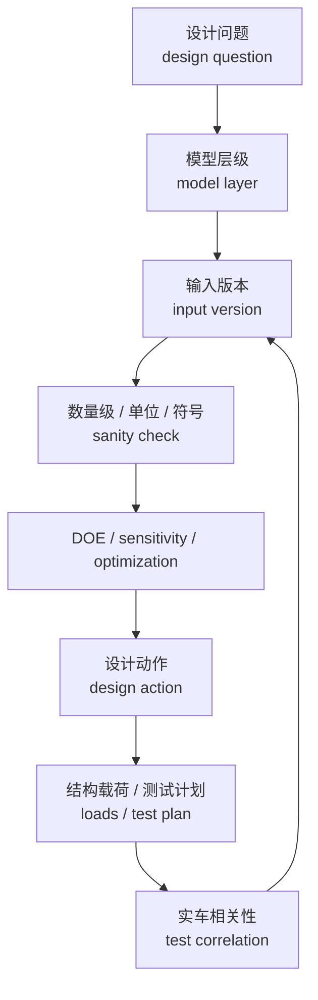

# 06 仿真与优化

## 这章解决什么问题

仿真不是证明工具，也不是把模型做复杂的竞赛。它的价值在于把一个清楚的 design question，经过合适的 model layer、可信的 input version、基础 sanity check、DOE / optimization 和设计动作，最后带回 test correlation。只有这条链路闭合，仿真图才是工程证据的一部分；如果链路断了，曲线再平滑也只是一个未验证假设。

本章把 K&C、简化动力学、参数优化和整车模型分层说明，帮助队员知道什么时候该用哪种模型、输入如何版本化、结果怎样进入设计档案、结构载荷和测试计划。

## 仿真分层

| 层级 | 适合回答的问题 | 典型输入 | 典型输出 | 使用边界 |
| --- | --- | --- | --- | --- |
| K&C 模型 | 硬点变化如何影响轮端运动 | 硬点、转向、轮胎包络、基础刚度假设 | 外倾、前束、侧倾中心、bump steer、anti 参数 | 只能说明几何 / 柔度假设下的轮端运动，不证明轮胎极限或实车操稳 |
| 简化动力学模型 | 偏频、阻尼、侧倾刚度是否合理 | 角重、轮端刚度、阻尼、轮胎刚度、质心估算 | 频率、响应、轮胎动载、姿态趋势 | 适合数量级和趋势，不替代非线性轮胎、车手输入和测试 |
| 多体载荷模型 | 杆件和支座受力如何传递 | 硬点、质量、轮胎力、弹簧阻尼、工况 | Joint force、杆件轴力、结构校核输入 | 输出要经过自由体图、坐标和工况复核，不能直接等于结构安全 |
| 整车模型 | 轮胎、气动、操稳和控制如何耦合 | 轮胎模型、质量/CG、气动、制动、动力系统、控制 | 圈速趋势、稳态/瞬态响应、参数敏感性 | 适合方案排序和研究，不在未相关时宣称真实圈速或赛道表现 |

- RCVD 风格的稳态、瞬态、G-G 和前后轴分析适合建立趋势和边界，不替代实车相关性验证。

## 判断逻辑

### 先问问题，再选模型

如果问题是“外倾曲线是否合理”，K&C 模型比整车模型更直接；如果问题是“偏频变化是否让轮胎动载变差”，简化动力学模型往往更透明；如果问题是“控制策略和轮胎极限如何耦合”，才需要更高层整车模型。

### 把链路写完整

仿真记录应按同一条链路写：`设计问题 -> 模型层级 -> 输入版本 -> sanity check -> DOE / optimization -> 设计动作 -> 结构或测试交付 -> correlation`。不要只保存最终曲线；曲线旁边至少要写清它回答的问题、使用的输入版本、哪些检查通过、最终改变了什么设计或测试计划。

### 输入必须版本化

轮胎、质量、质心、气动、制动、动力系统和控制假设都可能更新。每个仿真结果应写明输入版本，否则同一张曲线可能来自已经过期的车辆状态。

### fixed 与 adjustable 不要混用

仿真和优化前先把参数分层。不是所有变量都能在赛场调校；如果优化器把冻结硬点、车架接口或质量属性当作 adjustable set-up，结果可能可计算但不可执行。

| 参数类别 | 示例 | 管理方式 | 常见错误 |
| --- | --- | --- | --- |
| fixed parameters | 已冻结硬点、车架接口、轮距 / 轴距、主要质量和 CG 版本、已定轮辋 / upright 包络 | 作为输入版本和约束；变更需要设计评审 | 把它们当作赛场调校旋钮 |
| adjustable set-up | 胎压、静态 camber / toe、防倾杆状态、阻尼档位、制动平衡、车高或预载范围 | 记录 baseline、调节范围、每次只改的变量和测试条件 | 同时改多个变量后强行归因 |
| derived outputs | 动态轮荷、G-G 包络、关节力、yaw-rate gain、侧倾角、轮胎利用率 | 作为模型输出和结构 / 测试输入，不直接手工调 | 把输出量当成独立输入去“调好看” |
| measured inputs | 角重、胎温胎压、方向盘角、制动压力、轮速、IMU、悬架位移 | 记录标定、单位、符号、滤波和测试场景 | 没有标定就用于 correlation |

### 优化目标和约束要公开

优化前应写清楚目标函数、设计变量、约束、权重和停止条件。例如硬点优化不能只追求某条曲线好看，还要限制干涉、杆件角度、安装空间、制造和结构载荷。

### 复杂模型需要简单校验

整车模型输出前，应先用手算、简化模型或已知工况检查数量级。复杂模型如果基础输入不可靠，只会更快地产生难以解释的错误。

### 公开资料只支持流程，不替代验证

公开 FSAE / Formula Student 案例普遍会把规则、轮胎、CAD 包络、多体模型和实车测试串成闭环。引用这些资料时，应提炼“为什么这样建模、如何验证、哪些输入有限制”，不要照搬某支车队的参数、优化百分比或相关性数字。

### 输出要传给下游

仿真输出不能停在“模型通过”。K&C 和 MBD 输出应给几何、弹簧阻尼和结构章节；动态响应、G-G、方向盘角、轮速和悬架位移预测应给测试章节；测试差异再回到输入版本和模型假设。不能把操稳模型的轮胎力直接当作结构耐久载荷，也不能把结构导力模型当作车辆操稳证明。

## 输出

| 输出物 | 最低内容 | 交给谁 |
| --- | --- | --- |
| 模型清单 | 模型用途、软件、版本、负责人、输入来源 | 设计评审、软件工作流 |
| 输入版本表 | 轮胎、质量、CG、气动、制动、控制、硬点和弹簧阻尼版本 | 所有下游模型 |
| 工况说明 | 速度、转角、制动、加速、路面、边界条件、坐标和单位 | 结构载荷、测试计划 |
| 优化记录 | 目标函数、约束、变量范围、权重、结果和被放弃方案 | 几何、簧上参数、答辩证据 |
| 设计结论 | 结论、适用范围、限制、需要测试验证的问题 | 设计档案、下一轮测试 |
| 结构载荷输入 | 轮胎力、关节力、峰值工况、坐标转换、自由体图复核状态 | 第 07 章 / 高级 06 |
| 测试相关性输入 | 预测通道、测试场景、车辆设定、传感器、滤波和差异解释模板 | 第 08 章 / 高级 08 |
| 公开交叉验证记录 | 引用的规则、公开论文或案例、它支持的流程判断、访问日期和使用边界 | references 和维护记录 |

## 常见错误

- 模型越复杂越晚发现基础假设错了。
- 优化目标没有工程意义，得到的结果无法制造或无法装配。
- 多个输入同时改变，却把结果归因于其中一个参数。
- 图表没有单位、工况、版本和坐标定义。
- 把仿真曲线当成实车证明，或把稳态模型结论直接用于瞬态问题。
- 只保存最终模型，不保存中间方案和失败原因。
- 仿真结果没有转成设计动作、测试计划或结构校核输入。

## 验证方式

- 数量级检查：用一阶公式或自由体图检查力、频率、位移和角度是否合理。
- 运动检查：看模型动画或关键姿态，确认没有反向、错轴或不真实约束。
- 敏感性扫掠：小幅改变关键输入，结果趋势应符合物理直觉。
- 版本回归：输入更新后复跑关键工况，确认结论是否仍成立。
- 实车对标：在同一测试场景、同一坐标 / 符号 / 单位、同一车辆设定下，用测试数据校正轮胎、阻尼、质量、CG、气动和控制假设；先解释差异，不把“仿真曲线贴合”写成实车证明。

## 和其它章节的关系

- 第 02 章提供车辆目标和约束。
- 第 03 章提供轮胎与整车输入版本。
- 第 04 章提供硬点和 K&C 指标。
- 第 05 章提供弹簧、阻尼、运动比和侧倾参数。
- 第 07 章使用载荷仿真结果做结构校核。
- 第 08 章用实车测试反过来修正模型。

## 进阶阅读

模型层级、K&C、二自由度操稳、G-G 图、DOE、优化、多体动力学和相关性验证见 [高级 05 仿真、优化与相关性](advanced/05-simulation-optimization-correlation.md)。

## 本章公开来源

- [Dynamic Handling Characterization and Set-Up Optimization for a Formula SAE Race Car via Multi-Body Simulation](https://www.mdpi.com/2075-1702/9/6/126)，用于 fixed / adjustable 参数、整车 MBD、set-up 管理和实车验证边界。
- [MathWorks: Formula Student Vehicle Modeling Using Simscape Multibody](https://www.mathworks.com/videos/formula-student-vehicle-modeling-using-simscape-multibody-1683608443602.html)、[Vehicle Dynamics Simulation Using MATLAB and Simulink for Student Competitions](https://www.mathworks.com/videos/vehicle-dynamics-simulation-using-matlab-and-simulink-for-student-competitions-1637351938976.html) 和 [Formula Student Vehicle with Simscape](https://github.com/simscape/Formula-Student-Vehicle-Simscape)，用于公开整车模型模板、K&C / maneuver / GGV 工作流和软件版本边界。
- [Purdue: Modeling of Multibody Dynamics in Formula SAE Vehicle Suspension Systems](https://hammer.purdue.edu/articles/thesis/Modeling_of_Multibody_Dynamics_in_Formula_SAE_Vehicle_Suspension_Systems/12269003)，用于 MBD 模型搭建、camber / toe / motion ratio / roll-center 和 maneuver response 的流程案例。
- [MIT: Optimization of a Formula SAE Vehicle's Suspension Kinematics](https://dspace.mit.edu/entities/publication/552bc5c1-9705-4a17-847d-9a9a9ff27b60)，用于说明优化问题应写清 objective、constraint、权重和使用边界。
- [University of Cincinnati Bearcats Motorsports Amesim project](https://www.ceas.uc.edu/research/centers-labs/siemens-simulation-technology-center/courses---projects/amesim/formula-sae/project.html)，用于说明用相同场景对比仿真和实车数据。
- [DesignJudges: Conceptual and Objective Design in FSAE](https://www.designjudges.com/articles/conceptual-and-objective-design-in-fsae)，用于补充概念仿真、质量模型和模型怀疑精神。
- 完整章节索引见 [参考资料：章节引用索引](references.md#章节引用索引)。
