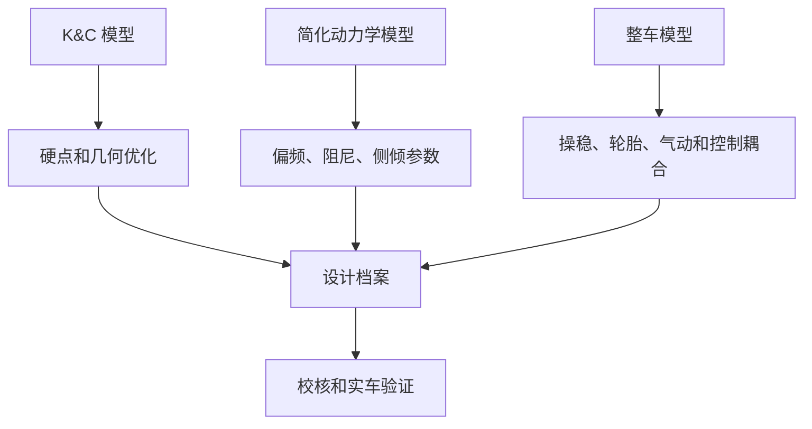

# 06 仿真与优化

## 这章解决什么问题

仿真不是为了把模型做复杂，而是为了回答当前设计问题。本章把 K&C、简化动力学、参数优化和整车模型分层说明，帮助队员知道什么时候该用哪种模型、输入如何版本化、结果怎样进入设计档案。

## 仿真分层

| 层级 | 适合回答的问题 | 典型输入 | 典型输出 |
| --- | --- | --- | --- |
| K&C 模型 | 硬点变化如何影响轮端运动 | 硬点、转向、轮胎包络、基础刚度假设 | 外倾、前束、侧倾中心、bump steer、anti 参数 |
| 简化动力学模型 | 偏频、阻尼、侧倾刚度是否合理 | 角重、轮端刚度、阻尼、轮胎刚度、质心估算 | 频率、响应、轮胎动载、姿态趋势 |
| 多体载荷模型 | 杆件和支座受力如何传递 | 硬点、质量、轮胎力、弹簧阻尼、工况 | Joint force、杆件轴力、结构校核输入 |
| 整车模型 | 轮胎、气动、操稳和控制如何耦合 | 轮胎模型、质量/CG、气动、制动、动力系统、控制 | 圈速趋势、稳态/瞬态响应、参数敏感性 |

- RCVD 风格的稳态、瞬态、g-g 和前后轴分析适合建立趋势和边界，不替代实车相关性验证。

## 判断逻辑

### 先问问题，再选模型

如果问题是“外倾曲线是否合理”，K&C 模型比整车模型更直接；如果问题是“偏频变化是否让轮胎动载变差”，简化动力学模型往往更透明；如果问题是“控制策略和轮胎极限如何耦合”，才需要更高层整车模型。

### 输入必须版本化

轮胎、质量、质心、气动、制动、动力系统和控制假设都可能更新。每个仿真结果应写明输入版本，否则同一张曲线可能来自已经过期的车辆状态。

### 优化目标和约束要公开

优化前应写清楚目标函数、设计变量、约束、权重和停止条件。例如硬点优化不能只追求某条曲线好看，还要限制干涉、杆件角度、安装空间、制造和结构载荷。

### 复杂模型需要简单校验

整车模型输出前，应先用手算、简化模型或已知工况检查数量级。复杂模型如果基础输入不可靠，只会更快地产生难以解释的错误。

### 公开资料只支持流程，不替代验证

公开 FSAE / Formula Student 案例普遍会把规则、轮胎、CAD 包络、多体模型和实车测试串成闭环。引用这些资料时，应提炼“为什么这样建模、如何验证、哪些输入有限制”，不要照搬某支车队的参数、优化百分比或相关性数字。

## 输出

| 输出物 | 最低内容 |
| --- | --- |
| 模型清单 | 模型用途、软件、版本、负责人、输入来源 |
| 输入版本表 | 轮胎、质量、CG、气动、制动、控制、硬点和弹簧阻尼版本 |
| 工况说明 | 速度、转角、制动、加速、路面、边界条件和单位 |
| 优化记录 | 目标函数、约束、变量范围、权重、结果和被放弃方案 |
| 设计结论 | 结论、适用范围、限制、需要测试验证的问题 |
| 公开交叉验证记录 | 引用的规则、公开论文或案例、它支持的流程判断、访问日期和使用边界 |

## 常见错误

- 模型越复杂越晚发现基础假设错了。
- 优化目标没有工程意义，得到的结果无法制造或无法装配。
- 多个输入同时改变，却把结果归因于其中一个参数。
- 图表没有单位、工况、版本和坐标定义。
- 把仿真曲线当成实车证明，或把稳态模型结论直接用于瞬态问题。
- 只保存最终模型，不保存中间方案和失败原因。
- 仿真结果没有转成设计动作、测试计划或结构校核输入。

## 验证方式

- 数量级检查：用一阶公式或自由体图检查力、频率、位移和角度是否合理。
- 运动检查：看模型动画或关键姿态，确认没有反向、错轴或不真实约束。
- 敏感性扫掠：小幅改变关键输入，结果趋势应符合物理直觉。
- 版本回归：输入更新后复跑关键工况，确认结论是否仍成立。
- 实车对标：用测试数据校正轮胎、阻尼、质量、CG、气动和控制假设。

## 和其它章节的关系

- 第 02 章提供车辆目标和约束。
- 第 03 章提供轮胎与整车输入版本。
- 第 04 章提供硬点和 K&C 指标。
- 第 05 章提供弹簧、阻尼、运动比和侧倾参数。
- 第 07 章使用载荷仿真结果做结构校核。
- 第 08 章用实车测试反过来修正模型。

## 进阶阅读

模型层级、K&C、二自由度操稳、G-G 图、DOE、优化、多体动力学和相关性验证见 [高级 05 仿真、优化与相关性](advanced/05-simulation-optimization-correlation.md)。

## 本章公开来源

- [Dynamic Handling Characterization and Set-Up Optimization for a Formula SAE Race Car via Multi-Body Simulation](https://www.mdpi.com/2075-1702/9/6/126)，用于 fixed / adjustable 参数、整车 MBD 和 set-up 管理边界。
- [MathWorks: Formula Student Vehicle Modeling Using Simscape Multibody](https://www.mathworks.com/videos/formula-student-vehicle-modeling-using-simscape-multibody-1683608443602.html) 和 [Formula Student Vehicle with Simscape](https://github.com/simscape/Formula-Student-Vehicle-Simscape)，用于公开整车模型模板和 K&C / maneuver 工作流。
- [University of Cincinnati Bearcats Motorsports Amesim project](https://www.ceas.uc.edu/research/centers-labs/siemens-simulation-technology-center/courses---projects/amesim/formula-sae/project.html)，用于说明用相同场景对比仿真和实车数据。
- [DesignJudges: Conceptual and Objective Design in FSAE](https://www.designjudges.com/articles/conceptual-and-objective-design-in-fsae)，用于补充概念仿真、质量模型和模型怀疑精神。
- 完整章节索引见 [参考资料：章节引用索引](references.md#章节引用索引)。
