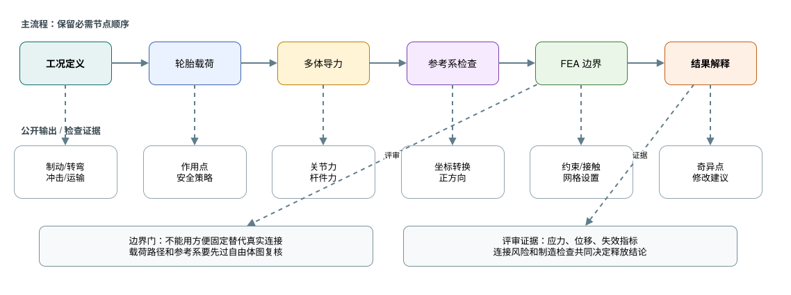
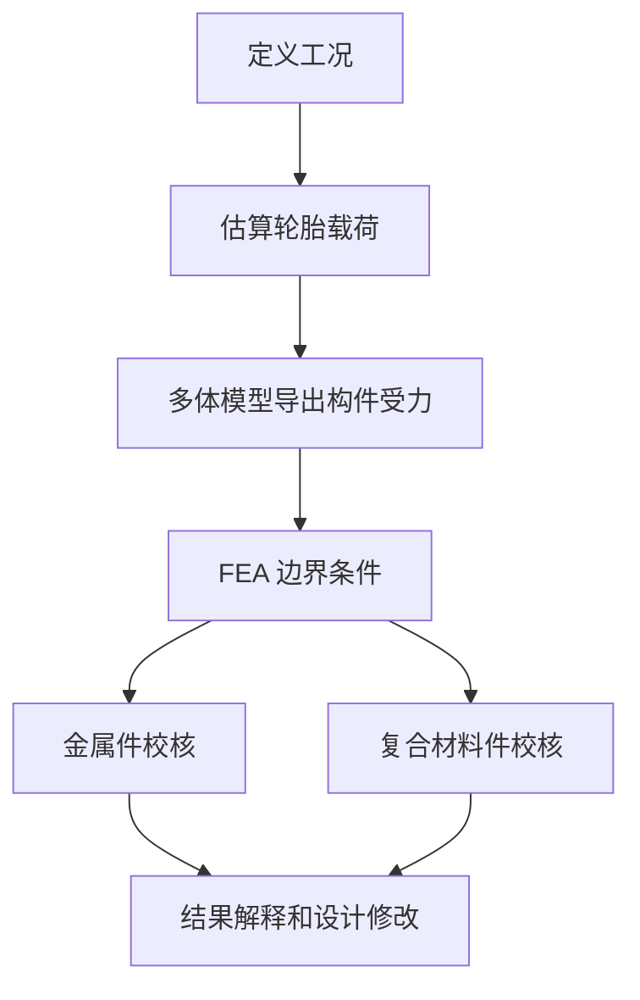

# 07 载荷与结构校核

## 这章解决什么问题

悬架结构校核要回答两个问题：每个零件在什么载荷下工作，以及分析证据是否足以支持制造、测试和比赛使用。本章说明如何从载荷工况出发，建立金属件和复合材料件的公开、可复核校核流程。

## 载荷和坐标系

结构校核必须先说明载荷来自哪里：规则、手算、轮胎模型、多体仿真、历史测试、供应商资料或保守估计。每个载荷工况都应写明参考坐标系、正方向、作用点、组合方式和安全系数策略。

常见工况包括制动、加速、稳态转弯、制动入弯、路面冲击、顶车/运输、误操作和装配预紧。是否需要组合工况，应根据车辆目标、赛道工况和零件失效后果决定。

## 金属件校核

| 步骤 | 关注点 |
| --- | --- |
| 定义载荷 | 轮胎力、关节力、制动扭矩、推杆/拉杆力、支座反力 |
| 建立边界条件 | 约束要接近真实连接，不用“方便固定”替代真实关节 |
| 材料和制造 | 材料牌号、热处理、焊接、机加工、缺口和表面质量 |
| 网格和接触 | 关键圆角、孔边、焊趾、接触面和连接件需重点复核 |
| 结果解释 | 区分真实高应力、约束奇异点和网格伪影 |
| 修改闭环 | 改几何、改材料、改连接、改载荷路径后重新校核 |

金属件不应只看最大等效应力。还要关注变形、屈曲、疲劳敏感区域、孔边承压、紧固件剪切/拉伸、焊接区域和装配误差。

## 复合材料件校核

复合材料件需要把铺层、方向、厚度、材料强度和制造质量写清楚。若材料数据不完整，应使用保守假设，并明确说明校核只能支持早期设计判断，不能替代试样、工艺验证和实车检查。

| 项目 | 需要说明 |
| --- | --- |
| 铺层/材料 | 纤维方向、层数、单层厚度、树脂体系、夹芯或嵌件 |
| 强度数据 | 拉伸、压缩、剪切、层间强度和数据来源可靠性 |
| 失效准则 | 最大应力、Tsai-Hill、Tsai-Wu、Hashin 或其它准则的适用范围 |
| 失效模式 | 区分 fiber failure、matrix failure、interlaminar failure 和连接区破坏 |
| 边界条件 | 载荷引入、约束、嵌件、胶接、螺栓孔和接触面 |
| 制造影响 | 纤维褶皱、孔隙、厚度偏差、固化质量和修边损伤 |

复合材料仿真结果应以 failure index、层间应力、位移、连接区风险和制造可控性共同判断。数据不足时要避免使用绝对化表述，例如“已经安全”，应改为“在当前假设下未发现明显超限，仍需试样或实车验证”。

### 复合材料建模和评审细节

| 主题 | 公开安全的记录方式 |
| --- | --- |
| Laminate coordinate system | 写明 0 deg 方向相对零件轴线、车辆坐标或载荷方向的定义，避免 CAD、铺层表和求解器各用一套方向 |
| Ply-angle sign convention | 说明正角度绕哪个法向旋转；左右件镜像时要确认角度符号是否也镜像 |
| Load introduction | 载荷应通过嵌件、垫片、胶接面、螺栓孔或夹具区域引入，避免把集中力直接施加在不真实的单点 |
| Bolted joints | 检查孔边承压、净截面拉伸、剪切撕裂、垫片压溃、预紧和装配偏差；孔周围铺层通常需要单独评审 |
| Bonded joints | 关注胶层剪切/剥离、搭接长度、表面处理、固化质量、环境影响和检验方法 |
| Buckling | 薄壁或夹芯结构应检查整体屈曲、局部屈曲和后屈曲敏感性，不能只看强度 failure index |
| Delamination | 层间拉伸、层间剪切、自由边、孔边、冲击损伤和厚度突变区域要作为分层风险点 |
| Coupon / allowable evidence | 优先使用与实际材料、铺层、工艺和环境相符的试样或公开 allowables；来源不一致时必须降低结论强度 |
| Knockdown factors | 对孔隙、湿热、冲击、制造偏差、批次差异和数据不足使用保守折减，并记录折减依据 |

复合材料件的校核结论建议分级表达：

- 设计初筛：基于公开或供应商材料数据和简化边界，只能说明方案是否值得继续。
- 工艺确认：需要试片、铺层样件、胶接样件或连接样件支持材料 allowables。
- 装车释放：需要制造记录、检查记录、结构校核、装配复核和出车后检查共同支持。

## 输出

| 输出物 | 最低内容 |
| --- | --- |
| 载荷工况表 | 工况、载荷来源、坐标系、作用点、组合、单位、安全系数 |
| 构件受力表 | 多体模型或自由体图导出的杆件力、关节力和支座力 |
| FEA 设置说明 | 几何简化、材料、网格、约束、接触、连接和求解器设置 |
| 结果解释 | 应力/位移/失效指标、风险位置、奇异点判断、裕度说明 |
| 设计修改记录 | 修改原因、修改内容、复算结果和释放结论 |

## 常见错误

- 载荷来源不清，或者把不同坐标系的力直接相加。
- 边界条件过硬，让应力看起来偏高或偏低。
- 只看云图最大值，不检查载荷路径和连接区。
- 忽略制动加转弯、加速加转弯等组合工况。
- 金属件没有考虑疲劳、焊接、孔边和紧固件。
- 复合材料只按各向同性材料处理，没有区分纤维、基体和层间失效。
- 修改结构后没有回到多体模型和载荷表更新输入。

## 验证方式

- 自由体图复核：检查力平衡、力矩平衡和数量级。
- 多体模型复核：确认关节定义、杆件方向、质量和工况姿态正确。
- 网格/约束复核：关键区域做网格敏感性，检查约束是否符合真实连接。
- 结果复核：判断最大值是否为奇异点，检查变形是否影响装配和运动。
- 制造和测试复核：首件检查、无损或外观检查、出车后裂纹/松动/磨损检查。

## 和其它组的接口

| 组别 | 需要同步 |
| --- | --- |
| 车架 | 支座载荷、节点加强、焊接空间、疲劳和维护检查 |
| 制造 | 材料、工艺、热处理、铺层、检验和返修限制 |
| 总布置 | 结构加厚或改形对空间、重量和维护的影响 |
| 测试 | 出车前检查表、传感器位置、失效迹象和停测标准 |
| 采购 | 材料批次、紧固件等级、复合材料和胶接体系可追溯 |

## 进阶阅读

金属件载荷路径、工况定义、力提取和 FEA 评审见 [高级 06 载荷与金属结构](advanced/06-loads-metal-structure.md)；复合材料失效、铺层、连接和制造风险见 [高级 07 复合材料校核与制造风险](advanced/07-composites-and-manufacturing.md)。
