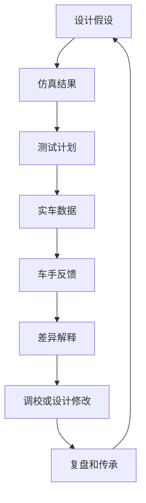

# 08 验证与迭代

## 这章解决什么问题

设计只有在实车上被验证、解释和记录后才算形成闭环。本章说明如何把仿真结果、测试计划、实车数据、车手反馈和复盘传承连接起来，让悬架设计不止停留在报告和模型里。

## 测试前

| 项目 | 最低要求 |
| --- | --- |
| 测试目标 | 每次测试只回答少量明确问题，例如制动稳定性、转向响应或侧倾控制 |
| 车辆状态 | 车高、角重、外倾、前束、胎压、预载、弹簧/阻尼/防倾杆设定 |
| 安全检查 | 紧固件、球头、杆端、制动、转向、轮胎、泄漏、干涉和限位 |
| 数据准备 | 传感器通道、采样率、时间同步、文件命名、备份方式 |
| 调校计划 | 初始设定、每轮只改一个主要变量、预期变化和停止条件 |

测试前应把仿真预期写成可观察现象。比如某个防倾杆设定预期让前轴更早进入极限，就应提前说明会从转向角、横摆响应、轮胎温度、车手反馈或圈速片段中看什么。

## 测试中

一轮测试只改一个主要变量，是建立因果关系的基本纪律。若必须同时改变多个变量，例如安全原因或天气变化，应在日志中标注这轮数据只能做弱结论。

每次出车至少记录：

- 时间、场地、路面、天气、轮胎状态和驾驶员；
- 车辆设定：车高、胎压、弹簧、阻尼、防倾杆、外倾、前束；
- 测试工况：加速、制动、稳态圆、蛇形、赛道片段或耐久模拟；
- 数据文件名和异常事件；
- 车手反馈，尽量区分现象、位置、速度区间和驾驶动作。

## 测试后

| 任务 | 做法 |
| --- | --- |
| 数据清理 | 检查通道、单位、零点、时间同步、异常值和缺失片段 |
| 对比仿真 | 对比趋势和数量级，先解释差异来源，再决定是否改模型 |
| 车手反馈整理 | 把“推头”“不稳”“弹跳”等描述转成工况、输入和可检查指标 |
| 车辆检查 | 看磨损、裂纹、松动、干涉痕迹、漏油、胎面和温度分布 |
| 决策记录 | 写明下一轮是调校、修车、改设计、补数据还是暂停结论 |

## 差异解释

实车和仿真不同不一定说明设计错了。常见原因包括轮胎状态、路面、质量/质心变化、气动假设、阻尼器实际特性、传感器误差、装配误差、柔度、驾驶输入和天气。复盘时应先列可能原因，再用数据和检查逐项排除。

## 验证矩阵示例

下表只给“证据和通过标准的写法”，不提供通用阈值。每支车队应根据规则、车辆目标、场地、传感器和安全策略设置自己的接受标准。

| 示例类别 | 证据 | 通过标准写法 |
| --- | --- | --- |
| 静态设定 static setup | 车高、角重、外倾、前束、胎压、预载、限位和左右一致性记录 | 与设计设定表一致；差异在团队定义的可调/测量范围内；异常有复测或原因说明 |
| Skidpad / steady-state | 稳态圆或八字数据、方向盘角、横向加速度、车手反馈、胎温分布 | 趋势与仿真或预期一致；左右方向差异可解释；没有持续干涉、跳动到底或不可控失稳 |
| Braking stability | 制动压力、减速度、方向修正、轮速、制动后检查 | 车辆可重复直线制动；左右偏差和轮胎锁止现象有记录；转向/悬架连接无异常 |
| Damper behavior | 悬架位移、速度直方图、阻尼器温度或外观、车手对颠簸和响应的反馈 | 行程未频繁触及机械极限；阻尼器工作区间覆盖主要工况；异常温升、泄漏或噪声被处理 |
| Post-run inspection | 球头、杆端、紧固件、支座、复合材料表面、轮胎和磨痕 | 没有新增裂纹、松动、分层、异常磨损或不可解释接触痕迹；发现问题有停测或返修记录 |

## 答辩和传承

答辩不是把所有图表堆出来，而是讲清楚设计目标、关键取舍、验证证据和下一步。好的传承记录应让下一届知道：当时为什么这样设计，哪些假设后来被验证，哪些假设失败，哪些问题还没有证据。

建议保留：

- 设计目标和关键参数的版本历史；
- 仿真输入、工况和限制；
- 测试计划、原始数据位置和处理脚本；
- 调校记录和结论可信度；
- 故障、干涉、制造偏差和修复记录；
- 下一季优先解决的问题。

## 输出

| 输出物 | 最低内容 |
| --- | --- |
| 验证矩阵 | 目标、仿真证据、测试方法、数据通道、通过标准 |
| 测试日志 | 车辆状态、每轮变量、车手反馈、数据文件和异常 |
| 相关性记录 | 仿真和实车差异、可能原因、修正动作 |
| 调校建议 | 下一轮设定、预期变化、风险和停止条件 |
| 传承笔记 | 成功经验、失败假设、未验证问题和答辩叙事 |

## 常见错误

- 只听车手反馈，不看车辆状态和数据。
- 一次改多个变量，最后无法判断因果。
- 测试后只保存数据文件，不写当时车辆设定。
- 没有记录轮胎状态 tire state、场地 / 路面条件 track condition、车辆版本和数据文件，就直接做调校变化 setup change。
- 仿真结果通过了，就以为实车也通过了。
- 只记录成功结论，不记录失败尝试和不确定性。
- 赛后复盘只写“下次优化”，没有明确下一季输入和验证方法。

## 验证方式

- 静态验证：车高、角重、外倾、前束、胎压、行程、限位和干涉。
- 动态验证：加速、制动、稳态圆、蛇形、赛道片段、耐久后检查。
- 数据验证：通道校准、时间同步、单位、滤波、异常值和重复性。
- 模型验证：用实车数据更新轮胎、阻尼、质量、CG、气动和柔度假设。
- 文档验证：下一位队员能根据记录复现设计判断和测试结论。

## 进阶阅读

静态检查、shakedown、测试矩阵、数据相关性、问题闭环和答辩叙事见 [高级 08 验证、测试与答辩](advanced/08-validation-testing-defense.md)。

## 本章公开来源

- [Dewesoft: Suspension Testing on Formula SAE Racecar](https://dewesoft.com/blog/suspension-testing-on-formula-sae-racecar) 和 [Dewesoft tire-road force analysis](https://dewesoft.com/blog/optimizing-formula-suspension-through-tire-road-force-analysis)，用于应变片、悬架位移、IMU、静态/动态测试和模型相关性。
- [Mantracourt FSAE validation case](https://www.mantracourt.com/case-studies/data-acquisition-in-formula-sae-suspension-and-steering-system-validation-tests/) 和 [HBK Bologna case](https://www.hbkworld.com/en/knowledge/resource-center/case-studies/university-bologna-formula-sae-student)，用于载荷、转向力和弹簧阻尼调校的可测通道。
- [Alex McCormick: Formula Student Suspension Validation](https://amccormick21.wordpress.com/2016/02/15/formula-student-suspension-validation/)，用于几何、CAD 装配、可维护性和 FEA 验证流程。
- [DesignJudges: A Field Guide to the Design Event](https://www.designjudges.com/articles/a-field-guide-to-the-design-event)，用于答辩证据包、设计报告和现场展示。
- 完整章节索引见 [参考资料：章节引用索引](references.md#章节引用索引)。
