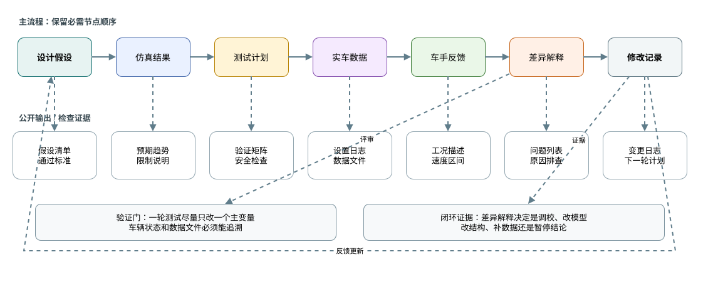
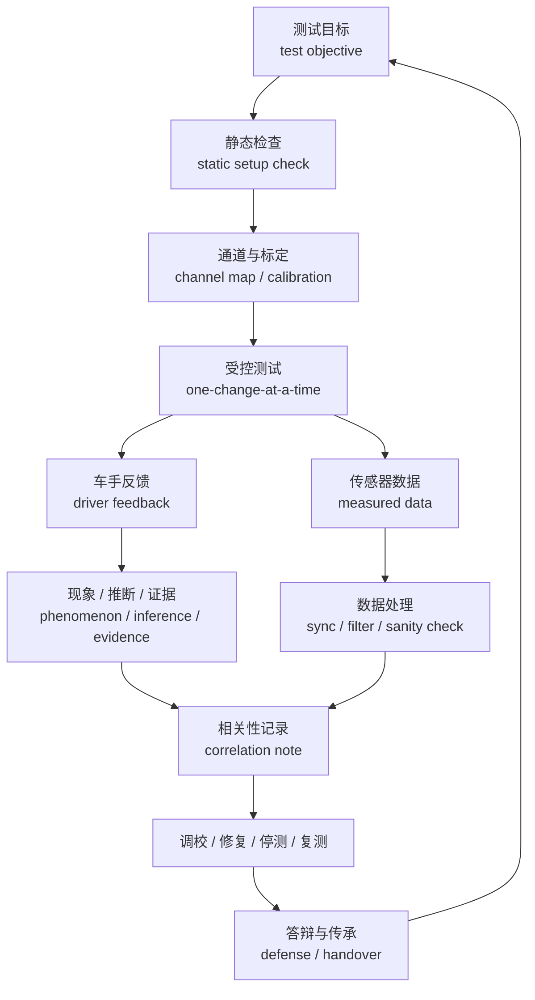

# 08 验证与迭代

## 这章解决什么问题

测试不是“把车跑起来”，也不是“只听车手说好不好开”。悬架验证 validation 要把设计假设、静态检查、数据通道、传感器标定、测试执行、车手反馈、数据处理、相关性 correlation、停测条件、答辩和传承连成一条证据链。本章给快速层读者建立顺序；更详细的矩阵、日志和停测分级见 [高级 08 验证、测试与答辩](advanced/08-validation-testing-defense.md)。

## 快速路线

| 环节 | 初学者要做什么 | 不能误解成什么 |
| --- | --- | --- |
| 测试目标 test objective | 每轮只回答少量问题，例如制动稳定性、稳态转向趋势、行程是否触限、某个通道是否可用 | 不是到场后随便跑圈，再从数据里找故事 |
| 静态检查 static setup check | 记录车高、角重、toe / camber、胎压、预载、弹簧 / 阻尼 / 防倾杆、行程、限位、紧固和干涉 | 静态正确不等于动态正确，只是允许进入下一步 |
| 数据通道 channel map | 列出应变、悬架位移、IMU、制动压力、轮速、方向盘角、视频、GPS / timing 等通道的单位、方向、采样率和用途 | 有 DAQ 不等于验证完成；通道坏了的数据不能硬解释 |
| 传感器标定 calibration | 检查零点、量程、方向、单位、左右轮对应、时间同步和滤波延迟 | 标定不是软件里点一下完成，而是要用简单动作确认物理意义 |
| 测试执行 test execution | shakedown 后再进入加速、制动、skidpad、slalom、赛道片段或 endurance-style 检查；一轮只改一个主要变量 | 不能同时改胎压、阻尼、防倾杆和驾驶任务后还做强因果结论 |
| 车手反馈 driver feedback | 把“推头、不稳、跳、没信心”写成发生工况、驾驶动作、速度区间和现象 | 车手反馈不是根因，只是待解释的现象输入 |
| 数据处理 data processing | 先查通道健康、单位、零点、同步、滤波和异常段，再画图 | 曲线平滑不代表数据可信 |
| 相关性 correlation | 对比仿真和实车的趋势、相位、符号、数量级和差异原因 | 仿真与测试曲线贴合也不等于结构安全证明或全部工况正确 |
| 停测条件 stop condition | 安全异常、结构疑点、关键通道失效或测试负责人认为风险不可接受时停测、检查、复测 | 停测不是失败，是避免低可信度或高风险数据污染结论 |
| 答辩和传承 defense / handover | 说明目标、推理、证据、限制、未验证项和下一季输入 | 不是把所有图表堆出来，也不是隐藏失败尝试 |

## 测试前

测试前应先写清“这轮要回答什么”。如果测试目标无法对应到数据通道、车辆检查或车手任务，就应先补计划，而不是直接上车。

| 项目 | 最低要求 |
| --- | --- |
| 测试目标 | 每次测试只回答少量明确问题，例如制动稳定性、转向响应、侧倾控制、行程利用或数据通道健康 |
| 车辆状态 | 车高、角重、外倾、前束、胎压、预载、弹簧 / 阻尼 / 防倾杆设定、轮胎状态和车辆版本 |
| 静态安全检查 | 紧固件、球头、杆端、制动、转向、轮胎、泄漏、干涉、限位、复材表面和传感器固定 |
| 通道规划 | 通道名、单位、正方向、采样率、标定状态、时间同步、文件命名和备份方式 |
| 调校计划 | baseline、每轮只改一个主要变量、预期变化、停测条件和恢复测试条件 |

测试前还要把仿真预期写成可观察现象。比如某个防倾杆设定预期让前轴更早进入极限，就应提前说明会从方向盘角、yaw rate、横向加速度、轮胎温度、悬架位移、车手反馈或圈速片段中看什么。

## 通道与标定

数据通道表 channel map 的价值，是让测试后能判断“这条曲线到底代表什么”。最低字段建议如下：

| 通道类型 | 用途 | 质量边界 |
| --- | --- | --- |
| 应变 strain gauge | 估计杆件力、支座载荷或结构模型趋势 | 必须说明桥路、零点、方向、温度影响、加载方向和是否可能混入弯矩 |
| 悬架位移 shock / wheel displacement | 判断行程利用、触限、阻尼工作区间和姿态变化 | 必须说明压缩 / 回弹正方向、安装几何、量程和是否触底 |
| IMU / accelerometer | 观察纵向 / 横向加速度、yaw rate、姿态趋势和事件对齐 | 必须说明安装方向、坐标转换、零偏、重力方向和滤波延迟 |
| 制动压力 brake pressure | 对齐制动输入、制动稳定性和轮速变化 | 必须说明左右 / 前后对应、零点、踏板输入关系和采样同步 |
| 轮速 wheel speed | 判断锁止、打滑、车速估计和左右差异 | 必须说明车轮对应、传感器丢齿 / 丢包、轮胎半径和低速噪声 |
| 方向盘角 steering angle | 对齐驾驶输入、yaw response 和稳态转向趋势 | 必须说明零点、左右正方向、传动比和机械限位 |

标定应使用简单动作验证物理意义：轻点制动 brake tap、方向盘左右 sweep、悬架 bounce、静止 IMU 检查、轮速空转或 logger marker。视频、DAQ、GPS / timing 和独立记录源要用同一可识别事件做时间对齐；滤波 filter 会带来 delay，进入 correlation 前要记录处理方式。

## 测试中

一轮测试只改一个主要变量，是建立因果关系的基本纪律。若必须同时改变多个变量，例如安全原因、天气变化或维修后重置，应在日志中标注这轮数据只能做弱结论。

每次出车至少记录：

- 时间、场地、路面、天气、轮胎状态、驾驶员和安全负责人。
- 车辆设定：车高、胎压、弹簧、阻尼、防倾杆、外倾、前束、预载和关键可调件。
- 测试工况：低速 shakedown、加速、制动、稳态圆、蛇形、赛道片段或 endurance-style 检查。
- 本轮变量、预期变化、数据文件名、视频编号和异常事件。
- 车手反馈，尽量区分现象、位置、速度区间和驾驶动作。

## 测试后

| 任务 | 做法 |
| --- | --- |
| 数据清理 | 检查通道、单位、零点、时间同步、滤波、异常值、缺失片段和文件版本 |
| 对比仿真 | 对比趋势、相位、符号和数量级，先解释差异来源，再决定是否改模型 |
| 车手反馈整理 | 把“推头”“不稳”“弹跳”等描述转成工况、输入和可检查指标 |
| 车辆检查 | 看磨损、裂纹、松动、干涉痕迹、漏油、胎面、胎温和传感器固定 |
| 决策记录 | 写明下一轮是调校、修车、改设计、补标定、补测试还是暂停结论 |

实车和仿真不同不一定说明设计错了。常见原因包括轮胎状态、路面、质量 / 质心变化、气动假设、阻尼器实际特性、传感器误差、装配误差、柔度、驾驶输入和天气。复盘时应先列可能原因，再用数据和检查逐项排除。

## 验证矩阵示例

下表只给“证据和通过标准的写法”，不提供通用阈值。每支车队应根据规则、车辆目标、场地、传感器和安全策略设置自己的接受标准。

| 示例类别 | 证据 | 通过标准写法 |
| --- | --- | --- |
| 静态设定 static setup | 车高、角重、外倾、前束、胎压、预载、限位、左右一致性和干涉记录 | 与设计设定表一致；差异在团队定义的可调 / 测量范围内；异常有复测或原因说明 |
| 数据通道 data channel | channel map、标定记录、同步事件、滤波说明和缺失通道记录 | 关键通道能回答本轮测试目标；无法定量使用的通道已降级为趋势或剔除 |
| Skidpad / steady-state | 稳态圆或八字数据、方向盘角、横向加速度、yaw rate、车手反馈、胎温分布 | 趋势与仿真或预期一致；左右方向差异可解释；没有持续干涉、触限或不可控失稳 |
| Braking stability | 制动压力、减速度、方向修正、轮速、制动后检查 | 车辆可重复直线制动；左右偏差和锁止现象有记录；转向 / 悬架连接无异常 |
| Damper behavior | 悬架位移、速度直方图、阻尼器温度或外观、车手对颠簸和响应的反馈 | 行程未频繁触及机械极限；阻尼器工作区间覆盖主要工况；异常温升、泄漏或噪声被处理 |
| Post-run inspection | 球头、杆端、紧固件、支座、复合材料表面、轮胎和磨痕 | 没有新增裂纹、松动、分层、异常磨损或不可解释接触痕迹；发现问题有停测、修复或复测记录 |

## 停测、答辩和传承

测试计划必须提前写停测条件 stop condition 和恢复条件 restart condition。凡涉及转向、制动、轮胎、轮辋、悬架杆件、球头 / 杆端、支座、载荷路径、制动管路、关键线束、传感器固定或复材表面的异常，应优先停测检查。关键数据通道失效时，即使车辆安全，本轮也不应用于定量结论。

答辩不是把所有图表堆出来，而是讲清楚设计目标、关键取舍、验证证据和下一步。好的传承记录应让下一届知道：当时为什么这样设计，哪些假设后来被验证，哪些假设失败，哪些问题还没有证据。

建议保留：

- 设计目标和关键参数的版本历史。
- 仿真输入、工况、模型边界和限制。
- 测试计划、通道表、处理脚本版本和原始数据内部索引；公开文档只写字段和负责人，不写绝对路径、真实文件名、URL、日志名或可识别数据包。
- 调校记录、结论强度和未验证风险。
- 故障、干涉、制造偏差、停测和复测记录。
- 下一季优先解决的问题。

## 输出

| 输出物 | 最低内容 |
| --- | --- |
| 验证矩阵 | 目标、仿真证据、测试方法、数据通道、通过标准、未验证风险 |
| 静态检查表 | 车辆设定、紧固、干涉、行程、胎压、传感器标定和数据通道 |
| 测试日志 | 车辆状态、每轮变量、车手反馈、数据文件、异常和停测 / 恢复记录 |
| 相关性记录 | 仿真和实车差异、可能原因、通道质量、模型修正动作和复核计划 |
| 调校建议 | 下一轮设定、预期变化、风险、停止条件和结论强度 |
| 传承笔记 | 成功经验、失败假设、未验证问题、答辩叙事和下一季输入 |

## 常见错误

- 只听车手反馈，不看车辆状态和数据。
- 一次改多个变量，最后无法判断因果。
- 有 DAQ 和漂亮曲线，就认为验证已经完成。
- 传感器没有标定，却把错误符号、错误单位或时间错位的数据用于相关性。
- 测试后只保存数据文件，不写当时车辆设定。
- 没有记录轮胎状态 tire state、场地 / 路面条件 track condition、车辆版本和数据文件，就直接做调校变化 setup change。
- 仿真结果通过了，就以为实车也通过了。
- 单次测试通过，就认为所有工况都正确。
- 仿真和测试曲线贴合，就把它当成结构安全证明。
- 只记录成功结论，不记录失败尝试和不确定性。

## 验证方式

- 静态验证：车高、角重、外倾、前束、胎压、行程、限位、干涉和紧固。
- 动态验证：加速、制动、稳态圆、蛇形、赛道片段、endurance-style 和 post-run inspection。
- 数据验证：通道校准、时间同步、单位、滤波、异常值、重复性和通道降级说明。
- 模型验证：用实车数据更新轮胎、阻尼、质量、CG、气动、柔度和测试条件假设。
- 文档验证：下一位队员能根据记录复现设计判断、测试结论和未验证风险。

## 进阶阅读

静态检查、channel map、传感器标定、shakedown、测试矩阵、数据相关性、问题闭环和答辩叙事见 [高级 08 验证、测试与答辩](advanced/08-validation-testing-defense.md)。

## 本章公开来源

- [Dewesoft: Suspension Testing on Formula SAE Racecar](https://dewesoft.com/blog/suspension-testing-on-formula-sae-racecar) 和 [Dewesoft tire-road force analysis](https://dewesoft.com/blog/optimizing-formula-suspension-through-tire-road-force-analysis)，用于应变、悬架位移、IMU、制动压力、轮速、方向盘角、静态 / 动态测试、滤波和模型相关性思路。
- [Mantracourt FSAE validation case](https://www.mantracourt.com/case-studies/data-acquisition-in-formula-sae-suspension-and-steering-system-validation-tests/)、[HBK Bologna case](https://www.hbkworld.com/en/knowledge/resource-center/case-studies/university-bologna-formula-sae-student) 和 [Micro-Measurements analytical validation case](https://docs.micro-measurements.com/?id=9703)，用于通道规划、测量质量、标定和应变 / 位移 / 加速度数据的可用性边界。
- [Oregon State suspension-force validation](https://ir.library.oregonstate.edu/concern/graduate_thesis_or_dissertations/8049g827d)、[University of Cincinnati Amesim project](https://www.ceas.uc.edu/research/centers-labs/siemens-simulation-technology-center/courses---projects/amesim/formula-sae/project.html) 和 [MathWorks sensor-to-simulation](https://www.mathworks.com/videos/bringing-sensor-data-to-simulation-1746112241217.html)，用于说明测量力、动态响应和 sensor-to-simulation 相关性需要坐标、同步、滤波和目标定义。
- [DesignJudges: A Field Guide to the Design Event](https://www.designjudges.com/articles/a-field-guide-to-the-design-event) 和公开 design event 资料，用于答辩证据包、设计报告和现场展示的组织方式。
- 这些公开来源只支持通道规划、测量质量、相关性和答辩证据组织，不提供通用通过阈值、硬件必选方案、结构放行标准或可复制的车辆参数。完整章节索引见 [参考资料：章节引用索引](references.md#章节引用索引)。
