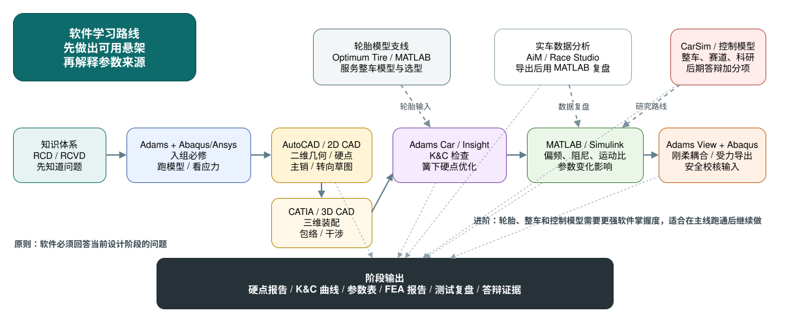
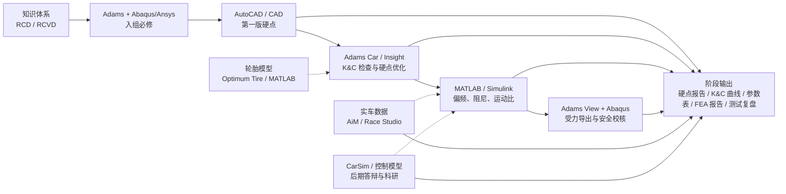

# 09 软件路线

## 目标读者

这篇文档面向需要学习悬架相关软件，但不想陷入“教程看了很多，设计仍然不会做”的队员。

软件路线必须服务于工程问题。会打开软件不等于会设计；能解释输入、输出、假设、限制和下一步验证，才算软件能力进入悬架设计链。

## 学习目标

- 知道每类软件回答什么工程问题。
- 明确最低可用工作流。
- 避免把软件熟练度误认为设计能力。
- 把软件输出接回 [设计目标](02-design-targets.md)、[几何与硬点](04-geometry-and-hardpoints.md)、[载荷与结构校核](07-loads-and-structure-check.md) 和 [验证与迭代](08-validation-and-iteration.md)。

## 软件问题总表

软件应回答 RCD / RCVD 式的工程问题：每个输出都要说明输入、假设、边界、版本和验证方式，并能被队友或评审复核，而不是只证明“软件会用”。

| 软件 | 回答的问题 | 最小可信输出 |
| --- | --- | --- |
| CAD / AutoCAD | 能不能布置、会不会干涉 | 硬点和包络图 |
| Adams Car | 轮端运动是否符合目标 | K&C 曲线和硬点报告 |
| Adams View / Insight | 载荷、刚柔耦合和优化 | 优化记录和载荷表 |
| MATLAB / Python | 参数如何计算、数据如何解释 | 脚本、图表、敏感性分析 |
| Abaqus / Ansys | 结构在载荷下是否安全 | FEA 报告和修改建议 |
| CarSim / Simulink | 整车行为和研究路线 | 整车模型结果和限制说明 |
| Git / Markdown / 版本化报告 | 结论能不能追溯、复现和传承 | 提交记录、评审文档、版本化报告 |

## 软件实现链

源材料中的软件路线不是把工具排成学习清单，而是把每个工具放进悬架设计的输入输出链。新人学习软件时，应先问“这个软件把哪个知识点做成了什么工程交付物”，再去学菜单和按钮。

| 设计阶段 | 主要工具 | 输入 | 最低交付物 | 交给下一步 |
| --- | --- | --- | --- | --- |
| 轮胎模型 | Optimum Tire、Adams Tire Data and Fitting Tool、MATLAB / Python、表格 | 轮胎数据、坐标约定、拟合目标、数据覆盖范围 | 轮胎模型说明、残差趋势、适用范围、待相关性验证项 | Adams Car、MATLAB / Python、CarSim / Simulink |
| 参数主版本 | 表格、Git / Markdown | 设计目标、整车参数、轮胎和簧上假设、版本说明 | 参数总表、单位表、假设表、变更记录 | CAD、Adams、FEA、数据分析 |
| 二维几何 | AutoCAD 或 2D CAD | 坐标系、轮胎 / 轮辋边界、目标几何、接口约束 | 硬点草图、主销几何、转向拉杆几何、坐标说明 | CATIA / 3D CAD、Adams Car |
| 三维包络 | CATIA / 3D CAD | 硬点、轮辋、制动、车架、转向、车身和维护空间 | 装配包络、干涉问题清单、制造 / 维修风险 | 硬点修正、结构支座、Adams 模型 |
| K&C 与硬点优化 | Adams Car、Adams Insight | 硬点、模板、轮胎模型、工况、设计变量和约束 | K&C 曲线、运动比、DOE / 灵敏度、优化取舍记录 | 簧上参数、载荷提取、评审报告 |
| 参数与响应分析 | MATLAB / Python、表格、Adams Car | 角重、轮胎刚度、弹簧阻尼、运动比、测试数据 | 偏频、侧倾刚度、阻尼方向、敏感性图 | 调校计划、整车仿真、测试验证 |
| 载荷提取 | 表格、MATLAB / Python、Adams View | 轮载、接地点力、硬点、连接定义、工况 | 载荷工况表、连接点力、坐标和单位说明 | Abaqus / Ansys、复材校核 |
| 结构校核 | Abaqus / Ansys | 载荷、约束、材料、网格、连接、铺层或失效准则 | FEA 报告、危险区域、设计修改建议 | 制造复核、测试前 release review |
| 测试回流 | Race Studio / AIM、MATLAB / Python、Git / Markdown | 通道字典、传感器标定、测试日志、车辆版本 | 数据清洗、相关性对比、调校记录、复测计划 | 轮胎模型、参数表、载荷工况、答辩证据 |

这张表的核心不是“推荐某个唯一软件”，而是要求每个软件输出都能被下一步使用。不能交给下一步复核的图、截图或模型文件，只能算练习结果，不能算设计证据。

## 视觉总览

## 推荐学习顺序

| 阶段 | 软件类别 | 最小任务 | 对应章节 |
| --- | --- | --- | --- |
| 入门 | 表格、CAD | 建立参数表，画第一版硬点 | 02, 04 |
| 基础仿真 | Adams Car 或同类多体软件 | 查看 K&C 和几何指标 | 04, 06 |
| 参数分析 | MATLAB 或 Python | 做参数计算、画图和敏感性分析 | 03, 05, 06 |
| 结构校核 | Abaqus 或 Ansys | 完成典型零件强度校核 | 07 |
| 进阶仿真 | Adams View / Insight、柔性体、多体整车 | 做优化、载荷导出和刚柔耦合检查 | 06, 07 |
| 文档固化 | Git、Markdown、版本化报告 | 记录参数来源、评审意见、结论和变更 | 00-10 |
| 研究探索 | CarSim、Simulink、数据平台 | 做整车仿真、控制和赛道分析探索 | 06, 08 |

## 表格工具

工程问题：

- 参数如何统一记录？
- 单位和版本如何避免混乱？
- 简单计算能否被别人复核？

最低工作流：

- 建立参数表，包含名称、符号、单位、来源、当前值、备注。
- 建立方案对比表，记录每次改动的原因和结果。
- 对关键公式写明输入和输出。
- 在每个阶段保存版本，避免仿真、CAD 和 FEA 使用不同参数。

常见错误：

- 单位混用。
- 只保存最终值，不保存来源和版本。
- 表格公式被手工覆盖后无人发现。

## CAD / AutoCAD

工程问题：

- 硬点和布置是否能装进车里？
- 杆件、转向、制动、轮辋、车架和车身包络是否干涉？

最低工作流：

- 建立坐标系，说明原点、轴向、单位和正负方向。
- 放入轮胎、轮辋、车架边界和关键包络。
- 画出第一版硬点、杆件、转向拉杆、避震器和可调结构。
- 输出硬点表给多体软件，并记录导出版本。

可信输出：

- 硬点和包络图。
- 干涉检查说明。
- 与车架、制动、转向、传动和空气动力学的接口清单。

常见错误：

- 坐标系和多体软件不一致。
- 只在静态姿态检查，不检查跳动、转向、侧倾和极限姿态。
- 过早追求漂亮模型，忽略接口确认。

## Adams Car

工程问题：

- 悬架几何和 K&C 指标是否符合目标？
- 参数变化对轮端运动有什么影响？

最低工作流：

- 导入硬点。
- 设置单位、坐标和基础模板。
- 跑轮跳、转向、侧倾等基础工况。
- 导出外倾、前束、侧倾中心、bump steer 等结果。
- 将曲线和 [04 几何与硬点](04-geometry-and-hardpoints.md) 的目标逐项对比。

可信输出：

- K&C 曲线。
- 硬点报告。
- 参数改动记录和模型限制说明。

常见错误：

- 模型模板不理解就直接套用。
- 只看某个指标的峰值，不看曲线趋势。
- 优化目标没有工程含义。

## Adams View / Insight

工程问题：

- 哪些载荷应传给结构校核？
- 刚柔耦合、参数优化或特殊机构是否需要比模板模型更细的表达？
- 优化目标和约束是否真的对应车辆目标？

最低工作流：

- 从已验证的几何模型开始，不用进阶工具修补基础输入错误。
- 明确工况、目标函数、约束和设计变量。
- 导出关键连接点载荷，并说明坐标系、单位和时间点。
- 对优化前后结果做物理检查，避免只接受软件给出的最优点。

可信输出：

- 优化记录。
- 载荷表。
- 关键假设和未覆盖工况说明。

常见错误：

- 把没有工程边界的数值优化当成设计结论。
- 只导出最大载荷，不说明工况来源和方向。
- 刚柔耦合模型复杂，但材料、连接和边界条件仍不可信。

## MATLAB / Python

工程问题：

- 参数选择是否有可复现的计算依据？
- 仿真和实车数据如何处理？
- 设计结论是否能用图表清楚表达？

最低工作流：

- 编写参数计算脚本，输入和单位写在文件开头或配置表中。
- 绘制曲线并保存输入参数。
- 做简单敏感性分析。
- 读取测试数据，完成滤波、对齐、绘图和对比。

推荐任务：

- 四分之一悬架模型。
- 偏频和阻尼选择。
- 纵向/侧向简化车辆模型。
- 轮胎数据可视化。
- 出车数据后处理。

常见错误：

- 脚本里写死参数但不记录来源。
- 图表没有单位和工况说明。
- 用复杂模型掩盖基础假设不清楚。

## Abaqus / Ansys

工程问题：

- 结构在定义载荷下是否安全？
- 哪些区域需要修改几何、材料、连接或工艺？

最低工作流：

- 明确载荷来源和约束含义。
- 建立简化但合理的模型。
- 设置材料、网格、接触和连接。
- 检查应力、位移、安全系数或失效指标。
- 写出模型限制和复核建议。

可信输出：

- FEA 报告。
- 修改建议。
- 需要实物检查、疲劳评估或材料验证的风险清单。

常见错误：

- 约束过硬导致结果失真。
- 只看最大应力，不检查位置是否为奇异点。
- 复合材料只按各向同性材料处理。

## CarSim / Simulink / 整车研究工具

工程问题：

- 整车行为、控制策略或赛道分析是否需要更高层模型？
- 哪些路线适合用于答辩、科研或下一代方案储备？

最低工作流：

- 先明确研究问题。
- 使用简化模型验证思路。
- 再接入更完整的整车工具。
- 把输出和实车数据或低阶模型对比。

可信输出：

- 整车模型结果。
- 输入版本表。
- 限制说明和后续验证计划。

常见错误：

- 人手不足时过早投入复杂工具。
- 模型输入来自多个组但没有版本控制。
- 研究项目和当年设计闭环脱节。

## Git / Markdown / 版本化报告

工程问题：

- 设计结论、参数来源和评审意见能否被追溯？
- 下一位队员能否复现当时为什么这样改？
- 学习文档和项目工作材料能否清楚分层？

最低工作流：

- 用 Git 记录学习文档、脚本、参数说明和报告模板的变更。
- 用 Markdown 写设计说明、评审记录、测试复盘和待验证项。
- 每次关键参数变化都记录来源、影响章节、验证证据和未解决风险。
- 把导出的 PDF、图片或报告视为结果文件，保留生成它们的脚本、模型版本或输入说明。

可信输出：

- 清晰的提交记录。
- 可审阅的 Markdown 评审文档。
- 标明版本、输入和限制的设计报告。

常见错误：

- 只在聊天或口头会议里保存关键结论。
- 把最终报告当作唯一资料，不保留参数来源和修改历史。
- 把内部截图、表格或原始数据混进学习文档。

## 实践任务

为每个软件类别写一个“一天内能完成的最小练习”，要求包含：

- 输入；
- 操作步骤；
- 输出文件；
- 判断结果是否可信的方法；
- 下一步如何接入真实设计。

## 进阶阅读

按表格、CAD、Adams、MATLAB/Python、FEA、数据采集、Git/Markdown 拆解的最小可用工作流见 [高级 09 软件工作流](advanced/09-software-workflows.md)。

## 参考来源

本篇由公开资料和经过改写的软件工作流经验整理而成。公开参考资料和来源处理方式见 [references.md](references.md)。

## 本章公开来源

- [MathWorks: Magic Formula Tire Modeling in Formula Student](https://blogs.mathworks.com/student-lounge/2022/06/07/mf-tyre/)，用于轮胎模型工具链和 MF-Tyre 接口说明。
- [Formula Student Vehicle with Simscape](https://github.com/simscape/Formula-Student-Vehicle-Simscape) 与 [Simscape Multibody Formula Student video](https://www.mathworks.com/videos/formula-student-vehicle-modeling-using-simscape-multibody-1683608443602.html)，用于公开整车模型、K&C、maneuver 和参数化模板。
- Adams Car / Adams View / Adams Insight、Abaqus / Ansys、MATLAB / Python 等官方资料类型，用于说明软件章节应按“工程问题 -> 输入 -> 输出 -> 验证”组织。
- Dewesoft / Mantracourt / HBK 数据采集案例，用于把测试数据回流到模型和答辩证据。
- 完整章节索引见 [参考资料：章节引用索引](references.md#章节引用索引)。
