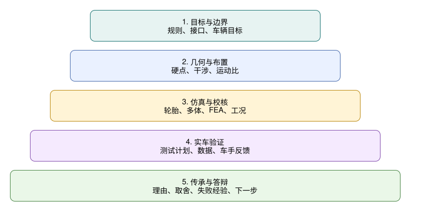
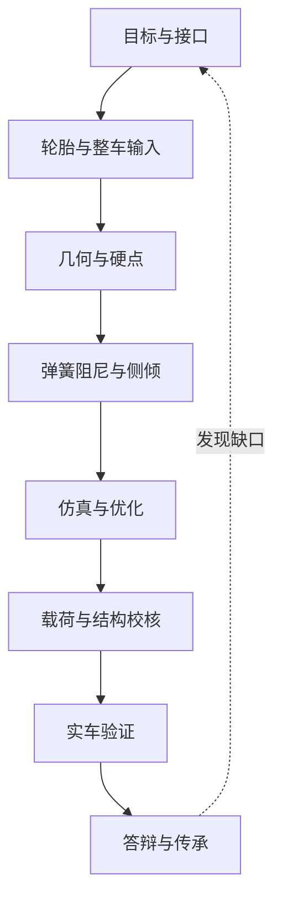

# 10 检查清单

## 目标读者

这篇文档面向设计评审、软件仿真、出车测试和答辩准备中的悬架队员。清单不是为了增加流程感，而是为了让关键问题不要靠记忆。

本章按手册主线排序，可直接作为一次悬架设计评审的顺序：先问目标和接口，再问轮胎、几何、簧上系统、仿真、校核、实车验证，最后整理答辩和传承。

## 学习目标

- 在每个设计阶段知道该检查什么。
- 把经验、风险和验证证据记录下来。
- 让下一位队员能复盘你的判断。

## 视觉总览

## 快速 Gate

以下 gate 用来在评审会上快速判断“能不能进入下一步”。任一项无法回答时，不要用经验补空；把结论降级为待验证、退回修改或暂停公开。

| Gate | 必问问题 | 不合格信号 |
| --- | --- | --- |
| 来源边界 source boundary | 公开来源、工程经验和内部项目资料是否分层？正文是否只保留通用流程、字段和边界？ | 把公开案例参数、内部文件名、截图或原始数据写进读者可见内容 |
| 参数分类 parameter class | fixed、adjustable、derived、measured 是否分清？变更后哪些章节要重开？ | 把固定硬点或质量当成赛场调校变量，把 derived output 手工改成 input |
| MR / VR convention | motion ratio、velocity ratio、wheel rate、damper velocity 的定义和单位是否逐处一致？ | 运动比倒置、单位混用，或图表没有说明 damper / wheel 方向 |
| 仿真边界 simulation boundary | 模型层级、输入版本、变量范围、stop criterion 和 downstream consumer 是否清楚？ | 只保存软件截图，或把优化最优点当成可制造方案 |
| correlation 边界 | 仿真与测试是否在同一问题、同一场景、同一版本下比较？ | 把“曲线接近”写成实车证明或结构安全证明 |
| 结构交付 boundary package | MBD-to-FEA 载荷是否带坐标、方向、峰值时刻、作用点、连接和反力平衡？ | 只给最大力或云图，不给工况和边界 |
| 复材证据等级 | 材料 allowables、铺层、连接、coupon / 首件 / 实车检查证据等级是否说明？ | 用公开资料给通用 coupon、材料许用或释放阈值 |
| DAQ 降级 | channel map、标定、同步、滤波和通道失效后的降级规则是否记录？ | 关键通道失效后仍作定量结论 |
| stop / restart | 停测条件、修复证据、降级测试和恢复性能测试条件是否写清？ | 安全异常修完后直接恢复原性能测试 |
| 发布边界 release boundary | 发布前是否检查链接、来源、敏感词、源文件名、内部值、截图和原始数据？ | 为了完整性发布未授权材料或可反推历史方案的信息 |

## 目标与接口

- 车辆目标是否写清楚？
- 当年规则版本是否确认？
- 悬架目标是否从整车目标分解而来，而不是直接沿用旧方案？
- 轮胎、轮辋、车架、制动、转向、传动、空气动力学和电控边界是否确认？
- 关键参数是否写明单位、坐标系、正负方向和目标范围？
- 上一代车辆问题是否转化为可验证目标？
- 每个目标是否有验证方式？
- 哪些目标互相冲突，是否记录取舍？
- 需要跨组确认的接口是否有负责人和时间点？
- 来源边界是否写清：规则、公开资料、工程经验和内部项目资料分别支持什么？

## 轮胎与整车输入

- 轮胎数据来源、工况范围和缺失工况是否记录？
- 轮胎模型版本是否可追溯？
- 拟合结果是否覆盖目标载荷、外倾、滑移和温度压力使用范围？
- 轮胎结论是否说明了数据限制，而不是只比较峰值抓地？
- 数据覆盖不足时，结论是否降级为趋势、初筛或待相关性验证？
- 整车模型中质量、质心、轴距、轮距、空气动力学和控制输入是否版本一致？
- fixed、adjustable、derived、measured 参数是否分开记录？
- 动态轮荷、载荷转移和轮胎载荷敏感性是否进入参数讨论？
- 轮胎、轮辋、制动和转向节的包络是否和几何建模一致？
- 仿真问题是否明确？
- 仿真结论是否写明限制？

## 几何与硬点

- 坐标系、单位和正负方向是否明确？
- 硬点来源、版本和修改理由是否记录？
- 主销内倾、主销后倾、机械拖距、scrub radius 是否检查？
- 外倾、前束、侧倾中心、bump steer、轮距变化和轮距包络是否导出？
- 轮跳、转向、侧倾、制动姿态下是否检查干涉？
- A 臂、转向拉杆、制动卡钳、轮辋、车架节点和传动部件是否共同检查？
- Ackermann、anti-dive、anti-squat 等指标是否说明适用目的和副作用？
- 参数改动是否有理由、结果和版本记录？

## 弹簧阻尼与侧倾

- 偏频、轮端刚度、弹簧刚度、运动比和阻尼目标是否一致？
- motion ratio / velocity ratio 约定是否写明，轮端、弹簧端和阻尼器端的单位是否一致？
- 弹簧/阻尼器行程是否满足目标工况？
- 运动比曲线是否平滑且可解释？
- 轮端刚度和弹簧刚度是否区分清楚？
- 抗侧倾杆或第三弹簧等结构是否有明确设计目的？
- 前后侧倾刚度分配是否和车辆目标、轮胎特性、空气动力学需求一起讨论？
- 可调范围是否足够实车调校？
- 布置是否与车架、车身、传动、空气动力学和维修空间冲突？

## 仿真与优化

- 仿真问题是否先被写成工程问题，而不是直接打开软件？
- 输入版本是否与目标、轮胎、硬点和簧上参数一致？
- 简化计算、K&C、多体动力学、参数研究和整车模型各自回答什么问题是否清楚？
- 优化目标、约束、变量范围和停止条件是否记录？
- 优化结果是否经过物理解释和包装检查？
- 敏感性分析是否说明哪些参数最影响结论？
- 模型限制、未覆盖工况和下一步验证是否写清楚？
- correlation 是否只用于说明模型在特定场景下更可信，而不是被写成全部工况或结构安全证明？
- 软件输出是否回到设计决策，而不是只作为图片保存？
- 软件输出是否说明下游消费者，例如硬点修正、FEA boundary package、测试矩阵或答辩证据？
- RCD / RCVD 概念是否已转成输入、输出、假设 / 边界和验证证据 verification evidence，而不是停留在书摘或软件截图？

## 载荷与结构校核

- 载荷来源是否明确？
- 工况是否覆盖制动、转弯、加速、冲击、组合载荷和装配预紧等关键风险？
- 多体载荷、手算载荷和工程经验之间是否做过数量级检查？
- 边界条件是否符合真实连接方式？
- 材料参数是否有来源？
- 网格质量是否检查？
- 最大应力位置是否判断为真实风险还是奇异点？
- 金属件是否检查安全系数、屈服、疲劳、连接和制造风险？
- 复合材料件是否检查铺层、方向、失效准则、连接和制造缺陷风险？
- 复材证据是否分级：公开来源、供应商数据、coupon、连接样件、首件和实车复查分别能支持什么？
- 复材结论是否避免给出通用 coupon、allowable、铺层表或释放阈值？
- 设计修改后是否重新校核？
- 校核结论是否写成“可制造、需修改、需试验验证”中的明确状态？

## 实车验证

- 测试目标是否明确？
- 测试前车高、角重、外倾、前束、胎压、预载和可调件位置是否记录？
- 传感器、采样率、数据格式和校准状态是否确认？
- channel map 是否说明每个通道能回答什么、不能回答什么、失效后如何降级？
- 每轮测试只改少量变量了吗？
- 车手反馈是否和数据一起记录？
- 仿真和实车差异是否解释？
- 调校建议是否能转成下一次测试计划？
- 测试后是否检查松动、干涉、裂纹、磨损和温度异常？
- stop condition、restart condition 和 degraded test 边界是否提前写清？
- 未验证的设计结论是否标成风险，而不是默认通过？

## 答辩与传承

- 能否用三分钟解释本年度悬架目标？
- 每个关键参数是否能回答“为什么是这个值”？
- 是否准备了与上一代或备选方案的对比？
- 是否能解释仿真模型的输入、输出和限制？
- 是否能说明实车验证做了什么、没做什么、下一步怎么做？
- 是否把失败尝试、工程取舍和未解决风险写清楚？
- 成本、制造、装配、维护和调校是否与设计逻辑一致？
- 下一位队员是否能根据文档复现关键计算、模型和评审结论？
- 发布前是否已经去除未授权资料、原始数据、截图、表格、内部路径、源文件名、敏感词和内部标识？
- 发布前链接、来源角色和章节 `## 本章公开来源` 是否与正文一致？

## 实践任务

选一份已有设计报告或你自己的练习方案，用本清单做一次评审。把问题分成：

- 立即修改；
- 需要跨组确认；
- 需要仿真或测试验证；
- 暂时接受但必须记录风险。

## 进阶阅读

覆盖目标、轮胎、几何、簧上系统、仿真、金属件、复材、验证、文档和答辩的完整评审门见 [高级 10 评审清单](advanced/10-review-checklists.md)。

## 参考来源

本清单由公开资料和经过改写的工程评审经验整理而成。公开参考资料和来源处理方式见 [references.md](references.md)。

## 本章公开来源

- [FSAE Design Judging Score Sheet](https://www.fsaeonline.com/content/fsae%20design%20score%20sheet%20150pt.pdf)，用于把检查项分成 design、build、refinement / validation 和 understanding。
- [DesignJudges: A Field Guide to the Design Event](https://www.designjudges.com/articles/a-field-guide-to-the-design-event)，用于答辩组织、设计报告、证据包和现场准备。
- [DesignJudges: Conceptual and Objective Design in FSAE](https://www.designjudges.com/articles/conceptual-and-objective-design-in-fsae)，用于把整车目标、概念设计、质量模型和仿真边界纳入检查清单。
- [参考资料：章节引用索引](references.md#章节引用索引)，用于检查每章公开来源是否已经转成工程问题，而不是链接堆。
