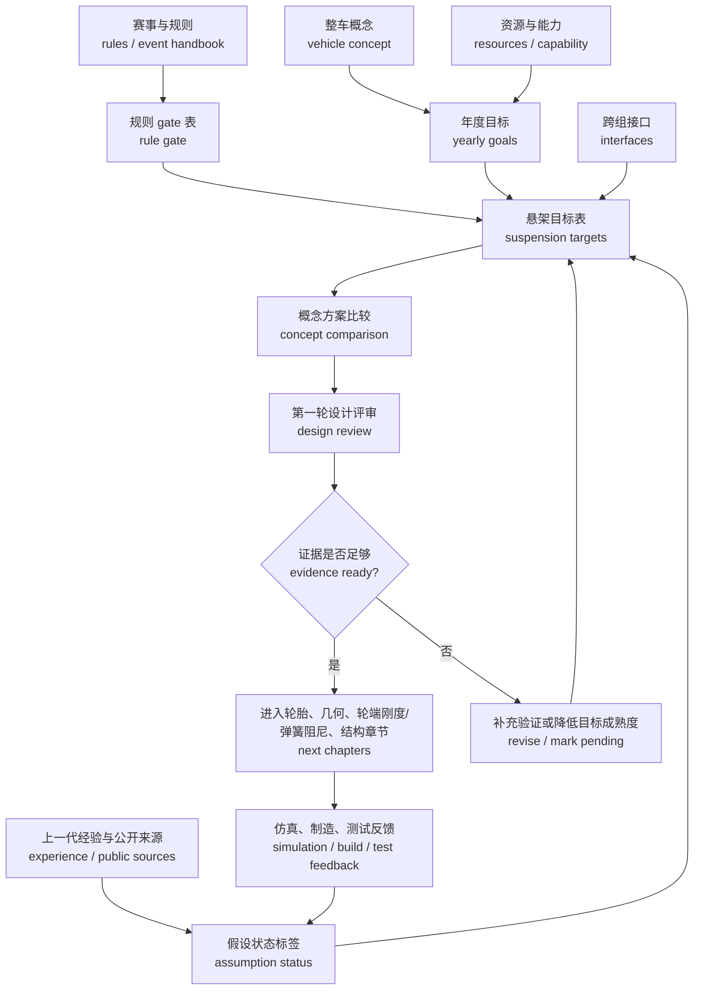

# 01 设计目标与约束分解

## 本章解决的问题

悬架设计的第一步不是画硬点，也不是挑弹簧，而是建立一套能被解释、能被评审、能被验证的目标系统。[快速版设计目标章节](../02-design-targets.md) 已经给出入门目标表，本章把它扩展成工程章节：年度目标如何设定、规则 gate 如何关闭、design event 证据如何准备、接口如何管理，以及假设如何标注成熟度。

本章坚持三个边界：

1. 规则和赛事文件是最低 gate，不是永久通用数值库。
2. DesignJudges 和公开车队报告可以帮助理解目标、概念和证据组织，但不能替代官方规则，也不能提供可直接套用的参数。
3. 公开文档只写可泛化的方法、表格和检查逻辑；具体车辆参数、原始测试数据、内部代号和未授权图表留在团队内部记录中。

## 年度目标设定

年度目标应从整车层开始。悬架组要先理解“今年这台车想解决什么问题”，再决定几何、行程、弹簧阻尼、结构和测试目标。目标设定至少经过四步。

| 步骤 | 要回答的问题 | 输出 |
| --- | --- | --- |
| 1. 确认赛事与规则 | 参加哪个赛区、哪个赛季、适用哪些 rules、event handbook、设计文件模板和检查流程？ | 规则 gate 表、版本、检查日期、负责人 |
| 2. 确认整车概念 vehicle concept | 今年优先可靠完成、低速灵活、稳定可预测、轻量、可维护、成本控制，还是某类动态项目表现？ | 整车优先级、悬架角色、不可牺牲的边界 |
| 3. 盘点资源 | 人员经验、预算、制造能力、采购周期、软件能力、传感器和测试日是否支持目标？ | 资源约束、目标复杂度上限、风险项 |
| 4. 拆成悬架任务 | 哪些目标落到轮胎、几何、轮端刚度/弹簧阻尼、结构、调校和测试？ | 悬架目标表、接口表、验证矩阵 |

年度目标不应只写“追求性能”。一个更成熟的表述会同时说明：目标工况、为什么今年重要、由谁确认、会影响哪些子系统、验证证据是什么、哪些输入仍待验证。

## 规则 gate 与 design event 证据

规则 gate 是进入设计的最低门槛。目标表应记录规则来源、适用赛季、检查状态和未关闭问题；但不要把旧年份条文、规则镜像或某个赛区评分表写成所有赛事都适用的结论。

design event 不是在最后补 PPT。公开评分表和评审文章共同提醒一件事：裁判会检查目标是否能连到设计决策、制造实现、验证证据和团队理解。悬架目标阶段就应该准备这些证据。

| 证据类别 | 目标阶段要准备什么 | 不应怎么写 |
| --- | --- | --- |
| 规则证据 | 官方资源入口、适用文件版本、规则 gate 表、检查负责人、关闭日期 | 用过期文件或第三方镜像当最终规则 |
| 设计报告证据 | 目标来源、概念取舍、接口边界、被放弃方案和风险 | 只列最终参数，不解释为什么 |
| 制造证据 | 方案是否可加工、可装配、可维护，关键公差如何控制 | 把“能画出来”当成“能造出来” |
| 验证证据 | 计算、仿真、K&C、FEA、台架或实车测试如何支持目标 | 把仿真图当成无需相关性验证的结论 |
| 团队理解证据 | 成员能解释目标、假设、取舍和更新触发 | 让文档只有少数人能读懂 |

如果规则最低要求和性能愿望冲突，先满足规则和安全，再重新调整车高、行程、包络、运动比、结构或目标优先级。目标阶段的成熟标志不是参数多，而是每个关键目标都知道“为什么、由谁、怎么验证、何时重算”。

## 目标、约束、偏好和假设

目标表建议强制包含 `类型` 字段。

| 类型 | 定义 | 管理方式 |
| --- | --- | --- |
| 约束 constraint | 不满足就不能参赛、不能制造、不能装配、不能安全测试或会违反已确认接口 | 必须有负责人、版本和关闭证据；变化后触发评审 |
| 目标 target | 方案希望达到的工程表现，可通过计算、仿真、测试或设计评审检查 | 写清单位、评价方式、接受准则和验证方法 |
| 偏好 preference | 多个可行方案之间的倾向，例如简化加工、减少专用件、沿用熟悉工具 | 记录取舍理由；不能伪装成硬约束 |
| 假设 assumption | 设计早期用于启动计算或模型的输入，尚未完全确认 | 必须标注状态、来源、更新触发和影响章节 |

常见错误是把偏好写成约束，把估算写成事实，把目标写成单点参数。比如“更高侧倾刚度”本身不是成熟目标；它要回到轮胎载荷敏感性、车身姿态、气动高度、车手信心、机械抓地和测试可调性的共同取舍。

## 假设状态标签

每条关键输入都应标注状态。下面这组标签可直接放进目标表或输入版本表。

| 标签 | 含义 | 使用边界 |
| --- | --- | --- |
| 实测 measured | 来自本项目已校准测量、台架、实车测试或供应商确认数据 | 写明测量条件、单位、日期和负责人 |
| 估算 estimated | 来自一阶计算、质量预算、早期 CAD、经验范围或简化模型 | 只能启动设计；不能当最终放行证据 |
| 继承 inherited | 来自上一代项目或团队经验，已被重新审查为可参考 | 必须说明今年规则、轮胎、包络和资源是否改变 |
| 公开案例启发 public-case-derived | 来自公开论文、报告、DesignJudges 或公开车队资料的结构和方法 | 只能学习报告组织、证据类型和思考路径；不复制参数 |
| 待验证 pending verification | 来源、条件或适用性还没有关闭 | 必须写关闭条件、责任人和受影响章节 |

这些标签让读者知道目标的可信度，也让团队知道什么时候需要回头重算。比如质量估算、轮胎模型、制动包络、车架节点、传感器计划或测试结果变化，都可能影响几何、轮端刚度/弹簧阻尼、载荷和仿真章节。

## 目标分解流程

这条流程强调：目标表不是一次性冻结的文档，而是会被规则更新、接口变更、测试结果和制造反馈持续修订的工程记录。

## 目标化设计 objective design 与概念方案比较

DesignJudges 关于 conceptual and objective design 的核心价值，在于提醒团队不要孤立优化子系统。悬架目标应服务整车概念，并通过可比较的方案来说明为什么选择某条路线。

概念比较可以很简单，但要有边界：

| 比较项 | 方案 A：保守可靠 | 方案 B：提高可调范围 | 方案 C：激进性能探索 |
| --- | --- | --- | --- |
| 适合的年度目标 | 新队伍、测试少、制造资源有限 | 有稳定测试计划，需要学习调校 | 有较强仿真、制造和测试能力 |
| 主要收益 | 完成度高、风险低、容易解释 | 更容易在测试中学习车辆响应 | 有机会改善目标工况表现 |
| 主要风险 | 性能上限可能受限 | 零件复杂、装配和重复定位要求高 | 验证压力大，失败成本高 |
| 需要的证据 | 规则 gate、包络、基本计算、制造评审 | 调校矩阵、重复定位、测试计划 | 模型边界、参数研究、充分测试 |
| 决策条件 | 资源不足或规则/包络变化较多 | 测试资源和成员能力能支撑 | 风险关闭条件明确且可验证 |

这里的 A/B/C 不是推荐答案，而是示范比较方式。成熟目标会说明为什么某个概念适合今年的规则、资源、团队能力和整车优先级。公开车队报告可以用来学习这种报告结构，但不能用来复制目标值或方案权重。

## 约束与接口矩阵

悬架是接口密集系统。目标阶段应建立接口矩阵，并把每个接口和目标表互相链接。

| 接口对象 | 需要对方确认 | 悬架交付物 | 目标阶段检查 |
| --- | --- | --- | --- |
| 底盘 / 车架 chassis / frame | 主结构节点、管件空间、焊接/安装面、载荷路径、坐标系 | 安装点需求、支座载荷方向、维护工具路径 | 坐标系一致；极限行程不干涉；载荷能回到主结构 |
| 气动 aero / bodywork | 目标车高、地板/扩散器空间、翼面敏感性、车身拆装 | 行程窗口、姿态控制目标、杆件外露边界 | 侧倾和俯仰对气动窗口的影响已标注 |
| 传动 drivetrain | 电机、差速器、链线或半轴包络、极限角度、轮毂连接 | 轮心、后悬杆件空间、牵引工况需求 | 跳动、转向和传动极限组合不冲突 |
| 制动 brakes | 制动盘、卡钳、轮毂、油管、散热和维护空间 | upright 包络、轮辋内间隙、制动入弯目标 | 卡钳和油管在极限姿态下可避让 |
| 转向 steering | 齿条位置、转向柱空间、行程、转向角、力矩目标 | 主销参数、转向节臂、拉杆点、bump steer 目标 | 极限转向和跳动组合工况已检查 |
| 人机 ergonomics | 驾驶员姿态、踏板、方向盘、视野、逃生和可维护边界 | 前舱杆件避让、调整件可达性、规则优先边界 | 不用性能目标压缩安全和驾驶员空间 |
| 制造 manufacturing | 材料、加工设备、公差、夹具、热处理、外协周期 | 零件复杂度、关键公差、检具需求、可替换件策略 | 设计能制造、能检验、能重复装配 |
| 测试 testing | 场地、传感器、DAQ、轮胎数量、测试日程、安全流程 | 调校矩阵、验证方法、复测条件、问题清单 | 目标能被测到；每次测试变量可控 |

接口矩阵的价值在于提前暴露冲突。若车架节点、制动包络、轮胎尺寸或气动高度窗口改变，目标表应显示哪些章节需要重新打开，而不是让后续成员凭记忆追补。

## 目标表字段

建议把目标表作为高级手册后续章节的共同入口。字段可以按如下结构组织：

| 字段 | 说明 |
| --- | --- |
| 编号 | 便于在几何、轮端刚度/弹簧阻尼、结构和测试章节引用 |
| 目标或约束 | 只写一个工程问题，避免一行塞多个目标 |
| 类型 | 约束、目标、偏好或假设 |
| 输入来源 | 官方规则、整车目标、接口会议、公开来源、测试反馈、估算等 |
| 假设状态 | 实测、估算、继承、公开案例启发或待验证 |
| 单位/评价方式 | mm、deg、N、N/mm、N·m/deg、等级、趋势或定性评审 |
| 负责人 | 负责确认输入和关闭风险的人或组 |
| 验证方法 | 计算、CAD 包络、K&C、FEA、制造评审、台架、实车测试、design event 证据 |
| 更新触发 | 规则、质量、轮胎、包络、制造、测试或接口变化 |
| 影响章节 | 轮胎、几何、spring / damper / roll、仿真、结构、复材、验证或软件 |

不成熟的目标可以进入表格，但必须标注状态。比如“待验证：测试传感器计划尚未确认，因此制动入弯目标目前只能用仿真和车手反馈闭环，不能宣称已由实车数据验证。”

## 目标成熟度输出

成熟目标不是看起来技术词多，而是输出物能支撑设计推进。可以用下面的成熟度检查。

| 成熟度 | 状态 | 必须有的输出 |
| --- | --- | --- |
| M0 意图 | 只有方向，例如稳定、轻量、低速灵活 | 目标草句、来源记录、待验证标签 |
| M1 可追溯 | 能追到规则、整车概念、资源或接口 | 输入来源、负责人、假设状态、更新触发 |
| M2 可分解 | 能分到轮胎、几何、轮端刚度/弹簧阻尼、结构、测试等章节 | 影响章节、接口矩阵、初版验证方法 |
| M3 可比较 | 至少比较过两个可行方案或取舍路径 | 概念比较表、被放弃方案、风险清单 |
| M4 可验证 | 有计算、仿真、制造、测试或 design event 证据计划，并知道证据边界 | 验证矩阵、数据需求、评审记录、关闭条件 |

进入几何和硬点设计前，关键约束应达到 M4，关键性能目标至少达到 M2/M3。关键规则、安全、包装和装配约束不能只停留在证据计划：进入几何或结构决策前，它们必须已经关闭，或由负责人以风险通过/带风险通过形式写明批准条件、关闭日期和受影响章节。若目标仍是 M0/M1，可以继续作为探索方向，但不要让它支配结构、包络或安全相关决策。

## 设计评审门槛

第一轮设计评审建议至少问这些问题：

- 是否能说明今年悬架服务的整车概念，而不是只列参数？
- 是否已经核对适用规则和 design event 文件，并把它们写成规则 gate？
- 是否明确哪些输入是实测、估算、继承、公开案例启发或待验证？
- 是否覆盖底盘、气动、传动、制动、转向、人机、制造和测试接口？
- 是否记录被放弃方案和取舍理由？
- 是否知道每个关键目标如何验证，以及验证失败时要回到哪个章节？
- 是否避免了受限原始数据、未经授权图表、内部代号和可反推出历史车辆细节的组合参数？

评审结论可以分为：

| 结论 | 含义 | 下一步 |
| --- | --- | --- |
| 通过 | 关键规则 gate 和接口已关闭，目标能进入后续章节 | 进入轮胎、几何、轮端刚度/弹簧阻尼、结构和仿真任务 |
| 带风险通过 | 目标方向可用，但仍有待验证输入 | 写清关闭条件、负责人和重算章节 |
| 退回修改 | 规则、接口、验证或资源边界不足以支撑设计 | 降低目标成熟度，补充证据或改概念 |

对于结构、安全和规则相关目标，评审语言应保守。早期仿真或公开案例只能支持设计方向，不能替代材料数据、制造检查、实车测试和规则审查。

## 与后续章节的关系

本章回答“为什么这样设计”。后续章节负责把目标落成具体输入、模型、结构和验证。

- [02 轮胎与整车输入](02-tire-and-vehicle-inputs.md)：把整车目标、质量、轮胎和测试边界转成轮胎模型与车辆输入。
- [03 几何与硬点](03-geometry-and-hardpoints.md)：把操稳目标、包络和接口约束转成 hardpoints、K&C 和 steering interface 检查。
- [04 弹簧、阻尼、侧倾与车身姿态](04-spring-damper-roll-and-ride.md)：把姿态、行程、轮端刚度、motion ratio 和调校目标连起来。
- [05 仿真、优化与相关性](05-simulation-optimization-correlation.md)：把目标成熟度转成模型层级、参数研究和 correlation 计划。
- [06 载荷与金属结构](06-loads-metal-structure.md)：把目标工况和接口载荷转成结构校核输入。
- [07 复合材料与制造风险](07-composites-and-manufacturing.md)：把材料、铺层、连接、制造变差和验证边界纳入目标成熟度，而不是只看轻量化愿望。
- [08 验证、测试与答辩](08-validation-testing-defense.md)：把目标表变成测试矩阵、数据证据和 design event 解释。
- [09 软件工作流](09-software-workflows.md)：把目标表中的输入、假设状态和验证方法传递给计算表、CAD、MBD、FEA、DAQ 和文档 workflow。
- [10 评审清单](10-review-checklists.md)：把本章的目标、约束、接口、假设和验证边界固化成检查问题。

如果后续章节发现输入变化，例如轮胎、质量、车高、制动包络、制造公差或测试数据更新，应回到本章更新目标表，而不是只在单个模型里改数值。

## 本章公开来源

- [Formula SAE Series Resources](https://www.fsaeonline.com/cdsweb/gen/documentresources.aspx)：用于规则、评分表和设计文件模板的官方复核入口；本章只把它写成维护习惯和规则 gate，不引用永久数值。
- [Formula SAE Design Judging Score Sheet](https://www.fsaeonline.com/content/fsae%20design%20score%20sheet%20150pt.pdf)：用于说明 design event 会检查设计、制造、验证和团队理解；具体分值和分类必须按当年文件复核。
- [IMechE Formula Student Forms and documents](https://www.imeche.org/events/formula-student/team-information/forms-and-documents)：作为 FS UK 当前文件入口；2026-06-21 复核时该页列出 `FS2026 Design Judging Scoring Sheet`，并把上一年 static documents 标为 archived/reference only。正文只采用“从官方入口复核当前表格”的维护习惯，不把某年评分表写成永久规则。
- [FSG Rules & Documents](https://www.formulastudent.de/fsg/rules)：作为 FSG 2026 当前规则和 handbook 入口；2026-06-21 复核时该页列出 `FS-Rules_2026_v1.1` 和 `FSG26_Event_Handbook_v1.3`。本章只把它们用于规则 gate、文件更新和设计答辩证据类型的复核，不作为其它赛事要求。
- [DesignJudges: A Field Guide to the Design Event](https://www.designjudges.com/articles/a-field-guide-to-the-design-event)、[Conceptual and Objective Design in FSAE](https://www.designjudges.com/articles/conceptual-and-objective-design-in-fsae) 和 [Setting Winning Priorities](https://www.designjudges.com/articles/setting-winning-priorities)：用于目标设定、概念比较、可靠性和证据组织的评审视角；不作为官方规则解释。
- 公开车队报告和公开论文只用于案例结构、报告组织和验证边界对照，不复制参数、图表或方案权重。完整章节索引见 [参考资料：章节引用索引](../references.md#章节引用索引)。
