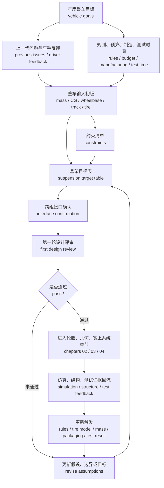

# 01 设计目标与约束分解

## 本章解决的问题

悬架设计的第一步不是打开 CAD 画 A 臂，也不是直接沿用上一代硬点，而是把“今年这台车要成为什么样的车”翻译成悬架可以执行、可以评审、可以验证的目标。[快速版设计目标章节](../02-design-targets.md) 已经说明了基本输入和常见判断，本章进一步展开目标分解、跨组接口、证据记录和评审门槛。

本章要解决四个问题：

1. 如何从整车目标、比赛目标和车手反馈中提炼悬架目标。
2. 如何区分必须满足的约束 constraint、希望优化的目标 target、以及可以取舍的偏好 preference。
3. 如何让目标表既能指导几何、弹簧阻尼、仿真和结构校核，又避免把某一台历史赛车的具体性能数据当作通用答案。
4. 如何在输入变化时触发重新评审，而不是让早期假设静悄悄地污染后续设计。

这里的“目标”不是口号。合格的目标应至少说明工程含义、单位或评价方式、来源、验证方法、负责人、版本和更新触发条件。对于安全相关或结构相关内容，本章给出的是工程流程，不能替代规则审查、专业校核、材料数据、制造验证和实车测试。

## 从整车目标到悬架目标

FSAE / Formula Student 的悬架目标来自整车目标。整车目标通常包含：比赛项目优先级、可靠性目标、可维护性目标、成本与制造周期、车手训练水平、测试时间、团队软件能力、上一代赛车暴露的问题，以及规则、场地和预算边界。悬架组不能只问“外倾角应该多少”或“侧倾中心放哪里”，而要先问这些参数服务于什么整车行为。

目标分解可以按以下路径理解：

| 层级 | 典型问题 | 悬架需要转译成什么 |
| --- | --- | --- |
| 年度整车目标 | 今年更重视低速灵活、稳定可预测、可靠完赛、轻量化、可调校，还是更高极限 | 几何目标、轮端刚度、行程窗口、可调范围、结构裕度和测试优先级 |
| 上一代问题 | 车手是否反馈入弯迟钝、弯中推头、制动不稳、出弯牵引差、颠簸路面难控制 | 运动学曲线、前后侧倾刚度分配、制动姿态、阻尼方向、轮胎工作窗口 |
| 规则和包络 | 轮距、轴距、离地间隙、轮胎外廓、车身边界、紧固件和安全要求 | 硬点边界、杆件空间、行程限位、安装结构、维护空间 |
| 制造和预算 | 能否加工复杂 upright，能否采购目标弹簧阻尼，能否反复试制 | 参数可实现性、结构简化、通用件选择、调校件数量 |
| 测试和答辩 | 有多少实车测试时间，能否采集车速、方向盘角、加速度、轮速、行程 | 目标验证方法、传感器需求、数据处理脚本、答辩证据包 |

这类推理链值得保留，但表达应落在工程目标上，例如“提升低速弯响应”“改善弯中稳定性”“目标接近中性转向”“在规则和包络内增加可调范围”。某一年车辆的精确成绩、车辆编号和完整参数组合不适合作为通用教学内容。

从整车目标落到悬架目标时，建议先形成一张“悬架目标草表”，每一行只表达一个工程问题。例如：

| 目标类别 | 工程含义 | 悬架影响 | 证据 | 项目资料 |
| --- | --- | --- | --- | --- |
| 操纵稳定性 handling stability | 车辆在稳态转弯、瞬态转向和制动转向组合工况下是否可预测 | 主销参数、前束变化、侧倾刚度分配、轮胎外倾控制、阻尼调校方向 | 车手反馈、视频、加速度和方向盘角日志、简化操稳模型、整车仿真 | 车辆编号、原始成绩、个人日志 |
| 车辆极限 limit performance | 轮胎在纵向、侧向和复合工况下的能力是否被合理利用 | 轮胎模型、动态轮荷、外倾角窗口、行程、姿态控制、调校范围 | 轮胎数据解释、G-G 图趋势、参数研究、实车测试 | 原始轮胎数据、模型拟合参数、精确历史极限值 |
| 低速灵活性 agility | 小半径弯和连续转向中，车辆是否愿意转向且不过度突兀 | Ackermann 策略、转向节几何、bump steer、前轴抓地力、转向力矩 | 低速工况仿真、车手评价、转向输入与横摆响应对比 | 内部赛道分段成绩、具体车手个人记录 |
| 制动与入弯稳定 braking entry | 制动时姿态、前后轮荷变化和方向稳定性是否可控 | 抗俯仰几何、前束变化、轮胎纵滑与侧偏余量、阻尼设定 | 制动数据、俯仰姿态、轮速、车手入弯修正量 | 具体制动系统参数和原始数据 |
| 可靠性与可维护性 reliability | 方案能否完成测试和比赛，损伤后能否快速检查和更换 | 结构裕度、杆端轴承选型、装配空间、紧固件可达性、限位保护 | 结构校核、装配评审、测试后检查记录 | 原始载荷数据表、供应商私密数据、失效原始记录 |
| 可调校性 adjustability | 测试中能否以可控步长改变关键行为 | 外倾、前束、车高、弹簧、阻尼、防倾杆、垫片和摇臂孔位 | 调校表、重复定位记录、测试矩阵 | 具体内部调校配方和未公开比赛策略 |

表中的“证据”不要求一开始就全部具备。早期可以是估算、上一代经验或公开资料，但必须标注可信度和更新条件。随着 [02 轮胎与整车输入](02-tire-and-vehicle-inputs.md)、[03 几何与硬点](03-geometry-and-hardpoints.md)、[04 弹簧、阻尼、侧倾与车身姿态](04-spring-damper-roll-and-ride.md) 逐步展开，目标表要不断从“意图”变成“可验证输入”。

## RCD / RCVD 校准后的目标链条

RCD 式设计取舍帮助团队定义“这台车想成为什么样的车”：是优先稳定、响应、低速通过性、可靠性、轻量化，还是可制造性。RCVD 式车辆动力学则防止这些目标停留在愿望层面，要求每个意图都能继续传递到轮胎、几何、簧上系统、载荷、仿真和验证证据。

| 目标层 | 应回答的问题 | 悬架文件中的证据 |
| --- | --- | --- |
| 整车目标 | 今年的车更重视稳定、响应、低速通过性、可靠性、轻量化还是可制造性？ | 目标说明、规则约束、质量和质心假设、风险清单 |
| 车辆动态目标 | 目标如何影响 understeer / oversteer 趋势、轮胎工作区间、载荷转移和车身姿态？ | 轮胎输入、几何指标、簧上参数、仿真模型边界 |
| 悬架设计目标 | camber、toe、roll center、ride / roll rate、motion ratio 和结构载荷要服务什么问题？ | 参数表、K&C 曲线、载荷工况、结构和验证计划 |
| 评审目标 | 什么证据能说明目标不是口号？ | 计算、仿真、测试、driver feedback、版本化评审记录 |

## 规则核对基线

规则是设计约束的最低入口，不是性能目标。以公开可查的 Formula Student Rules 2026 v1.0 为例，悬架目标表在进入硬点和簧上系统前，至少应把以下规则类条目转成检查项。实际参赛时必须核对当年、当地赛事的最新规则和 event handbook；不同赛事的条文编号、措辞和补充解释可能不同。

| 规则类边界 | 对悬架设计的含义 | 目标表应记录 |
| --- | --- | --- |
| 前后悬架必须可工作，且包含 shock absorbers | 不能把刚性连接、假行程或只靠橡胶柔性当作有效悬架；减振器安装、行程和限位必须能被实车展示 | 悬架形式、减振器位置、可用行程、限位和检查方法 |
| usable wheel travel 与 jounce 要求 | 轮端行程、弹簧/阻尼器行程、bump stop、droop limiter 和车高设定要一起核对，且应按含车手状态检查 | 目标 wheel travel、jounce / rebound 分配、含车手测量状态和测量工具 |
| 悬架安装点 inspection visibility | 车身、气动件和盖板不能让技术检查无法看到安装点；必要时必须能快速拆卸 | 安装点可视性、拆盖步骤、紧固件检查路径 |
| wheelbase、track 和 rollover stability 边界 | 硬点、轮心、轮距和车架包络变化可能触发规则复核；轮距不是只服务操稳，也服务合规与稳定性 | 轴距/轮距版本、左右轮心定义、规则检查日期 |
| static ground clearance 与轮辋内径向间隙 | 车高、轮胎外径、轮辋内球铰、制动、upright 和紧固件包络都要在极限姿态下留余量 | 车高状态、轮辋内 clearance、极限转向/行程检查 |
| tire、wheel、fastener 和 steering 相关条款 | 轮胎选择、轮辋、单螺母防松、关键紧固件、转向机械连接等会反向限制 upright 和硬点 | 轮胎/轮辋版本、紧固件策略、转向接口状态 |

手册应记录规则如何转化为工程检查，而不是把某一年规则截图、内部 scrutineering 表或未经确认的解释当成永久真理。若规则最低值和团队性能目标冲突，先满足规则和安全，再讨论是否通过车高、运动比、限位、包装或目标取舍重新设计。

## 设计目标的输入来源

悬架目标至少应从以下来源汇总。不同团队的成熟度、预算和车型不同，来源的可信度也不同；不要把某一年的习惯写成普遍真理。

| 输入来源 | 应提取的信息 | 记录要求 | 风险提示 |
| --- | --- | --- | --- |
| 整车年度目标 | 比赛项目优先级、性能方向、可靠性目标、成本和制造周期 | 写清楚目标来源、负责人和版本 | 若整车目标只停留在口号，悬架目标会变成参数堆砌 |
| 上一代赛车问题 | 车手抱怨、维修记录、测试失败、参数不可调或不可制造处 | 区分“现象”和“推测原因” | 车手感觉很重要，但不能直接等同于根因 |
| 规则和安全要求 | 尺寸边界、紧固件、材料、驾驶员空间、轮胎外露和安全条款 | 记录规则版本和检查日期 | 规则是硬约束，不能用性能目标覆盖 |
| 轮胎与轮辋 | 轮胎尺寸、轮辋宽度、轮胎模型、轮胎数据覆盖范围 | 记录坐标系、单位、模型版本和适用工况 | 轮胎数据常有温度、载荷、坐标系和工况限制 |
| 整车参数估算 | 质量、轴荷、轴距、轮距、质心高度、气动假设、制动和传动包络 | 用 kg、mm、N、deg 等单位写清楚，并标注估算来源 | 早期估算变化会影响频率、载荷、几何和仿真 |
| 包络与制造 | 车架节点、转向机、卡钳、轮毂、半轴、车身、地板和维护空间 | 以统一坐标系交付接口表和包络模型 | 包络晚确认会迫使硬点返工 |
| 测试条件 | 传感器、场地、轮胎数量、可用测试日、车手稳定性 | 形成可执行测试矩阵 | 没有测试条件的目标，只能停留在仿真结论 |
| 比赛与答辩 | 需要向裁判解释的设计选择、验证证据和风险控制 | 保留计算、仿真、制造和测试证据 | 答辩不是展示最终数值，而是解释取舍和验证链 |

单位和坐标系必须在目标表旁边定义。建议使用整车坐标系说明：

- `x` 轴：车辆前进方向，单位通常为 mm 或 m。
- `y` 轴：车辆左侧方向，单位通常为 mm 或 m。
- `z` 轴：竖直向上，单位通常为 mm 或 m。
- 角度：用 deg 表示时应说明正方向，例如外倾 camber、前束 toe、主销后倾 caster 的符号约定。
- 力和刚度：力用 N，力矩用 N·m，弹簧刚度可用 N/mm，侧倾角刚度可用 N·m/deg。
- 加速度目标：若用 `g` 表示，应说明这是相对于重力加速度的无量纲倍数，用于目标等级或工况假设，不要把历史精确成绩写成通用目标。

如果使用早期载荷转移或频率估算，应在公式附近定义符号。例如讨论纵向载荷转移时，可以只写框架：载荷转移与整车质量 `m`、纵向加速度等级 `a_x`、质心高度 `h_CG` 和轴距 `L` 有关；其中 `m` 的单位为 kg，`a_x` 可用 g 的倍数或 m/s²，`h_CG` 与 `L` 的单位应一致。具体车辆输入值应放在项目自己的设计记录中。

## 目标、约束和偏好的区别

目标 target、约束 constraint 和偏好 preference 混在一起，是悬架设计早期最常见的混乱来源。

| 类型 | 定义 | 例子 | 管理方式 |
| --- | --- | --- | --- |
| 约束 constraint | 不满足就不能继续设计、不能制造、不能参赛或存在安全风险 | 规则边界、车架空间、轮辋内包络、紧固件安全要求、驾驶员空间、制动卡钳避让 | 必须有负责人确认；变化后触发重新评审 |
| 目标 target | 方案希望达到的工程表现，可通过计算、仿真、测试或评审证据检查 | 稳态转向趋势、外倾控制、行程利用、偏频范围、可调范围、结构裕度 | 写入目标表；说明单位、验证方法和接受准则 |
| 偏好 preference | 在多个可行方案之间的倾向，不一定压倒其它目标 | 更简单的摇臂、更少的专用件、更容易调校、更熟悉的软件流程 | 记录取舍理由；不能伪装成硬约束 |

例如“希望前轴更有抓地力”是目标方向，不是直接的几何参数。它可能对应更合理的外倾角工作窗口、减少不利前束变化、改善轮胎垂向载荷分配、调整前后侧倾刚度分配，或改进车手对临界状态的感知。哪一种才是主要路径，需要轮胎模型、运动学、整车仿真和测试反馈共同确认。

再例如“沿用旧车硬点”通常只是偏好，除非车架、成本或制造周期已经把它变成明确约束。即便沿用，也要重新检查规则、轮胎、轮辋、车架、制动、气动和驾驶员反馈是否发生变化。

建议在目标表中增加三个字段：

| 字段 | 写法建议 |
| --- | --- |
| `类型` | 约束、目标或偏好，不允许空白 |
| `更新触发` | 例如规则变化、质量估算变化、轮胎模型更新、车架节点冻结、制动包络变更、测试发现异常 |
| `影响章节` | 指向几何、簧上系统、仿真、结构、测试或评审清单 |

这样做的意义是：当某个输入变化时，团队知道应该重新打开哪些模型和文档，而不是凭记忆补丁式修改。

## 操纵稳定性与车辆极限目标

悬架目标常可归纳为两类：操纵稳定性 handling stability 和车辆极限 limit performance。这里保留这个工程逻辑，不把对应年份的精确成绩、车辆编号和目标数值写成示例答案。

操纵稳定性关注的是车手能否预测车辆行为，特别是：

- 稳态转弯时，车辆是否呈现可解释的不足转向、中性或过度转向趋势。
- 瞬态转向时，横摆响应 yaw response 是否过慢、过快或伴随明显摆振。
- 制动入弯时，前束、外倾、俯仰和轮胎复合工况是否让车辆变得难以控制。
- 弯中和出弯时，车手是否能通过方向盘力、车身姿态和轮胎反馈判断极限接近。
- 经过颠簸或路肩时，轮胎动载和阻尼响应是否让抓地变化过于突然。

车辆极限关注的是轮胎和整车能力是否被合理利用，特别是：

- 轮胎侧向力、纵向力和回正力矩是否在目标工况内被合理建模。
- 纵向、侧向和复合工况下，动态轮荷是否让某一轴过早失去有效抓地。
- 外倾角、前束、车高、侧倾中心和行程是否把轮胎保持在可用工作窗口。
- 弹簧、阻尼和防倾杆是否让姿态控制与轮胎接地之间保持可接受取舍。
- 仿真预测能否通过测试数据做相关性验证 correlation，而不是只追求漂亮曲线。

在学习目标表中，可以用“等级”和“趋势”表达这些目标。例如：

| 目标项 | 表达方式 | 项目资料 |
| --- | --- | --- |
| 加速表现 | 提升纵向牵引利用率；以测试区间和轮速数据验证 | 历史精确秒数、具体比赛成绩 |
| 小半径转弯 | 改善低速弯响应和弯中稳定性；用方向盘角、横摆响应和车手评分验证 | 某年绕环精确目标和原始数据 |
| 侧向极限 | 通过轮胎模型、外倾控制和载荷转移管理提高可用侧向能力 | 可识别历史赛车的精确极限数值 |
| 制动稳定 | 控制制动俯仰、前束变化和轮胎复合工况余量 | 具体制动系统参数和测试曲线 |

这些目标不应孤立决定参数。比如减少前轴载荷转移可能帮助前轴轮胎，但会受质心高度、轮距、侧倾刚度分配、气动载荷、弹簧阻尼和轮胎载荷敏感性共同影响。更高的姿态控制也可能提高轮胎动载波动。高级手册后续章节会分别展开这些关系：轮胎输入见 [02 轮胎与整车输入](02-tire-and-vehicle-inputs.md)，硬点与运动学见 [03 几何与硬点](03-geometry-and-hardpoints.md)，弹簧阻尼与侧倾见 [04 弹簧、阻尼、侧倾与车身姿态](04-spring-damper-roll-and-ride.md)。

## 跨组接口

悬架是高度接口化的系统。目标如果没有跨组确认，很容易在后期变成“仿真上成立、车上装不下、测试时调不了”。接口表应至少覆盖以下对象。

| 接口对象 | 对方需要提供 | 悬架需要提供 | 关键检查 |
| --- | --- | --- | --- |
| 车架 / 底盘 frame / chassis | 主结构节点、管件空间、驾驶舱边界、焊接和安装面、结构载荷路径 | 内点硬点需求、支座载荷方向、安装空间、维护工具路径 | 坐标系一致；极限行程不干涉；支座载荷能闭合到主结构 |
| 转向 steering | 转向机位置、齿条行程、转向柱空间、方向盘角范围、转向力矩目标 | 主销参数、转向节臂、拉杆点、bump steer 目标、转向角需求 | 极限转向和跳动组合工况；杆件角度；方向盘反馈 |
| 制动 braking | 制动盘、卡钳、轮毂、油管、散热和维护空间、制动力需求 | upright 空间、轮辋内包络、制动工况姿态、载荷输入接口 | 卡钳避让；油管不拉扯；制动入弯稳定性 |
| 传动 drivetrain | 电机、链传动、半轴、差速器、轮毂连接和极限角度 | 轮心位置、行程窗口、后悬杆件包络、牵引工况需求 | 半轴角度；链线或传动包络；出弯牵引影响 |
| 气动 / 车身 aero / bodywork | 目标车高、地板和扩散器空间、翼面敏感性、车身拆装边界 | 车高窗口、行程、侧倾和俯仰控制目标、杆件外露边界 | 姿态变化对气动的影响；车身拆装是否可维护 |
| 人机 ergonomics | 驾驶员姿态、踏板和方向盘空间、视野、逃生和维护需求 | 前舱杆件空间、转向柱避让、调整件可达性 | 安全和规则优先；不要用性能目标压缩驾驶员边界 |
| 制造 manufacturing | 可用材料、加工设备、焊接能力、公差、热处理和外协周期 | 零件复杂度、关键公差、检具需求、可替换件策略 | 设计是否可加工；装配误差对定位参数的影响 |
| 测试 testing | 场地、传感器、数据采集、轮胎数量、测试日程和安全流程 | 调校矩阵、目标验证方法、检查清单、故障后复测条件 | 目标是否能被测到；每次调校是否只改变少量变量 |
| 车手反馈 driver feedback | 入弯、弯中、出弯、制动、路感、疲劳和信心描述 | 参数解释、调校建议、问题复盘表、下一轮测试问题 | 区分现象、判断和根因；避免把单次反馈过度放大 |

接口交付应采用统一坐标系和版本号。所有 mm、deg、N、N·m、kg 等单位都要写在表头或字段说明中。CAD 包络、仿真模型和目标表的版本应能互相追溯；如果车架节点或轮辋包络更新，悬架目标表需要记录是否触发硬点、转向、制动和结构校核的重新检查。

## 目标分解流程图

这张流程图强调两件事。第一，悬架目标表不是一次性冻结的文档，而是被规则、轮胎模型、质量估算、车架包络、测试结果和制造反馈不断修订的工程记录。第二，第一轮设计评审不应该只看参数是否“像旧车”，而应检查目标、约束、接口和验证计划是否足以支撑后续设计。

## 输出物

完成本章后，团队至少应有以下输出物。学习手册提供结构、字段和方法；具体数值和原始数据应放在项目设计记录中。

| 输出物 | 最低内容 | 用途 |
| --- | --- | --- |
| 悬架设计目标表 | 目标类别、工程含义、单位或评价方式、类型、来源、证据、负责人、版本、更新触发、项目资料边界 | 把整车意图转成悬架任务 |
| 约束清单 | 规则、包络、制造、预算、安全、测试时间和跨组边界 | 防止后期才发现不可制造或不可参赛 |
| 跨组接口表 | 接口对象、输入、输出、坐标系、单位、版本、确认日期、未决问题 | 管理车架、转向、制动、传动、气动和测试交付 |
| 第一版整车输入表 | 质量等级、轴荷趋势、轴距、轮距、质心假设、轮胎和轮辋、气动假设、制动和传动边界 | 启动轮胎、几何、弹簧阻尼和载荷估算 |
| 风险与不确定性清单 | 哪些输入来自估算，哪些来自旧车经验，哪些等待测试或采购确认 | 避免把低可信度输入当成最终事实 |
| 第一轮设计评审记录 | 通过项、风险项、待补充项、责任人和下一次更新时间 | 为后续章节提供审查入口 |

建议目标表分成“学习模板”和“项目记录”两层：学习模板说明字段、逻辑和泛化结论；项目记录由团队自行管理具体数据、历史成绩和原始记录。这样既能把经验转化为可维护的知识，也能避免把某台车的细节误写成通用答案。

## 常见错误

1. 直接复制旧车目标，却没有检查今年的轮胎、车架、规则、气动、制造能力和车手反馈是否变化。
2. 用精确历史成绩包装目标，容易误导读者把某一年结果当成普适答案。
3. 把“提升操稳”写成单句目标，却没有拆成稳态、瞬态、制动入弯、弯中、出弯和颠簸路面的验证问题。
4. 把“提高操稳”写成目标，却没有说明轮胎、几何、侧倾刚度、转向响应、载荷和测试证据各自如何支持它。
5. 把偏好当成约束，例如“沿用某个布置”没有说明是制造周期限制、成本限制，还是单纯熟悉。
6. 只和车架确认硬点，不和转向、制动、传动、气动、车身、制造、测试和车手确认接口。
7. 单位和符号不清：同一个前束角有人按单轮 toe 写，有人按总前束写；同一个坐标值有人用 mm，有人用 m。
8. 早期质量、质心、轮胎模型或包络更新后，没有回头检查偏频、行程、载荷、几何和仿真。
9. 目标表只写最终结论，不记录被放弃方案和取舍理由，导致后续成员无法复盘。
10. 仿真目标过度精细，但测试条件无法验证，最后无法判断模型是否可信。
11. 在学习文档中保留源表格、源图、内部编号或组合参数，使读者能反推出历史车辆。

## 验证与评审

设计目标阶段的验证不是证明车辆已经快，而是证明后续设计有可靠输入和审查路径。建议至少做以下评审。

| 评审项 | 检查问题 | 证据形式 |
| --- | --- | --- |
| 目标一致性 | 悬架目标是否能追溯到整车目标、上一代问题或明确规则要求 | 目标分解表、会议记录、问题清单 |
| 约束完整性 | 规则、车架、轮辋、制动、传动、气动、驾驶员和制造边界是否确认 | 接口表、包络模型、规则检查记录 |
| 单位与坐标系 | 所有 mm、deg、N、N·m、kg、N/mm、N·m/deg 是否定义清楚 | 参数表表头、坐标系说明、模型设置描述 |
| 输入可信度 | 哪些是实测，哪些是估算，哪些来自旧车经验或公开资料 | 输入版本表、风险清单、待验证项 |
| 验证可行性 | 每个关键目标是否能通过计算、仿真、测试或设计评审检查 | 验证矩阵、测试计划、数据采集需求 |
| 更新机制 | 轮胎模型、质量估算、车架节点、包络或测试结果变化时，是否知道重算什么 | 更新触发清单、责任人、受影响章节 |
| 发布边界 | 是否避开历史车辆编号、原始成绩、源表、源图、精确硬点、原始载荷和个人记录 | 发布前红线检查 |

第一轮设计评审可以用以下问题作为门槛：

- 是否能用一段话说明今年悬架服务的整车目标，而不是只列参数。
- 是否能指出至少三类硬约束，并说明它们的确认负责人。
- 是否能解释操纵稳定性和车辆极限目标分别如何验证。
- 是否有明确的跨组接口表，且每个接口都有版本和单位。
- 是否知道哪些目标仍是估算，何时会被更新。
- 是否已经把本章结论传递给轮胎、几何、簧上系统、仿真和结构校核负责人。

评审结论建议分为“通过”“带风险通过”“退回修改”。对于“带风险通过”，必须写清楚风险关闭条件，例如轮胎模型确认、车架节点冻结、轮辋包络复核、测试传感器到位或制造方案确认。结构和安全相关目标必须使用保守措辞，不应因为早期仿真结果看起来可行，就暗示实车安全已经充分证明。

更细的阶段检查可放入 [10 评审清单](10-review-checklists.md)，并随着后续章节逐步补充。

## 与其它章节的关系

本章是高级手册的入口，负责把“为什么设计”讲清楚；后续章节负责回答“输入是什么、参数怎么来、模型怎么用、结果怎么验证”。

- [快速版设计目标](../02-design-targets.md)：适合第一次建立目标意识，本章是它的详细展开。
- [02 轮胎与整车输入](02-tire-and-vehicle-inputs.md)：把本章的整车输入和极限目标转成轮胎数据、轮胎模型和车辆参数。
- [03 几何与硬点](03-geometry-and-hardpoints.md)：把操稳、轮胎工作窗口、包络和接口约束转成硬点初始化与运动学检查。
- [04 弹簧、阻尼、侧倾与车身姿态](04-spring-damper-roll-and-ride.md)：把姿态控制、动态轮荷、行程和调校目标转成轮端刚度、运动比、阻尼和侧倾刚度逻辑。
- [10 评审清单](10-review-checklists.md)：把本章的目标、约束、接口和更新触发机制固化成可复用的评审问题。

目标章节写得越清楚，后续章节越不容易变成孤立的公式、软件截图和参数表。悬架设计的开源价值也正在这里：不是复刻某台车的答案，而是讲清如何把复杂约束拆成可学习、可验证、可复盘的工程流程。

## 本章公开来源

- [Formula Student Rules 2026 v1.0](https://www.formulastudent.de/fileadmin/user_upload/all/2026/rules/FS-Rules_2026_v1.0.pdf) 和 [Formula SAE Rules 2026](https://www.fsaeonline.com/cdsweb/gen/DownloadDocument.aspx?DocumentID=278fd4d7-aa27-4e33-bc4a-090148e662a0)，用于规则 gate、wheel travel、track / wheelbase 和检查状态的目标表字段。
- [DesignJudges: Overall Vehicle Priorities](https://www.designjudges.com/articles/overall-vehicle-priorities)，用于把合法性、可靠性、性能和车手信心写成整车优先级。
- [DesignJudges: Conceptual and Objective Design in FSAE](https://www.designjudges.com/articles/conceptual-and-objective-design-in-fsae)，用于概念设计、lap time / mass model 和方案筛选边界。
- [FSAE Design Judging Score Sheet](https://www.fsaeonline.com/content/fsae%20design%20score%20sheet%20150pt.pdf)，用于把目标表连接到设计、制造、验证和理解四类证据。
- 完整章节索引见 [参考资料：章节引用索引](../references.md#章节引用索引)。
