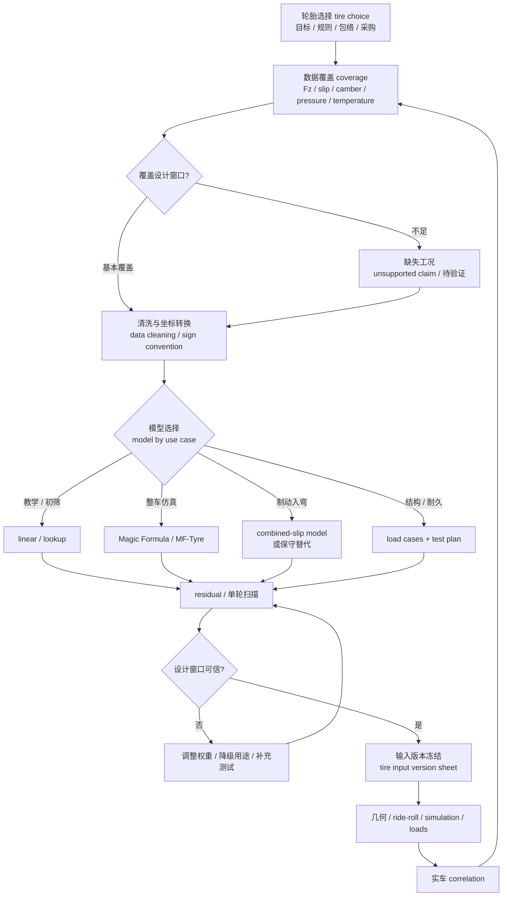

# 02 轮胎与整车输入

## 本章解决的问题

轮胎与整车输入是悬架设计从目标进入计算、仿真和验证的第一道边界。上一章 [01 设计目标与约束分解](01-design-targets.md) 定义“今年的车要解决什么问题”；本章定义“这些问题在轮胎、轮荷和整车参数层面需要哪些可信输入”。快速预览层的 [03 轮胎与整车输入](../03-tire-and-vehicle-inputs.md) 给出入门 workflow，本章进一步展开选择标准、公开数据边界、模型选择、拟合残差、动态载荷转移和下游交付物。

本章要回答：

- 怎样把轮胎数据当作第一个真实设计输入，而不是硬点、rates 和仿真之后的补丁。
- 怎样使用 Calspan / FSAE TTC、MathWorks MF-Tyre、Formula U / WUSTL 等公开来源，同时不发布受限数据、模型拟合参数、模型系数或私有曲线。
- 怎样按用途选择 linear、lookup table、Magic Formula / Pacejka-style、联合滑移替代或结构载荷模型。
- 怎样把 load sensitivity、slip angle、slip ratio、camber、压力、温度和动态轮荷写成可复核的模型边界。
- 怎样处理 unsupported combined-slip、temperature、pressure、vertical stiffness、transient 或 high-frequency load claims。
- 怎样把轮胎结论交给 [03 几何与硬点](03-geometry-and-hardpoints.md)、[04 弹簧、阻尼、侧倾与车身姿态](04-spring-damper-roll-and-ride.md)、[05 仿真、优化与相关性](05-simulation-optimization-correlation.md)、[06 载荷与金属结构](06-loads-metal-structure.md) 和 [07 复合材料与制造](07-composites-and-manufacturing.md)。

公开手册只写方法、字段、边界和工程判断。原始 TTC data table、团队私有数据、可识别轮胎曲线、模型系数、历史车辆组合和未授权截图应留在团队工程资料中。

## 公开来源审计结论

本章按 [参考资料：章节引用索引](../references.md#章节引用索引) 的来源角色写作。公开来源给的是工作方式和边界，不给本车答案。

| 来源角色 | 可以吸收进本章 | 必须降级或保留在团队内部 |
| --- | --- | --- |
| Calspan FSAE TTC / Formula SAE Tire Test Consortium | 说明为什么轮胎数据应早于硬点和 rates；说明 TTC-style 数据是授权数据生态，覆盖维度需要记录 | 不暗示本仓库拥有授权数据；不发布数据表、曲线、具体型号结论或私有参数 |
| MathWorks Magic Formula / MF-Tyre | 说明模型选择、拟合、有效范围检查、导出到整车仿真的 workflow | 不把 Magic Formula 写成唯一模型；不声称拟合精度或赛道有效性 |
| Formula U / WUSTL 等公开轮胎报告 | 借鉴报告结构：数据集边界、模型用途、residual 审查、工作范围和限制说明 | 不复用参数、图表、拟合结果或团队特定 tire choice |
| FS Wiki Tires | 用作 slip angle、load sensitivity、TTC 入口等入门语言 | 不作为参数权威、结构安全依据或比赛规则解释 |
| 公开拟合示例和数据限制讨论 | 强化 coverage window、residual、holdout、坐标符号和 unsupported claim 处理 | 不把示例 residual、模型复杂度或数据窗口套到其他车辆 |

因此，本章对现有 tire claims 的修正原则是：凡是涉及 combined slip、温度、胎压、load sensitivity、camber、垂向刚度或高频载荷的结论，都必须写清数据覆盖、模型边界和验证状态；没有覆盖时写成待验证、保守假设或替代模型，不写成定量结论。

## 轮胎为什么是悬架设计边界

悬架不能制造抓地力，它只能通过几何、轮荷、姿态、运动比和阻尼，让轮胎尽量在可用窗口内工作。若轮胎输入错误，硬点优化会追求错误的 camber / toe 趋势，弹簧阻尼会围绕错误的动态轮荷设计，整车仿真会把外推结果当成赛道表现，结构载荷也可能把操稳模型误用为耐久载荷。

| 设计问题 | 轮胎输入如何影响结论 | 本章输出给谁 |
| --- | --- | --- |
| 目标设定 | 轮胎尺寸、数据质量、采购和测试能力决定目标是否可实现 | [01 设计目标](01-design-targets.md) |
| 几何与硬点 | camber 工作窗口、侧偏刚度、回正力矩和轮胎包络约束 hardpoints | [03 几何与硬点](03-geometry-and-hardpoints.md) |
| ride / roll / pitch | load sensitivity、动态轮荷、垂向刚度和胎压假设影响侧倾刚度分配 | [04 弹簧、阻尼、侧倾与车身姿态](04-spring-damper-roll-and-ride.md) |
| 整车仿真 | Magic Formula、查表或线性模型的适用范围决定仿真能回答什么 | [05 仿真、优化与相关性](05-simulation-optimization-correlation.md) |
| 结构载荷 | 轮胎力、轮荷、制动/转向组合和额外冲击工况定义结构输入 | [06 载荷与金属结构](06-loads-metal-structure.md)、[07 复合材料与制造](07-composites-and-manufacturing.md) |
| 测试与答辩 | 胎温、胎压、轮速、加速度和车手反馈用于 correlation | [08 验证、测试与答辩](08-validation-testing-defense.md) |

工程上要避免两个极端：一是只看峰值力，把轮胎选型变成排名游戏；二是把复杂模型当成真实世界。轮胎模型只是把有限数据、坐标约定、权重和假设压缩成可用工具，必须用残差和实车相关性持续约束。

## 轮胎选择标准

轮胎选择应先服务车辆目标和数据可信度，再谈模型复杂度。公开文档可以写选择维度和风险，不写私有型号排名或可还原的历史结论。

| 选择维度 | 应检查的问题 | 输出写法 |
| --- | --- | --- |
| 规则与可采购性 | 规格、赛事规则、供应稳定性、预算、备用胎数量 | 推荐 / 备选 / 风险，不写“绝对最好” |
| 尺寸与包络 | 外径、胎宽、轮辋宽度、质量、制动空间、转向和轮跳包络 | 给几何、车架、制动和传动的边界 |
| 数据质量 | 是否有授权 TTC-style 数据、团队测试或可公开引用的结构化报告 | 数据角色和授权状态，而不是原始数据 |
| 载荷敏感性 | 设计 `F_z` 窗口内峰值、线性区斜率和附着利用率如何变化 | load sensitivity 趋势与待验证窗口 |
| camber / pressure / temperature | 数据是否覆盖预计外倾、胎压和热状态 | 覆盖矩阵和敏感性风险 |
| 纵向与联合工况 | 是否支持制动、驱动和 combined slip | unsupported claim 处理方式 |
| 测试可复现性 | 胎温、胎压、磨耗、测试顺序和车手输入是否可记录 | correlation 计划和更新触发条件 |

一个合格的公开结论应类似：“候选轮胎 A 在目标轮荷和侧偏窗口中有更清楚的数据覆盖，但联合滑移和温度窗口仍需实车验证；候选 B 包络更稳妥，但公开数据结构较弱。”这种结论比简单排名更适合学习文档。

## 坐标、符号与单位

轮胎数据进入模型前，必须先统一坐标系、符号、单位和左右轮镜像规则。SAE、ISO-style、测试台架和仿真软件之间可能在 `F_y`、`M_z`、slip angle、camber、slip ratio 和 `F_z` 正方向上不同。任何导入前都要做单轮扫描，确认小正 slip angle、小正 slip ratio、正/负 camber 下力和力矩方向可解释。

| 符号 | 英文术语 | 常用单位 | 记录要求 |
| --- | --- | --- | --- |
| `F_z` | normal / vertical load | N | 写明正方向；若数据为负载荷，附着利用率使用 `|F_z|` |
| `F_y` | lateral force | N | 写明与车辆 `y` 轴、轮胎局部坐标和左右轮镜像的关系 |
| `F_x` | longitudinal force | N | 区分驱动、制动、滚动阻力和软件正负号 |
| `M_z` | aligning moment | N·m | 写明绕哪个轴为正，以及与回正感的对应关系 |
| `α` | slip angle | deg 或 rad | 写明角度顺序；公式用 rad 时必须注明 |
| `κ` | slip ratio | 无量纲或 % | 写明自由滚动半径、有效半径或受载半径定义 |
| `γ` | camber / inclination angle | deg | 写明上端向车外或车内倾斜的正负号 |
| `p` | pressure | kPa 或 bar | 区分冷态、热态和测试设定 |
| `T` | tire temperature | deg C | 没有可靠温度数据时写成未覆盖因素 |

线性区可以用框架关系帮助检查单位：

```text
F_y ≈ C_α · α
```

其中 `F_y` 为侧向力，单位 N；`C_α` 为侧偏刚度 cornering stiffness，单位 N/rad 或 N/deg；`α` 为侧偏角。这个关系只适合小 slip angle 附近，不能解释峰值、过峰后、联合滑移或强 camber 工况。

load sensitivity 可以用附着利用率趋势检查：

```text
μ_y = |F_y| / |F_z|
```

其中 `μ_y` 无量纲。通常 `F_z` 增大时绝对力可能增加，但单位垂向载荷对应的附着利用率可能下降。这个趋势解释了为什么同一轴左右载荷转移后，外侧轮能力增加不一定能完全补回内侧轮损失，也解释了为什么侧倾刚度分配、轮距、质心高度和阻尼调校会回到轮胎窗口。

## 数据覆盖矩阵

轮胎数据不是“有或没有”，而是覆盖范围是否匹配设计工况。TTC-style 数据、公开报告和团队测试都应转成同一张 coverage matrix。

| 覆盖维度 | 要记录什么 | 如果缺失如何写 |
| --- | --- | --- |
| `F_z` 轮荷 | 低载、设计载荷、高载，是否覆盖动态轮荷范围 | 未覆盖高/低载时，load sensitivity 只作为趋势 |
| slip angle `α` | 线性区、峰值附近、过峰后是否覆盖 | 未覆盖峰值时，不写极限侧向能力结论 |
| slip ratio `κ` | 驱动、制动、零滑移附近是否覆盖 | 未覆盖纵向时，不写制动/牵引结论 |
| camber `γ` | 实车预计外倾、roll camber、左右轮镜像 | 未覆盖时，几何优化目标写成待验证 |
| pressure `p` | 冷态/热态设定，是否有多个胎压层级 | 单一胎压模型不能解释胎压调校 |
| temperature `T` | 胎面、内部热状态、测试顺序或环境 | 没有热状态时，不写升温/热衰退定量判断 |
| wheel / rim | 轮辋宽度、安装方向、轮胎方向性 | 轮辋不同则标注不可直接比较 |
| speed / surface | 测试速度、flat-belt / 路面等效条件 | 路面和速度差异只作 correlation 风险 |
| vertical stiffness | 轮胎垂向刚度、spring-rate 或包络测试 | 缺失时，ride 和结构章节用独立保守假设 |
| transient / high frequency | 瞬态、冲击、路肩、坑洼和高频力 | 准静态模型不能证明耐久安全 |

数据工况至少分成三类：

| 数据类型 | 能回答 | 不能自动回答 |
| --- | --- | --- |
| 纯侧向 pure lateral | 侧偏刚度、外倾敏感性、回正力矩趋势、早期几何目标 | 制动入弯、牵引出弯、纵向力耦合 |
| 纯纵向 pure longitudinal | 加速、制动、零滑移附近纵向刚度 | 转弯同时制动/驱动时的力分配 |
| 联合滑移 combined slip | `F_x` 与 `F_y` 相互削弱、制动入弯、出弯牵引趋势 | 未测温度、胎压、路面、高频冲击和实车瞬态 |

若只有纯侧向数据，仍可用于几何和稳态操稳入门，但不得假装支持联合制动转弯。若只有公开报告结构，没有授权数据，正文只能写 workflow、字段和边界，不能写可还原曲线或系数。

## 模型选择：按用途而不是按软件菜单

模型复杂度由工程问题决定。一个透明的线性模型可能比越界的 Magic Formula 更适合早期学习；一个查表模型可能比过度拟合的参数模型更能暴露数据缺口。

| 用途 | 合适模型 | 最低输入 | 主要输出 | 边界语言 |
| --- | --- | --- | --- | --- |
| 教学和 sanity check | 线性模型 linear model | 设计载荷附近的小 `α` 数据或公开估算 | `C_α`、稳态趋势、单位检查 | 只用于小 slip angle，不解释峰值和饱和 |
| 候选比较和数据可视化 | 查表模型 lookup table | `F_z`、`α`、`κ`、`γ`、`p` 等网格 | 曲线、覆盖矩阵、插值趋势 | 外推只作风险提示，不作赛道结论 |
| MBD / full-vehicle 仿真 | Magic Formula / MF-Tyre / Pacejka-style | 多工况数据、坐标转换、权重和 residual | 软件接口、参数研究、稳态/准稳态趋势 | 参数耦合强，模型边界和版本必须随文件交付 |
| 联合滑移研究 | combined-slip 模型或保守摩擦椭圆 | `F_x`、`F_y` 与 `α`、`κ` 的耦合数据 | 制动入弯和出弯牵引趋势 | 无联合数据时，只能写替代假设或待验证 |
| 温度/胎压调校 | 数据驱动查表或敏感性模型 | 多胎压、多热状态或可靠测试记录 | 调校趋势和测试优先级 | 单一温度/胎压数据不能证明热行为 |
| ride / vertical behavior | 垂向刚度模型或独立轮胎 spring-rate | 垂向刚度、轮胎包络、胎压状态 | ride rate 串联、动态轮荷估计 | 缺数据时使用保守范围并标注待验证 |
| 结构和耐久 | 轮胎力趋势 + 额外载荷工况 | 冲击、制动转向、路面输入或实车测量 | 结构载荷边界和验证计划 | 准静态操稳 tire model 不等于耐久载荷证明 |

模型说明至少应包含：数据版本、模型形式、坐标和单位、拟合权重、残差检查、覆盖窗口、缺失工况、导出格式、下游用途和更新触发条件。

## 拟合 workflow 与 residual 审查

拟合不是把数据丢进工具后导出参数文件。它是一套可复现的数据清单、清洗、坐标转换、模型选择、权重设置、残差审查、导出和版本冻结流程。

| 步骤 | 输入 | 输出 | 主要风险 |
| --- | --- | --- | --- |
| 1. 定义用途 | 设计目标、候选轮胎、下游问题 | 建模目标：几何、ride/roll、整车仿真或结构 | 模型回答了错误问题 |
| 2. 建 coverage matrix | 数据字段、测试条件、公开来源角色 | 覆盖窗口和缺失窗口 | 把缺失工况误认为已覆盖 |
| 3. 清洗数据 | 原始记录、测试顺序、异常点 | 清洗后数据版本和处理说明 | 过度滤波抹掉迟滞、跳变或真实非线性 |
| 4. 坐标转换 | SAE / ISO-style、软件格式、左右轮规则 | 转换说明和单轮扫描图 | 正负号错误导致整车趋势反向 |
| 5. 选择模型 | 数据覆盖、软件需求、设计问题 | 模型形式和适用边界 | 复杂度超过数据支撑能力 |
| 6. 设置权重 | 设计窗口、峰值、线性区、`M_z`、`F_x` / `F_y` | 拟合权重说明 | 全局误差好看，目标工况失真 |
| 7. 审查 residual | 拟合曲线、数据、holdout 或 cross-validation | 分组残差图和问题清单 | 平均 residual 掩盖局部偏差 |
| 8. 导出与回归 | 模型文件、查表、脚本、版本说明 | tire input version sheet | 下游使用过期模型 |
| 9. 实车 correlation | 胎温、胎压、轮速、加速度、制动压力、方向盘、悬架位移 | 模型更新记录和下一轮测试计划 | 用单次测试过度校准 |

residual 审查要按设计窗口分箱，而不是只看总体误差。最低检查包括：

- 按 `F_z`：低载、设计载荷和高载是否都合理。
- 按 camber：外倾变化下 `F_y`、`M_z`、峰值位置是否可解释。
- 按 slip angle：线性区、峰值附近和过峰后是否有系统偏差。
- 按 slip ratio：驱动、制动和零滑移附近是否方向正确且连续。
- 按输出量：不能只看 `F_y`，还要看 `F_x`、`M_z` 和需要时的垂向行为。
- 按用途：几何设计窗口、ride/roll 动态轮荷窗口、仿真事件窗口和结构载荷窗口要分开看。

数据量允许时，应保留 holdout 数据或做 cross-validation。若没有足够数据，公开文档应把模型写成“用于早期趋势”或“待验证假设”，而不是给出精确承诺。

## Unsupported claims 的处理

轮胎数据缺口很正常。成熟的处理方式不是等待完美数据，也不是把缺口藏起来，而是把缺失工况、临时替代和过期条件写清楚。

| 缺失或不确定项 | 临时处理 | 必须写清的风险 |
| --- | --- | --- |
| 缺少 combined slip | 保守摩擦圆/椭圆、相近模型或低权重趋势判断 | 制动入弯和牵引出弯只能视为待验证趋势 |
| 缺少 longitudinal 数据 | 只做侧向几何、稳态转向和入门操稳分析 | 加速、制动和驱动轮载荷结论不完整 |
| 缺少 temperature 覆盖 | 固定温度假设，测试时记录胎温并做敏感性分析 | 不解释升温、热衰退或连续圈表现 |
| 缺少 pressure 层级 | 单一胎压模型，胎压列为测试优先变量 | 调校结论可能受胎压主导 |
| 缺少 vertical stiffness | ride 计算使用保守范围或独立测量计划 | ride frequency、wheel rate 和结构输入不应过度精确 |
| 缺少 transient / high-frequency 数据 | 结构章节另设冲击、路肩、跳动限位和实测验证 | 操稳模型不能证明耐久安全 |
| 左右轮或方向性不明 | 建统一镜像规则，测试中检查左右差异 | 左右转弯和方向盘力解释可能偏差 |

替代模型要有过期条件。例如：“该联合滑移假设仅用于 v0.3 早期方案筛选；一旦获得制动入弯实车数据或授权 combined-slip 数据，需要重新审查 [05 仿真、优化与相关性](05-simulation-optimization-correlation.md) 的结论。”这比给出无证据的精确结论更可信。

## 动态轮荷与整车输入依赖

静态角重只是起点。实际轮胎 `F_z` 会受到纵向加速度、侧向加速度、质心高度、轴距、轮距、前后侧倾刚度分配、弹簧阻尼、气动载荷、路面输入和车手操作影响。轮胎模型必须和整车输入版本一起冻结。

| 输入项 | 常用单位 | 作用 | 记录要求 |
| --- | --- | --- | --- |
| 整车质量 `m` | kg | 决定惯性、轮荷和载荷转移 | 标注是否含车手、油/电状态和测量版本 |
| 质心高度 `h_CG` | mm 或 m | 决定纵向和横向载荷转移量级 | 写明测量或估算方法 |
| 轴距 `L` | mm 或 m | 决定纵向载荷转移和 pitch 行为 | 与 CAD / 实车版本一致 |
| 前后轮距 `t_f`, `t_r` | mm 或 m | 决定横向载荷转移和 roll 行为 | 区分轮胎中心、轮辋中心或接地点定义 |
| 静态角重 | N 或 kg | 定义初始 `F_z` | 记录胎压、车高、车手和车辆状态 |
| 气动载荷 | N 或随速度函数 | 改变高速轮荷和姿态 | 估算值必须标注待验证 |
| 制动 / 驱动边界 | N·m、比例或无量纲 | 决定 `F_x` 需求和 combined slip 风险 | 与制动、传动和电控版本关联 |
| 悬架刚度 / 阻尼 | N/mm、N·m/deg、阻尼曲线 | 影响动态轮荷和姿态控制 | 与 [04](04-spring-damper-roll-and-ride.md) 参数版本一致 |
| 轮胎半径 / 垂向刚度 | mm、N/mm | 影响 ride rate、包络和载荷估计 | 若缺数据，写保守范围和测试计划 |

纵向载荷转移可用框架公式检查量纲：

```text
ΔF_z,long ≈ m · a_x · h_CG / L
```

其中 `ΔF_z,long` 为前后轴之间的轴总垂向载荷转移，单位 N；`m` 为质量，单位 kg；`a_x` 为纵向加速度，单位 m/s^2；`h_CG` 和 `L` 单位必须一致。横向载荷转移可用类似框架理解，其大小与质量、侧向加速度、质心高度、轮距和前后侧倾刚度分配有关。公式是 sanity check，不是结构放行依据。

动态轮荷和 load sensitivity 之间的关系要传给 ride/roll 和仿真章节：如果某个轴在转弯中因为载荷转移导致附着利用率下降，侧倾刚度分配、轮距、质心高度、阻尼和车高都可能需要回查。结构章节则需要额外关注制动转向组合、路面冲击、跳动限位和高频力；若轮胎模型不支持这些工况，必须建立独立保守载荷和实测验证计划。

## 下游交付物

完成本章后，团队应形成一个 tire-and-vehicle input package。公开手册给字段，项目工程库保存具体数据。

| 交付物 | 最低内容 | 交给谁 |
| --- | --- | --- |
| 轮胎选择说明 | 选择标准、推荐/备选、采购/包络/数据风险 | 目标设定、总布置、制动、车架 |
| 数据覆盖矩阵 | `F_z`、`α`、`κ`、`γ`、pressure、temperature、speed、rim、vertical stiffness | 几何、ride/roll、仿真、测试 |
| 坐标与符号说明 | SAE / ISO-style、左右轮镜像、`F_x` / `F_y` / `F_z` / `M_z`、slip ratio 定义 | 仿真和数据分析 |
| 轮胎模型包 | 模型形式、版本、residual、适用窗口、导出格式、更新触发条件 | [05 仿真](05-simulation-optimization-correlation.md) |
| 几何输入卡 | 外径、胎宽、轮辋、camber 工作窗口、回正力矩趋势、轮心包络 | [03 几何](03-geometry-and-hardpoints.md) |
| ride / roll 输入卡 | 动态轮荷窗口、load sensitivity、垂向刚度或待验证范围、胎压敏感性 | [04 ride/roll](04-spring-damper-roll-and-ride.md) |
| 结构输入卡 | 轮胎力边界、制动/转向组合、额外冲击工况、模型不支持项 | [06](06-loads-metal-structure.md)、[07](07-composites-and-manufacturing.md) |
| 相关性验证计划 | 胎温、胎压、轮速、加速度、方向盘、制动压力、悬架位移、车手反馈 | [08 测试](08-validation-testing-defense.md) |

公开模板可以先用字段表，不填真实轮胎数据：

| tire input package 字段 | 写法 | 交叉检查 |
| --- | --- | --- |
| `input_version` | 教学版可写 `tire-input-v0-example`；项目版写版本、日期和负责人 | 下游 Adams / MATLAB / CAD 是否引用同一版本 |
| `tire_choice_status` | 推荐、备选、待采购、待验证，并说明限制 | 选择理由是否同时覆盖性能、采购、包络和数据可用性 |
| `data_coverage` | 列出 `F_z`、slip angle、slip ratio、camber、pressure、temperature、speed 是否覆盖设计窗口 | 不把缺失工况写成已验证结论 |
| `coordinate_sign` | 写清 SAE / ISO-style、左右轮镜像、力和力矩正方向 | 仿真、脚本和测试通道符号是否一致 |
| `model_export` | 写模型形式、适用窗口、residual 检查和导出格式 | 下游整车模型是否知道模型不能回答的问题 |
| `downstream_trigger` | 轮胎、轮辋、胎压、质量、质心、坐标或模型形式变化时的回归动作 | 是否通知几何、ride/roll、仿真、结构和测试章节 |

任何关键输入变化，例如轮胎、轮辋、胎压策略、质量、质心、轮距、模型形式、坐标转换或制动/驱动边界变化，都应触发下游章节回归检查。

## 轮胎模型可信度流程图



## 常见错误

1. 把 TTC 或公开报告当成完整答案，而不是数据窗口和授权来源。
2. 只按峰值 `F_y` 选胎，忽略 load sensitivity、camber、pressure、temperature、回正力矩和可采购性。
3. 使用 Magic Formula / Pacejka-style 后不写模型边界、残差和外推限制。
4. 用纯侧向数据支持制动入弯或牵引出弯，却没有联合滑移说明。
5. 混用不同 slip ratio、SAE / ISO-style、左右轮镜像或软件 sign conventions。
6. 只看总体 residual，不看设计窗口、低载/高载、camber、slip 和 `M_z`。
7. 用静态角重判断轮胎工作区间，却不检查动态轮荷。
8. 把操稳 tire model 输出直接当成结构耐久载荷。
9. 把质量、质心、轮距、气动、制动和轮胎模型版本混在一起。
10. 在公开文档发布原始曲线、受限数据、模型系数或能反推历史车辆的信息。

## 验证与相关性

轮胎模型验证分三层：

| 层级 | 检查问题 | 证据形式 | 通过语言 |
| --- | --- | --- | --- |
| 数据内部验证 | 覆盖矩阵、坐标转换、单位和 residual 是否可信 | 覆盖表、转换说明、单轮扫描、残差图 | 设计窗口内无未解释方向错误、曲线跳变或失真 |
| 仿真使用验证 | 导入软件后 `F_x`、`F_y`、`M_z`、`F_z` 趋势是否可解释 | 稳态圆、制动/驱动检查、敏感性分析 | 简单工况方向正确，参数变化趋势合理 |
| 实车相关性验证 | 模型能否解释加速、制动、稳态转弯、瞬态转向和胎温胎压趋势 | 轮速、IMU、方向盘、制动压力、悬架位移、胎温胎压、车手反馈 | 主要趋势一致；差异可追溯并触发更新 |

当模型与实车不一致时，不要直接改轮胎模型。先排查传感器零点、同步、滤波、胎压胎温、定位参数、车高、弹簧阻尼、防倾杆、质量状态、气动、制动、传动和悬架柔度。只有当这些状态被记录并排除后，才更新轮胎模型版本；更新后要回归检查几何目标、ride/roll 参数、整车仿真趋势和结构载荷。

## 与其它章节的关系

本章是高级手册的输入枢纽。读者可先阅读快速层 [03 轮胎与整车输入](../03-tire-and-vehicle-inputs.md)，再用本章建立详细输入包。

| 章节 | 本章提供什么 | 本章需要什么回流 |
| --- | --- | --- |
| [01 设计目标](01-design-targets.md) | 轮胎能力、数据质量、轮辋、采购和整车输入边界 | 年度目标、优先级、规则和接口约束 |
| [03 几何与硬点](03-geometry-and-hardpoints.md) | camber 工作窗口、轮胎尺寸、回正力矩趋势和包络 | 实际 camber gain、toe change、roll center 和行程结果 |
| [04 弹簧、阻尼、侧倾与车身姿态](04-spring-damper-roll-and-ride.md) | load sensitivity、动态轮荷、垂向刚度和胎压边界 | 侧倾刚度分配、频率、阻尼和姿态控制变化 |
| [05 仿真、优化与相关性](05-simulation-optimization-correlation.md) | 轮胎模型版本、坐标、适用窗口、残差和整车输入 | 参数研究、模型越界记录、correlation 差异 |
| [06 载荷与金属结构](06-loads-metal-structure.md) | 轮胎力边界、制动/转向组合和额外冲击假设 | FEA / MBD 载荷路径和安全边界反馈 |
| [08 验证、测试与答辩](08-validation-testing-defense.md) | 胎温胎压记录、数据通道和模型限制 | 实车数据、车手反馈和模型更新证据 |

## 本章公开来源

- [Calspan FSAE Tire Test Consortium](https://calspan.com/automotive/fsae-ttc) 和 [Formula SAE Tire Test Consortium](https://www.fsaettc.org/)，用于 TTC-style 数据生态、授权边界、测试数据价值和覆盖维度说明。
- [MathWorks: Magic Formula Tire Modeling in Formula Student](https://blogs.mathworks.com/student-lounge/2022/06/07/mf-tyre/)，用于 Magic Formula / MF-Tyre 的模型选择、拟合、有效范围检查、导出和软件 workflow。
- [Formula U Racing: Construction of a Steady State, Semi-Empirical Tire Model](https://uen.pressbooks.pub/range26i1/chapter/cantrell/) 与 [WUSTL Tire Modeling and Data Analysis in the FSAE Context](https://openscholarship.wustl.edu/cgi/viewcontent.cgi?article=1311&context=mems500)，用于公开报告结构、数据限制、模型用途和 residual 审查写法。
- [FS Wiki: Tires](https://fswiki.us/Tires)，用于 slip angle、load sensitivity、TTC 和轮胎建模入口的入门术语。
- 完整章节索引见 [参考资料：章节引用索引](../references.md#章节引用索引)。
