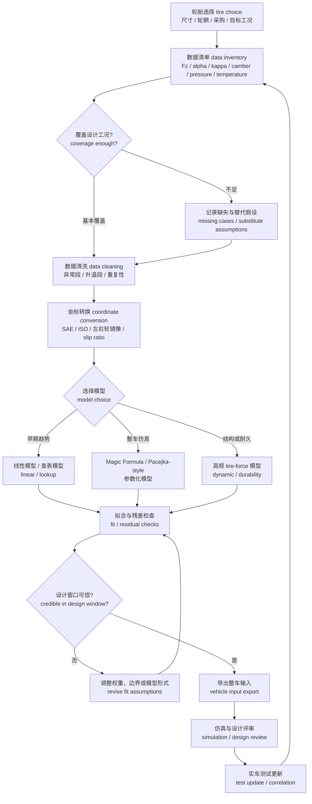

# 02 轮胎与整车输入

## 本章解决的问题

轮胎与整车输入是悬架设计从目标进入计算、仿真和验证的第一道边界。上一章 [01 设计目标与约束分解](01-design-targets.md) 讨论了“今年的车要解决什么问题”；本章讨论“这些问题在轮胎和整车层面需要哪些可信输入”。快速预览层的 [03 轮胎与整车输入](../03-tire-and-vehicle-inputs.md) 给出了基础路线，本章进一步展开坐标系、数据覆盖、模型选择、拟合流程、动态轮荷和相关性验证。

本章要回答以下问题：

- 轮胎为什么会限制悬架几何、弹簧阻尼、整车仿真和载荷校核。
- 如何定义轮胎坐标系、符号、单位和 SAE / ISO-style 转换风险。
- 如何判断纯侧向、纯纵向和联合滑移数据是否覆盖设计需要。
- 如何按使用目的选择线性模型、查表模型、Magic Formula / Pacejka-style 模型，或高频 / 耐久 tire-force 模型。
- 如何把拟合出来的轮胎模型当作设计工具，而不是把它误认为真实世界本身。
- 如何把轮胎输出转化为整车输入，并把不确定性传递给 [03 几何与硬点](03-geometry-and-hardpoints.md)、[04 弹簧、阻尼、侧倾与车身姿态](04-spring-damper-roll-and-ride.md)、[05 仿真、优化与相关性](05-simulation-optimization-correlation.md) 和 [08 验证、测试与答辩](08-validation-testing-defense.md)。

本章讲通用流程和评审逻辑。原始测试曲线、具体型号对比、私有轮胎数据、拟合参数、源图和历史车辆输入组合应放在团队自己的工程资料中。

## 轮胎为什么是悬架设计边界

悬架不能“制造”抓地力，它只能通过几何、载荷、姿态、运动比和阻尼，让轮胎尽量在有利工况下工作。轮胎决定了车辆能从地面获得的纵向力、侧向力和回正力矩，也决定了载荷转移后抓地能力如何变化。若轮胎输入错误，后续硬点优化、弹簧阻尼选择、整车仿真和结构载荷提取都会建立在错误边界上。

对 FSAE / Formula Student 悬架设计而言，轮胎至少影响以下设计链条：

| 设计问题 | 轮胎输入如何影响结论 | 后续章节 |
| --- | --- | --- |
| 目标设定 | 轮胎尺寸、数据质量和工作窗口决定目标是否可实现 | [01 设计目标](01-design-targets.md) |
| 几何与硬点 | 外倾 camber、前束 toe、轮心路径、roll center 和 bump steer 都服务于轮胎工作窗口 | [03 几何与硬点](03-geometry-and-hardpoints.md) |
| 弹簧阻尼与侧倾 | 动态轮荷、载荷敏感性 load sensitivity 和姿态控制共同影响前后轴抓地分配 | [04 弹簧、阻尼、侧倾与车身姿态](04-spring-damper-roll-and-ride.md) |
| 整车仿真 | 线性操稳、G-G 趋势、联合制动转弯和参数优化都依赖轮胎模型适用范围 | [05 仿真、优化与相关性](05-simulation-optimization-correlation.md) |
| 结构载荷 | 轮胎力和轮胎垂向载荷会成为 upright、A 臂、摇臂、拉杆和车架支座的载荷来源 | [06 载荷与金属结构](06-loads-metal-structure.md)、[07 复合材料与制造](07-composites-and-manufacturing.md) |
| 测试与答辩 | 轮胎模型必须通过实车数据做 correlation，才能解释设计取舍 | [08 验证、测试与答辩](08-validation-testing-defense.md) |

工程上要特别避免两种误解。第一，峰值侧向力高不等于车辆一定快；轮胎是否容易进入有效工作温度、是否对外倾敏感、是否在目标载荷范围内稳定、是否具备可用数据，同样重要。第二，拟合曲线好看不等于模型可信；拟合只是把有限测试数据压缩成设计工具，真实车辆仍会受到路面、胎温、胎压、轮辋、磨耗、车手输入、悬架柔度和测试误差影响。

## 轮胎坐标系与符号

轮胎数据进入计算前，必须先统一坐标系、符号、单位和参考方向。不同测试机构、教材和仿真软件可能采用不同正方向。SAE 与 ISO-style 坐标表达之间常见差异包括侧向力方向、侧偏角 slip angle 正方向、外倾 camber 正方向、回正力矩 aligning moment 正方向，以及纵向滑移 slip ratio 的定义方式。文档不需要绑定某个商业软件的内部格式，但必须把项目采用的约定写清楚。

建议在轮胎模型说明中定义以下符号：

| 符号 | 英文术语 | 常用单位 | 含义与记录要求 |
| --- | --- | --- | --- |
| `F_z` | normal load / vertical load | N | 轮胎垂向载荷。需说明正方向，例如是否以向上地面对轮胎的力为正，或以轮胎压向地面为正。 |
| `F_y` | lateral force | N | 轮胎侧向力。需说明正方向与车辆 `y` 轴、轮胎局部坐标或测试坐标的关系。 |
| `F_x` | longitudinal force | N | 轮胎纵向力。需区分驱动牵引、制动和滚动阻力在符号上的表达。 |
| `M_z` | aligning moment | N·m | 回正力矩，影响方向盘反馈和轮胎接近极限时的路感。 |
| `α` | slip angle | deg 或 rad | 侧偏角，通常表示轮胎平面方向与接地印迹速度方向的夹角。公式中使用 rad 时必须注明。 |
| `κ` | slip ratio | 无量纲或 % | 纵向滑移率，定义可能基于自由滚动半径、有效半径或受载半径；不同定义不能混用。 |
| `γ` | camber / inclination angle | deg | 外倾角或倾角。需说明左、右轮以及正负方向如何镜像。 |
| `p` | inflation pressure | kPa 或 bar | 胎压。应说明冷态、热态或测试设定。 |
| `T` | tire temperature | deg C | 胎温或温度状态。若没有可靠温度数据，必须写成未覆盖因素。 |

### 坐标与符号约定模板

下面的模板用于项目模型说明。它不声称某一种约定天然正确，而是要求团队把自己的约定写成可检查的条目。填写时可以把“本项目采用”替换为团队自己的项目名称；具体车辆数据应放在项目工程包中。

| 模板项 | 本项目公开模板写法 |
| --- | --- |
| `x/y/z` axes | `x` 轴为车辆前进方向，`y` 轴为车辆左侧方向，`z` 轴为竖直向上；若使用轮胎局部坐标，应说明局部 `x/y/z` 与整车坐标的旋转关系。 |
| `F_x` | 纵向力 longitudinal force，单位 N；需写明驱动力为正还是制动力为正，并说明这是地面对轮胎的力还是轮胎对地面的力。 |
| `F_y` | 侧向力 lateral force，单位 N；需写明正方向与整车 `y` 轴、轮胎局部坐标和左右轮镜像的关系。 |
| `F_z` | 垂向载荷 normal load，单位 N；需写明正方向。若采用压向地面的载荷为正，公式中应把这个定义写在符号表旁边；若数据中 `F_z` 为负，应在附着利用率中使用 `|F_z|`。 |
| `M_z` | 回正力矩 aligning moment，单位 N·m；需写明绕哪个 `z` 轴为正，以及正方向与方向盘回正感的对应关系。 |
| `α` slip angle | 侧偏角，单位 deg 或 rad；需写明轮胎指向与接地印迹速度方向的夹角顺序，以及左 / 右轮是否镜像。 |
| `κ` slip ratio | 纵向滑移率，无量纲或 %；需写明基于自由滚动半径、有效半径还是受载半径，并说明驱动、制动和零滑移附近的符号。 |
| `γ` camber | 外倾角，单位 deg；需写明车轮上端向车外或车内倾斜时的正负号，以及左右轮如何镜像。 |
| 左 / 右轮镜像 | 写明是否用同一套轮胎模型镜像左右轮；若镜像，应列出哪些角度、力或力矩需要改变符号，哪些量保持不变。 |
| SAE / ISO 转换检查 | 转换后必须做单轮扫描：小正 `α`、小正 `κ`、正 / 负 `γ` 下，`F_x`、`F_y`、`M_z` 趋势应能被物理直觉解释；不得出现未解释的符号反转。 |

在线性区讨论侧向力时，可以使用近似关系：

```text
F_y ≈ C_α · α
```

其中 `F_y` 为侧向力，单位 N；`C_α` 为侧偏刚度 cornering stiffness，单位可写作 N/rad 或 N/deg；`α` 为侧偏角。若 `α` 用 deg，`C_α` 必须对应 N/deg；若 `α` 用 rad，`C_α` 必须对应 N/rad。这个关系只适合小侧偏角附近的近似线性区，不能用于解释峰值、过峰后下降、联合滑移或大外倾工况。

纵向滑移率 slip ratio 的风险更容易被忽略。不同软件可能把驱动和制动的正负方向、分母半径、零滑移参考点定义得不同。团队在导入模型前应做一个最小检查：在同一组 `κ` 输入下，确认 `F_x` 的方向和趋势是否符合预期；在 `κ = 0` 附近，确认模型是否表现为自由滚动或带有定义导致的偏置。若不能解释这个差异，不能把模型直接交给整车仿真使用。

任何轮胎比较都必须先声明同一套符号和测试边界。侧向力 lateral force、回正力矩 aligning moment、侧偏角 slip angle、外倾角 camber angle、垂向载荷 normal load、胎压 pressure、温度 temperature 和测试路面 test surface 必须共享已声明的正负号、单位、坐标系和工况定义后，才能比较峰值、斜率、残差或整车响应。若某条曲线来自不同路面、胎压、温度窗口或坐标约定，它应先被标成“不可直接比较”，而不是被放进同一张排名表。

载荷敏感性 load sensitivity 是轮胎设计输入中的核心概念。通常随着 `F_z` 增大，轮胎可产生的绝对力会增加，但单位垂向载荷对应的附着利用率可能下降。若项目定义 `F_z` 为压向地面的正垂向载荷，可以用框架量 `μ_y = |F_y| / F_z` 表示侧向附着利用率；若数据或软件把 `F_z` 记为负值，应使用 `μ_y = |F_y| / |F_z|`。其中 `μ_y` 无量纲。这个关系意味着同一轴发生左右载荷转移后，外侧轮增加的侧向能力往往不能完全补偿内侧轮损失的能力，所以轴总侧向力可能下降。这个趋势会直接影响侧倾刚度分配、轮距、质心高度和阻尼调校方向。

## 轮胎数据覆盖范围

轮胎数据不是“有或没有”的二元问题，而是覆盖范围是否匹配设计工况的问题。公开资料中常见的 TTC-style 数据可以作为 FSAE 轮胎建模的重要来源类型，但它仍然只是特定测试台架、特定轮辋、特定胎压、特定温度历史和特定测试流程下的数据。团队需要把数据覆盖范围写成工程边界，而不是一句“已有轮胎数据”。

至少要检查以下维度：

| 覆盖维度 | 应记录内容 | 为什么影响悬架设计 |
| --- | --- | --- |
| 垂向载荷 `F_z` | 数据覆盖的正常载荷区、低载区和高载区 | 决定侧偏刚度、峰值力、载荷敏感性和载荷转移结论 |
| 侧偏角 `α` | 小角度线性区、峰值附近、过峰后区间是否覆盖 | 决定操稳模型、极限趋势和车手反馈解释 |
| 滑移率 `κ` | 驱动、制动和零滑移附近是否覆盖 | 决定加速、制动、牵引控制和制动入弯分析 |
| 外倾 `γ` | 数据是否覆盖悬架实际会产生的外倾范围 | 决定 camber gain、roll camber 和硬点优化目标 |
| 胎压 `p` | 冷态 / 热态胎压设定、是否有多个胎压层级 | 决定测试可重复性和调校解释 |
| 温度 `T` | 是否记录胎面温度、内部热状态或测试顺序 | 决定模型是否能解释热衰退、升温和重复圈差异 |
| 轮辋与安装 | 轮辋宽度、安装方向、左右轮镜像关系 | 决定数据能否转移到实车布置 |
| 速度与路面 | 测试速度、台架路面或等效路面 | 决定滚动阻力、高频响应和实车相关性 |

数据工况通常可以分为三类：

| 数据类型 | 主要输入 | 典型输出 | 能回答的问题 | 不能自动回答的问题 |
| --- | --- | --- | --- | --- |
| 纯侧向 pure lateral | `F_z`、`α`、`γ`、`p` | `F_y`、`M_z`、侧偏刚度、峰值趋势 | 转弯能力、外倾敏感性、回正力矩趋势 | 制动入弯、牵引出弯、联合滑移饱和 |
| 纯纵向 pure longitudinal | `F_z`、`κ`、`p` | `F_x`、纵向刚度、制动 / 驱动峰值 | 加速、制动、牵引余量 | 转弯时纵向力与侧向力相互削弱 |
| 联合滑移 combined slip | `F_z`、`α`、`κ`、`γ` | `F_x`、`F_y`、`M_z` 的耦合变化 | 制动入弯、出弯牵引、摩擦椭圆 / 摩擦圆趋势 | 未测试温度、未覆盖胎压、路面差异和高频冲击 |

若某个候选轮胎只有纯侧向数据，仍可以用于早期几何和侧向趋势学习，但不能假装它已经支持制动入弯或牵引出弯仿真。若联合滑移数据缺失，应在整车模型说明中明确写出：联合工况结论来自替代模型、保守假设或待验证推断。缺失工况不是失败，隐瞒缺失才是工程风险。

### 公开资料校准：TTC 数据不是万能答案

公开资料能帮助团队把 TTC-style 数据放到正确位置。Calspan 对 FSAE TTC 的公开说明强调：这类数据的价值在于把专业轮胎测试能力带给学生车队，并让轮胎数据能进入 CAE tire model，例如 Magic Formula / Pacejka-style 模型。公开说明同时给出一个重要边界：数据来自特定 flat-belt tire machine、测试带、速度和测试流程，不等于“真实赛道上的所有轮胎行为”。

因此，TTC-style 数据进入本章时应形成以下记录，而不是只写“有 TTC 数据”：

| 公开资料提示 | 写入文档的方式 | 设计含义 |
| --- | --- | --- |
| 测试台架和路面被定义 | 记录 flat belt、测试带、测试速度或等效速度范围 | 实车路面、路肩、坑洼和高频冲击仍需独立验证 |
| 覆盖多个 construction 和工况 | 建立候选轮胎与工况覆盖矩阵 | 先看数据是否覆盖设计窗口，再比较峰值 |
| 同时关注侧向、纵向、弹簧率等测试 | 把 lateral、drive / brake、spring-rate 和联合工况分开标注 | 几何、簧上系统、纵向工况和结构载荷不能混用同一条曲线 |
| 支持 Magic Formula / Pacejka-style 模型 | 写清模型版本、坐标、权重、残差和外推限制 | 参数文件只是接口，不是轮胎真理 |

公开学生轮胎建模报告也给了一个务实提醒：模型复杂度应匹配团队经验和车辆数据。如果缺少完整车辆输入或暂时只需要早期稳态研究，先使用 steady-state、半经验 semi-empirical 或查表模型，明确忽略瞬态和联合工况，反而比强行拟合一个看似完整的模型更诚实。报告中反复出现的风险包括坐标 / 符号定义不一致、低载或局部工况 residual 被平均误差掩盖、纵向模型误差影响制动 / 加速 / pitch 分析。它们都应进入模型评审，而不是留到仿真异常后再排查。

## 轮胎模型选择

轮胎模型的复杂度应由工程问题决定。早期学习和目标分解需要直观；整车优化需要连续、可导或软件可调用；载荷校核和耐久分析可能需要更高频的力响应。不要因为某个软件支持复杂模型就默认它更可信，也不要因为简化模型好算就把它用于超出边界的结论。

| 模型类型 | 适合用途 | 最低输入 | 主要优点 | 主要限制 |
| --- | --- | --- | --- | --- |
| 线性模型 linear model | 入门操稳、侧偏刚度估算、目标级趋势、二自由度模型 | 设计载荷附近的小 `α` 数据或公开估算 | 透明、易检查、便于解释不足 / 过度转向趋势 | 只适合小滑移；不能表达峰值、饱和、联合滑移和明显非线性 |
| 查表模型 lookup table | 候选轮胎比较、数据可视化、参数扫掠、保留实测曲线形状 | 按 `F_z`、`α`、`κ`、`γ` 等组织的数据网格 | 直观，便于暴露数据缺口，较少依赖公式形式 | 插值边界要严格管理；外推只能作为风险提示 |
| Magic Formula / Pacejka-style 模型 | 整车动力学仿真、优化、联合工况趋势、商业软件接口 | 多工况数据、坐标转换、权重设定、残差评审 | 软件支持广，能用紧凑参数表达复杂曲线 | 参数耦合强；拟合曲线好看不代表物理可解释；版本差异需核对 |
| 高频 / 耐久 tire-force 模型 | 路面冲击、路肩、坑洼、结构载荷和耐久风险 | 额外动态测试、轮胎包络、垂向动态特性或验证数据 | 能保留更高频的力变化，适合结构和耐久问题 | 数据需求高；若缺少专门测试，只能作为粗略替代或待验证模型 |

另一种更贴近评审的写法，是先问“这个模型层级能回答什么问题，不能回答什么问题”：

| 模型层级 | 适合回答的问题 | 不适合回答的问题 |
| --- | --- | --- |
| 查表 / 插值 | 在已有数据覆盖范围内比较趋势、建立早期整车输入 | 外推到未测 camber、pressure、load、temperature 或路面条件 |
| 简化线性模型 | 做概念推导、稳态初筛、教学和 sanity check | 解释峰值附近、联合滑移、强非线性和温度敏感行为 |
| Pacejka-style / Magic Formula | 连接仿真软件、做参数研究、复现实验曲线形状 | 在缺少残差审查和工况覆盖时代表真实赛道答案 |
| 实车相关性修正模型 | 把测试数据反馈给仿真和调校 | 替代原始数据质量、传感器校准和测试设计 |

线性模型适合回答“在目标载荷附近，前后轴侧偏刚度关系会让车趋向什么稳态转向趋势”。它不适合回答“极限制动入弯时轮胎还能剩多少侧向力”。查表模型适合让团队看见数据本身，尤其适合做轮胎候选比较和覆盖范围检查。Magic Formula / Pacejka-style 模型适合连接多体动力学或整车仿真软件，但模型说明必须写清楚版本、坐标约定、输入数据、权重策略、适用范围和残差检查。高频 / 耐久模型适合结构载荷和通过障碍分析，但若没有对应动态测试，不应把其输出当成定量强度结论。

常见软件或模型名可以作为示例，例如 MF5.2、PAC2002、Pacejka-style 参数化模型、Optimum Tire 类拟合工具、Adams Car 的 Tire Data and Fitting Tool，或 MATLAB / Python 自写拟合脚本。它们的作用是组织数据、拟合曲线和导出软件接口，不是替代数据质量、坐标约定、残差检查和实车对标 correlation。手册讨论工具类别和评审逻辑，模型文件、软件截图和精确参数由项目自行管理。

一个实用原则是：先用简单模型建立物理直觉，再用查表模型保护数据真实性，最后在需要软件接口、联合工况或参数研究时拟合更完整模型。复杂模型的结果应回到简单物理问题上复核：峰值是否出现在合理区域，线性区斜率是否合理，载荷敏感性是否合理，外倾变化是否有可解释趋势，联合滑移是否符合摩擦极限直觉。

模型边界声明示例：

> 本轮胎模型仅用于平整路面、低频操稳和早期参数研究。模型输入覆盖范围以随附数据覆盖矩阵为准；超出载荷、外倾、侧偏角、滑移率、胎压、温度或速度范围的结果只作为趋势提示。模型不用于证明结构耐久安全，也不替代实车胎温、胎压、轮速、加速度和车手反馈的相关性验证。

## 拟合与数据处理流程

拟合不是把数据丢进软件后导出参数文件。它是一套可复现的数据处理、坐标转换、模型选择、权重设置、残差评审和版本管理流程。每一步都可能引入偏差。读者需要学会记录流程，而不是复制某个历史项目的工具截图或私有设置。

| 步骤 | 输入 | 处理 | 输出 | 风险 |
| --- | --- | --- | --- | --- |
| 轮胎选择与问题定义 | 候选轮胎、轮辋、整车目标、规则和预算 | 明确模型要服务操稳、几何、牵引、制动、结构还是教学 | 轮胎选择说明和建模目标 | 只按峰值力选胎，忽略数据质量和可采购性 |
| 数据清单建立 | 测试数据、公开资料、内部试验记录 | 列出 `F_z`、`α`、`κ`、`γ`、`p`、`T` 等覆盖范围 | 数据覆盖矩阵 | 把缺失工况误认为已覆盖 |
| 数据清洗 | 原始记录、测试顺序、异常点说明 | 去除明显无效段，标注升温、迟滞、跳点和重复性问题 | 清洗后数据版本 | 过度滤波会抹掉真实非线性或迟滞 |
| 坐标转换 | SAE / ISO-style 定义、软件坐标说明 | 统一力、力矩、角度、左右轮镜像和 slip ratio 定义 | 坐标转换脚本或转换说明 | 正负号错会导致整车仿真趋势反向 |
| 模型选择 | 设计问题、数据覆盖、软件接口需求 | 在线性、查表、Magic Formula / Pacejka-style 或高频模型之间取舍 | 模型形式和适用边界 | 模型复杂度超过数据支撑能力 |
| 拟合设置 | 清洗数据、初始参数、权重、边界 | 分阶段拟合 `F_y`、`F_x`、`M_z` 及联合滑移关系 | 轮胎模型版本 | 只追求全局误差，牺牲设计工况精度 |
| 残差检查 | 拟合曲线、原数据、设计工况窗口 | 按载荷、外倾、滑移、力和力矩分组审查残差 | 残差图和问题清单 | 平均误差小但局部工况严重失真 |
| 整车输入导出 | 模型文件、查表数据、适用范围 | 输出给多体动力学、脚本或整车模型 | 车辆模型输入包 | 导出格式和软件单位不一致 |
| 版本冻结与回归 | 模型、脚本、文档、图表 | 记录版本、用途、限制和更新触发条件 | 可复现模型包 | 后续改动无法追溯 |
| 实车测试更新 | 加速度、轮速、方向盘、制动压力、胎温、胎压、悬架位移 | 做相关性检查，修正假设或更新模型 | correlation 记录和下一版模型 | 用单次测试过度校准，失去泛化能力 |

拟合权重应服务设计目的。例如，若目标是稳态操稳，设计载荷附近小到中等 `α` 的 `F_y` 斜率和 `M_z` 趋势可能比过峰后远端曲线更重要；若目标是制动入弯，联合滑移下 `F_x` 与 `F_y` 的相互削弱必须得到关注；若目标是结构载荷，高频或瞬态力峰可能不能由准静态操稳模型直接给出。

残差检查不能只看一个总体误差数字。建议至少按以下方式分组查看：

- 按 `F_z` 分组：低载、设计载荷附近、高载是否都合理。
- 按 `γ` 分组：外倾变化对 `F_y`、`M_z` 和峰值位置的影响是否可信。
- 按 `α` 分组：线性区、峰值附近、过峰后是否存在系统偏差。
- 按 `κ` 分组：驱动、制动、零滑移附近是否有方向错误或不连续。
- 按输出量分组：不能只拟合 `F_y`，还要检查 `F_x` 和 `M_z` 是否在可接受范围内。
- 单独评审设计窗口 residual，而不是让全局 residual 掩盖目标工况内的偏差。
- 数据量允许时，保留 holdout 数据或使用 cross-validation，检查模型是否只是在记住某一组测试点。
- 不接受未解释的符号反转、曲线跳变、力或力矩不连续；若确实来自测试过程，应在模型边界说明中记录。

## 缺失工况与模型替代

轮胎数据缺失很常见。成熟的处理方式不是等待完美数据，也不是把缺失藏起来，而是把缺失工况、替代假设和影响范围写进模型说明。

| 缺失或不确定项 | 可采用的临时处理 | 必须写清的风险 |
| --- | --- | --- |
| 缺少联合滑移 combined slip | 用保守摩擦椭圆 / 摩擦圆框架，或使用相近模型启动早期研究 | 制动入弯和牵引出弯结论只能视为趋势 |
| 缺少纵向数据 | 暂时只做侧向几何和稳态转向研究 | 加速、制动和驱动轮载荷结论不完整 |
| 缺少温度覆盖 | 固定温度假设，测试时记录胎温并做敏感性分析 | 模型无法解释升温、热衰退或连续圈表现 |
| 缺少胎压层级 | 用单一胎压模型，并把胎压作为测试优先变量 | 调校结论可能受胎压变化主导 |
| 缺少高频动态数据 | 结构载荷采用保守工况、独立冲击假设或后续实测修正 | 准静态轮胎模型不能证明耐久安全 |
| 左右轮方向或轮胎非对称不明 | 先按统一镜像规则建模，并在测试中检查偏差 | 左右转弯表现可能不同，方向盘力解释会偏差 |

替代模型必须有过期条件。例如：“该联合滑移假设仅用于早期方案筛选；一旦获得实车制动入弯数据或更完整轮胎数据，需要重新评审 [05 仿真、优化与相关性](05-simulation-optimization-correlation.md) 中的整车结论。”这种写法比给出看似精确但无证据的结论更可靠。

## 轮胎比较逻辑

本章可以说明轮胎比较的维度，但具体历史型号的私有对比值或可识别源数据的曲线应由团队自行管理。比较的目的不是宣布某个轮胎“绝对最好”，而是在给定车辆目标、规则、预算和测试能力下，选择最适合的设计边界。

| 比较维度 | 应关注的问题 | 常见误区 |
| --- | --- | --- |
| 尺寸与轮辋 | 外径、宽度、轮辋适配、轮辋内制动包络、质量和安装空间 | 只看标称尺寸，不检查实车包络和制动空间 |
| 数据质量 | 是否有纯侧向、纯纵向、联合滑移、外倾、胎压和温度信息 | 峰值曲线漂亮但数据覆盖不足 |
| 侧向能力 | `F_y` 峰值、线性区斜率、过峰后可控性、外倾敏感性 | 只按最大侧向力排序 |
| 纵向能力 | 驱动 / 制动峰值、零滑移附近斜率、与侧向力耦合 | 忽略出弯牵引和制动入弯 |
| 载荷敏感性 | 轴内载荷转移后，轴总力是否损失明显 | 只看单条高载曲线 |
| 回正力矩 | `M_z` 峰值、衰减位置、对车手路感的提示作用 | 把方向盘力只当成转向系统问题 |
| 温度和胎压 | 是否容易进入工作窗口，测试是否可重复 | 不记录测试顺序，误把热状态变化当成参数效果 |
| 可采购与维护 | 供货稳定、成本、轮胎寿命、备用数量 | 选择数据上理想但项目无法稳定使用的轮胎 |

轮胎比较建议输出“推荐、备选、风险”和“需要后续验证的问题”。例如可以写：候选 A 的侧向趋势更适合目标工况，但联合滑移数据不足；候选 B 的数据覆盖更完整，但包络或采购风险更高。这样的结论比简单排名更适合公开学习文档。

## 动态轮荷与整车输入

轮胎模型必须与整车输入一起使用。静态角重只是起点；实际工况中的轮胎 `F_z` 会受到纵向加速度、侧向加速度、质心高度、轴距、轮距、侧倾刚度分配、弹簧阻尼、气动载荷、路面输入和车手操作影响。若只在静态载荷下比较轮胎，可能会低估载荷转移和动态轮荷对轴总抓地的影响。

常见整车输入包括：

| 输入项 | 常用单位 | 作用 | 记录要求 |
| --- | --- | --- | --- |
| 整车质量 `m` | kg | 决定惯性、载荷转移和轮胎工作区间 | 标注是否含车手、是否为估算、版本来源 |
| 质心高度 `h_CG` | mm 或 m | 影响纵向和横向载荷转移 | 与坐标系和测量方法一起记录 |
| 轴距 `L` | mm 或 m | 影响纵向载荷转移和俯仰 | 与 CAD / 实车测量版本一致 |
| 前后轮距 `t_f`, `t_r` | mm 或 m | 影响横向载荷转移和滚转行为 | 区分前轴、后轴和轮胎中心定义 |
| 静态轴荷 / 角重 | N 或 kg | 决定轮胎初始 `F_z` | 说明测量状态、胎压、车手和燃料 / 电池状态 |
| 气动载荷 | N 或 N 随速度关系 | 改变高速轮胎工作区间和姿态敏感性 | 若只是估算，应标注待验证 |
| 制动 / 驱动边界 | N·m、比例或无量纲 | 决定 `F_x` 需求和联合滑移风险 | 与制动、传动、电控版本关联 |
| 悬架刚度与阻尼 | N/mm、N·m/deg、阻尼曲线 | 影响动态轮荷和姿态 | 与 [04](04-spring-damper-roll-and-ride.md) 的参数版本一致 |

载荷转移可以用框架公式帮助检查量纲。纵向载荷转移的简化关系可写作：

```text
ΔF_z,long ≈ m · a_x · h_CG / L
```

其中 `ΔF_z,long` 为前后轴之间的轴总垂向载荷转移，单位 N；`m` 为质量，单位 kg；`a_x` 为纵向加速度，单位 m/s^2；`h_CG` 和 `L` 单位必须一致。若采用 `x` 轴向前且 `a_x > 0` 表示加速，则该式可理解为后轴轴总载荷增加、前轴轴总载荷减少；制动时 `a_x < 0`，方向相反。若需要单轮载荷变化，在左右对称且忽略横向载荷转移的简化前提下，可把轴总变化再分配到左右轮；一旦存在转向、侧倾、气动偏载或制动左右不均，就不能直接用这个一半分配作为结构校核输入。横向载荷转移可用类似框架理解，其大小与质量、侧向加速度、质心高度、轮距以及前后侧倾刚度分配有关。学习文档不需要给出历史车辆输入值，但必须说明哪些输入是测量值、哪些是估算值、哪些等待实车验证。

动态轮荷还会影响结构载荷。操稳模型中的轮胎力通常关注平路、低频和准稳态行为；结构校核则可能需要路面冲击、跳动限位、制动转向组合、路肩输入或轮胎高频力。若轮胎模型不支持这些工况，应在 [06 载荷与金属结构](06-loads-metal-structure.md) 和 [07 复合材料与制造](07-composites-and-manufacturing.md) 中采用额外保守工况和实车验证计划，而不是直接把操稳模型输出当成耐久载荷。

## 轮胎模型可信度流程图



这张流程图强调：轮胎模型的可信度不是由模型名字决定，而是由数据覆盖、坐标一致、拟合残差、设计窗口、整车导出和实车相关性共同决定。

## 输出物

完成本章后，团队至少应形成以下输出物。学习手册给出字段、流程和泛化结论；具体数据、模型文件和测试记录应放在项目工程库中。

| 输出物 | 最低内容 | 用途 |
| --- | --- | --- |
| 轮胎选择说明 | 候选轮胎比较维度、推荐方案、备选方案、采购 / 包络 / 数据风险 | 支撑目标设定和轮辋、制动、几何边界 |
| 数据覆盖矩阵 | `F_z`、`α`、`κ`、`γ`、`p`、`T`、速度、轮辋、左右轮方向 | 判断哪些结论可信、哪些只是替代假设 |
| 坐标与符号说明 | SAE / ISO-style 转换、力和力矩正方向、角度单位、slip ratio 定义 | 防止模型导入后趋势反向 |
| 数据处理记录 | 清洗规则、异常点处理、滤波、版本、脚本或软件设置说明 | 保证拟合可复现 |
| 轮胎模型包 | 模型形式、适用范围、残差图、导出格式、版本和更新触发条件 | 给整车仿真、参数研究和评审使用 |
| 整车输入表 | 质量、轴荷、轴距、轮距、质心、气动、制动 / 驱动边界、悬架参数版本 | 连接轮胎、几何、簧上系统和仿真 |
| 相关性验证计划 | 实车数据通道、测试项目、胎温胎压记录、通过 / 退回标准 | 把模型从“可用假设”推进到“有证据支持” |

## 常见错误

1. 只按峰值 `F_y` 选胎，不看数据覆盖、载荷敏感性、外倾敏感性、回正力矩和可采购性。
2. SAE / ISO-style 坐标转换没有复核，导致 `F_y`、`M_z`、`α` 或 `γ` 正负号反向。
3. 混用不同 slip ratio 定义，制动和驱动趋势看似合理但零滑移附近已经错位。
4. 把纯侧向数据拟合出的模型用于制动入弯和牵引出弯，却没有说明联合滑移缺失。
5. 只看总体拟合误差，不按载荷、外倾、侧偏角、滑移率和力矩分别检查残差。
6. 过度滤波或过度平滑，让模型失去真实迟滞、非线性或不连续风险提示。
7. 把 Magic Formula / Pacejka-style 参数文件当成真理，忘记它只是有限数据下的设计工具。
8. 用静态角重判断轮胎工作区间，却没有检查制动、加速、转向、气动和阻尼造成的动态轮荷。
9. 整车输入版本混乱：质量来自一个版本，轮距来自另一个版本，气动和制动边界又来自未确认假设。
10. 混用左右轮、SAE / ISO-style 或软件内部 sign conventions，让 `F_y`、`M_z`、`α`、`γ` 在导入后方向相反。
11. 把拟合系数当成轮胎物理常数，忽略它们依赖数据窗口、模型形式、权重和坐标定义。
12. 忽略峰值力附近的 residual，只看线性区或全局平均误差，导致极限工况判断过度乐观。
13. 把轮胎数据外推到未测的 camber、pressure、load、temperature 或路面条件，并直接写成赛道结论。
14. 把原始曲线、具体型号对比、私有测试值或可以反推历史车辆的组合信息写进学习文档。

## 验证与相关性

轮胎模型验证分为三个层级：数据内部验证、仿真使用验证和实车相关性验证。三者都通过，模型才适合作为关键设计判断的依据。

| 层级 | 检查问题 | 证据形式 | 通过标准 |
| --- | --- | --- | --- |
| 数据内部验证 | 清洗后数据是否可追溯，坐标转换是否正确，残差是否集中在可解释区域 | 数据覆盖矩阵、转换说明、残差图、曲线对比 | 设计窗口内没有方向错误、明显失真或未解释缺口 |
| 仿真使用验证 | 模型导入整车软件后，力、力矩、单位和趋势是否符合预期 | 单轮扫描、稳态圆、制动 / 驱动检查、敏感性分析 | 简单工况能被物理直觉解释，参数变化方向合理 |
| 实车相关性验证 | 仿真能否解释实车加速、制动、稳态转弯、瞬态转向和胎温胎压趋势 | 轮速、加速度、方向盘角、制动压力、悬架位移、胎温、胎压、车手反馈 | 能解释主要趋势；不能解释的差异被记录并触发模型更新 |

模型可信度至少应满足这些检查标准：残差图按载荷、外倾、侧偏角、滑移率和输出量分箱查看；设计窗口 residual 单独评审；没有未解释的符号反转；没有未解释的力、力矩或导出曲线不连续；数据量允许时做 holdout 或 cross-validation；实车相关性接受标准用定性工程语言表达，例如“主要趋势一致、参数变化方向一致、异常差异可追溯且已记录”，而不是承诺某个通用数值门槛。

相关性验证不是把模型调到刚好匹配某一次测试。实车测试本身也有误差，包括路面变化、胎温、胎压、风、车手输入、传感器零漂、悬架装配误差和车辆磨耗。更可靠的做法是用多次测试和多个工况检查趋势：提高胎压后曲线是否按预期变化，改变前后侧倾刚度后稳态趋势是否变化，制动压力增加后 `F_x` 需求和轮速趋势是否合理，外倾调整是否改变胎温分布和弯中反馈。

当模型与实车不一致时，不应立即修改轮胎模型。先按以下顺序排查：

1. 数据采集是否可信：传感器零点、采样同步、单位、滤波和时间对齐。
2. 实车状态是否符合模型：胎压、胎温、定位参数、车高、弹簧阻尼、防倾杆、质量状态。
3. 整车输入是否过期：质量、质心、气动、制动、传动、悬架柔度和包络是否更新。
4. 轮胎模型是否越界：`F_z`、`α`、`κ`、`γ`、速度、温度是否超出数据覆盖。
5. 模型形式是否不足：是否需要联合滑移、更高频响应、柔性或热状态补充。

只有当这些问题被记录并排查后，才应更新模型版本。更新后必须回归检查早期结论：几何目标、弹簧阻尼参数、整车仿真趋势和结构载荷是否仍成立。

## 与其它章节的关系

本章是高级手册的输入枢纽。读者可以先阅读快速层 [03 轮胎与整车输入](../03-tire-and-vehicle-inputs.md) 获得全局预览，再用本章建立详细输入。

与其它章节的连接如下：

| 章节 | 本章提供什么 | 本章需要什么回流 |
| --- | --- | --- |
| [01 设计目标](01-design-targets.md) | 轮胎可用能力、数据质量、轮辋和整车输入边界 | 年度目标、优先级、规则和接口约束 |
| [03 几何与硬点](03-geometry-and-hardpoints.md) | 外倾工作窗口、侧偏特性、轮胎尺寸、轮心和包络边界 | 实际 camber gain、toe change、roll center 和行程结果 |
| [04 弹簧、阻尼、侧倾与车身姿态](04-spring-damper-roll-and-ride.md) | 载荷敏感性、动态轮荷目标、轮胎垂向刚度假设 | 侧倾刚度分配、频率、阻尼和姿态控制变化 |
| [05 仿真、优化与相关性](05-simulation-optimization-correlation.md) | 轮胎模型版本、适用范围、整车输入和残差说明 | 参数研究、敏感性分析、模型越界记录 |
| [08 验证、测试与答辩](08-validation-testing-defense.md) | 相关性验证计划、胎温胎压记录要求、模型限制 | 实车数据、车手反馈、模型更新证据 |

如果本章的任何关键输入变化，例如轮胎选择、坐标转换、模型形式、整车质量、质心、轮距、制动边界或气动假设，后续章节都应重新检查。悬架设计不是从轮胎模型单向推出最终答案，而是在目标、模型、几何、簧上系统、仿真、结构和实车测试之间不断闭环。
