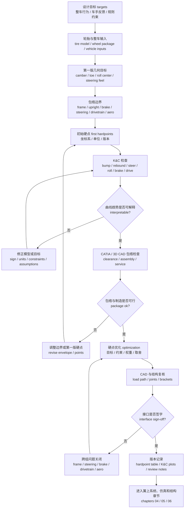

# 03 悬架几何与硬点

## 本章解决的问题

悬架几何不是一组孤立的漂亮曲线，也不是优化器输出的一串坐标。它把 [01 设计目标](01-design-targets.md) 中的整车行为目标、[02 轮胎与整车输入](02-tire-and-vehicle-inputs.md) 中的轮胎工作窗口、车架和转向制动传动包络、制造装配能力、结构载荷路径和车手反馈连接成可建模、可制造、可验证的轮端运动。

快速预览层见 [../04-geometry-and-hardpoints.md](../04-geometry-and-hardpoints.md)。本章进一步回答：

- 如何定义主销、侧视和正视几何，并理解它们对转向手感、轮胎力、车身姿态和结构载荷的影响。
- 如何在优化前建立第一版硬点，而不是让软件在无边界空间里搜索。
- 如何用 K&C 检查把 camber、toe、bump steer、roll center、track change、Ackermann、anti-dive 和 anti-squat 放到同一个评审框架里。
- 如何用表格模板记录硬点、坐标系、单位、符号、版本和接口状态，并把具体车辆坐标留在项目工程记录中。

几何设计的核心取舍是：轮胎想要合适的外倾和载荷，车手想要可预测的方向盘反馈，车架和 upright 需要合理载荷路径，转向、制动、传动和气动需要空间，制造希望结构简单可测量，整车姿态又不能破坏空气动力学和稳定性。任何单一指标都不应被当作唯一答案。

RCVD 式 axis systems 或任何教材 / 软件坐标系统进入项目后，都必须先固定原点、轴向、正负方向、左右镜像和输入条件，再比较硬点或曲线。否则 camber gain、toe change、steering axis 和 roll-center migration 可能只是符号相反、参考面不同或输入被锁定方式不同，却被误判成几何优劣差异。公开文档可以讲通用约定；项目工程记录必须把实际约定写到硬点表、K&C 模型、CAD 导出和测试复盘里。

## 几何设计的核心任务

几何设计首先要把轮心 wheel center、轮胎接地点 contact patch、upright 外点、A 臂内点、转向拉杆点、推杆或拉杆点、减振器和摇臂点放进同一套坐标系。随后要检查这些点在跳动、回弹、转向、侧倾、制动、加速和组合工况下如何改变轮胎姿态与车身姿态。

推荐采用下面的坐标模板：

| 字段 | 模板写法 |
| --- | --- |
| 坐标系 | `x` 轴指向车辆前进方向，`y` 轴指向车辆左侧，`z` 轴竖直向上。若项目使用其它约定，必须在硬点表和软件模型中同步说明。 |
| 长度单位 | 硬点、轮距、轴距、行程、包络间隙统一使用同一长度单位，常见为 mm；公式推导可使用 m，但不得在同一表格里混用。 |
| 角度单位 | caster、KPI / SAI、camber、toe、steering angle、roll angle 通常用 deg；用于三角函数或脚本计算时要注明是否转换为 rad。 |
| 左右镜像 | 左右轮硬点应说明是按整车坐标镜像、按局部轮坐标镜像，还是由 CAD 单独导出；必须列明哪些角度和力需要改变符号。 |
| 外倾 camber | 建议写清“车轮上端向车外为正”或“车轮上端向车内为正”的项目约定，并说明左右轮如何镜像。 |
| 前束 toe | 区分单轮 toe 与总前束 total toe；说明车轮前缘向车辆中心线收拢或张开时的正负号。 |
| 曲线横轴 | K&C 曲线的横轴要标明 wheel travel、roll angle、steering input、vertical force 或其它输入，并写清 bump / rebound 正方向。 |
| 曲线版本 | 每张曲线对应硬点版本、轮胎和轮辋版本、转向机版本、车架包络版本、软件版本和导出日期。 |

硬点表模板先提供字段，不提供历史坐标：

| 点位字段 | 说明 | 版本记录 |
| --- | --- | --- |
| 轴别与左右 | 前 / 后、左 / 右、是否镜像生成 | 关联整车坐标系版本 |
| 点位名称 | 例如上 A 臂前内点、下 A 臂后内点、转向拉杆外点、轮心、推杆点 | 使用项目统一命名 |
| `x` coordinate | 整车坐标下的纵向位置，单位见表头 | 项目记录中填写数值；学习模板保留字段 |
| `y` coordinate | 整车坐标下的横向位置，单位见表头 | 项目记录中填写数值；学习模板保留字段 |
| `z` coordinate | 整车坐标下的竖向位置，单位见表头 | 项目记录中填写数值；学习模板保留字段 |
| 来源 | CAD、K&C 模型、优化器、测量或临时假设 | 写明可信度和更新触发 |
| 接口状态 | 车架、转向、制动、传动、气动、制造是否确认 | 未确认项不得假装冻结 |

这张表的目的不是给出项目答案，而是让读者知道合格硬点记录必须能被 CAD、多体动力学、结构校核、装配测量和测试复盘共同使用。

几何曲线评审还应把“记录什么约定”和“看什么工程含义”分开：

| 几何量 | 需要记录的约定 | 评审时看什么 |
| --- | --- | --- |
| camber gain | bump / rebound 方向、轮心位移单位、角度正负 | 是否服务轮胎工作区间，而不是追求单一大数值 |
| toe change / bump steer | 转向坐标、左右轮符号、rack 输入是否锁定 | 曲线趋势是否符合转向稳定性和车手感受目标 |
| roll center migration | 车身坐标、轮距、高度参考面 | 是否在行程内平滑，是否与载荷转移和 jacking 风险一起评审 |
| caster / trail / KPI | 主销轴定义、轮心和接地点参考 | 是否兼顾回正、转向力、制动稳定和包装空间 |
| anti-dive / anti-squat | 侧视瞬心、制动 / 驱动力路径 | 是否只是辅助指标，不能替代实际载荷和结构检查 |

## 规则门槛与几何包络

公开规则给几何设计提供的是硬边界，而不是推荐几何答案。以 Formula Student 2026 规则中的公开条目为例，悬架必须有可工作的前后系统、减振器、可用 wheel travel 和含车手状态下的 jounce；安装点还要能在技术检查中被看到。这些要求应在第一版硬点阶段就进入 CAD / K&C 检查，而不是等到实车装配后再补救。

建议把规则门槛拆成以下几何检查：

| 检查项 | 需要在几何阶段确认什么 | 常见返工原因 |
| --- | --- | --- |
| wheel travel / jounce | 轮端 bump、rebound、限位、减振器 stroke、轮胎包络和车高状态是否能同时满足 | 静态车高看似够，含车手后 jounce 不足；bump stop 太早接触 |
| 轮辋内 clearance | 球铰、upright、制动卡钳、紧固件和转向臂在任意转角和目标车高下是否避让轮辋 | 只检查静态直行姿态，没有检查极限转向、跳动或回弹 |
| mounting point visibility | A 臂、推杆/拉杆、摇臂、转向和减振器安装点是否能直接看到或通过拆盖检查 | 气动件或车身把关键支座包住，技术检查和赛后检查都困难 |
| wheelbase / track | 轮心定义、轮距版本、左右镜像和车架坐标是否与规则检查一致 | CAD、K&C 和实车测量基准不一致 |
| steering / suspension covers | 盖板、车身开口和维护路径是否允许检查、调校和紧固件复检 | 设计只考虑空气动力或外观，忽略现场维护和 inspection |

这些检查不应停留在“满足最低规则值”。规则最低 wheel travel 只能说明可以进入技术检查讨论，不能说明几何曲线、轮胎姿态、阻尼器速度或结构载荷已经合理。合格的硬点方案应同时满足规则、轮胎工作窗口、车手反馈、包络制造和结构载荷路径。

## 主销几何

主销 kingpin 或 steering axis 是前悬转向时车轮绕其旋转的等效轴线。对双横臂悬架而言，它通常由上下球铰或 upright 上的上下转向支承点定义；对其它结构，也应按实际转向约束定义。主销几何直接影响方向盘力、回正感、制动稳定性、转向时轮胎接地点路径、轮辋和制动包络，以及 upright 载荷路径。

关键概念如下：

- caster：主销后倾角，通常在侧视图中描述 steering axis 与竖直方向的夹角。它会影响机械拖距、回正力矩、转向时外倾变化和制动稳定感。更大的 caster 不必然更好，因为它可能增加转向力、改变转向时车身抬升和降低包络余量。
- KPI / SAI：主销内倾角 kingpin inclination / steering axis inclination，通常在正视图中描述 steering axis 与竖直方向的夹角。它影响 scrub radius、转向抬升、方向盘力和轮辋内布置。KPI / SAI 过度追求某一方向可能导致轮胎接地点横向移动、转向力矩或 upright 结构风险。
- scrub radius：主销轴线与地面交点到轮胎接地中心之间的横向距离。它会影响制动左右不均时的方向稳定、路面冲击传到方向盘的力矩、低速转向力和轮胎磨耗。它必须结合轮辋 offset、轮胎宽度、制动包络和转向臂布置检查。
- mechanical trail：从侧视角看，主销轴线与地面交点到轮胎接地中心之间的纵向距离。它与轮胎 aligning moment 一起形成方向盘回正感，但也会改变转向输入所需力矩。
- spindle trail：轮心或轮轴中心相对 steering axis 的纵向偏置。它与 caster、机械拖距、转向节结构和轮端载荷路径一起影响回正和转向力，不应只按单一目标调整。

主销几何评审时至少检查：

| 检查项 | 评审问题 |
| --- | --- |
| 转向手感 | 方向盘力是否在车手可接受范围内，回正趋势是否随侧向载荷合理变化。 |
| 制动稳定 | 制动时左右附着差、轮胎纵向力和 scrub radius 是否造成难以控制的转向力矩。 |
| 轮辋包络 | steering axis、球铰、制动卡钳、轮毂、轮辋内壁和紧固件是否在极限姿态下避让。 |
| 外倾变化 | 转向输入下的 camber 变化是否与目标轮胎窗口一致，而不是只看静态 camber。 |
| 结构路径 | upright 上下支承点和转向臂是否能把载荷传给金属结构校核需要的合理路径。 |

主销参数常被早期包络强烈限制。若轮辋、制动、轴承或驱动件已经接近空间边界，改变 KPI / SAI、caster 或 scrub radius 可能比优化 A 臂内点更难。因此主销冻结前，应让几何、转向、制动、传动和结构负责人共同签字确认。

## 侧视几何

侧视几何主要描述悬架连杆在车辆纵向-竖向平面中的布置。它影响制动俯仰、加速抬头或下蹲、轮心纵向位移、纵向力进入车架的路径，以及弹簧阻尼系统看到的运动。

正文中可把侧视虚拟摆臂 side-view swing arm, `SVSA` 作为理解工具：它由侧视瞬心和轮胎接地点关系帮助解释纵向力如何引起车身俯仰趋势。`SVSA` 不是单独目标值；它必须和制动比例、驱动方式、质心高度、轮胎纵向力、阻尼和结构节点一起评审。

anti-dive 是制动时由悬架几何产生的抗俯冲倾向。它不是“越高越好”的百分比，而是制动力、轮胎纵向力、质心高度、轴距、前悬连杆侧视交点、车架支座刚度和阻尼共同作用后的姿态响应。过度追求 anti-dive 可能带来制动时轮胎垂向载荷变化更突然、杆件载荷路径更差、前端抓地反馈更生硬或车架节点难以布置。

anti-squat 是加速时由后悬几何产生的抗下蹲倾向。它与驱动轮纵向力、链传动或半轴力线、质心高度、后悬侧视几何、弹簧阻尼和轮胎纵向抓地有关。过强的 anti-squat 可能改善某些姿态问题，却也可能让出弯牵引变得不连续，或把载荷引入不利结构路径。

侧视几何还要检查：

- 轮心 fore-aft movement：跳动和回弹时轮心纵向位移是否合理，是否会影响轮胎接地、车身包络、传动角度和制动管路。
- caster change：悬架行程中 caster 是否出现不可解释的突变，是否影响转向回正和制动入弯稳定。
- longitudinal compliance sensitivity：若未来考虑柔性或衬套，纵向力路径是否会让 toe 或 camber 在载荷下发生不利变化。
- pitch attitude：制动、加速、过路肩或纵向波动时，几何和弹簧阻尼是否共同维持可接受车身姿态，特别是底板、前翼或扩散器对车高敏感的车辆。

侧视几何的结论应与 [04 弹簧、阻尼、侧倾与车身姿态](04-spring-damper-roll-and-ride.md) 一起评审。几何上的 anti 参数不能替代弹簧、阻尼、限位和实车测试；弹簧阻尼也不能弥补不可制造或载荷路径很差的硬点布置。

## 正视几何

正视几何主要描述悬架在车辆横向-竖向平面中的行为。它影响轮胎外倾控制、侧倾中心 roll center、轮距变化 track change、轮胎接地点横向移动、jacking tendency、侧向载荷路径，以及车身侧倾时轮胎是否还处在可用工作窗口。

正视虚拟摆臂 front-view swing arm, `FVSA` 可用于理解侧向力、侧倾中心和 jacking tendency 的关系。较短或角度极端的 `FVSA` 可能让侧倾中心移动剧烈或引入更明显的垂向几何力；较长的 `FVSA` 也不自动更好，因为它会与外倾增益、轮距变化、包装和载荷路径共同耦合。

roll center 是车身相对轮胎侧向力作用的几何参考点。它通常由悬架瞬心和轮胎接地点几何关系推导，但不同软件和悬架类型可能定义细节不同。设计时不应只追求某个静态 roll center 高度，还要看 roll center migration，即跳动、侧倾和转向过程中侧倾中心如何移动。过高或移动剧烈的 roll center 可能引入明显 jacking effect 或让轮胎载荷变化变得难以解释；过低也可能带来侧倾角过大和姿态控制压力。

camber gain 是车轮随跳动、回弹或侧倾产生的外倾变化率。它服务于轮胎在弯中保持合适接地状态，但不能简单地追求“越大越好”。过大的 camber gain 可能导致直线制动和加速时轮胎接地恶化、轮胎磨耗增加、转向中外倾变化过强，或让包装和结构变差。

track change 是轮距随悬架运动变化的趋势。它影响轮胎横向擦滑、滚动阻力、方向稳定、车身包络和轮胎温度。小的 track change 通常更容易解释，但如果为了消除它牺牲 camber、roll center、杆件长度或结构路径，也可能得不偿失。

toe 是车轮绕竖直轴的角度。静态 toe 是调校参数，动态 toe 则来自悬架几何、转向拉杆布置和柔性。bump steer 指车轮在没有方向盘输入时，由跳动或回弹引起的 toe 变化。它对 FSAE 车辆尤其敏感，因为短轴距、小轮胎和高转向输入会放大车手对前束变化的感受。bump steer 不是越接近零就一定越好，但任何非零趋势都应有明确理由，并通过车手反馈和实车数据验证。

Ackermann 描述转向时内外轮转角关系。理想几何常从低速纯滚动转弯推导，但真实赛车有轮胎侧偏、载荷转移、轮胎温度、转向系统柔性和车手输入。低速小半径项目可能需要关注 Ackermann 带来的响应和内轮利用率；高速或中高速转向时，过度按几何理想化可能反而不适合轮胎工作窗口。设计时应把 Ackermann 当作可调的策略，而不是教材公式的直接答案。

## 从车手反馈到几何目标

车手反馈是几何目标的重要输入，但不能直接等同于根因。比如“入弯推头”“弯中前轮没抓地”“制动时点头明显”“方向盘太沉”“路肩后车头跳动”都可能来自轮胎、前后载荷转移、弹簧阻尼、转向系统、制动平衡、气动姿态、结构柔度或几何。

建议用以下路径把反馈转成几何目标：

| 车手或视频现象 | 可能关联的几何问题 | 需要同时检查的非几何因素 |
| --- | --- | --- |
| 入弯响应慢 | 前轮 camber 工作窗口、toe、bump steer、caster、Ackermann、前轴 roll center | 制动释放、前后轮胎温度、前后侧倾刚度、阻尼低速段、方向盘传动比 |
| 弯中持续推头 | 外侧前轮外倾不足、前轴载荷敏感性、roll center migration、前束趋势 | 轮胎模型、前后侧倾刚度分配、车手油门、气动平衡 |
| 制动入弯不稳 | scrub radius、caster、anti-dive、制动姿态下 toe 变化 | 制动平衡、轮胎纵滑、左右制动力差、阻尼和车架柔性 |
| 出弯牵引差 | 后悬 camber / toe 变化、anti-squat、半轴和轮心路径 | 差速器或电控策略、后轮胎温度、油门斜率、后轴阻尼 |
| 方向盘力不自然 | mechanical trail、spindle trail、KPI / SAI、scrub radius、轮胎 aligning moment | 转向机摩擦、转向柱角度、轮胎压力、转向节刚度 |

从反馈到目标时，建议先写“可检验假设”而不是直接写“修改某个硬点”。例如：弯中推头可以先假设外侧前轮没有保持在目标外倾窗口，然后用轮胎模型、K&C camber 曲线、侧倾角、胎温和车手数据验证。若证据不支持，再检查前后侧倾刚度、制动或转向输入。

## 初始硬点定义

硬点初始化是优化前最重要的一步。没有可信的初始硬点，优化器可能给出数学上更好、车上却装不下或承载路径很差的方案。

初始化应按以下顺序推进：

| 输入 | 需要确认的内容 | 对硬点的影响 |
| --- | --- | --- |
| 坐标系统 | 原点、轴向、单位、左右镜像、车高基准、轮心和接地点定义 | 所有硬点表、CAD、K&C 和结构模型必须一致 |
| 轮胎与轮辋 | 外径、宽度、轮辋 offset、轮胎包络、目标 camber 和 toe 调整范围 | 决定轮心、接地点、轮辋内球铰空间和车身开口 |
| upright / hub / brake package | 轴承、轮毂、制动盘、卡钳、紧固件、转向臂、外球铰和传感器空间 | 限制 steering axis、KPI / SAI、scrub radius、外点位置和载荷路径 |
| frame pickup envelope | 车架管、节点、支座焊接面、驾驶员空间、踏板和维护工具路径 | 限制 A 臂内点、转向机、减振器和摇臂支座 |
| steering rack | 齿条位置、行程、内拉杆点、转向柱、转角需求和方向盘力目标 | 决定 bump steer、Ackermann、拉杆角度和极限转向避让 |
| drivetrain | 半轴、差速器、电机、链传动、轮端连接和极限角度 | 尤其限制后悬轮心路径、内点空间、anti-squat 和行程 |
| aero / bodywork | 地板、扩散器、翼面、车身开口、目标车高和维修拆装 | 限制行程、轮胎包络、杆件外露、车身姿态和 jacking 风险 |
| damper / rocker package | 推杆或拉杆点、摇臂、减振器、弹簧、传感器和限位 | 决定 motion ratio、行程利用、结构载荷和维护空间 |

第一版硬点不需要完美，但必须真实。最低要求是：杆件长度和角度可制造，球铰角度在极限姿态下可接受，轮辋和制动不干涉，转向机和拉杆可安装，车架有支座空间，传动不被侵入，减振器和摇臂能布置，工具能接触紧固件，结构载荷能传到合理节点。

## 硬点优化

硬点优化的目标是改进可验证的车辆行为，而不是让某条曲线贴近无来源的数值。优化前必须明确设计变量、目标函数、约束、权重、工况、软件版本和退出条件。学习文档适合讲目标类别和约束逻辑；精确点位、优化目标、源表格和源图应放在项目记录中。

常见设计变量包括：A 臂内点位置、upright 外点位置、转向拉杆内外点、推杆或拉杆点、摇臂点、静态 camber / toe 调整件、车高和限位位置。变量选择应服从包络和制造逻辑。若 upright、轮辋和制动已经冻结，主销几何可能很难大幅改变；此时优化内点和转向拉杆点更现实。若车架节点还未冻结，则应优先把载荷路径和维护空间一起纳入变量边界。

优化目标可以分为：

| 目标类别 | 表达方式 | 典型约束 |
| --- | --- | --- |
| 轮胎姿态 | 在目标行程、侧倾和转向工况中保持合理 camber、toe 和接地点路径 | 轮胎模型边界、轮辋包络、调校范围 |
| 转向响应 | 控制 bump steer、Ackermann、caster / KPI / SAI 相关手感和转向角范围 | 转向机行程、拉杆角度、方向盘力、转向柱空间 |
| 车身姿态 | 管理 roll center migration、anti-dive、anti-squat 和轮心路径 | 气动包络、车高、限位、弹簧阻尼方案 |
| 结构与制造 | 保持杆件夹角、支座可焊接性、关节角度、紧固件可达性和载荷路径 | 车架节点、材料、加工能力、维护策略 |
| 版本可追溯 | 每次变化能解释目的、影响和代价 | 硬点表版本、K&C 曲线、CATIA / 3D CAD 截面、评审记录 |

不要把优化结果当作自动正确。一个常见情况是：某个硬点变化让外倾曲线更接近目标，却让转向拉杆角度恶化、轮辋干涉、车架支座悬空、FEA 载荷路径变差或制造公差敏感性大幅提高。此时应记录“为什么拒绝该方案”，因为被拒绝方案往往比最终坐标更能帮助后续成员理解边界。

## K&C 检查

K&C 是 kinematics and compliance 的缩写。早期几何章节通常先做刚体运动学 kinematics，检查连杆几何如何决定车轮运动；更成熟时还应考虑 compliance，即杆端、upright、车架和轮胎在载荷下的弹性变形如何改变 camber、toe 和轮心位置。若没有柔性数据，应写成“刚体 K&C 初筛”，并把柔性影响列为待验证项。

因此，刚体 K&C 只能作为第一层筛选：它适合发现硬点符号、包络、趋势和明显曲线问题，但不能直接声称实车在制动、侧向力、路肩或驱动载荷下仍保持同样 toe / camber。要声明 real-car toe / camber under load，必须补充 compliance 数据、载荷路径假设、实车定位变化或测试证据；若这些证据暂时没有，结论应写成“刚体趋势支持，柔性影响待验证”。

基础 K&C 工况建议覆盖：

- 平行跳动与回弹：左右轮同向 wheel travel，用于检查 camber gain、toe、track change、roll center 变化和包络。
- 单轮跳动：一侧轮跳动，用于检查 roll center、jacking tendency、杆件角度、球铰角度和车身包络。
- 转向扫描：方向盘或齿条输入，用于检查 Ackermann、turning camber、scrub path、转向角范围和干涉。
- 侧倾工况：车身 roll 或等效垂向力输入，用于检查外侧轮 camber、toe、roll center migration 和轮距变化。
- 制动姿态：前后悬架在制动俯仰下的 camber、toe、anti-dive 和轮胎纵向力路径。
- 加速姿态：后悬在驱动工况下的 toe、camber、anti-squat、半轴角度和牵引稳定性。
- 组合极限：跳动加转向、回弹加转向、侧倾加转向、制动加转向等，用于发现单工况看不到的干涉和突变。

核心指标表：

| 指标 | 物理意义 | 常见影响 | 检查工况 | 不应单独优化的原因 |
| --- | --- | --- | --- | --- |
| kingpin / steering axis | 车轮转向的等效轴线，由 upright 支承点和转向约束定义 | 影响回正、转向力、轮辋包络、制动稳定和 upright 载荷 | 静态、转向扫描、制动姿态、极限转向包络 | 改变轴线会同时改变 KPI / SAI、caster、scrub radius、trail 和结构空间 |
| caster | 侧视主销后倾，影响机械拖距和转向时外倾 | 回正力、方向盘力、制动入弯稳定、转向外倾变化 | 静态、转向扫描、制动姿态、行程扫描 | 更大 caster 可能增加转向力、包络风险和转向抬升 |
| KPI / SAI | 正视主销内倾角 | scrub radius、转向抬升、方向盘冲击、轮辋空间 | 静态、极限转向、轮辋和制动包络 | 与轮辋 offset、球铰空间、scrub radius 和 upright 强度耦合 |
| scrub radius | steering axis 地面交点到接地中心的横向距离 | 制动稳定、路面冲击、转向力矩、轮胎磨耗 | 静态、制动、左右附着差、转向扫描 | 需要和轮胎、制动、转向力和轮辋包络一起判断 |
| mechanical trail | steering axis 地面交点到接地中心的纵向距离 | 回正感、方向盘力、车手路感 | 静态、转向扫描、制动入弯 | 与 caster、轮胎 aligning moment 和 steering ratio 强耦合 |
| spindle trail | 轮轴中心相对 steering axis 的纵向偏置 | 回正、转向力、upright 载荷路径 | 静态、转向扫描、结构评审 | 可能改善手感但恶化 upright 包络或载荷路径 |
| roll center | 侧向力作用的几何参考点 | 侧倾力矩臂、jacking tendency、前后载荷转移分配 | 静态、侧倾、单轮跳动、行程扫描 | 静态高度不代表迁移趋势，且与弹簧和防倾杆共同决定姿态 |
| camber gain | 车轮随行程或侧倾产生的外倾变化 | 轮胎接地、弯中抓地、直线制动和磨耗 | 平行跳动、侧倾、转向、制动姿态 | 过大可能损害直线工况、包络和制造可行性 |
| toe | 车轮绕竖直轴的角度，含静态和动态部分 | 稳定性、入弯响应、轮胎温度、直线阻力 | 静态调校、行程、侧倾、制动和加速 | toe 同时受转向、柔性、调校和车手偏好影响 |
| bump steer | 无方向盘输入时行程引起的 toe 变化 | 颠簸、制动、侧倾中车辆自转向趋势 | 平行跳动、单轮跳动、侧倾和组合工况 | 完全消除未必最佳，残余趋势必须与整车行为一致 |
| track change | 轮距随行程或侧倾变化 | 轮胎擦滑、温度、包络、滚阻和侧向稳定 | 平行跳动、单轮跳动、侧倾 | 过度压低可能牺牲 camber、roll center 或杆件长度 |
| Ackermann | 内外轮转角关系 | 低速转弯、内轮利用率、轮胎温度和转向响应 | 转向扫描、低速半径工况、轮胎模型检查 | 理想几何不等于真实轮胎最佳，需结合侧偏和载荷转移 |
| anti-dive | 制动时几何抗俯冲倾向 | 制动姿态、前轮载荷变化、转向稳定和杆件载荷 | 制动姿态、纵向力路径、前悬行程 | 过强可能恶化轮胎接地、手感或结构路径 |
| anti-squat | 加速时几何抗下蹲倾向 | 出弯牵引、后悬姿态、半轴角度和杆件载荷 | 加速姿态、驱动工况、后悬行程 | 过强可能让牵引不连续或把载荷引入不利车架节点 |

K&C 曲线评审要看趋势、突变、左右一致性、单位、符号和输入版本。不要只在曲线末端读一个数字。若曲线出现不连续、左右镜像异常、方向反转或局部尖峰，应先检查坐标系、约束定义、球铰自由度、转向输入、模型装配和单位。

## CATIA / 3D CAD 包络与制造检查

K&C 曲线通过不代表车能装起来。CATIA / 3D CAD 包络与制造检查至少要覆盖：

| 检查对象 | 检查内容 |
| --- | --- |
| 轮胎包络 | 静态、跳动、回弹、转向、侧倾和组合姿态下是否碰车身、翼面、车架、制动管路或传感器。 |
| 轮辋和制动 | 球铰、upright、卡钳、制动盘、轮毂、紧固件和工具空间是否避让。 |
| A 臂和杆端 | 杆件角度、最小长度、杆端摆角、锁紧螺母、调整垫片和拆装方向是否可行。 |
| 转向拉杆 | 内外拉杆点、齿条行程、转向柱、极限转角、拉杆摆角和防松结构是否可行。 |
| 推杆 / 拉杆与摇臂 | motion ratio 曲线、杆件压屈风险、减振器行程、弹簧空间、限位和传感器是否可行。 |
| 车架支座 | 支座是否落在合理节点，焊接或螺接是否可操作，载荷是否能进入主结构。 |
| 制造公差 | 装配孔、垫片、调整件、检具、焊接变形和测量基准是否支持目标几何。 |
| 维护和测试 | 换轮、调 toe / camber、换弹簧、拆 upright、安装位移传感器是否可在赛场完成。 |

制造检查的关键是把“理论硬点”变成“可定位硬点”。学习文档可以使用字段模板，例如：定位基准、孔位类型、可调范围、测量工具、允许误差来源、装配顺序、复测方法、风险备注。实际孔位、夹具尺寸和制造图应放在项目记录中。

## 硬点闭环流程图

这张图强调闭环：几何目标来自整车和轮胎，第一版硬点来自包络和制造，优化必须回到 K&C、CAD、结构和接口确认。任何环节变化，都应触发版本记录和受影响章节复查。

## 输出物

完成本章后，团队应至少形成以下输出物。学习模板说明字段、逻辑和方法；具体坐标和模型文件由项目自行管理。

| 输出物 | 最低内容 | 写法建议 |
| --- | --- | --- |
| 几何目标说明 | 每个目标的工程含义、来源、相关轮胎或车手反馈、验证方法 | 写目标类别和验证逻辑，具体目标值进项目记录 |
| 硬点表模板 | 坐标系、单位、点位字段、版本、来源、接口状态 | 写字段和单位，实际坐标进项目记录 |
| K&C 曲线包 | camber、toe、bump steer、roll center、track change、Ackermann、anti 参数等曲线 | 可用示意曲线讲读图方法，历史曲线需重绘或留在项目记录中 |
| CATIA / 3D CAD 包络记录 | 极限姿态、干涉检查、维护空间、制造可达性 | 用检查项讲方法，不放源截图或未授权 CAD 图 |
| 优化记录 | 设计变量、目标类别、约束类别、被拒绝方案和取舍理由 | 写取舍方法，精确优化设置和源表格进项目记录 |
| 接口签字表 | 车架、转向、制动、传动、气动、制造、测试确认状态 | 写流程和字段，不写私有负责人或内部编号 |
| 版本变更日志 | 每次硬点变化的原因、影响章节、重新验证项 | 写变更触发逻辑，数值变化进项目记录 |

## 常见错误

1. 坐标系没有冻结，CAD、K&C、结构和测量各用一套正负号。
2. 只优化 camber 或 roll center，看起来曲线更好，却牺牲 bump steer、转向力、制造空间或结构路径。
3. 把静态 roll center 高度当成全部结论，不看迁移、jacking tendency 和侧倾刚度分配。
4. 把 Ackermann 当作固定教材答案，不结合轮胎侧偏、载荷转移和比赛工况。
5. 只看平行跳动，不检查转向、侧倾、制动、加速和组合极限姿态。
6. 轮辋、制动、upright 或转向机未冻结就发布硬点结论，后期大面积返工。
7. 只在软件中检查不干涉，没有确认杆端摆角、紧固件、工具空间和装配顺序。
8. 没有记录被拒绝方案，导致下一位成员重复尝试同一条不可行路径。
9. 用历史经验直接替代验证，把某一年适用的几何选择写成普遍真理。
10. 在学习文档中保留源图、源表、精确坐标或源文件名，使读者能反推出内部车辆。

## 验证与评审

几何和硬点评审建议分为四层：

| 评审层 | 检查问题 | 证据形式 |
| --- | --- | --- |
| 输入评审 | 设计目标、轮胎模型、轮辋、upright、制动、转向机、车架和传动包络是否是当前版本 | 目标表、输入版本表、接口清单 |
| 运动学评审 | camber、toe、bump steer、roll center、track change、Ackermann、anti 参数趋势是否物理可解释 | K&C 曲线、符号检查、左右镜像检查 |
| 包络制造评审 | 极限姿态是否干涉，杆端和紧固件是否可装，支座是否可制造和测量 | CATIA / 3D CAD 截面、装配顺序、检具和测量方案 |
| 结构与测试评审 | 载荷路径是否合理，是否能导出给 [06 载荷与金属结构](06-loads-metal-structure.md)，测试中是否能验证目标 | 载荷路径草图、测试计划、传感器位置、版本记录 |

最低评审问题包括：

- 能否用一段话解释每个主要几何目标服务哪个整车行为。
- 每条 K&C 曲线的单位、符号、横轴、工况和硬点版本是否清楚。
- 静态和动态 camber / toe 趋势是否与轮胎模型边界一致。
- 主销、scrub radius、mechanical trail 和 spindle trail 是否与转向手感、制动稳定和轮辋包络共同评审。
- anti-dive 和 anti-squat 是否只作为姿态管理的一部分，而不是孤立追求的数字。
- CAD 中是否检查组合极限姿态，而不是只检查装配姿态。
- 结构负责人是否确认支座位置、载荷方向和后续 FEA 输入方式。
- 文档是否避开实际坐标、精确历史目标、源表、源图和源文件名。

结构、安全和实车行为相关结论应使用保守措辞。K&C 和 CAD 检查通过只能说明该版本具备进入下一阶段的条件，不能替代结构校核、制造检验、实车测量和测试相关性验证。

## 与其它章节的关系

本章处在高级手册的中枢位置：

| 章节 | 关系 |
| --- | --- |
| [01 设计目标](01-design-targets.md) | 提供整车行为、约束、车手反馈和接口边界，决定几何目标从哪里来。 |
| [02 轮胎与整车输入](02-tire-and-vehicle-inputs.md) | 提供轮胎工作窗口、坐标系、动态轮荷和模型边界，决定 camber、toe 和载荷相关判断是否可信。 |
| [04 弹簧、阻尼、侧倾与车身姿态](04-spring-damper-roll-and-ride.md) | 几何决定轮端运动和 motion ratio 边界，簧上系统决定姿态控制和轮荷变化，两者必须共同评审。 |
| [05 仿真、优化与相关性](05-simulation-optimization-correlation.md) | 本章的硬点和 K&C 曲线进入整车仿真、参数研究、优化记录和实车 correlation。 |
| [06 载荷与金属结构](06-loads-metal-structure.md) | 硬点位置、杆件方向和轮胎力路径决定金属件载荷提取、边界条件和支座设计。 |

读者可以把本章看成从目标和轮胎输入进入机械实现的桥梁。几何方案只有在后续簧上系统、仿真、结构、制造和测试中持续闭环，才算完成工程意义上的验证。
