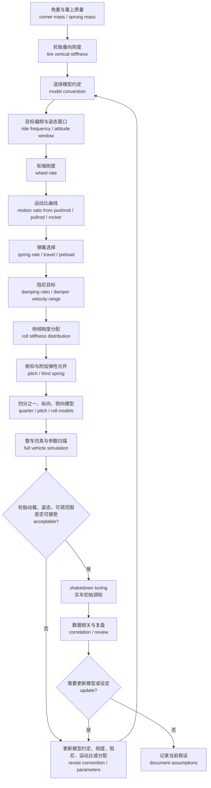

# 04 弹簧、阻尼、侧倾与车身姿态

## 本章解决的问题

快速预览层的 [05 弹簧阻尼与侧倾](../05-spring-damper-and-roll.md) 已经给出基本计算骨架。本章把这条链路展开成高级设计流程：从角重、轮胎垂向刚度 tire vertical stiffness、轮端刚度 wheel rate 和弹簧刚度 spring rate 出发，建立偏频 ride frequency、阻尼比 damping ratio、运动比 motion ratio、侧倾刚度 roll stiffness、侧倾梯度 roll gradient、俯仰 pitch 和第三弹簧 third spring 的选择逻辑。

弹簧阻尼系统不是让车身“越稳越好”的孤立系统。更小的侧倾、俯仰和起伏可以改善车手信心、气动姿态和底盘离地间隙，但过强的弹簧、阻尼或防倾杆也可能增加轮胎动态载荷变化，使接地压力更不连续，反而降低轮胎可用抓地力和车手可控性。因此，本章的目标不是给出某组通用参数，而是说明如何把参数选择写成可计算、可仿真、可测试、可回溯的工程决策。

本章描述通用方法和评审逻辑。任何具体设定都必须由团队结合 [02 轮胎与整车输入](02-tire-and-vehicle-inputs.md)、[03 几何与硬点](03-geometry-and-hardpoints.md)、[05 仿真、优化与相关性](05-simulation-optimization-correlation.md) 和 [08 验证、测试与答辩](08-validation-testing-defense.md) 重新计算和验证；历史赛车的弹簧、阻尼、第三弹簧、频率、侧倾梯度和源结果表不适合作为通用答案。

## 轮端刚度、弹簧刚度与轮胎刚度

弹簧刚度 spring rate 是弹簧自身的力-位移斜率；轮端刚度 wheel rate 是轮心或接地点看到的等效悬架垂向刚度；轮胎垂向刚度 tire vertical stiffness 是轮胎垂向载荷与轮胎压缩之间的等效关系。车辆响应由轮端、轮胎、几何和阻尼共同决定，不能只看弹簧包装上的刚度标称值。

建议先统一以下符号和单位：

| 符号 | 含义 | 常用单位 | 说明 |
| --- | --- | --- | --- |
| `m_c` | 单角对应的簧上质量 sprung mass per corner | kg | 应说明是否含车手、燃油或电池状态，以及是否扣除簧下质量 |
| `k_s` | 弹簧刚度 spring rate | N/mm 或 N/m | 弹簧端测得的线性或局部斜率 |
| `k_w` | 轮端刚度 wheel rate | N/mm 或 N/m | 由悬架弹簧路径换算到轮心或接地点的刚度，通常不含轮胎 |
| `k_t` | 轮胎垂向刚度 tire vertical stiffness | N/mm 或 N/m | 静态、滚动动态或模型导出值必须区分 |
| `k_eff` | 轮胎与悬架串联后的简化等效刚度 effective vertical stiffness | N/mm 或 N/m | 仅用于忽略簧下质量的 ground-to-body 简化等效模型 |
| `MR_x` | 位移运动比 displacement motion ratio | 无量纲 | 本章定义为弹簧位移除以轮端垂向位移 |
| `F_z` | 轮胎垂向载荷 normal load | N | 正方向和数据来源要与轮胎章节一致 |

若 `MR_x` 定义为弹簧位移 / 轮端垂向位移，则线性近似下：

```text
k_w = k_s · MR_x^2
```

其中 `k_w` 和 `k_s` 的刚度单位必须一致。若团队把运动比定义为轮端位移 / 弹簧位移，公式中的运动比需要取倒数后再平方。文档中必须明确采用哪一种定义，否则弹簧选择和阻尼换算会发生系统性错误。

除非文档明确写成“等效刚度”，本章中的 `k_w` 默认指悬架弹簧路径换算到轮端的 wheel rate，不包含轮胎垂向刚度。若某张表把轮胎刚度串联进来，应改用 `k_eff` 或其它明确名称，避免把悬架参数和轮胎参数混在一起。

轮胎与悬架在垂向上可以先按串联弹簧理解：

```text
k_eff = (k_w · k_t) / (k_w + k_t)
```

其中 `k_eff` 为轮胎与悬架串联后的简化等效垂向刚度。这个框架只适合把轮胎与悬架合并成 ground-to-body 等效弹簧、且忽略簧下质量的早期估算。真实四分之一车 2-DOF model 应把轮胎刚度 `k_t`、悬架轮端刚度 `k_w`、簧上质量和簧下质量作为分开的状态，而不是把所有刚度直接合并成一个偏频结论。这个框架提醒两件事：第一，轮胎垂向刚度不是无限大，尤其在轻量赛车和小轮胎上会影响地面到车身的等效响应；第二，若轮胎垂向刚度来自估算或不完整数据，等效模型结论也应标注为待验证。

轮胎垂向刚度还可能随载荷、胎压、温度、滚动状态、外倾角和路面频率变化。早期筛选可以使用线性化刚度，但项目设计记录应说明采用的是静态测量、滚动动态测量、轮胎模型导出，还是经验估算。若后续实车角重、胎压或轮胎型号变化，轮端刚度与偏频需要重新计算。

## 偏频与车身运动

偏频 ride frequency 用来描述簧上质量在垂向小扰动下的固有响应趋势。它不是舒适性指标的简单搬用，也不是“越高越赛车”的标签。对 FSAE / Formula Student 车辆而言，偏频会影响路面跟随、轮胎动态载荷、车高窗口、气动姿态、制动点头、出弯牵引、车手信心和调校灵敏度。

使用偏频公式前，必须先选择模型约定 model convention。本章建议把悬架簧上模态估算和轮胎+悬架简化等效估算分开记录。

悬架簧上模态 sprung-mode estimate 通常用于反推弹簧和轮端刚度。此时使用由悬架弹簧路径得到的 `k_w`，默认不包含轮胎刚度：

```text
f_s = (1 / (2 · pi)) · sqrt(k_w / m_c)
```

其中 `f_s` 为悬架簧上模态估算频率，单位 Hz；`k_w` 为轮端刚度，单位 N/m，通常是悬架弹簧路径换算到接地点或轮心的 wheel rate；`m_c` 为单角簧上质量，单位 kg。若刚度使用 N/mm，需要先换算到 N/m。

若只是要理解轮胎与悬架串联后从地面到车身的简化等效响应，可以另写：

```text
f_eff = (1 / (2 · pi)) · sqrt(k_eff / m_c)
```

其中 `f_eff` 为 simplified equivalent-model reference，单位 Hz；`k_eff = (k_w · k_t) / (k_w + k_t)`；`k_t` 为轮胎垂向刚度，单位 N/m。该式忽略簧下质量，仅适合早期概念比较或敏感性说明。若要做真实四分之一车 2-DOF 分析，应把簧上质量、簧下质量、`k_w`、`k_t` 和阻尼器作为独立状态，不应把 `f_eff` 当作直接的弹簧选择目标。

偏频选择应同时回答以下问题：

| 参数 | 输入 | 计算/仿真方法 | 影响 | 验证 |
| --- | --- | --- | --- | --- |
| wheel rate 轮端刚度 | 角重、目标偏频、运动比 | 悬架簧上模态估算；参数扫描 | 车身垂向响应、轮胎动载、行程利用 | 静态压缩量、悬架位移传感器、实车车高变化 |
| spring rate 弹簧刚度 | 可采购弹簧规格、运动比、行程、预载 | 由轮端刚度反推弹簧端刚度；检查静态挠度 | 初始车高、调校步长、结构载荷 | 弹簧台架数据、角重、换簧前后对比 |
| tire vertical stiffness 轮胎垂向刚度 | 轮胎数据、胎压、温度、载荷范围 | 线性化拟合或轮胎模型导出；敏感性分析 | 等效偏频、轮胎压缩、路面输入过滤 | 胎压胎温记录、轮胎压缩测量、模型相关性 |
| ride frequency 偏频 | 单角簧上质量、模型约定、`k_w` 或 `k_eff` | 悬架簧上模态、简化等效模型、四分之一车模型 | 起伏、俯仰、侧倾耦合和气动高度 | 路面扫频、阶跃输入、车手反馈和数据日志 |
| damping ratio 阻尼比 | 阻尼器曲线、目标衰减、速度区间 | 线性阻尼比估算、速度-力曲线换算 | 衰减速度、轮胎贴地、瞬态手感 | 阻尼器台架、位移速度直方图、调校试验 |
| motion ratio 运动比 | 硬点、推杆/拉杆、摇臂、行程包络 | K&C 或 CAD 导出全行程曲线 | 等效刚度、阻尼速度、非线性和载荷路径 | 全行程测量、干涉检查、传感器标定 |
| roll stiffness 侧倾刚度 | 弹簧、防倾杆、轮距、roll center、轮胎 | 侧倾模型、K&C、整车仿真 | 侧倾角、轴内载荷转移、稳态平衡 | 侧倾台、稳态圆、胎温和车手反馈 |
| roll gradient 侧倾梯度 | 侧向加速度、侧倾角、气动和轮胎状态 | 稳态转弯仿真或测试回归 | 姿态控制、车手信心、气动稳定性 | 加速度计、悬架位移、视频和数据相关 |

更高的偏频通常会减少车身低频运动，但也会让轮胎和路面输入之间的力变化更直接。若路面粗糙、轮胎工作窗口窄或车手需要较高可预判性，过高的轮端刚度可能使车辆在极限附近更跳、更难读懂。偏频的合理性必须放到轮胎接地、动态轮荷、车手可用性和气动需求中综合判断。

## 阻尼基础与阻尼器工作区间

阻尼器 damper 通过速度相关力控制弹簧和车身运动。阻尼比 damping ratio 是线性模型中常用的无量纲指标，但真实阻尼器通常具有低速、高速、压缩 compression、回弹 rebound、泄压、滞回、温度和调节机构等非线性特征。只给出一个名义阻尼比，不能说明阻尼器是否在实际工作区间内有效。

若采用悬架簧上模态估算，线性轮端阻尼可以先用下式估算：

```text
c_w,sprung = 2 · zeta · sqrt(k_w · m_c)
```

其中 `c_w,sprung` 为悬架簧上模态对应的轮端等效阻尼，单位 N·s/m；`zeta` 为阻尼比 damping ratio，无量纲；`k_w` 为不含轮胎的轮端刚度，单位 N/m；`m_c` 为单角簧上质量，单位 kg。若用 `k_eff` 写阻尼估算，只能标成 simplified equivalent-model reference，用于概念比较，不应直接作为阻尼器目标。

阻尼器轴向 damping 必须通过运动比换算到轮端，并检查阻尼器实际速度、做功和温升范围。若要从阻尼器端换算到轮端，需要使用速度运动比：

```text
c_w = c_d · VR^2
```

其中 `c_d` 为阻尼器端等效阻尼，单位 N·s/m；`VR` 为速度比 velocity ratio，本章建议定义为阻尼器速度 / 轮端垂向速度。若阻尼器速度与轮端速度的关系随行程变化，应使用局部速度比曲线，而不是单一静态值。

阻尼器评审应区分至少三类速度区间：

| 区间 | 主要来源 | 设计关注 |
| --- | --- | --- |
| 低速 low-speed damping | 车身俯仰、侧倾、转向输入、制动释放、油门变化 | 车身姿态、瞬态响应、车手信心、稳态建立速度 |
| 中速 mid-speed damping | 路面起伏、连续弯、普通路肩、快速方向变化 | 轮胎贴地、动态轮荷、车身控制和热负荷 |
| 高速 high-speed damping | 路肩冲击、坑洼、限位接近、短波路面输入 | 冲击吸收、轮胎接地、结构保护和驾驶可控性 |

压缩与回弹也不应机械地追求某一固定比例。较强回弹可能帮助控制车身回弹速度，但过强时会让悬架在连续输入下“趴住”而失去行程；较强压缩可能支撑制动和转向姿态，但过强时会把路面输入直接传给轮胎和车架。阻尼目标应由四分之一车、纵向半车、侧向/侧倾模型、整车仿真和实车 shakedown tuning 共同校验。

阻尼器工作区间的最低输出应包括：阻尼器速度-力曲线、轮端速度换算、目标速度直方图、压缩/回弹调节方向、温升风险、行程利用、限位策略和每次调校的记录格式。若无法获得可靠台架曲线，应把阻尼器结论写成工程经验或待验证假设。

### 公开资料校准：阻尼调校不是档位迷信

公开 race car 和 FSAE 阻尼资料的共同点，不是给出一组可以复制的 damping setting，而是反复把阻尼器放回“轮胎接地、车身控制、速度区间和测试反馈”的闭环里。对学生车队来说，这比记住某个压缩 / 回弹比例更重要：阻尼器调节旋钮改变的是某段速度区间的力学响应，最后要回到轮胎动载、车身姿态、车手反馈和数据通道验证。

因此，阻尼资料进入本章时应转成以下问题：

| 公开资料提示 | 写入设计记录的方式 | 验证方式 |
| --- | --- | --- |
| 阻尼曲线按速度区间理解 | 记录低速、中速、高速；压缩和回弹分别说明 | 阻尼器台架、悬架位移速度直方图、路面事件分段 |
| 车身控制和轮胎贴地存在取舍 | 写清本轮调校优先解决 pitch、roll、heave、路肩还是牵引 | 同一测试任务下对比方向盘角、yaw rate、悬架位移和车手反馈 |
| 调节档位不等于线性增减 | 记录旋钮方向、有效速度区间、温度和是否左右一致 | 调节前后曲线或至少做重复 run，避免只凭主观感觉 |
| 阻尼不能掩盖弹簧或几何问题 | 调校记录必须链接 wheel rate、motion ratio、行程和 K&C 假设 | 若调阻尼只能隐藏触底、跳动或抓地不足，应回到上游设计 |

不要写“某资料推荐某档位”，也不要把一组车队经验改成通用配方。更好的写法是：当前证据显示某类速度区间的车身运动或轮胎动载需要调整；下一轮只改变一个阻尼方向，并用同一测试任务复核。如果没有阻尼器曲线或位移速度数据，结论应降级为调校经验，而不是定量证明。

## 运动比与布置

运动比 motion ratio 把轮端运动转换为弹簧和阻尼器的位移、速度和力。它由推杆 pushrod、拉杆 pullrod、摇臂 rocker、减振器安装点、弹簧轴线、车架支座、upright 点和行程几何共同决定。运动比既是计算问题，也是包装 packaging、结构载荷、维护和调校问题。

设计运动比时应至少检查：

- 全行程曲线，而不是只记录静态值。曲线应覆盖跳动 bump、回弹 rebound、转向和侧倾组合工况。
- 位移运动比和速度运动比是否采用同一约定，是否在大行程下出现突变或反向趋势。
- 弹簧、阻尼器、摇臂和杆件是否在极限行程、极限转向和车身侧倾下避让轮胎、车架、车身、制动管和传感器。
- pushrod 是否存在压屈风险，pullrod 是否有维护空间和连接可靠性问题，rocker 是否把载荷引入合理车架节点。
- 阻尼器实际速度是否落在可调阀系能区分的范围内，避免调节档位变化在轮端几乎不可见。
- 更换弹簧、防倾杆、垫片或孔位时，是否能在赛场环境中重复定位。

若 `MR_x` 随行程变化，`k_s · MR_x^2` 只能作为一阶简化，适用于运动比变化和预载影响较小的局部线性区。更严谨的做法是从能量或虚功关系出发，先把弹簧力换算为轮端力，再对轮端行程求切线刚度 tangent wheel rate：

```text
F_w(x_w) = F_s(x_s) · MR_x(x_w)
k_w,tangent = dF_w / dx_w
```

其中 `x_w` 为轮端垂向位移，单位 mm 或 m；`x_s` 为弹簧位移，单位相同；`F_s` 为弹簧端力，单位 N；`F_w` 为轮端等效力，单位 N；`k_w,tangent` 为切线轮端刚度，单位 N/mm 或 N/m。展开后，切线刚度不仅包含弹簧刚度通过 `MR_x^2` 的贡献，也会包含运动比随行程变化、弹簧预载和附加弹性元件触发带来的项。若为了教学使用 `k_w ≈ k_s · MR_x^2`，应明确它是 first-order simplification，而不是全行程精确关系。

运动比不是越大越好。较大的运动比可以让给定弹簧产生更高轮端刚度，也会放大阻尼器速度和弹簧力，对支座、摇臂轴承、杆件和阻尼器载荷提出更高要求。较小的运动比可能减轻部分载荷和包装压力，但会要求更硬弹簧或更高阻尼器端力，并可能降低调校分辨率。合理方案应在可采购弹簧、阻尼器工作区间、结构载荷、行程和维护之间取平衡。

## 行程与运动比的规则校核

FSAE / Formula Student 规则通常会把可工作的悬架、前后 shock absorbers、usable wheel travel 和 jounce 写成技术检查要求。簧上系统设计时，不能只在纸面上满足偏频和侧倾目标，还要证明轮端、弹簧、阻尼器、摇臂和限位在含车手状态下有真实可用行程。

建议把行程校核写成一张独立表，而不是藏在弹簧计算表里：

| 项目 | 应检查的内容 | 风险 |
| --- | --- | --- |
| wheel travel | 轮端从目标静态车高到 bump / rebound 限位的可用行程，含车手状态和测量基准 | 静态不含车手时看似足够，技术检查状态下不足 |
| damper stroke | 阻尼器压缩/回弹行程、内部限位、外部 bump stop 和安装角度 | 阻尼器先到底，轮端仍未达到目标 jounce |
| spring stack | 主弹簧、辅助弹簧、垫片、预载和第三弹簧的触发顺序 | 预载或 packer 让可用行程被提前吃掉 |
| motion ratio curve | 全行程位移比和速度比，而不是单一静态运动比 | 行程末端运动比变化导致轮端刚度、阻尼和行程推断失真 |
| clearance | 轮胎、轮辋、制动、车架、气动、车身和传感器在极限行程下的避让 | 规则行程满足了，但实际会干涉或无法维护 |
| measurement method | 测量点、车高状态、轮胎胎压、车手质量状态和左右轮是否同时运动 | 不同人测得的 wheel travel 不可比较 |

这个校核应与 [03 几何与硬点](03-geometry-and-hardpoints.md) 的 K&C 行程扫描和 [10 评审清单](10-review-checklists.md) 的出车前检查共用同一套定义。若为了性能目标把车高降得很低、把限位设得很早，必须说明这是否仍满足规则和现场检查要求。规则最低行程不是调校目标；真正的目标还要由轮胎动载、路面、气动、车手反馈和结构风险共同决定。

## 侧倾刚度分配

侧倾刚度 roll stiffness 描述车身相对轮胎接地点发生侧倾时，悬架系统提供的恢复力矩。它来自弹簧、防倾杆 anti-roll bar、轮胎垂向刚度、悬架几何、车架柔度和附加弹性元件。侧倾刚度分配 roll stiffness distribution 决定前后轴在横向加速度下如何分担弹性载荷转移，是稳态转向平衡、轮胎温度、车手反馈和气动姿态的重要输入。

基础比例可写为：

```text
D_phi_f = K_phi_f / (K_phi_f + K_phi_r)
```

其中 `D_phi_f` 为前轴侧倾刚度分配，无量纲；`K_phi_f` 为前轴侧倾刚度，单位 N·m/rad 或 N·m/deg；`K_phi_r` 为后轴侧倾刚度，单位与前轴一致。使用该比例时必须说明 `K_phi` 是否只包含弹簧贡献，是否包含防倾杆、轮胎、几何和附加弹性元件。

侧倾角和侧倾梯度可用下列框架记录：

```text
roll gradient = phi / a_y
```

其中 `phi` 为车身侧倾角，单位 deg 或 rad；`a_y` 为侧向加速度，可用 m/s^2 或 g 的无量纲倍数表示；roll gradient 的单位需随定义写清，例如 deg/g 或 rad/(m/s^2)。学习文档保留框架和单位，具体车辆的侧倾梯度结果应放在项目记录中。

前后侧倾刚度分配会通过载荷敏感性影响轴总抓地。若把更多弹性侧倾刚度分配给前轴，通常会增加前轴轴内载荷转移趋势；在轮胎载荷敏感性明显时，前轴轴总侧向能力可能下降，车辆可能更趋向不足转向。反过来，把更多侧倾刚度分配给后轴，可能提高入弯响应或减小不足转向，但也可能让后轴极限更突然。这里的“通常”必须由轮胎模型、K&C、整车仿真和实车测试验证，不能作为固定规则。

侧倾刚度还要和几何侧倾中心 roll center、jacking tendency、气动高度、轮距、质心高度和阻尼一起看。防倾杆提高侧倾刚度时，可能减少车身侧倾，却也会增加单轮 bump 时的左右耦合，使内外轮动态载荷更不均。对粗糙路面或路肩较多的工况，过强防倾杆可能降低轮胎贴地连续性。

## 俯仰与抗俯仰逻辑

俯仰 pitch 是制动、加速、路面输入和气动载荷变化下的车身纵向转动。制动点头、出弯抬头或后悬下蹲不仅影响车手观感，还影响前后轮胎载荷、前翼/底板/扩散器高度、制动入弯稳定性和牵引连续性。

纵向载荷转移的基础框架已在 [02 轮胎与整车输入](02-tire-and-vehicle-inputs.md) 中介绍，可在本章用于判断俯仰工况下的前后轴载荷趋势：

```text
Delta_Fz_long ≈ m · a_x · h_CG / L
```

其中 `Delta_Fz_long` 为前后轴之间的轴总垂向载荷转移，单位 N；`m` 为整车质量，单位 kg；`a_x` 为纵向加速度，单位 m/s^2；`h_CG` 为质心高度，单位 m；`L` 为轴距，单位 m。该式是准静态框架，不能表达阻尼滞后、轮胎纵滑、制动系统动态、气动变化或悬架柔度。

anti-dive 是前悬几何在制动时抵抗点头的倾向；anti-squat 是后悬几何在加速时抵抗下蹲的倾向。它们不是单纯的“百分比越高越好”。过强 anti-dive 可能让制动时前轮垂向载荷变化更突然、降低轮胎对路面起伏的顺应性，或把纵向力引入不利车架路径。过强 anti-squat 可能改善某些加速姿态，却让后轮牵引变化更生硬，或增加半轴、链传动、杆件和支座的载荷风险。

俯仰设计建议用以下顺序评审：

1. 先由制动、驱动和气动需求定义目标姿态窗口，而不是直接指定 anti-dive 或 anti-squat。
2. 用 [03 几何与硬点](03-geometry-and-hardpoints.md) 的侧视几何检查纵向力路径、轮心 fore-aft movement、caster 变化和传动包络。
3. 用弹簧、阻尼和第三弹簧模型检查制动释放、油门阶跃、连续路面输入和限位接近。
4. 用整车仿真和实车数据判断轮胎动态载荷、轮速、制动压力、纵向加速度和车手反馈是否一致。

如果俯仰问题来自轮胎、制动平衡、气动支撑、底板间隙或车手输入，单纯提高前弹簧或前阻尼可能只是隐藏症状。安全相关或结构相关姿态问题必须回到规则、结构载荷和实车验证，不应只靠本章公式下结论。

## 第三弹簧与附加弹性元件

第三弹簧 third spring、heave spring、bump rubber、packers、辅助弹簧和限位块等附加弹性元件，常用于把 heave 起伏刚度、roll 侧倾刚度和 pitch 俯仰刚度部分解耦。它们尤其常见于需要控制气动车高或在不同工况下改变等效刚度的平台，但也会显著增加调校和解释难度。

第三弹簧的公共逻辑可以这样理解：

- 左右轮同向跳动时，第三弹簧可能参与工作，提高 heave 或 pitch 方向的支撑。
- 左右轮反向运动时，若机构设计正确，第三弹簧可能较少参与 roll 方向运动，使侧倾刚度主要由主弹簧和防倾杆控制。
- 当行程接近限位、packers 或 bump rubber 参与时，系统刚度会非线性上升，影响轮胎动载、车高、结构冲击和车手反馈。

第三弹簧刚度、预载、垫片组合和源结果表应放在项目记录中。学习手册保留以下字段模板：

| 字段 | 说明 |
| --- | --- |
| 元件类型 | 第三弹簧、辅助弹簧、限位块、bump rubber、packers 或组合机构 |
| 参与工况 | heave、pitch、roll、制动、加速、气动压缩、路肩冲击 |
| 触发条件 | 行程、载荷、车高、摇臂角度或限位接近 |
| 等效刚度曲线 | 记录曲线字段、解释和项目数值来源 |
| 风险 | 非线性突变、调校难解释、结构冲击、左右不一致、传感器误判 |
| 验证 | 台架压缩、实车位移数据、车高记录、胎温和车手反馈 |

建议先完成基础参数链，再在明确需求下加入附加弹性元件，并在 [05 仿真、优化与相关性](05-simulation-optimization-correlation.md) 中做敏感性分析。第三弹簧不是修复所有姿态问题的捷径；若主弹簧、防倾杆、运动比、几何和阻尼尚未建立清晰逻辑，过早加入它会让问题更难定位。

## 四分之一、纵向和侧向模型

弹簧阻尼设计应使用不同层级模型回答不同问题。模型越复杂不等于越可信；关键是输入、单位、边界和输出是否适合问题。

| 模型 | 适合回答 | 主要输入 | 主要输出 | 限制 |
| --- | --- | --- | --- | --- |
| 四分之一车 quarter-car | 单轮垂向路面输入、轮胎动载、阻尼速度、偏频趋势 | 单角质量、轮端刚度、轮胎刚度、阻尼曲线、路面输入 | 车身加速度、轮胎动载、行程、阻尼器速度 | 不能表达前后耦合、侧倾和驾驶输入 |
| 半车纵向 pitch model | 制动点头、加速抬头、前后偏频配合、纵向阻尼 | 前后轴质量分配、轴距、质心高度、前后刚度阻尼 | 俯仰角、前后行程、动态轮荷 | 轮胎联合滑移和横向转弯需另建模型 |
| 侧向/侧倾 roll model | 侧倾角、侧倾梯度、前后侧倾刚度分配、轴内载荷转移 | 轮距、质心高度、roll center、前后侧倾刚度、轮胎载荷敏感性 | 侧倾角、前后轮荷变化、稳态平衡趋势 | 难以表达瞬态转向、非线性轮胎和柔性 |
| 整车多体模型 full vehicle model | K&C、组合工况、参数扫描、车手输入和赛道趋势 | 硬点、轮胎模型、质量属性、阻尼曲线、控制输入 | 姿态、轮荷、轮胎力、横摆、速度趋势 | 需要相关性验证，不能用漂亮曲线代替实车证据 |

四分之一车模型常用于阻尼高速区间和路面输入研究；纵向模型适合制动和加速姿态；侧向模型适合侧倾刚度分配和稳态趋势；整车模型用于组合工况和参数优化。若不同模型给出相互冲突的趋势，应先检查单位、坐标系、运动比定义、轮胎刚度、阻尼曲线和输入工况，而不是立即选择看起来更符合预期的结果。

## 参数选择流程图



这张流程图的重点是反馈回路。角重、轮胎刚度、运动比或阻尼器数据一旦变化，轮端刚度、偏频、侧倾分配和仿真结论都可能需要重算。实车 shakedown tuning 不应只记录“更好/更差”，而要记录每次改动前后的车高、角重、胎压、胎温、阻尼档位、弹簧、防倾杆、天气、车手反馈和数据趋势。

## 输出物

完成本章设计后，至少应形成以下输出物。学习模板说明字段、逻辑、单位和验证方法；具体参数和测试曲线由项目自行管理。

| 输出物 | 最低内容 | 写法建议 |
| --- | --- | --- |
| 角重与质量状态表 | 单角质量、是否含车手、燃油或电池状态、版本来源 | 写字段和单位，具体历史数值留在项目记录中 |
| 轮端刚度与偏频计算表 | `k_s`、`MR_x`、`k_w`、`k_t`、`k_eff`、`f_s`、`f_eff` 和单位 | 写公式和字段，源结果表留在项目记录中 |
| 运动比曲线说明 | pushrod / pullrod / rocker 布置、全行程曲线、干涉和维护检查 | 写曲线类型和检查逻辑，历史坐标不写入手册 |
| 阻尼器工作区间记录 | 速度-力曲线、轮端速度换算、低速/中速/高速关注点 | 若无授权曲线，只写评审字段和待验证项 |
| 侧倾刚度分配记录 | 弹簧、防倾杆、轮胎、几何贡献和 roll gradient 评估 | 讲分配逻辑，具体配方和比赛调校策略由团队自行管理 |
| 俯仰与 anti 参数评审 | anti-dive、anti-squat、制动/加速姿态、气动高度风险 | 写成趋势和验证问题，不写历史目标数值 |
| 第三弹簧与附加元件记录 | 参与工况、触发条件、等效刚度曲线字段、风险 | 讲字段和风险，具体第三弹簧值和垫片组合留在项目记录中 |
| 调校与验证矩阵 | shakedown tuning 顺序、每次只改的变量、记录字段 | 保留方法，内部保留具体设定 |

这些输出物应能被仿真、结构、制造、测试和答辩共同使用。若只剩下一张“最终弹簧阻尼表”，后续成员很难判断参数来自轮胎、气动、车手反馈、采购限制，还是单纯沿用经验。

## 常见错误

1. 只讨论 spring rate 弹簧刚度，不说明 wheel rate 轮端刚度、motion ratio 运动比、角重和 tire vertical stiffness 轮胎垂向刚度。
2. 把 ride frequency 偏频当作唯一目标，忽略轮胎动态载荷、行程、阻尼器速度和车手可用性。
3. 为了减少车身运动，把弹簧、防倾杆或阻尼设得过强，导致轮胎接地更不连续，动态轮荷变化更大。
4. 使用单一静态运动比换算所有工况，却没有检查全行程和转向/侧倾组合下的曲线。
5. 把 damping ratio 阻尼比写成一个数字，不检查压缩/回弹、低速/高速、温升和实际速度区间。
6. 只靠防倾杆修正转向平衡，未检查轮胎载荷敏感性、roll center、camber、toe、气动和车手输入。
7. 把 anti-dive 或 anti-squat 当成越高越好，忽略纵向力路径、轮胎顺应性、结构载荷和制动/牵引连续性。
8. 过早加入 third spring 或 bump rubber，却没有先建立主弹簧、阻尼和防倾杆的基准逻辑。
9. 实车调校一次改变多个变量，导致无法判断是弹簧、阻尼、防倾杆、胎压还是车手适应造成变化。
10. 在学习文档中写入历史弹簧、阻尼、第三弹簧、频率或源表格，使读者误以为某组参数可直接复用。

## 验证与调校

验证不是证明“这组参数一定最佳”，而是检查假设是否经得起计算、仿真、台架和实车证据。建议按以下层级推进：

| 层级 | 检查内容 | 证据 |
| --- | --- | --- |
| 计算复核 | 单位、运动比定义、刚度串联、偏频、阻尼换算、侧倾分配 | 计算表、符号表、版本记录 |
| CAD / K&C | 全行程运动比、推杆/拉杆/摇臂干涉、限位、传感器和维护空间 | K&C 曲线、CAD 截面、装配检查 |
| 台架 | 弹簧刚度、阻尼器速度-力曲线、防倾杆扭转刚度、第三弹簧触发 | 台架报告、校准记录、温度说明 |
| 仿真 | 四分之一车、纵向 pitch、侧向 roll、整车参数扫描 | 模型版本、输入边界、敏感性结果 |
| 静态实车 | 车高、角重、预载、悬架行程、限位间隙、调节重复性 | 调车记录、测量工具、照片或设定说明 |
| 动态实车 | shakedown tuning、稳态圆、制动、加速、路肩、连续弯 | 数据日志、胎温胎压、车手反馈、视频 |
| 相关性 | 仿真趋势是否与实车方向一致，异常是否能解释 | correlation 记录、模型更新清单 |

调校时建议一次只改变少量变量，并明确预期。例如更换前防倾杆应先写出预计影响：前轴弹性载荷转移、侧倾角、前轮胎温、入弯响应和弯中平衡可能如何变化。测试后再对比实际数据，区分“方向符合但幅度不对”“方向相反”“车手反馈和数据矛盾”“轮胎状态变化掩盖结论”等情况。

如果出现以下现象，应暂停继续加硬或继续调档，回到假设复查：

- 车身运动变小，但轮胎温度更不均、车手更难预测极限或数据中轮荷波动更大。
- 阻尼调节后感觉变化很大，但阻尼器速度数据说明主要工作区间不在该调节机构覆盖范围内。
- 防倾杆改变了稳态平衡，但在单轮路面输入或路肩工况中明显降低贴地连续性。
- 制动点头减少，但轮速、制动压力或车手反馈显示制动入弯更紧张。
- 模型预测和实车趋势多次相反，且无法用胎温、胎压、路面或车手输入解释。

所有安全相关和结构相关结论都应保守表达。本章的公式、模型和调校流程只能帮助建立证据链，不能替代规则审查、材料数据、结构校核、台架验证和实车安全测试。

## 与其它章节的关系

| 章节 | 输入给本章 | 本章输出给对方 |
| --- | --- | --- |
| [02 轮胎与整车输入](02-tire-and-vehicle-inputs.md) | 轮胎垂向刚度、载荷敏感性、胎压胎温、整车质量和质心假设 | 动态轮荷、姿态控制目标、调校变量对轮胎工作窗口的影响 |
| [03 几何与硬点](03-geometry-and-hardpoints.md) | pushrod / pullrod / rocker 点、roll center、anti-dive、anti-squat、行程和包络 | 运动比目标、行程需求、弹簧阻尼载荷路径和姿态控制需求 |
| [05 仿真、优化与相关性](05-simulation-optimization-correlation.md) | 模型层级、参数扫描、整车工况和相关性方法 | 弹簧、阻尼、侧倾刚度、第三弹簧和调校范围的参数版本 |
| [08 验证、测试与答辩](08-validation-testing-defense.md) | 测试计划、数据采集、车手反馈和答辩证据要求 | shakedown tuning 记录、验证矩阵、风险与待验证项 |
| [快速版 05 弹簧阻尼与侧倾](../05-spring-damper-and-roll.md) | 入门级概念、最小计算骨架和学习路线 | 更详细的公式、流程、模型边界和评审逻辑 |

这一章位于几何与仿真之间。几何决定轮端如何运动，轮胎决定载荷变化是否有利，弹簧阻尼和侧倾系统决定车身如何响应，而仿真和测试负责检查这些假设是否能在真实车辆上成立。若任一输入变化，本章结论都应回到计算表和验证矩阵重新评审。
