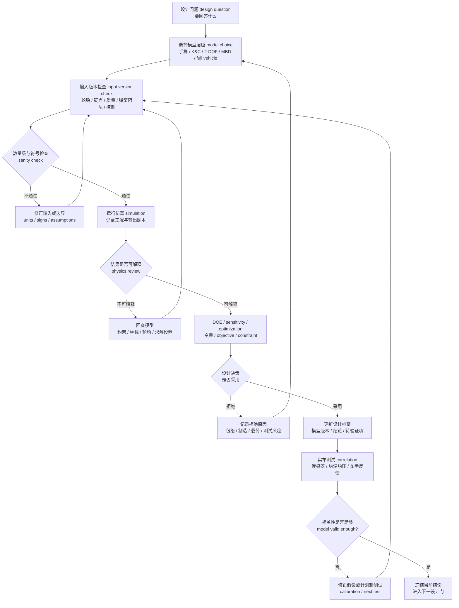

# 05 仿真、优化与相关性验证

## 本章解决的问题

仿真 simulation、优化 optimization 和相关性验证 correlation 的目的不是把模型做得越复杂越好，而是用合适的模型回答清楚的设计问题，并把结论转化为可检查的设计动作。快速预览层见 [06 仿真与优化](../06-simulation-and-optimization.md)。本章进一步说明：如何从手算、表格、K&C、二自由度 2-DOF 操稳模型、四分之一车 quarter-car、多体动力学 multibody dynamics、刚柔耦合 rigid-flex 到整车 full-vehicle 模型逐层升级；如何管理输入版本、目标函数、约束和灵敏度；以及如何用实车数据反过来修正模型。

本章回答以下问题：

- 当前设计问题应该用哪一层模型，而不是默认打开最复杂的软件。
- K&C、简化操稳、稳态 / 瞬态、G-G 图、DOE 和多体整车模型分别适合回答什么。
- 如何定义 objective function、constraint、design variable 和 sensitivity，避免优化器输出不可制造或不可解释的方案。
- 如何保证轮胎、硬点、弹簧阻尼、质量、质心、气动和控制输入在同一版本下使用。
- 如何把仿真结果与 [02 轮胎与整车输入](02-tire-and-vehicle-inputs.md)、[03 几何与硬点](03-geometry-and-hardpoints.md)、[04 弹簧、阻尼、侧倾与车身姿态](04-spring-damper-roll-and-ride.md)、[06 载荷与金属结构](06-loads-metal-structure.md) 和 [08 验证、测试与答辩](08-validation-testing-defense.md) 形成闭环。

本章保留通用模型框架、评审逻辑和安全边界。历史仿真结果表、具体车辆编号、源图、源表、原始测试数据、精确硬点、私有轮胎系数和可重建历史车辆的参数组合应放在项目记录中。

## 模型分层

模型分层的核心原则是：先用透明模型建立数量级和物理直觉，再用更高保真模型处理耦合问题，最后用实车数据做相关性验证。复杂模型不能替代简单检查，也不能替代测试；它只是让更多输入和耦合关系在同一个框架里被计算。

| 模型 | 回答的问题 | 输入 | 输出 | 不适合回答的问题 |
| --- | --- | --- | --- | --- |
| 手算与表格 hand calculation / spreadsheet | 载荷转移、偏频、侧倾刚度分配、初始目标是否在合理数量级 | 质量、质心、轴距、轮距、角重、轮端刚度、轮胎简化参数 | 一阶载荷、频率、刚度比例、敏感性趋势 | 非线性轮胎、瞬态驾驶输入、复杂包络和柔性结构 |
| K&C 几何模型 | 硬点变化如何影响 camber、toe、roll center、bump steer、Ackermann 和轮心路径 | 硬点、轮胎外形、转向系统、行程、约束和坐标系 | 轮端运动曲线、几何指标、包络风险 | 轮胎饱和、车手输入、气动耦合和真实柔度 |
| 二自由度 2-DOF 操稳模型 | 小侧偏线性区内的横摆 yaw 与侧向响应趋势 | 质量、质心到前后轴距离、横摆惯量、速度、前后侧偏刚度 | 稳态转向趋势、yaw-rate response、侧偏角趋势 | 极限工况、联合滑移、强非线性轮胎和大侧倾 |
| 四分之一车 / 半车模型 quarter-car / half-car | 垂向、俯仰、阻尼和轮胎动态载荷的基础趋势 | 簧上 / 簧下质量、轮端刚度、轮胎刚度、阻尼曲线、路面输入 | 车身加速度、悬架行程、轮胎动载、阻尼器速度 | 左右耦合、转向输入、整车操稳和轮胎横纵耦合 |
| 侧倾与简化整车模型 | 侧倾角、前后侧倾刚度分配、轴内载荷转移和稳态平衡 | 轮距、质心高度、roll center、弹簧 / 防倾杆、轮胎载荷敏感性 | 侧倾梯度、前后轮荷趋势、稳态平衡判断 | 瞬态横摆、复杂悬架几何和车手输入细节 |
| 多体动力学 multibody | 硬点、轮胎、弹簧阻尼、转向和质量属性耦合后的运动与力 | 硬点、质量惯量、轮胎模型、阻尼曲线、控制输入、工况 | 姿态、轮荷、轮胎力、关节力、K&C 与操稳输出 | 输入不可信时的定量结论、结构局部应力和制造公差 |
| 刚柔耦合 rigid-flex | 构件柔性对轮端姿态、载荷路径和关键节点力的影响 | 多体模型、柔性体、连接约束、材料和边界假设 | 载荷路径、柔性变形、接口力、结构校核输入 | 未验证材料 / 边界下的强度证明和疲劳寿命承诺 |
| 整车 / 圈速模型 full-vehicle / lap simulation | 轮胎、气动、动力、制动、控制和赛道策略的整体趋势 | 轮胎、质量、气动、动力、制动、控制、赛道和车手模型 | 圈速趋势、G-G 边界、能量 / 制动需求、参数排序 | 没有测试相关性时的绝对性能宣称 |
| 实车相关性验证 test correlation | 模型是否能解释真实车辆，哪些输入需要更新 | 传感器数据、胎温胎压、角重、车手反馈、测试工况记录 | correlation 报告、模型更新、下一轮测试计划 | 替代完整设计计算或掩盖测试条件变化 |

每一层模型都应写清模型边界 model boundary。边界至少包括：适用工况、坐标系、单位、输入来源、忽略的物理现象、输出可信度和需要测试验证的问题。若模型只用于趋势判断，应明确写成趋势判断；若输入来自估算，应把结果标为待验证。

## RCVD 风格的模型层级边界

RCVD 风格的方法常把车辆问题拆成稳态、前后轴、force-moment、g-g、瞬态和整车相关性等层级。它们的价值在于帮助团队知道“当前结论来自哪种模型边界”，而不是把某一张图或某一个求解器当成魔法证明。公开文档中应把模型用途、误用边界和验证需求写在一起。

| 模型层级 | 适合用途 | 必须避免的误用 |
| --- | --- | --- |
| 稳态简化模型 | 快速理解 understeer / oversteer 趋势、前后轴分配和参数敏感性 | 直接宣称瞬态操稳、赛道圈速或结构安全 |
| 前后轴 pair analysis | 比较前后轮胎工作点和载荷分配趋势 | 忽略轮胎数据范围、气动和实车柔度 |
| force-moment / g-g 分析 | 观察整车极限包络和横纵向耦合趋势 | 把图形边界当作没有测试支持的真实极限 |
| 多体动力学模型 | 检查 K&C、参数变化、整车响应和导力输入 | 忽略输入版本、约束假设和实车相关性 |
| 实车相关性模型 | 用测试数据修正模型可信度 | 用少量测试点证明全部工况正确 |

稳态 steady-state 和瞬态 transient 结论应在公开文档中分开标注。稳态分析可以支持趋势、平衡和参数敏感性的讨论；瞬态分析才讨论输入建立、延迟、过冲、阻尼和车手可感知响应。若一个结论来自稳态模型，就不要直接写成瞬态手感或赛道表现；若瞬态模型缺少轮胎松弛、阻尼器曲线、转向柔度或车手输入验证，也只能作为待相关性验证的趋势。

## 公开资料交叉验证后的仿真原则

多篇公开 FSAE / Formula Student 悬架论文和项目案例呈现出一致的流程：先做规则和目标分析，再讨论 tire behavior、CAD 包络、几何与部件方案，随后用 multibody dynamics 或同类模型检查 kinematics / dynamics，最后用测试或赛道数据做 correlation。这个公开脉络支持本手册的分层写法：仿真不是起点，也不是终点，而是把目标、轮胎、几何、簧上参数和结构载荷连接起来的证据工具。

交叉验证后，本仓库采用以下写作原则：

| 原则 | 文档写法 | 需要避免 |
| --- | --- | --- |
| 规则和目标先行 | 每个模型都写明服务哪个 design question，以及哪些规则、包络和接口是不可违反的 constraint | 先建整车模型，再倒推它能回答什么 |
| tire data 驱动几何和 set-up | 轮胎模型、外倾、胎压、侧倾刚度和制动/驱动边界必须在同一输入版本下评审 | 把 tire model 当黑箱，或者用静态轮荷替代动态轮荷 |
| CAD / MBD 互相校验 | CAD 负责装配、干涉和制造；MBD 负责轮端运动、关节力和组合工况趋势 | 只看 MBD 曲线，不检查车上能否装、能否测、能否维护 |
| fixed 与 adjustable 参数分开 | 质量、质心、硬点和车架接口等冻结参数，与胎压、camber、toe、防倾杆、阻尼等 set-up 参数分开管理 | 优化时把不可调参数当成赛场调校变量 |
| 简化假设显式记录 | 若模型把 chassis、suspension links 或 joints 视为刚体，应写清 compliance 被忽略或只做定性风险判断 | 把刚体模型输出当作柔度或结构安全证明 |
| correlation 是闭环证据 | 用相同测试场景对比方向盘角、加速度、轮速、制动压力、悬架位移、胎温胎压和车手反馈 | 用单次仿真或单次测试强行校准出“看起来正确”的模型 |

公开案例中的性能提升、相关性百分比或具体车辆参数不应被照搬成本仓库的通用结论。更有价值的是它们反复出现的工程结构：输入版本清楚、模型边界清楚、测试场景清楚、差异解释清楚。

公开 MBD 案例还提醒团队把“不可调输入”和“赛场 set-up”分开。质量、质心、悬架 attachment points、车架接口和部分几何约束通常应视为 fixed parameters；胎压、camber、toe、roll stiffness、brake balance、阻尼或防倾杆状态才可能进入 adjustable set-up。若优化器把固定参数当成赛场可调变量，输出可能很漂亮，但不会变成可执行调校。

另一个边界是模型保真度。学生方程和商业多体模型常会先把 chassis、suspension links 或 joints 当作 rigid bodies，以便建立可运行的整车模型；这适合早期 handling / set-up 趋势，却不能说明 compliance、局部应力、制造公差和连接柔度已经正确。公开论文中常见的后续工作都是把仿真结果带回实车测试做 validation，因此本手册把 correlation 放在仿真章节末尾，而不是作为可选附录。

## K&C 与几何模型

K&C 是仿真链条的几何入口。它把 [03 几何与硬点](03-geometry-and-hardpoints.md) 中的硬点、转向点、轮心、轮胎包络和行程约束转换为可评审的轮端运动曲线。早期项目通常先做刚体 kinematics；当有足够材料、连接和测量数据时，再考虑 compliance。

K&C 模型适合回答：

- wheel travel 中 camber、toe、track change、roll center migration 是否可解释。
- 转向扫描中 Ackermann、turning camber、scrub path 和极限转角是否满足目标。
- 侧倾、制动、加速和组合姿态下，硬点是否让轮胎保持在目标工作窗口。
- 包络、球铰摆角、杆件角度、转向拉杆和推杆 / 拉杆是否存在明显干涉风险。

K&C 模型不适合单独回答轮胎是否已经达到极限、车辆是否最快、结构风险是否可接受或车手是否会喜欢某个瞬态手感。它给出的是几何导致的轮端姿态和路径，必须与轮胎模型、弹簧阻尼、整车操稳和实车数据一起评审。

K&C 输出进入优化前应先做 sanity check：

- 左右镜像是否符合坐标系定义，尤其是 camber、toe、steering angle 和侧向力方向。
- 曲线横轴是否明确，例如 bump / rebound、roll angle、steering input 或 vertical force。
- 单位是否一致，硬点、轮胎半径、车高、行程和 CAD 包络是否来自同一版本。
- 曲线突变是否来自真实几何限位，还是约束、关节自由度、装配顺序或符号错误。
- 几何指标是否有轮胎与整车目标支撑，而不是为了让曲线看起来平滑。

## 操纵稳定性简化模型

二自由度 2-DOF bicycle model 是操纵稳定性 handling 中最常用的入门模型之一。它通常把整车简化为横向速度 / 质心侧偏和横摆角速度 yaw rate 两个主要状态，用前后轮的线性侧偏刚度描述小侧偏角范围内的轮胎力。它适合建立不足转向 / 过度转向趋势、稳态 yaw-rate gain 和瞬态响应的第一层直觉。

概念上，线性轮胎可写成：

```text
F_y ≈ C_alpha · alpha
```

其中 `F_y` 为轮胎侧向力，单位 N；`C_alpha` 为侧偏刚度 cornering stiffness，单位 N/rad 或 N/deg；`alpha` 为侧偏角 slip angle，单位必须与 `C_alpha` 对应。该关系只适合小侧偏角线性区，不能用于峰值、过峰、联合滑移或大外倾工况。

2-DOF 模型通常需要以下输入：

| 输入 | 含义 | 来源 |
| --- | --- | --- |
| `m` | 整车质量，单位 kg | 角重或质量预算 |
| `I_z` | 绕竖直轴横摆惯量 yaw moment of inertia，单位 kg·m^2 | CAD 估算、摆振试验或质量模型 |
| `a`, `b` | 质心到前 / 后轴距离，单位 m 或 mm | 整车布置和质心测量 |
| `U` | 车速，单位 m/s | 工况定义 |
| `C_f`, `C_r` | 前 / 后轴等效侧偏刚度，单位 N/rad 或 N/deg | 轮胎模型与静态 / 动态轮荷估算 |
| `delta` | 前轮或方向盘等效转角，单位 rad 或 deg | 转向系统和输入定义 |

简化模型的输出包括 yaw-rate response、质心侧偏趋势、稳态转向增益、响应时间常数和前后轴力利用趋势。它可以解释“改变前后侧偏刚度或质心位置，车辆稳态转向趋势如何变化”，但不能替代非线性轮胎模型和实车测试。若车已经接近极限、轮胎有明显载荷敏感性、存在联合制动 / 驱动，或气动载荷强烈变化，2-DOF 结论只能作为低保真趋势。

在概念层面，横摆力矩 yaw moment 由前后轴侧向力及其力臂决定。若前轴侧向力变化、后轴侧向力变化或质心位置变化，横摆力矩导数 yaw moment derivatives 会改变车辆响应。文档中可记录 `dN/dalpha`、`dN/dr` 或类似导数的含义，但必须说明它们来自线性化假设，不是极限工况的真实非线性行为。

## 稳态与瞬态检查

稳态 steady-state 检查关注输入和车辆状态趋于稳定后的关系，例如固定半径转弯、固定方向盘角阶梯后的稳定 yaw rate、稳态侧倾角和稳态轮荷分配。瞬态 transient 检查关注从一个状态进入另一个状态的过程，例如转角阶跃、转角扫频、制动释放入弯、油门阶跃出弯和蛇形输入。

稳态检查适合回答：

- 随车速或侧向加速度变化，车辆是更趋向不足转向、接近中性还是趋向过度转向。
- 前后轮胎侧向力、垂向载荷和侧倾刚度分配是否在合理范围内。
- 方向盘角、转弯半径、yaw-rate gain 和侧倾角之间是否符合物理直觉。

瞬态检查适合回答：

- yaw-rate response 是否过慢、过冲或衰减不足。
- 转向输入后前后轴力建立是否顺序合理，车手是否会感到响应滞后或突然。
- 阻尼、roll stiffness、转向传动比和轮胎松弛长度 relaxation length 等因素是否影响响应。

边界要写清楚：稳态模型不说明驾驶员如何把车带到该状态；瞬态模型若没有真实阻尼器曲线、轮胎松弛特性、转向系统柔性和车手输入模型，也不能作为绝对手感结论。稳态与瞬态都应回到测试数据，例如方向盘角、横摆角速度、侧向加速度、悬架位移、轮速、制动压力和胎温胎压。

## G-G 图与极限估计

G-G 图用于把车辆纵向加速度和侧向加速度放在同一平面上，观察加速、制动、转弯和联合工况的极限边界。它可以来自仿真、实车数据或二者对比。对 FSAE / Formula Student 悬架设计而言，G-G 图的价值不只是“边界越大越好”，而是帮助团队看见轮胎、载荷转移、制动、驱动和气动在联合工况下的可用空间。

G-G 图适合回答：

- 车辆在纯加速、纯制动、纯侧向和联合工况下的能力边界是否连续。
- 制动入弯和出弯牵引时，纵向力需求是否挤占侧向力余量。
- 轮胎模型、制动平衡、驱动限制和气动假设改变后，边界形状如何变化。
- 实车数据是否接近仿真边界，或是否被车手输入、轮胎温度、路面、控制策略限制。

G-G 图不适合单独证明某个硬点或弹簧参数正确。它是整车行为的结果图，需要追溯到轮胎模型、动态轮荷、控制、赛道和测试条件。若测试数据没有达到仿真边界，可能是模型过于乐观，也可能是测试场地、胎温、车手、制动释放、动力限制或安全边界导致。

极限估计可以从摩擦圆 / 摩擦椭圆 friction circle / friction ellipse 开始，但必须说明这是简化框架。真实轮胎的 `F_x`、`F_y`、`F_z`、camber、slip angle、slip ratio、温度和胎压存在耦合。若联合滑移数据不足，应把 G-G 图标为趋势图或待验证估计，不能把边界当作精确性能承诺。

## 数值优化与灵敏度分析

优化 optimization 是把设计问题转化为变量、目标函数和约束的过程。优化器不会自动理解工程意义；如果目标函数 objective function 或约束 constraint 写错，它会认真地找到一个错误答案。因此，优化前必须先写清楚“为什么优化、改哪些变量、什么不能破坏、如何判断结果可用”。

建议把优化问题记录为：

| 项目 | 说明 |
| --- | --- |
| design variable | 可改变的变量，例如硬点位置、弹簧刚度、防倾杆刚度、阻尼参数、静态 toe / camber、运动比或控制参数 |
| objective function | 要最小化或最大化的目标，例如目标曲线误差、轮胎动载、侧倾角、yaw-rate tracking error、圈速趋势或结构载荷指标 |
| constraint | 不允许违反的边界，例如包络、关节角、轮胎工作范围、调校范围、制造空间、结构载荷、规则和安全限制 |
| weight | 多目标优化中的权重，必须能解释工程优先级 |
| DOE | design of experiments，用于按计划采样变量空间，观察主效应与交互效应 |
| sensitivity | 灵敏度，描述输入小变化对输出的影响，用于识别关键参数和鲁棒性风险 |
| stop criterion | 停止条件，例如收敛、预算用完、改进不再显著或进入不可制造边界 |

DOE 适合在优化前回答“哪些变量值得优化”。例如先对前后侧倾刚度分配、轮端刚度、阻尼、静态 toe、camber 和关键硬点做参数扫掠，观察输出对各变量的 sensitivity。若某个变量的结果很敏感，而该变量又难以制造或测量，就应提高公差、传感器和实车验证优先级。若某个变量在模型中很敏感但实车难以复现，也要警惕模型把未验证假设放大了。

优化边界语言要保守：

- 优化结果是候选方案，不是最终答案。
- 目标函数越低不代表车辆一定更快或更好开。
- 多目标权重改变可能改变排名，应记录被放弃方案和原因。
- 若优化变量越过数据覆盖范围，结果只作为风险提示。
- 若一个方案破坏包络、载荷路径、制造、维护或测试可重复性，应拒绝，即使仿真指标更好。

## 多体动力学与整车模型

多体动力学模型把硬点、质量、惯量、轮胎、弹簧阻尼、转向、制动、动力和控制输入放进同一个运动学 / 动力学系统。它适合处理 K&C、轮荷、轮胎力、关节力、姿态、横摆和组合工况之间的耦合，也是 [06 载荷与金属结构](06-loads-metal-structure.md) 中提取载荷的重要来源之一。

多体模型适合回答：

- 组合工况下轮胎力、轮荷、悬架行程和关节力如何变化。
- 修改硬点、弹簧、防倾杆、阻尼或轮胎模型后，整车趋势如何变化。
- 结构校核需要的接口力是否来自合理的工况和边界。
- 车手输入、控制策略、制动 / 驱动和气动假设是否与底盘参数耦合。

多体模型不适合在输入未验证时发布绝对性能结论。它对轮胎模型、质量惯量、阻尼曲线、连接约束、坐标系、单位和控制输入非常敏感。模型动画看起来正常不代表力和力矩正确；曲线平滑不代表边界真实。

刚柔耦合 rigid-flex 模型可以把 A 臂、upright、摇臂、车架局部结构或复合材料部件的柔性引入系统，用于观察柔性对轮端姿态和载荷路径的影响。但若材料参数、连接边界、网格、接触或制造假设没有验证，刚柔耦合结果只能作为结构风险筛查和载荷提取线索，不能替代独立 FEA、台架和实车验证。

整车 / 圈速模型应使用更严格的边界声明。圈速趋势可能受轮胎、气动、动力、制动、控制、车手模型、赛道摩擦、线路和安全边界共同影响。它适合做方案排序和 sensitivity，不适合在没有 correlation 时声称真实圈速。

## 模型版本与输入一致性

仿真结果的可信度首先取决于输入版本是否一致。常见问题不是模型方程太简单，而是轮胎来自一个版本、硬点来自另一个版本、弹簧阻尼来自临时试算、质量和质心没有更新，最后把混合输入得到的曲线当作设计结论。

每个模型包至少应记录：

| 输入版本项 | 记录内容 |
| --- | --- |
| tire model | 模型类型、坐标系、单位、数据覆盖、适用边界和文件版本 |
| hardpoints | 坐标系、单位、左右镜像、CAD 来源、包络状态和冻结状态 |
| mass properties | 质量、质心、惯量、角重、是否含车手 / 电池 / 油液状态 |
| spring-damper | 弹簧、防倾杆、运动比、阻尼曲线、限位和调校状态 |
| aero | 气动载荷、平衡、车高敏感性和是否经过验证 |
| brake / powertrain / control | 制动分配、驱动限制、控制策略和输入命令定义 |
| road / event | 路面、赛道、速度、驾驶输入、工况和测试条件 |
| solver / software | 软件版本、求解设置、时间步、接触和约束设置 |
| output script | 后处理脚本、滤波、坐标转换和图表生成版本 |

输入一致性检查应在仿真前进行，而不是结果异常后再追查。最低做法是给每次仿真一个 run note，写明设计问题、输入版本、模型边界、工况、输出、结论和下一步动作。学习手册给出字段模板，项目记录保存具体值。

## 实车相关性验证

相关性验证 correlation 是把模型带回真实车辆的过程。它不是为了让模型“看起来对”，而是为了判断模型在哪些工况可信、哪些输入需要更新、哪些现象模型没有覆盖。相关性验证通常从简单、可重复、安全的测试开始，再逐步进入更复杂工况。

常见相关性对象包括：

- 静态角重、车高、悬架静态压缩量和 toe / camber 测量，用于验证质量、车高、硬点和弹簧预载。
- 低速转向与 K&C 测量，用于检查转向角、Ackermann、bump steer 和左右镜像。
- 路面输入、阶跃转向、稳态圆和蛇形输入，用于检查 yaw-rate response、侧向加速度、侧倾角和悬架位移。
- 制动与加速工况，用于检查纵向载荷转移、俯仰、轮速、制动压力、驱动限制和轮胎纵滑。
- 胎温、胎压和轮胎磨耗，用于判断轮胎模型、外倾、toe、载荷分配和车手输入是否一致。

相关性验证的边界也要写清楚。一次测试只代表当时的路面、胎温、胎压、车手、车辆状态和传感器质量。不要用单次数据过度校准模型；更好的做法是保留原始假设、记录修正原因、用下一次测试复核。若仿真与测试不一致，应先检查传感器标定、坐标系、滤波、测试条件和输入版本，再讨论模型本身是否需要改变。

## 仿真闭环流程图



该流程强调闭环而不是一次性出图。任何一次仿真都应能追溯到设计问题、输入版本、模型边界、结果解释、设计动作和测试验证。

## 软件实现路径

仿真和优化阶段的软件选择应由问题层级决定。低阶模型负责数量级和趋势，多体模型负责几何和组合工况，优化工具负责设计变量排序，整车研究工具负责更大系统问题；所有模型都要回到相关性验证。

| 技术问题 | 推荐工具 | 输入 | 输出 | 传给下一步 | 验证方式 |
| --- | --- | --- | --- | --- | --- |
| 数量级和趋势初筛 | 表格、MATLAB / Python | 质量、质心、轮胎、弹簧阻尼、几何和工况假设 | 2-DOF、quarter-car、pitch / roll 模型、敏感性图 | 参数选择、Adams 工况、测试计划 | 手算、单位检查、符号和极限情况复核 |
| K&C 和准静态整车 | Adams Car | 硬点、轮胎模型、簧上参数、模板和工况 | K&C 曲线、运动比、侧倾刚度趋势、准静态整车趋势 | 硬点优化、簧上系统、载荷模型 | 动画、曲线趋势、左右镜像和实车静态测量 |
| DOE 与优化 | Adams Insight、MATLAB / Python | 参数化变量、变量范围、目标函数、约束、已核对模型 | DOE 记录、灵敏度排序、响应面、拒绝方案理由 | 设计取舍、几何和参数更新 | 检查变量是否超出包络、制造、数据和规则边界 |
| 通用多体与刚柔耦合 | Adams View、Abaqus 柔性体 | 连接定义、柔性体、轮胎力、工况和测量点 | 特殊机构响应、连接点载荷、柔性影响趋势 | 结构校核、复材校核、载荷工况 | 自由体图、力平衡、刚柔简化边界和 FEA 对照 |
| 整车研究与控制 | CarSim、Simulink、Adams full vehicle、MATLAB / Python | 轮胎模型、整车参数、动力 / 制动 / 控制、赛道或驾驶员假设 | 整车趋势、控制策略、研究性对比、答辩增强材料 | 下一代方案、测试问题、公开教学案例 | 与低阶模型和实车数据比较，不把未相关模型当设计证明 |
| 相关性验证 | Race Studio / AIM、MATLAB / Python、Git / Markdown | 传感器数据、测试日志、车辆版本、仿真版本 | correlation report、模型修正、复测计划 | 轮胎模型、参数表、载荷工况、答辩证据 | 趋势、相位、符号、数量级和可重复测试共同判断 |

## 输出物

合适的仿真建议形成以下输出物：

| 输出物 | 最低内容 |
| --- | --- |
| 模型清单 | 模型用途、模型层级、负责人、软件 / 脚本、版本和适用边界 |
| 输入版本表 | 轮胎、硬点、质量、质心、惯量、弹簧阻尼、气动、制动、动力和控制版本 |
| 工况定义 | 输入命令、速度、路面、边界条件、坐标系、单位和停止条件 |
| sanity check 记录 | 数量级、符号、左右镜像、单位、动画和简化模型对照 |
| DOE / sensitivity 记录 | 变量、范围、采样方法、输出指标、主效应和交互风险 |
| 优化记录 | objective function、constraint、weight、算法、停止条件、候选方案和拒绝理由 |
| 设计结论 | 采用方案、适用范围、限制、影响章节和下一步验证 |
| correlation 报告 | 测试条件、传感器、滤波、仿真对比、差异解释和模型更新 |

输出物要能被后续结构校核、制造、测试和答辩复用。只保存最终图片而不保存输入、脚本和版本，会让仿真失去工程价值。

## 常见错误

- 先建复杂模型，再倒推它能回答什么问题。
- 没有做手算或表格数量级检查，直接相信多体或整车输出。
- 轮胎、硬点、弹簧阻尼、质量和气动输入来自不同版本。
- 只看最终曲线，不看坐标系、单位、正负号、工况和后处理脚本。
- 把线性 2-DOF 结果用于极限、联合滑移或大侧倾工况。
- 把 K&C 曲线当成整车性能结论，忽略轮胎和实车测试。
- 优化目标没有工程意义，得到无法制造、无法装配或无法解释的方案。
- DOE 变量范围越过模型数据覆盖，却没有标注外推风险。
- 多个输入同时改变，却把结果归因于其中一个参数。
- 只校准模型让它贴合一次测试，忽略胎温、胎压、车手和路面变化。
- 用操稳模型输出直接证明结构安全，忽略冲击、疲劳和边界条件。

## 验证与评审

仿真评审应按证据链进行，而不是按图表数量进行。最低评审问题如下：

| 评审项 | 需要回答的问题 |
| --- | --- |
| 设计问题 | 这次仿真要支持哪个设计决策，是否有明确输出物 |
| 模型选择 | 当前模型层级是否足够，是否有更简单模型可先检查 |
| 输入版本 | 轮胎、硬点、质量、弹簧阻尼和控制是否来自同一冻结状态 |
| 模型边界 | 哪些物理现象被忽略，结果适用于哪些工况 |
| sanity check | 数量级、单位、符号、左右镜像、动画和自由体图是否合理 |
| sensitivity | 关键结论是否对某些输入过度敏感，敏感输入能否测量或控制 |
| 工程可行性 | 候选方案是否满足包络、制造、调校、载荷路径和维护要求 |
| 相关性验证 | 是否有测试计划或测试数据支持模型，差异如何处理 |
| 文档追溯 | 结果是否能追溯到输入、脚本、工况、图表和结论版本 |

评审结论应分成三类：可以采用、需要补充验证、拒绝并记录原因。对安全关键、结构关键或测试风险较高的结论，应使用保守语言，并把验证要求传递给结构、制造和测试章节。

## 与其它章节的关系

- 快速预览层 [06 仿真与优化](../06-simulation-and-optimization.md) 给出本章的入门摘要和最小输出要求。
- [02 轮胎与整车输入](02-tire-and-vehicle-inputs.md) 提供轮胎模型、坐标系、载荷敏感性、整车质量和质心等输入边界。
- [03 几何与硬点](03-geometry-and-hardpoints.md) 提供 K&C 模型、硬点版本、包络和几何优化目标。
- [04 弹簧、阻尼、侧倾与车身姿态](04-spring-damper-roll-and-ride.md) 提供轮端刚度、阻尼、运动比、侧倾刚度和俯仰模型输入。
- [06 载荷与金属结构](06-loads-metal-structure.md) 使用多体动力学和工况定义输出结构校核所需载荷，但仍需要独立边界和安全评审。
- [08 验证、测试与答辩](08-validation-testing-defense.md) 负责把仿真结论带到实车测试、数据相关性和比赛答辩中，反过来更新本章模型。
