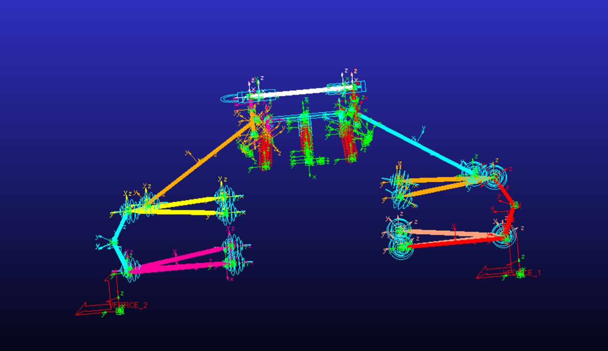
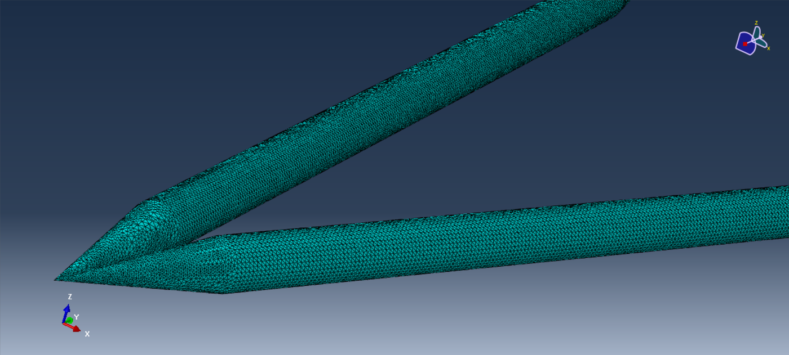
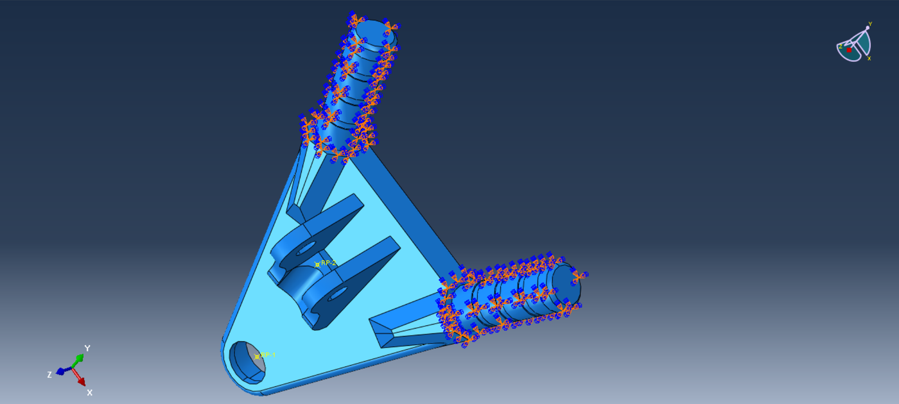
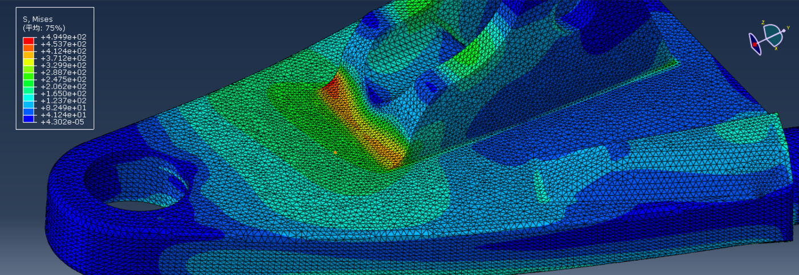
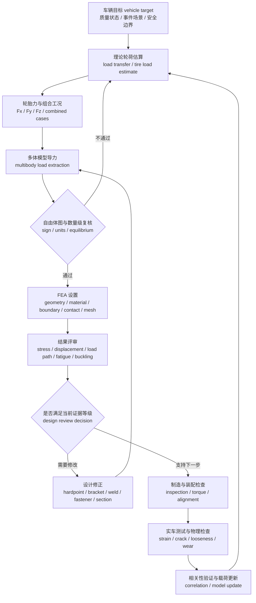

# 06 载荷与金属结构校核

## 本章解决的问题

悬架金属件校核要回答的不是“云图有没有变红”，而是：

- 在哪些车辆工况下，轮胎、制动、转向、弹簧阻尼、防倾杆和气动把力传进悬架。
- 这些力如何经过 upright、A 臂、推杆 / 拉杆、摇臂、转向拉杆、支座和车架节点形成载荷路径 load path。
- 哪些载荷可以用自由体图和理论估算建立数量级，哪些必须通过多体动力学 multibody dynamics 或刚柔耦合 rigid-flex 模型提取。
- FEA 的边界条件是否接近真实 joint、bracket、weld、fastener、bearing 和 contact region，而不是为了求解方便而过度固定。
- 结果如何结合应力、位移、稳定性、疲劳、制造和实车检查做保守判断。

快速预览层见 [07 载荷与结构校核](../07-loads-and-structure-check.md)。本章给出流程、公式框架、字段模板和评审逻辑；历史载荷数据表、应力结果、源图、源表、车号和具体车辆组合数据应放在项目记录中。所有结论都应写成“在当前假设下支持下一步设计 / 制造 / 测试评审”，不能把 FEA 单独当作安全认证。

## 公开来源如何进入本章

公开资料对载荷和金属结构最有价值的部分，是方法边界而不是载荷数值。FS Wiki 的 suspension forces 适合解释自由体图、杆件方向向量和矩阵平衡；Virginia Tech 关于用有限元预测悬架杆件载荷的研究，适合提醒 pinned members、two-force / truss 假设、steering 输入和 articulation 会改变载荷预测；Link Forces on a Formula Student Suspension System 这类论文适合展示 ADAMS、MATLAB、应变测量和计划验证怎样组成闭环；Dewesoft、HBK、Mantracourt、Micro-Measurements 等供应商案例适合说明可测通道、标定和信号质量；Monash / SAE 类公开结构设计案例适合借鉴报告组织和 design-to-test 逻辑。

这些来源不提供本仓库可直接引用的载荷表、安全系数、材料许用或结构放行标准。正文只吸收它们共同指向的审查习惯：先声明假设，再导出力，再把力转换成真实边界，最后用制造检查和实车测量修正模型。

## 载荷从哪里来

悬架结构载荷通常不是单一来源，而是多个模型层级逐步收敛的结果。早期设计先用手算和表格估算轮荷、轮胎力、制动扭矩和杆件力数量级；硬点、弹簧阻尼和轮胎模型冻结度提高后，再用多体模型提取关节力；需要评估结构柔度对力路径的影响时，再引入刚柔耦合。

常见载荷来源如下：

| 来源 | 适用阶段 | 主要输出 | 主要风险 |
| --- | --- | --- | --- |
| 规则和设计目标 | 概念设计、评审边界 | 需要覆盖的工况类型、最低验证要求、禁止区域 | 把规则最低要求误解为实际使用上限 |
| 质量预算与角重 | 早期估算、模型输入 | 静态轮荷、轴荷、质心和惯量估计 | 车手、油液、电池、气瓶或附件状态不一致 |
| 理论载荷估算 | 初版结构尺寸、工况筛选 | 纵向 / 横向载荷转移、轮胎力数量级 | 忽略非线性轮胎、气动姿态和联合滑移 |
| 轮胎模型 tire model | 操稳与结构输入 | `F_x`、`F_y`、`F_z`、回正力矩和联合滑移趋势 | 数据覆盖不足、坐标系或符号转换错误 |
| 多体动力学 multibody dynamics | 详细设计、结构输入 | 关节力、杆件轴力、推杆力、支座反力 | 约束定义、质量属性、输入工况和轮胎模型不可信 |
| 刚柔耦合 rigid-flex | 载荷路径和柔度敏感性 | 柔性体接口力、局部变形、关节力变化 | 柔性体边界未验证时输出只能作为风险线索 |
| 实车测试和检查 | 相关性验证、迭代 | 传感器载荷、裂纹、松动、磨损、永久变形 | 测试条件不可重复或没有足够传感器证据 |

每个载荷条目都应记录坐标系、单位、正方向、作用点、载荷来源、版本和适用边界。若载荷来自不同工具，必须说明如何把车辆坐标、轮胎坐标、局部零件坐标和 FEA 坐标转换到同一约定。

## 从轮载到结构载荷的边界

轮载分析 wheel load analysis 和载荷转移 load transfer 主要回答“车辆状态如何改变轮胎接地点的力”。结构校核还要继续回答“这些力如何通过轮胎、轮毂、upright、连杆、支座、连接件和车架节点进入具体零件”。两者之间不能省略边界条件 boundary condition、载荷路径 load path 和验证证据的转换。

| 输入层 | 能支持的判断 | 不能单独支持的判断 |
|---|---|---|
| 理论载荷转移 | 估算前后 / 左右轮载变化和结构初筛工况 | 证明具体零件在所有赛道工况安全 |
| RCVD-style wheel load 分析 | 校准制动、转向、侧向加速度和质量转移的关系 | 替代多体导力、柔度影响和测试数据 |
| 多体模型导力 | 给 FEA 提供更接近机构约束的节点力和工况组合 | 自动证明边界条件、接触、网格和材料模型正确 |
| 实车测量 / 相关性 | 检查模型趋势和载荷量级是否可信 | 覆盖未测试事件、冲击和制造缺陷 |

制动 braking 和驱动 driving 载荷进入结构校核前，至少要补齐以下审查：

- 符号约定 sign convention：制动、驱动、轮胎坐标、车辆坐标和零件局部坐标的正方向必须一致；左右件镜像时要单独检查。
- 轮胎力方向 tire force direction：`F_x`、`F_y`、`F_z`、制动扭矩和回正力矩要说明作用点、方向和是否包含联合滑移。
- 接地点假设 contact patch assumption：轮胎力从接地点传到轮心、轴承、upright 和连杆时，轮胎半径、scrub radius、mechanical trail 和制动卡钳反力不能被默认忽略。
- 结构载荷路径 load path review：每个轮端力都要追踪到 bearing、rod end、fastener、weld、bracket 和 chassis node，确认 FEA 的节点力、约束和接触代表真实传力方式。

## 图示：从导力到金属件 FEA

下面几张图用来补足“多体导力 - 网格 - 边界条件 - 结果解释”的视觉链条。它们只说明评审方法；颜色、形状和局部热点不代表可复用的设计答案，任何真实项目仍需回到自己的载荷、材料、边界和验证数据。



多体模型视图适合用来检查力从轮端、upright、A 臂、推杆 / 拉杆和车架支座进入结构的路径。这里用它说明载荷路径和接口力概念；真实工况数值、模型文件名和历史车辆参数应放在项目记录中。



网格细节图应帮助读者关注孔边、焊趾、厚度变化和载荷引入区域是否有足够网格质量，而不是只看求解是否成功。对管件、耳片和支座这类结构，网格与边界条件通常比单个最大应力值更值得先审。



支座边界图用于提醒读者：真实连接往往通过 bearing、rod end、fastener、垫片、接触面或焊接节点传力。若模型使用远程点、分布耦合或局部约束，应说明它们代表的真实连接行为和可能带来的误差。



应力云图适合用来定位热点和解释载荷路径，但不能单独作为安全结论。读图时应同时检查热点是否随网格收敛、是否位于真实应力集中区域、是否由过硬约束或单点加载制造，以及位移和制造可行性是否仍可接受。

## 理论载荷估算

理论估算的价值在于建立数量级和物理直觉。它不需要一开始就精确，但必须让团队知道某个杆件为什么受拉、某个支座为什么受弯、某个孔边为什么可能是风险点。

纵向载荷转移 load transfer 可用概念式表示：

```text
Delta_Fz_long = m · a_x · h_CG / L
```

其中 `Delta_Fz_long` 为前后轴之间的垂向载荷转移，单位 N；`m` 为整车质量，单位 kg；`a_x` 为纵向加速度，单位 m/s^2，制动和加速的正负号必须按项目约定定义；`h_CG` 为质心高度，单位 m；`L` 为轴距，单位 m。该式只表达惯性载荷转移的主要趋势，实际前后轮荷还受气动载荷、制动分配、弹簧阻尼、轮胎半径、俯仰姿态和路面输入影响。

侧向载荷转移 load transfer 可用概念式表示：

```text
Delta_Fz_lat,axle = m_axle · a_y · h_eff / t_axle
```

其中 `Delta_Fz_lat,axle` 为某一轴内左右轮之间的垂向载荷转移，单位 N；`m_axle` 为该轴等效质量分配，单位 kg；`a_y` 为侧向加速度，单位 m/s^2；`h_eff` 为从侧倾中心、弹性侧倾和质心高度综合得到的有效力臂，单位 m；`t_axle` 为该轴轮距，单位 m。更完整的模型还要考虑前后侧倾刚度分配、roll center height、防倾杆、弹簧、轮胎垂向刚度和阻尼造成的瞬态轴内载荷转移。

气动载荷 aero load 在早期可按轴向分配写成假设输入，例如 `F_z,aero_front(v)` 和 `F_z,aero_rear(v)`。文档应说明函数关系、来源和验证状态；私有气动图谱由团队自行管理。若没有可靠气动模型，应把气动作为保守假设或敏感性参数，并标注是否考虑俯仰、侧倾、车高和偏航角影响。

理论估算的最低检查包括：

- 静态轮荷加动态载荷转移后，四轮 `F_z` 的总和是否与整车垂向平衡一致。
- 制动和驱动工况下，`F_x` 的总和是否与整车纵向加速度和制动 / 驱动限制一致。
- 转弯工况下，`F_y` 的总和是否与整车侧向加速度一致。
- 力矩平衡是否能解释前后轴、左右轮和车架支座的反力方向。
- 估算结果是否只用于工况筛选，还是已经进入零件释放；后者必须有更高证据等级。

## 载荷转移与轮胎力

轮胎力是结构载荷的入口。悬架金属件看到的不是抽象的侧向加速度，而是轮胎接地点 contact patch 处的 `F_x`、`F_y`、`F_z`，以及由轮胎半径、主销几何、scrub radius、mechanical trail 和制动扭矩产生的力矩。

轮胎力估算应区分：

| 力或力矩 | 含义 | 结构校核关注点 |
| --- | --- | --- |
| `F_z` | 垂向轮荷，单位 N | 决定 upright、轴承、A 臂、推杆 / 拉杆和车架支座的主要压缩路径 |
| `F_x` | 纵向轮胎力，单位 N | 制动、驱动、路面冲击和 anti-dive / anti-squat 几何导致的杆件轴力 |
| `F_y` | 侧向轮胎力，单位 N | 转弯、侧滑、路肩侧向冲击和轴内载荷转移导致的 lateral load path |
| `M_z` | 回正力矩或轮胎绕竖直轴力矩，单位 N·m | 转向臂、转向拉杆、steering rack 和 upright 局部弯扭 |
| 制动扭矩 brake torque | 制动卡钳和制动盘之间的力矩，单位 N·m | 卡钳支座、upright、轮毂和紧固件载荷 |

轮胎具有载荷敏感性和联合滑移特性。`F_z` 增加不代表可用 `F_y` 或 `F_x` 按相同比例增加；制动或驱动也会占用侧向力余量。因此结构校核不能只用纯转弯、纯制动、纯加速三个孤立工况，还应考虑制动入弯、出弯加速、路肩冲击和转向带制动等组合状态。

若轮胎数据不足，文档应写明“轮胎力为保守估算 / 趋势估计 / 待测试相关性验证”。不要用单个摩擦系数替代完整说明；至少要记录假设的路面、胎温胎压、载荷范围、滑移状态和是否包含联合滑移。

## 组合工况

组合工况 combined cases 用来覆盖真实驾驶中同时出现的载荷，而不是把所有极端值机械叠加。设计时应先定义事件场景，再判断哪些力可能同时达到高水平，哪些峰值不会物理共存。

载荷工况模板如下：

| 工况 | 目的 | 输入 | 载荷来源 | 坐标系 | 输出 | 复核方法 |
| --- | --- | --- | --- | --- | --- | --- |
| 纯制动 | 检查纵向力、制动扭矩、前轴载荷增加和 anti-dive 载荷路径 | 质量状态、制动分配、轮胎纵向能力、质心和轴距 | 理论估算、多体模型、测试制动压力 | 车辆坐标、轮胎坐标、upright 局部坐标 | 轮胎 `F_x/F_z`、卡钳支座力、A 臂和转向拉杆力 | 自由体图、制动距离数据、左右力平衡 |
| 稳态转弯 | 检查侧向载荷转移、外侧轮载荷、侧向杆件力和支座剪切 | 侧向加速度目标、轮距、侧倾刚度分配、轮胎模型 | 理论估算、多体模型、K&C 姿态 | 车辆坐标、轮胎坐标 | 四轮 `F_y/F_z`、杆件轴力、支座反力 | 横摆 / 侧向加速度数据、轮荷趋势 |
| 制动入弯 | 检查 `F_x` 与 `F_y` 联合、前轴轮荷增加、转向臂和 upright 弯扭 | 制动输入、转角、车速、轮胎联合滑移边界 | 多体模型、轮胎模型、测试数据 | 车辆坐标、轮胎坐标、转向系统坐标 | 关节力、制动支座力、转向拉杆力 | G-G 图、制动压力和方向盘角同步 |
| 出弯加速 | 检查驱动轮纵向力、后悬 anti-squat 路径、半轴和后 upright | 油门 / 扭矩限制、差速器或控制策略、后轮轮荷 | 多体模型、动力系统输入、轮胎模型 | 车辆坐标、轮胎坐标、传动局部坐标 | 后悬连杆力、推杆 / 拉杆力、车架支座反力 | 轮速、纵向加速度、悬架位移 |
| 路面冲击 | 检查垂向冲击、限位、轮胎包络和局部屈曲风险 | 路面输入、轮胎垂向刚度、悬架行程、阻尼 | 简化冲击模型、多体模型、测试观察 | 车辆坐标、轮心局部坐标 | `F_z` 峰值、推杆力、摇臂和支座力 | 高速视频、位移传感器、出车后检查 |
| 装配 / 顶车 / 运输 | 检查非赛道载荷、误操作和维护状态 | 顶车点、绑带位置、维修姿态、装配预紧 | 自由体图、维护流程 | 车架和零件局部坐标 | 支架反力、局部弯曲、紧固件载荷 | 维护演练、首件检查、目视检查 |

这张表是字段模板，不是载荷答案。项目记录可以填数值；学习手册保留方法、来源和复核逻辑。

## FBD、矩阵法和二力杆假设

自由体图 free body diagram 和矩阵法 matrix method 适合建立数量级和符号检查。典型做法是把 upright 或悬架 corner 当作自由体，把轮胎接地点力、制动扭矩、转向输入和每根 link 的方向向量放进平衡方程，求解未知杆件力。这个方法的价值是透明：每个力从哪里来、沿哪个方向、绕哪个点取矩，都能被工程师复核。

但矩阵法通常依赖简化假设。公开来源反复提醒：这些假设一旦不成立，杆件力就只能作为初筛，不能直接作为释放载荷。

| 假设 | 何时近似可用 | 失效或降级场景 | 需要补的证据 |
| --- | --- | --- | --- |
| pinned joints | ball joint / rod end 主要传递力，弯矩很小 | 接头有偏心、安装角不足、锁紧螺母或垫片引入弯矩 | 端部摆角、偏心距、装配公差和局部 FEA |
| two-force member | 细长 link 两端受力且主要沿轴线拉压 | A 臂焊接结构、弯管、偏心接头、pushrod 端部偏载 | bending check、buckling check、应变片或局部模型 |
| truss-like suspension | 多根杆件构成清晰轴向传力路径 | steering tie rod、anti-roll bar、damper / spring、bearing 摩擦和 chassis 柔度参与传力 | MBD 导力、左右镜像复核和反力平衡 |
| no steering input | 直行或小转角工况，转向几何对力分配影响较小 | 大转角、制动入弯、回正力矩、转向拉杆载荷或 rack 反力显著 | steering angle sweep、tie rod load 和 upright moment |
| limited articulation | 姿态变化小，杆件方向近似固定 | bump / rebound、roll、pitch、路肩冲击和极限转角改变方向向量 | 姿态相关 hardpoint / unit-vector 更新 |
| static equilibrium | 准稳态载荷主导，惯性耦合较弱 | 瞬态冲击、轮胎 hop、kerb strike、快速转向和制动释放 | MBD transient、数据通道和 post-run inspection |

矩阵法输出前应附带三类信息：输入载荷和坐标系、每根杆件方向向量或力臂、被忽略的弯矩 / 柔度 / 接触 / 动态效应。若一个 load case 包含 steering、articulation 或 combined braking-cornering，建议把 FBD 作为 sanity check，再用 MBD 或刚柔耦合导力给 FEA 提供接口力。

## 多体模型导力

双横臂悬架的许多零件是静不定 statically indeterminate 系统。多个 A 臂、推杆 / 拉杆、转向拉杆、upright、轴承和车架支座共同约束轮端运动，仅靠单个自由体图往往无法唯一求出每个杆件和关节的载荷。几何约束、杆件角度、球铰位置、弹簧阻尼、防倾杆、转向系统和轮胎力都会影响力在各路径中的分配。

因此详细结构校核通常需要多体模型导力：

- 先把 [03 悬架几何与硬点](03-geometry-and-hardpoints.md) 中冻结或候选的 hardpoints、关节自由度和转向机构放入模型。
- 再使用与 [05 仿真、优化与相关性验证](05-simulation-optimization-correlation.md) 一致的轮胎、质量、弹簧阻尼、制动和驱动输入。
- 对每个工况导出轮胎力、轮心力、upright 关节力、A 臂杆端力、推杆 / 拉杆力、摇臂轴承力、转向拉杆力和车架 bracket 反力。
- 后处理时统一坐标系和符号，记录峰值所在时刻、车辆姿态、车轮行程、转角、制动 / 驱动输入和轮胎状态。

导力结果应先通过自由体图复核。若一个杆件在模型中受压，但自由体图预期为受拉，应先检查坐标系、关节自由度、测量对象方向和后处理脚本，而不是直接把数值送进 FEA。

公开测试案例也说明，载荷模型最好能被实车测量反向检查。例如在 A 臂、pushrod / pullrod 或 tie rod 上布置应变片，配合悬架位移、轮速、方向盘角、制动压力和 IMU，可以把杆件力、接地点力和车辆状态放到同一时间轴上比较。这类方法不能自动覆盖所有载荷路径，也会受传感器布置、温度、弯矩耦合和标定质量影响，但它提醒团队：多体导力和 FEA 结论应尽早规划可测量的 correlation，而不是等裂纹出现后才追查载荷来源。

如果采用简化矩阵或杆件轴力模型，应把假设写在结果前面，例如：杆件是否视为只受轴力、悬架组是否按静力平衡处理、接头是否忽略弯矩、左右件是否假定对称、轮胎接地点力如何由车身坐标转换到局部坐标。只要这些假设影响释放结论，就必须在结构评审中标为模型边界。

## MBD 导力到 FEA 的转换

多体模型导出的力不能直接复制到 FEA。中间至少要完成坐标、符号、作用点、约束和载荷分配的转换审查，否则高保真模型会把低级输入错误放大。

| 转换项 | 检查问题 | 典型错误 |
| --- | --- | --- |
| 坐标系 coordinate frame | 输出力是在车辆坐标、轮胎坐标、joint 局部坐标还是 marker 坐标？FEA 中是否已转换到零件局部坐标？ | 左右件镜像后 `F_y` 或 toe / steering 方向反了 |
| 符号 sign convention | 压缩、拉伸、制动、驱动、bump、rebound 的正方向是否与后处理脚本一致？ | 把 joint force on part 和 force by part 混用，方向相反 |
| 作用点 point of application | 力施加在 ball center、bearing center、bolt center、contact patch 还是 bracket 面上？ | 把轮胎力直接施加到支座孔中心，漏掉力矩臂 |
| 峰值时刻 peak event | 取的是单个通道峰值、同一时刻全量向量，还是包络组合？ | 把不同时间的 `F_x`、`F_y`、`F_z` 峰值机械叠加 |
| 力矩和耦合 moments | 是否包含制动扭矩、回正力矩、bearing 轴向力、caliper reaction 和 steering rack 反力？ | 只导杆件轴力，漏掉 upright 或转向臂弯扭 |
| 边界 stiffness | FEA 约束代表 chassis node、bearing、fastener、weld 还是理想固定？ | 为了收敛全固定孔边，导致虚假热点或虚假刚度 |
| 载荷分布 load distribution | 远程点、RBE、coupling、bearing load、contact 或垫片面如何分配力？ | 单节点集中力制造 singularity，或刚性耦合掩盖局部变形 |
| 版本 traceability | hardpoints、质量、轮胎、弹簧阻尼、工况和 FEA 几何是否来自同一冻结版本？ | 结构模型使用旧支座几何，导力来自新硬点 |

FEA boundary package 建议包含一页转换说明：MBD run 编号、工况、峰值时刻、坐标定义、原始输出字段、转换公式或脚本版本、FEA 载荷对象、约束对象、反力平衡检查和未覆盖风险。公开手册只给字段；真实项目的数值、脚本路径和模型文件留在项目工程包中。

## 刚柔耦合与力提取

刚柔耦合 rigid-flex 的目的不是让模型看起来更高级，而是评估结构柔度是否显著改变轮端姿态、关节力和载荷路径。例如 upright、摇臂、车架局部支座或长细杆件的柔性，可能让名义刚体模型中的力分配发生变化。

使用刚柔耦合时应说明：

| 项目 | 需要记录 |
| --- | --- |
| 柔性体范围 | 哪些零件被柔化，哪些仍为刚体；为何选择这些零件 |
| 接口节点 | ball joint、rod end、bearing、bracket、fastener 或接触区域如何与柔性体连接 |
| 模态或网格 | 柔性体来自模态中性文件、缩减模型还是直接柔性求解；适用频率和位移范围 |
| 材料与连接 | 材料参数、焊接、螺栓、胶接、过盈或接触是否被简化 |
| 输出 | 接口力、相对位移、局部柔度、对轮端 camber / toe / track 的影响 |
| 可信度 | 是否有台架、K&C、应变片或实车数据支持 |

力提取要避免两个常见陷阱。第一，把柔性体接口节点的局部峰值当作真实零件应力；刚柔耦合常用于系统力和柔度趋势，局部强度仍需独立 FEA。第二，在模型未相关性验证前过度相信高精度数字；更稳妥的表达是“该模型提示某支座在该组合工况下成为载荷路径主通道，需要进入详细校核”。

## FEA 边界条件

FEA boundary condition 应来自真实连接行为，而不是来自求解器里最方便的固定方式。边界过硬会制造虚假高应力或掩盖真实位移；边界过软会让载荷路径偏离实车。

常见连接的建模关注点如下：

| 连接或区域 | 真实行为 | FEA 建议 |
| --- | --- | --- |
| ball joint | 主要传递力，允许一定角度转动，不应传递不真实的固定弯矩 | 用球铰、远程点或分布耦合表达力输入；检查摆角和安装方向 |
| rod end | 通常沿杆件方向传递轴力，实际还受偏心、锁紧螺母和安装误差影响 | 轴向载荷与偏心弯矩分开检查；孔边和叉耳要单独评审 |
| bracket | 通过板件、耳片、焊缝和车架节点传力，常有面外弯曲 | 不要只固定孔边；应考虑螺栓、垫片、接触面和车架局部刚度 |
| weld | 焊趾、焊根和热影响区可能是疲劳敏感点 | 不能只看母材等效应力；需要焊接细节、可检区域和制造质量记录 |
| fastener | 通过预紧、摩擦、剪切、承压和拉伸传力 | 区分承剪、承拉、摩擦夹紧和滑移；检查孔边承压和垫片压溃 |
| bearing | 传递径向 / 轴向载荷并允许相对转动，实际有安装间隙和接触压 | 使用合理的接触、分布载荷或 bearing load；检查壳体、座孔和挡肩 |
| contact region | 接触面积随载荷、间隙、预紧和变形变化 | 避免单点集中力；必要时用接触或等效分布载荷，并做敏感性检查 |

对于管件、耳片、摇臂、转向节和支座，建议把 FEA 设置说明写成可复核的工程记录：几何简化、材料牌号或公开材料等级、厚度、热处理状态、焊接假设、载荷输入点、约束点、接触、连接、网格、求解器设置、后处理坐标和释放结论。材料强度、疲劳数据和制造状态不足时，应降低结论强度。

## 网格、奇异点与结果解释

FEA 结果解释不能只看 maximum stress。最大值可能来自真实 stress concentration，也可能来自点载荷、尖角、过硬约束或接触边界造成的 singularity。合格的评审要同时看 mesh、load path、位移、应力梯度和制造细节。

网格 mesh 评审至少包括：

- 关键孔边、圆角、焊趾、厚度变化、接触边缘和支座根部是否有足够网格质量。
- 高应力区域是否随网格细化收敛，还是持续向单个节点发散。
- 薄板、管件和焊接结构使用实体、壳或梁单元的选择是否与几何厚度和结果需求一致。
- 接触面、垫片区域和 bearing 座是否通过分布式载荷施加方式处理，避免单节点集中力。
- 左右件、镜像件和局部坐标是否一致，尤其是力方向和约束自由度。

结果解释建议按以下顺序：

| 结果项 | 如何判断 |
| --- | --- |
| load path | 载荷是否沿真实构件、焊缝、螺栓和支座传递；是否出现不符合自由体图的旁路 |
| displacement | 位移是否影响 toe、camber、bearing 对中、制动间隙、链线或装配包络 |
| stress concentration | 孔边、圆角、焊趾和厚度突变处是否有可解释的应力集中 |
| singularity | 峰值是否来自点约束、尖角、硬耦合或接触边缘；是否需要用路径平均或结构热点方法评审 |
| safety factor | 安全系数是否基于正确材料许用、载荷组合和失效模式；不要只用屈服强度除以最大云图值 |
| plasticity indicator | 屈服标志、等效塑性应变 equivalent plastic strain、PEEQ 或同类变量是否出现；若使用 AC YIELD 等求解器变量，应说明变量定义、材料模型和释放标准 |
| fatigue | 循环载荷、焊接、孔边、表面质量和应力幅是否可能主导寿命 |
| buckling | 长细杆、薄板耳片、推杆 / 拉杆和局部板件是否存在压屈或局部屈曲风险 |
| manufacturability | 加厚、改圆角或增加加强板后是否仍能加工、焊接、检查、装配和维护 |

若结果显示局部超限，先判断是否为真实结构问题。真实问题通常与清晰载荷路径、位移模式、塑性变量和应力梯度一致；数值伪影通常集中在理想化约束、尖角或单点加载处。处理方式不是删除峰值，而是说明为什么它不代表真实结构，或调整模型使边界更接近实物。

## 金属件设计修正

设计修正应先改变载荷路径，再追求局部“补强”。盲目加厚可能增加重量、改变刚度分配、恶化焊接空间或把问题转移到车架节点。

常见修正策略：

| 风险 | 优先思路 | 复核点 |
| --- | --- | --- |
| 杆件轴力过高 | 检查硬点、杆件夹角、力臂和是否有不必要的弯矩 | 回到多体模型重新导力；确认 geometry 没被破坏 |
| 耳片孔边应力高 | 增大有效承压面积、改善圆角、调整厚度、检查垫片和 fastener | 孔边承压、净截面、剪切撕裂和装配间隙 |
| 支座面外弯曲 | 改变 bracket 形状、增加合理肋板、让载荷进入节点 | 车架焊接空间、检修空间、载荷是否转移到薄弱节点 |
| 焊趾疲劳风险 | 降低应力集中、改善焊缝布置、提高可焊性和可检性 | 焊接顺序、热影响区、外观 / 无损检查方案 |
| 推杆 / 拉杆压屈 | 调整截面、长度、端部约束和安装偏心 | buckling、端部 rod end 摆角、行程极限 |
| 位移影响运动学 | 提高局部刚度、调整支撑间距或改变载荷路径 | camber / toe 变化、K&C 和实车测量相关性 |

每次修正都应记录“为什么改、改了哪里、影响哪些接口、需要重跑哪些工况”。如果改动会影响硬点、运动比、支座位置或质量属性，应通知几何、仿真和整车模型负责人同步更新，避免结构文件与车辆模型脱节。

## 载荷到校核流程图



这个流程强调闭环：结构校核不是 FEA 文件完成就结束，而是要回到载荷、模型、制造和实车检查。若测试发现裂纹、松动、磨损、永久变形或异常车手反馈，应重新审查载荷假设和边界条件。

## 软件实现路径

金属结构校核的软件链应把车辆动力学载荷转成结构模型能理解的边界条件。核心不是“把最大力导进 FEA”，而是保留工况、方向、坐标、作用点、连接定义和载荷路径审查。

| 技术问题 | 推荐工具 | 输入 | 输出 | 传给下一步 | 验证方式 |
| --- | --- | --- | --- | --- | --- |
| 理论轮载估算 | 表格、MATLAB / Python | 质量、轴距、轮距、质心、气动假设、纵横向加速度和事件场景 | 轮载和轮胎力工况表、保守假设、更新触发条件 | Adams View、多体模型、FEA 工况 | 简化载荷转移公式、单位和符号检查 |
| 多体模型导力 | Adams View | 硬点、连接定义、轮胎力、柔性体或刚体假设、工况 | 连接点力、峰值时刻、参考坐标系、载荷路径说明 | Abaqus / Ansys、自由体图复核 | 力平衡、动画、measure 定义和坐标转换复核 |
| FEA 边界准备 | Abaqus / Ansys、表格 | 导出的连接点力、作用点、约束含义、材料、连接和几何简化 | FEA boundary package、网格和约束说明 | 金属件结构校核、复材连接区校核 | 自由体图、反力平衡、边界刚度合理性检查 |
| 金属件校核 | Abaqus / Ansys | 载荷、约束、材料、网格、接触、螺栓或焊缝假设 | 位移、应力、稳定性、疲劳风险、危险区域和修改建议 | 结构设计修正、制造复核、测试前检查 | 网格敏感性、奇异点判断、手算数量级和实车检查 |
| 结果回流 | Git / Markdown、表格、测试数据工具 | FEA 结论、设计修改、测试检查、裂纹 / 松动 / 磨损记录 | 载荷模型更新、结构修改原因、复测计划 | 几何、仿真、制造和验证章节 | 修改后重跑受影响工况并记录版本 |

## 输出物

高级手册建议每个金属件至少形成以下输出物：

| 输出物 | 最低内容 | 写法建议 |
| --- | --- | --- |
| 载荷工况表 | 工况、目的、输入、载荷来源、坐标系、输出、复核方法、版本 | 写字段模板和示例逻辑，历史载荷值进项目记录 |
| 多体导力记录 | 模型版本、硬点版本、工况、关节定义、峰值时刻、后处理脚本 | 描述流程和检查项，具体车辆结果表进项目记录 |
| 自由体图复核 | 力平衡、力矩平衡、符号、数量级和载荷路径解释 | 可用自绘示意或 Mermaid 流程，不复制源图 |
| FEA 设置说明 | 几何、材料、接触、连接、约束、网格、求解器和后处理 | 写通用设置清单；图例只说明读图方法，原始模型、载荷表和路径信息留在项目记录中 |
| 结果解释报告 | 应力、位移、稳定性、疲劳风险、制造风险和结论等级 | 用保守语言说明方法和判断；图例只说明读图方式，不作为可复用设计值 |
| 设计修正记录 | 修改原因、版本差异、重算工况、接口影响和释放状态 | 总结经验，具体车辆参数留在项目记录中 |
| 物理检查记录 | 首件、装配、扭矩、裂纹、松动、磨损和测试后检查 | 写检查模板，事故记录或未授权照片不进入学习手册 |

项目文件可以有具体数值；学习手册保留可复用的方法、表头、评审问题和待验证说明。

## 常见错误

- 载荷来源不清，把手算估计、多体导力和测试峰值混在同一表里。
- 坐标系和符号未统一，导致 `F_x`、`F_y`、`F_z` 或关节力方向相反。
- 只考虑纯制动或纯转弯，忽略制动入弯、出弯加速、路肩冲击和维护工况。
- 把静不定悬架系统当成简单二力杆系统，未用多体模型复核关节力分配。
- FEA 中把真实 ball joint、rod end、bearing 或 bracket 直接全固定。
- 用单点力代替接触、垫片、轴承或 fastener 的分布载荷。
- 只看最大等效应力，不看 load path、位移、疲劳、buckling 和制造可行性。
- 把 singularity 当作真实失效，或反过来把真实 stress concentration 当作数值伪影忽略。
- 修改结构后没有回到硬点、质量、刚度和多体模型更新载荷。
- 发布文档时泄露历史载荷数据表、源图、源文件名、车号或可复现具体车辆的参数组合。

## 验证与评审

结构验证应分层表达证据等级：

| 证据 | 作用 | 不能替代什么 |
| --- | --- | --- |
| 手算和自由体图 | 建立数量级、符号和力矩平衡 | 复杂静不定系统的完整关节力 |
| 多体模型 | 提取组合工况下的接口力和杆件力 | 局部应力、焊接细节和制造缺陷 |
| FEA | 评估局部应力、位移、稳定性和设计修正趋势 | 材料实测、疲劳验证、制造质量和实车检查 |
| 台架或样件测试 | 验证特定零件、连接或载荷路径 | 全车所有工况和长期疲劳 |
| 实车测试与检查 | 发现真实裂纹、松动、磨损、变形和相关性问题 | 未覆盖工况下的安全承诺 |

评审时建议按以下问题逐项检查：

- 工况是否覆盖车辆目标、规则、赛道、维护和误操作风险。
- 载荷来源是否有版本，是否能追溯到轮胎、质量、硬点、弹簧阻尼和控制输入。
- 多体导力是否通过自由体图、左右镜像和数量级复核。
- FEA 边界条件是否接近真实 joint、bracket、weld、fastener、bearing 和 contact region。
- mesh 是否在关键区域足够稳定，高应力是否已区分 stress concentration 与 singularity。
- 结果是否同时看强度、位移、fatigue、buckling、fastener、weld 和 manufacturability。
- 设计修正是否已经回到载荷模型和接口文件更新。
- 制造、装配和测试检查是否有停用标准，例如裂纹、永久变形、松动、异常磨损或传感器异常。

结论语言要保守。推荐使用“在当前载荷假设、边界条件和材料数据下，该方案未发现阻止进入样件制造的明显风险，仍需制造检查与实车验证”。避免使用“仿真证明安全”“已经绝对可靠”等表述。

实车相关性不一定一开始就能给出完整载荷闭环，但至少应把可测证据纳入结构 release decision：

| 可测证据 | 能帮助确认什么 | 主要边界 |
| --- | --- | --- |
| link strain | A 臂、pushrod / pullrod、tie rod 的轴向或弯曲应变趋势 | 应变片位置、温度、桥路和弯矩耦合会影响换算 |
| suspension displacement | bump / rebound、行程利用、冲击和限位事件 | 不能直接等于载荷，需要与弹簧阻尼和姿态结合 |
| brake pressure / steering angle | 制动入弯、回正力矩、转向拉杆载荷的事件定位 | 输入通道只说明驾驶动作，不直接说明结构力 |
| IMU / wheel speed | 纵横向加速度、轮速差、G-G 区域和测试重复性 | 安装方向、滤波、时间同步和路面会影响解释 |
| post-run inspection | 裂纹、松动、磨损、压痕、焊缝异常和永久变形 | 没有发现损伤不等于覆盖了疲劳寿命 |

如果测试通道显示趋势与模型相反，应先停在相关性问题上：检查传感器方向、坐标转换、同一时刻载荷向量、MBD 关节定义和 FEA 边界，而不是直接调高安全系数或删除云图热点。

## 与其它章节的关系

- [03 悬架几何与硬点](03-geometry-and-hardpoints.md)：硬点、主销、杆件角度、推杆 / 拉杆位置和支座空间决定载荷路径，也决定多体导力的几何基础。
- [05 仿真、优化与相关性验证](05-simulation-optimization-correlation.md)：多体模型、刚柔耦合、输入版本和 correlation 是结构载荷可信度的来源。
- [07 复合材料校核与制造风险](07-composites-and-manufacturing.md)：复合材料件需要不同失效准则和制造验证，但载荷来源、边界条件和检查闭环应与金属件一致。
- [10 评审清单](10-review-checklists.md)：载荷、FEA、制造、测试和答辩检查项应进入统一评审清单，避免只在单个分析文件里存在。
- [07 载荷与结构校核](../07-loads-and-structure-check.md)：快速预览层用于新队员建立结构校核入口，本章提供更完整的载荷、导力和金属件校核方法。

## 本章公开来源

- [FS Wiki: Suspension Forces](https://fswiki.us/Suspension_Forces)，用于六杆件力平衡、矩阵法和推杆 / 拉杆载荷误区。
- [An Approach to Using Finite Element Models to Predict Suspension Member Loads](https://vtechworks.lib.vt.edu/bitstream/handle/10919/34020/Borg_L_ETD_Copy_07-26-2009.pdf)，用于 pinned members、truss、steering、articulation 和 FEA 假设审查；不采用其中任何具体载荷或安全结论。
- [Analysis of Link Forces on a Formula Student Suspension System](https://www.diva-portal.org/smash/get/diva2:1033230/FULLTEXT01.pdf)，用于杆件力测量、模型和载荷路径验证。
- [Dewesoft tire-road force analysis](https://dewesoft.com/blog/optimizing-formula-suspension-through-tire-road-force-analysis)、[Dewesoft suspension testing](https://dewesoft.com/blog/suspension-testing-on-formula-sae-racecar)、[Mantracourt FSAE validation case](https://www.mantracourt.com/case-studies/data-acquisition-in-formula-sae-suspension-and-steering-system-validation-tests/)、[HBK Bologna case](https://www.hbkworld.com/en/knowledge/resource-center/case-studies/university-bologna-formula-sae-student) 和 [Micro-Measurements validation case](https://docs.micro-measurements.com/?id=9703)，用于从应变片、悬架位移、轮速、方向盘角、制动压力、IMU、标定和信号质量反推载荷相关性。
- [SAE 2002-01-3310](https://saemobilus.sae.org/papers/design-formula-sae-suspension-2002-01-3310)、[SAE 2002-01-3308](https://saemobilus.sae.org/papers/design-formula-sae-suspension-components-2002-01-3308) 和 [Monash Motorsport suspension thesis collection](https://www.monashmotorsport.com/blog/2011suspensionthesis)，用于 design-build-test 组织方式和结构设计案例边界；不复制图表、参数或历史方案。
- 完整章节索引见 [参考资料：章节引用索引](../references.md#章节引用索引)。
