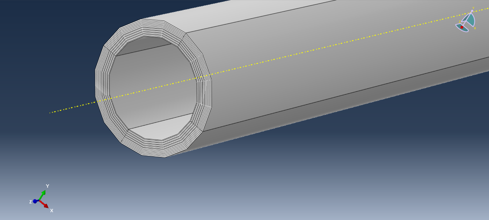
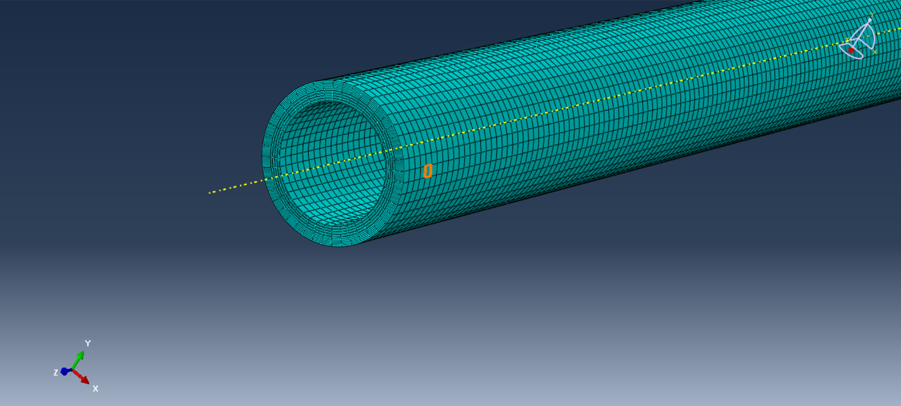
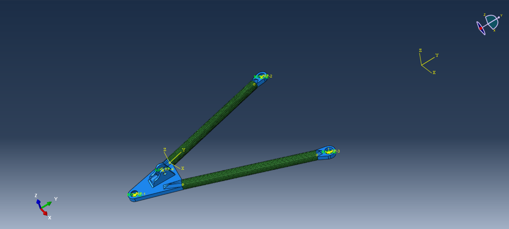
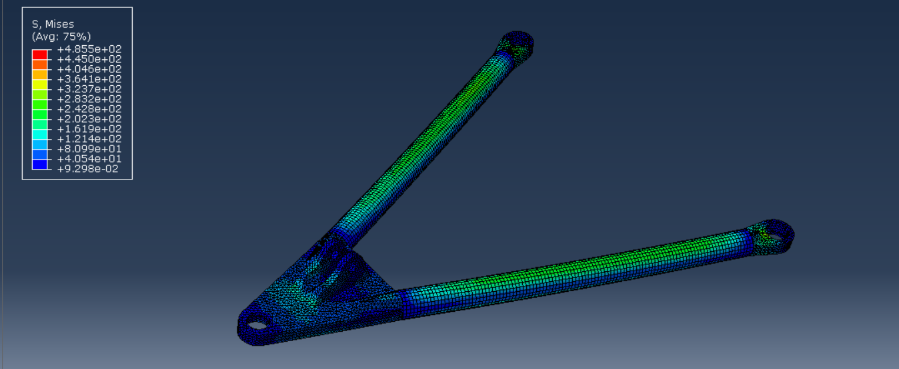
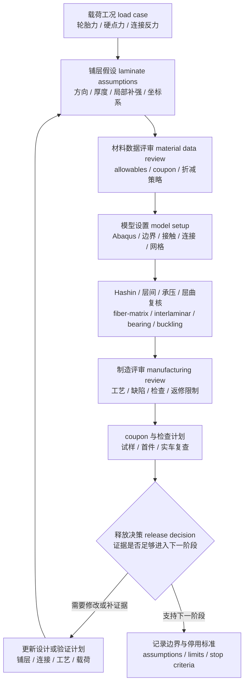

# 07 复合材料校核与制造风险

## 本章解决的问题

复合材料 composite parts 的结构评审不能直接照搬金属件思路。金属件常从屈服、疲劳、焊接和局部稳定性出发；复材还必须同时说明纤维方向、基体、层间、铺层假设、连接载荷引入和制造质量。对悬架团队而言，本章要回答：

- 复材件在什么工况下承受拉伸、压缩、剪切、弯曲、扭转、局部承压和连接载荷。
- 铺层 ply schedule、方向 orientation、厚度、材料 allowables 和坐标系是否与 CAD、FEA、制造记录一致。
- Hashin 类 failure criteria 能提示哪些失效模式，哪些风险仍需要试样 coupon、首件检查和实车验证。
- Abaqus 或其它 FEA 工具中的材料、边界、连接、网格和后处理是否足以支持当前设计阶段的评审。
- 制造缺陷、装配偏差和赛后损伤如何进入 release decision，而不是只看一张 failure index 云图。

快速预览层见 [07 载荷与结构校核](../07-loads-and-structure-check.md)。本章讨论复材校核流程、评审问题和保守判断方式；材料供应商数值、实际铺层表、源公式、源图表、车号或具体车辆组合数据应由团队自行管理。

RCD / RCVD 对复合材料本体不是完整材料手册；它们更适合作为车辆载荷、包装、制造和验证边界的上游校准。复材安全仍需要材料 allowables、铺层质量、连接区试验和制造过程控制。

## 复合材料和金属件的校核差异

金属材料通常近似为各向同性 isotropic，设计评审会重点看等效应力、屈服、疲劳、焊接、孔边和屈曲。复合材料往往是各向异性 anisotropic 或正交各向异性 orthotropic，强度和刚度随纤维方向、铺层顺序、树脂体系、固化质量和环境状态变化。一个方向上看起来很强的结构，可能在层间、孔边、压缩、剪切或冲击后损伤中提前暴露风险。

复材校核的特殊点包括：

| 主题 | 金属件常见关注 | 复合材料额外关注 |
| --- | --- | --- |
| 材料模型 | 弹塑性、疲劳、焊接影响 | 单向层 lamina、层合板 laminate、纤维 / 基体 / 层间失效 |
| 坐标系 | 零件局部坐标和载荷方向 | laminate coordinate system、ply angle sign convention、镜像件方向 |
| 连接 | 孔边承压、螺栓剪切、焊接或胶接 | 局部压溃 local crushing、层间剥离 delamination、pull-out、胶层剥离 |
| 制造 | 加工、焊接、热处理、表面质量 | 纤维褶皱、树脂富集、孔隙、固化偏差、厚度偏差、修边损伤 |
| 结果解释 | 最大应力、位移、疲劳、buckling | failure index、失效模式、损伤演化、层间应力、制造可重复性 |
| 证据等级 | 手算、FEA、台架、实车检查 | 还需材料批次、coupon、工艺记录、无损或外观检查 |

因此复材件的结论应写成“在当前材料数据、铺层假设、边界条件和制造控制下，未发现阻止进入下一阶段的明显风险”，而不是把仿真通过理解成实物安全承诺。

## 失效模式

复合材料的危险之处在于失效模式不止一种。评审时应至少区分以下模式，并说明每种模式在当前模型中是否被覆盖、如何后续验证。

| 失效模式 | 工程含义 | 悬架件常见触发点 | 评审关注 |
| --- | --- | --- | --- |
| fiber tension | 纤维方向受拉超过纤维承载能力 | 拉杆、碳管、拉伸侧壳体、胶接搭接端 | 载荷是否沿纤维主方向传递，孔边是否削弱净截面 |
| fiber compression | 纤维方向受压导致压缩破坏、微屈曲或 kink band | 推杆 / 拉杆受压、薄壁管件、受弯压缩侧 | buckling、端部偏心、夹具约束和制造直线度 |
| matrix tension | 横向拉伸或剪切导致基体开裂 | 孔边、厚度突变、自由边、低纤维方向承载区 | 基体裂纹是否可能诱发 delamination 或刚度下降 |
| matrix compression | 横向压缩和剪切导致基体压碎或剪切破坏 | 垫片下方、夹持区域、局部支承面 | local crushing、接触压力和载荷扩散面积 |
| shear | 面内或层间剪切使层合板滑移或基体损伤 | 扭转载荷、胶接搭接、连接偏心 | 剪切 allowables、胶层和铺层角度是否匹配 |
| delamination | 层间分离导致刚度、强度和损伤容限下降 | 自由边、孔边、冲击区、厚度变化、连接区 | 层间拉伸 / 剪切、制造缺陷、冲击后检查 |
| local crushing | 垫片、套筒、嵌件或夹具下方局部压溃 | 螺栓孔、轴承座、硬点夹持面 | 承压面积、垫片、衬套和局部补强设计 |
| buckling | 结构在压缩、弯曲或剪切下发生整体或局部失稳 | 长细碳管、薄壳、夹芯面板、压缩侧铺层 | 初始缺陷、边界条件、后屈曲敏感性 |
| connection pull-out | 嵌件、胶接端、螺栓或夹具从复材中拔出 | 硬点、接头、胶接碳管端部 | 载荷引入长度、表面处理、机械锁止和检查方案 |
| manufacturing defects | 制造偏差降低实际 allowables 或改变载荷路径 | 手糊、预浸料、固化、修边、钻孔、装配 | 工艺记录、首件检查、返修限制和停用标准 |

这些模式之间会互相影响。例如 matrix tension 产生的裂纹可能降低剪切刚度，随后推动 delamination；局部承压损伤可能让连接区刚度下降，进而改变载荷路径。评审报告要避免只列一个最小安全系数，而应说明主导失效模式和未覆盖风险。

## Hashin 类准则的工程含义

Hashin 类准则 Hashin-type failure criteria 常用于纤维增强复合材料的 lamina 层级失效模式识别。它通常把失效拆成 fiber tension、fiber compression、matrix tension、matrix compression 等类别，让工程师知道风险更像“纤维方向承载不足”还是“基体或剪切主导”。这比单纯用一个等效应力值更接近复材的物理行为。

Puck / IFF inter-fibre failure 类思路可以作为另一类失效解释视角，尤其用于更细地区分基体主导、纤维间失效和断裂面相关风险。无论使用 Hashin、Puck、Tsai-Wu 还是自定义准则，都必须记录材料 allowables、坐标系、适用范围、损伤演化假设，以及未覆盖的层间、连接和制造缺陷风险。

但它只是一个 review lens，不是安全证明。使用时应明确以下边界：

- 输入的强度参数、剪切参数和层间数据来自哪里，是否与实际材料、工艺、纤维体积分数、固化和环境一致。
- 模型是 lamina 层级、shell 层合板、solid 分层，还是简化等效材料；不同建模方式能看到的失效不同。
- failure index 反映的是当前准则和当前假设下的数学指标，不等于实物在赛道上不会损伤。
- 标准 Hashin 类指标主要检查纤维 / 基体相关模式，不能单独清除 interlaminar delamination 风险。
- Abaqus 内置模型、用户材料模型 user material、VUMAT / UMAT 或其它子程序的适用范围、损伤演化、单元删除 element deletion、网格依赖和后处理解释都需要单独记录。
- Hashin 对冲击损伤、制造孔隙、胶接失效、螺栓滑移、环境老化、连接 pull-out 和层间裂纹扩展的覆盖有限，不能替代 coupon 与检查。

因此 Hashin 结果必须与单独的层间 / 分层 review 配套使用。根据零件风险和证据等级，可增加 interlaminar normal stress、interlaminar shear stress、自由边和孔边层间应力复核；对关键连接或厚度突变区域，可建立局部子模型，或在适合时使用 cohesive-zone、VCCT-style 等分层扩展模型。仿真之外，还应安排 NDI / inspection、首件检查、coupon、连接样件或 joint tests，用来确认模型没有把层间损伤、胶接剥离或隐藏缺陷误判为已覆盖风险。

更稳妥的写法是：“Hashin 类指标显示当前载荷和铺层假设下某些 ply 的 fiber compression 或 matrix shear 风险较高；层间应力和连接子模型还提示孔边存在 delamination 线索，需要检查压屈、端部偏心、连接扩散和制造缺陷。”这类结论能引导下一步评审，而不是把一个数值当成最终许可。

## 材料参数与 allowables

复材仿真的可信度首先由材料数据决定。公开资料、供应商数据、历史经验和实测 coupon 之间的证据等级不同，不能混在一起使用而不说明来源。团队应建立材料数据表；教学文档可以说明字段和判断逻辑，具体供应商值和测试结果应留在工程记录中。

材料数据至少要记录：

| 数据项 | 需要说明的问题 |
| --- | --- |
| 弹性参数 | 纤维方向、横向、面内剪切和泊松耦合如何定义，坐标系是否清楚 |
| 强度 allowables | 拉伸、压缩、剪切、层间和承压数据来自公开资料、供应商、coupon 还是保守估计 |
| 工艺状态 | 预浸料、湿法、真空袋、热压罐、室温固化或其它工艺会改变数据适用性 |
| 环境条件 | 湿热、温度、油液、紫外、存放时间和老化是否影响结论 |
| 统计含义 | 数据是典型值、设计许用值、最小值还是样本很少的早期估计 |
| 折减策略 | 对缺陷、孔边、冲击、制造偏差和数据不足是否使用 conservative knockdown |

allowables 不是把供应商宣传值直接填进 FEA。若材料数据与实际铺层、固化和加工方式不一致，应降低结论等级，并把它写成“设计初筛输入”而不是“释放依据”。对承力复材件，推荐用 coupon 或连接样件建立与实际工艺相近的证据；没有测试前，仿真结论应保守表达。

材料 / 铺层字段模板建议至少包含以下项。这里先给出字段、单位和坐标定义；具体数值、来源和版本应在项目工程包中维护。

| 字段 | 单位 | 轴向或含义 | 记录要求 |
| --- | --- | --- | --- |
| `E1` | MPa 或 GPa | `1` 轴，fiber direction | 说明拉伸 / 压缩是否共用同一弹性模量 |
| `E2` | MPa 或 GPa | `2` 轴，in-plane transverse | 与 ply 局部坐标和材料卡一致 |
| `G12` | MPa 或 GPa | `1-2` 面内剪切 | 与 Hashin 或其它准则使用的剪切输入一致 |
| `G13` | MPa 或 GPa | `1-3` 剪切，`3` 为 through-thickness | 若模型不能解析厚向行为，应说明简化 |
| `G23` | MPa 或 GPa | `2-3` 剪切 | 用于 thick laminate、solid 或层间风险复核时需特别说明 |
| `Xt / Xc` | MPa | `1` 轴拉伸 / 压缩 allowables | 标明来源、统计含义和折减策略 |
| `Yt / Yc` | MPa | `2` 轴拉伸 / 压缩 allowables | 与实际工艺和环境是否匹配 |
| `S12` | MPa | `1-2` 面内剪切 allowable | 若另有层间剪切数据，应分开记录 |
| ply thickness | mm | 单层名义厚度或实测厚度 | 说明来自设计、供应商、coupon 或首件测量 |
| density | kg/m^3 或 g/cm^3 | 质量属性使用时记录 | 不参与结构强度时也应说明是否用于质量模型 |
| ply angle | deg | 相对 laminate `1` 轴或制造基准 | 说明正角方向、镜像规则和左右件处理 |

坐标映射必须可追溯：`1` 轴为纤维方向，`2` 轴为铺层平面内横向，`3` 轴为厚度方向；这三个材料轴要映射回 CAD 基准、FEA 局部坐标和 laminate coordinate system。若 CAD、铺层图和求解器坐标不一致，应先修正坐标定义，再讨论 failure index。

## 铺层、方向与厚度假设

铺层假设 ply schedule 是复材校核的核心输入。即使外形相同，只要 ply 方向、顺序、厚度、搭接和局部补强不同，刚度、失效模式和制造风险都可能改变。

评审时应检查：

- laminate coordinate system 是否清楚：基准方向相对零件轴线、车辆坐标、载荷方向或制造基准如何定义。
- ply-angle sign convention 是否统一：镜像件、左右件、展开图和求解器中的正负方向是否一致。
- 厚度假设是否来自设计铺层、制造实测、供应商信息或简化等效；若是简化，应写明适用边界。
- 局部补强、搭接、端部包覆、孔边补片和嵌件区域是否在模型里表达，或至少作为制造评审项记录。
- shell offset、stacking sequence、材料方向和实体几何是否一致，避免中面偏置或方向翻转造成错误刚度。
- 钻孔、修边、倒角和装配夹紧是否会切断纤维或引入局部 delamination 风险。

铺层表、供应商厚度值和具体零件参数组合不适合写进学习手册。这里保留字段模板和检查逻辑，提醒团队在自己的设计包中补齐项目数据。

## Abaqus 建模思路

Abaqus 建模的目标不是追求模型复杂，而是让模型复杂度与问题相匹配。概念阶段可用简化 laminate shell 观察载荷路径和刚度趋势；详细阶段才逐步加入连接、接触、局部补强、分层区域和更细的失效后处理。

推荐建模流程：

1. 明确零件功能：它是传递轴力、承受弯扭、承受局部夹紧，还是作为硬点载荷扩散结构。
2. 从 [06 载荷与金属结构校核](06-loads-metal-structure.md) 的载荷工况和接口力出发，统一坐标系、作用点、约束和版本。
3. 选择单元和材料表达：shell laminate、solid laminate 或等效各向异性模型应与厚度、连接和后处理需求一致。
4. 定义 ply 方向、stacking sequence、厚度、offset 和局部坐标，并用简单载荷检查变形方向是否符合直觉。
5. 建立真实载荷引入：通过垫片、套筒、嵌件、胶接面、夹具或分布耦合传力，避免单节点集中力。
6. 检查网格、接触、约束和边界敏感性，尤其是孔边、自由边、厚度突变和硬点区域。
7. 后处理 failure index、damage variables、单元删除状态、位移、层间风险、局部承压、buckling 和连接反力，并说明哪些风险不在模型覆盖范围内。

对于 Hashin、Puck-type、损伤演化或用户材料模型，要记录模型版本、适用假设、输出变量含义和后处理脚本。若项目使用 Fortran、VUMAT / UMAT 或其它用户子程序，手册说明它属于 user material implementation 即可；读者需要的是可复核的工程方法，而不是源代码、状态变量编号或删除阈值。

## 图示：复材建模、网格和结果读法

下面的图例用于说明复材件的读图方式：关注铺层、网格、连接区和后处理思路，而不是把图中的颜色或局部形状当作可复用的零件答案。

截面图能帮助读者理解 laminate 不是单一实体材料。铺层厚度、方向、顺序和局部补强都会影响刚度、失效模式和制造风险；这里的重点是读懂层合板思路，而不是复用某个项目的铺层表。

网格图用于检查管端、厚度变化和连接附近的单元质量。复材件如果只在中间均匀区域网格很好，而连接区、孔边或自由边没有细化，failure index 可能会掩盖真正的失效路径。

复材悬架件的风险常集中在 hardpoint、碳管端部、胶接端、嵌件和夹持区域。公开图例保留载荷引入和连接区布局的概念，真实项目必须继续检查 local crushing、delamination、buckling 和 pull-out。

云图只能说明当前模型和当前后处理变量下的风险分布。复材评审还需要把 fiber / matrix 失效、层间风险、连接区承压、制造缺陷和 coupon / 实车检查放在一起判断，不能把颜色分布等同于最终释放。

## 连接区、硬点与载荷引入

悬架复材件最容易出问题的地方往往不是中间均匀区域，而是 hardpoints、接头、胶接端、螺栓孔、夹持面和嵌件。载荷如果没有足够面积扩散，会把纤维方向优势变成局部压溃、剪切、分层或 pull-out 风险。

连接区评审要覆盖：

| 区域 | 主要风险 | 建模与评审要点 |
| --- | --- | --- |
| 螺栓孔 bolted joint | 孔边承压、净截面拉断、剪切撕裂、delamination | 垫片和套筒是否扩散载荷，孔边铺层是否单独评审 |
| 胶接 bonded joint | 胶层剪切、剥离、表面处理不足、固化偏差 | 搭接长度、剥离应力、胶层厚度控制和检验方法 |
| 嵌件 insert | local crushing、pull-out、热膨胀不匹配 | 嵌件形状、机械锁止、表面处理和周围补强 |
| 碳管端部 tube end | 端部压溃、胶接脱开、纤维切断、偏心弯矩 | 接头插入、端部包覆、轴线对齐和夹具定位 |
| 硬点 hardpoint | 多轴载荷、装配偏差、局部层间应力 | 与几何、载荷和制造基准一致，避免只按单向轴力释放 |

如果模型把连接区简化为刚性耦合、MPC beam、remote point 或集中载荷，应说明这种简化可能低估局部损伤，也可能高估局部峰值。关键连接建议用分布耦合、垫片 / 套筒接触、cohesive 或局部子模型、连接样件、装配检查和测试后复查共同支持。

## 制造缺陷与质量控制

复材强度高度依赖制造质量。仿真模型通常假设材料连续、铺层正确、固化充分、厚度稳定，但实际制造可能出现偏差。评审时要把制造风险列为结构证据的一部分。

| 风险 | 为什么 RCD / RCVD 只能提供边界 | 本手册需要保守写法 |
|---|---|---|
| 材料参数 | 赛车设计书不能替代材料供应商数据和试样结果 | allowables 来源、环境条件和批次差异必须记录 |
| 铺层方向 | 车辆载荷只说明外部需求，不说明实际纤维质量 | 铺层角度、厚度、搭接和缺陷检查必须进入评审 |
| 连接区 | 轮载和导力会集中到 inserts、bonding 和局部压溃位置 | 连接区需要单独建模、试验或保守裕度 |
| 制造缺陷 | 理论模型默认理想结构，实物可能有空隙、皱褶和固化偏差 | 测试和无损检查不能被仿真截图替代 |

| 风险 | 可能原因 | 仿真能看到什么 | 仿真看不到什么 | 验证方式 |
| --- | --- | --- | --- | --- |
| fiber tension 余量不足 | 纤维方向与主载荷不一致，孔边削弱净截面 | 纤维方向 failure index、载荷路径和应变集中 | 纤维断续、修边切伤、局部波纹 | 铺层方向复核、首件尺寸检查、拉伸 coupon |
| fiber compression 或 buckling | 压缩载荷、端部偏心、长细结构、初始弯曲 | 压缩侧指标、整体位移、线性或非线性屈曲趋势 | 初始缺陷、夹具误差、纤维微屈曲敏感性 | 直线度检查、压缩 coupon、样件加载 |
| matrix tension / shear | 横向载荷、扭转、孔边和自由边应力 | 基体模式指标、剪切应变和自由边热点 | 微裂纹扩展、湿热老化后的性能下降 | 显微或目视检查、剪切 coupon、环境后复测 |
| delamination | 层间拉伸 / 剪切、冲击、厚度突变、孔边 | 层间应力线索、自由边风险位置 | 内部分层、孔隙、冲击后隐伤 | 敲击、超声、切片、赛后检查 |
| local crushing | 垫片面积不足、夹紧力过高、嵌件设计不足 | 接触压力、局部位移、连接反力 | 树脂富集、实际垫片不平、装配预紧偏差 | 扭矩记录、压痕检查、承压样件 |
| pull-out | 胶接长度不足、表面处理差、载荷偏心 | 连接反力、胶接剪切 / 剥离趋势 | 表面污染、固化不足、胶层缺陷 | 胶接试样、破坏样件、装配追溯 |
| 制造缺陷 | 孔隙、褶皱、厚度偏差、固化不充分、钻孔毛刺 | 通常只能通过折减或敏感性间接覆盖 | 缺陷位置、尺寸、分布和批次差异 | 工艺记录、质量检查、无损检测、返修记录 |

质量控制记录建议包括材料批次、存放条件、裁片方向、铺层检查、真空和固化记录、脱模和修边记录、钻孔记录、首件尺寸、外观缺陷、返修限制和装配扭矩。对承力硬点，制造记录与 FEA 报告同样重要。

## 试样、实车检查与验证边界

coupon 和样件测试的价值在于把“软件中的材料”拉回“团队真实工艺”。常见验证层级包括：

- 材料 coupon：验证拉伸、压缩、剪切、承压或层间相关 allowables 是否适用于当前材料和工艺。
- 连接 coupon：验证胶接、嵌件、螺栓孔、碳管端部或夹持区域的实际破坏模式。
- 子结构样件：验证载荷扩散、局部补强、夹具和装配偏差对强度和刚度的影响。
- 首件检查：确认厚度、重量、外形、孔位、硬点、表面质量和制造记录。
- 实车检查：在低风险测试、逐步加载和赛后复查中观察裂纹、分层、松动、压痕、异响和永久变形。

验证边界必须写清楚。某个 coupon 只代表与其材料、铺层、工艺和加载方式相近的情形；实车短时测试也不能覆盖所有疲劳、冲击和环境状态。若发现任何疑似 delamination、连接松动、孔边压痕、永久变形或异常声响，应暂停该零件的释放结论，回到载荷、边界、制造和检查记录重新评审。

## 复材评审流程图

这个流程的重点是闭环。复材件只有在载荷、铺层、材料、模型、制造和检查证据相互一致时，才适合进入下一阶段；任何一个环节证据不足，都应降低结论等级或安排补充验证。

## 软件实现路径

复材校核的软件链与金属件不同：Adams View 提供上游载荷边界，Abaqus / Ansys 或同类 FEA 工具负责表达材料方向、铺层、连接区和失效准则，制造和试样验证负责决定模型是否可信。

| 技术问题 | 推荐工具 | 输入 | 输出 | 传给下一步 | 验证方式 |
| --- | --- | --- | --- | --- | --- |
| 载荷边界继承 | Adams View、表格 | 连接点力、作用点、坐标系、工况、载荷路径和安全边界 | 复材件载荷工况表、连接区受力说明 | Abaqus / Ansys 复材模型 | 与金属件载荷表、自由体图和反力平衡对照 |
| 铺层和材料方向 | Abaqus / Ansys、表格 | 材料 allowables、铺层顺序、ply orientation、厚度、局部坐标和制造边界 | layup 定义、材料方向说明、铺层风险清单 | 失效准则、制造评审 | 坐标系可视化、对称 / 平衡铺层检查、试样或供应商数据等级说明 |
| 连接区建模 | Abaqus / Ansys | 轴承窝、嵌件、胶接或机械连接、接触、cohesive 或等效连接假设 | 连接区边界、承压 / 层间风险、局部网格说明 | 结构修改、制造工艺、测试计划 | 连接假设审查、网格敏感性、局部失效模式解释 |
| 失效评估 | Abaqus / Ansys、后处理脚本 | 载荷、材料方向、失效准则、层间假设、边界条件 | Hashin / Puck-style 或其它失效指标、危险层和危险区域 | release review、结构修改 | 不只看云图峰值；检查纤维、基体、层间、承压和屈曲风险 |
| 制造与验证回流 | 制造记录、试样数据、Git / Markdown | 工艺窗口、缺陷记录、首件检查、coupon 或实车检查 | 制造风险、停用标准、模型修正和补充试验计划 | 下一轮铺层、连接和工艺改进 | 把空洞、褶皱、脱粘、纤维偏角和固化质量反馈到模型边界 |

## 输出物

复材校核建议形成以下输出物：

| 输出物 | 最低内容 | 写法建议 |
| --- | --- | --- |
| 复材设计说明 | 零件功能、载荷路径、铺层原则、连接策略和制造工艺 | 说明方法和字段，具体铺层表由项目工程包维护 |
| 材料数据记录 | 数据来源、allowables 类型、适用工艺、环境和折减策略 | 说明数据等级和折减思路，供应商值和测试数值不写入学习手册 |
| Abaqus 设置说明 | 单元、材料、坐标、边界、接触、连接、网格和后处理 | 描述可复核流程；模型图例只用于说明读图方式 |
| 失效模式评审 | fiber、matrix、shear、delamination、crushing、buckling、pull-out 风险 | 用模式和位置类型表达，避免组合出可识别车辆或材料的完整数据 |
| 制造质量计划 | 材料批次、铺层检查、固化记录、修边钻孔、首件和返修限制 | 保留检查项和判断逻辑 |
| coupon / 样件计划 | 测试目的、加载方式、记录项目、通过标准和边界 | 记录验证思路，试验数据由团队自行管理 |
| 释放结论 | 当前证据等级、未覆盖风险、停用标准和下一步动作 | 使用保守语言，不写过度承诺 |

项目工程包可以包含具体数值、图纸、铺层表和测试数据；学习手册保留可学习、可迁移的工程逻辑。

## 常见错误

- 把复材当作各向同性金属，只看一个等效应力云图。
- 没有定义 laminate coordinate system，导致 ply 方向和真实制造方向不一致。
- 镜像件角度符号处理错误，让左右件刚度和强度假设不对称。
- 使用供应商或历史材料数据，却没有说明工艺、环境和 allowables 的适用边界。
- Hashin 指标看起来较低，就忽略 delamination、local crushing、buckling 和 connection pull-out。
- 在 Abaqus 中用单点力或刚性全固定代替真实垫片、套筒、胶接、嵌件或夹具。
- 不检查孔边、自由边、厚度突变、端部和硬点，只看中间均匀区域。
- 忽略制造缺陷，把孔隙、褶皱、厚度偏差、固化偏差和修边损伤都当作不存在。
- coupon 与实车零件的材料、铺层、工艺或加载方式不一致，却把测试结论扩大使用。
- 把私有铺层、材料参数、源公式、源图表或车辆识别信息写进学习手册。

## 验证与评审

复材评审应按证据等级逐层推进：

| 证据 | 可以支持什么 | 不能替代什么 |
| --- | --- | --- |
| 手算和载荷路径 | 判断主要受拉、受压、受剪、受弯和连接风险 | 复材各模式失效和制造缺陷 |
| 简化 laminate FEA | 早期刚度、载荷路径和高风险区域识别 | 连接细节、层间损伤和真实制造质量 |
| Hashin 类后处理 | 区分 fiber / matrix 相关风险趋势 | 安全认证、胶接破坏、pull-out 和冲击隐伤 |
| coupon | 建立材料或连接的工艺相关证据 | 全尺寸零件的载荷路径和装配偏差 |
| 首件和装配检查 | 确认制造和安装是否接近设计假设 | 未测试工况、长期疲劳和赛道冲击 |
| 实车复查 | 发现裂纹、分层、松动、压痕、磨损和永久变形 | 未覆盖事件下的完整保证 |

评审问题建议包括：

- 载荷是否来自已评审的工况、硬点和连接反力，是否与金属件校核使用同一版本。
- ply 方向、厚度、坐标系和局部补强是否能从设计、仿真和制造记录互相追溯。
- allowables 是否来自与实际材料和工艺相符的证据；若不是，是否使用保守折减并降低结论等级。
- failure index 的主导模式是什么，是否与变形、载荷路径和制造风险一致。
- 连接区是否检查 local crushing、delamination、buckling、pull-out、胶接剥离和装配偏差。
- coupon、首件检查和实车复查是否覆盖最可能的失效模式，停用标准是否明确。
- 文档是否避开了私有材料值、具体铺层参数、源图表、车号和内部文件名。

推荐结论语言：“在当前载荷、材料、铺层、边界和制造检查假设下，该方案可支持进入样件或下一轮评审；仍需按计划完成 coupon、首件检查和实车复查，并在发现损伤迹象时重新评审。”这种表达保留了工程判断，也避免把分析结果说成安全保证。

## 与其它章节的关系

- [07 载荷与结构校核](../07-loads-and-structure-check.md)：提供结构校核的快速入口，帮助新队员理解复材件为何需要从载荷工况、边界条件和检查闭环出发。
- [06 载荷与金属结构校核](06-loads-metal-structure.md)：复材件与金属件共享载荷来源、坐标系、接口力和边界评审原则，但失效准则、材料证据和制造风险不同。
- [08 验证、测试与答辩](08-validation-testing-defense.md)：复材的 coupon、首件、实车检查和停用标准需要进入整车验证计划和答辩证据链。
- [10 评审清单](10-review-checklists.md)：将材料数据、铺层、Abaqus 设置、连接区、制造检查和验证边界纳入统一 review checklist，避免只在个人分析文件中保存。

## 本章公开来源

- Composite Suspension for Formula SAE / Formula Student 公开论文和报告，用于说明碳纤维悬架件、胶接、金属嵌件、制造波动和测试验证的常见风险。
- Formula Student composite talks / theses，用于补充 carbon fiber sandwich、allowables、coupon、铺层和制造质量控制的学习入口。
- Abaqus / Ansys 官方复合材料资料类型，用于材料方向、铺层、失效准则、局部坐标、连接和后处理字段。
- [FSAE Design Judging Score Sheet](https://www.fsaeonline.com/content/fsae%20design%20score%20sheet%20150pt.pdf)，用于把复材件也纳入 design、build、validation 和 understanding 证据链。
- 完整章节索引见 [参考资料：章节引用索引](../references.md#章节引用索引)。
