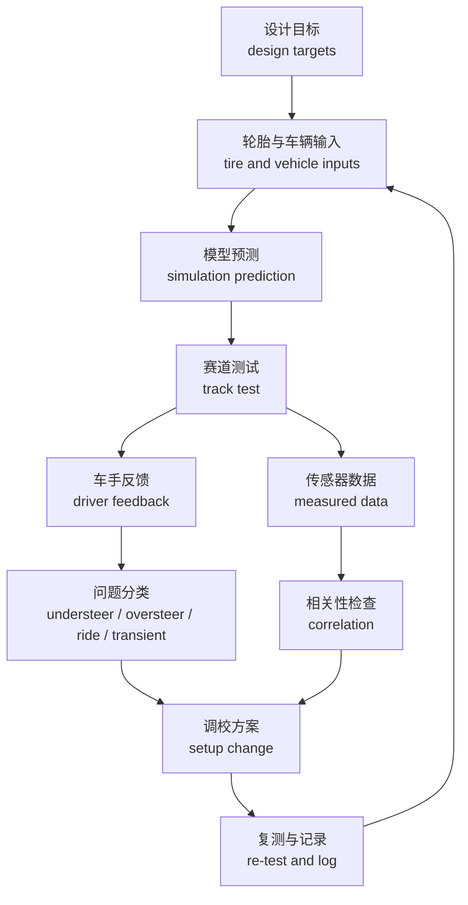
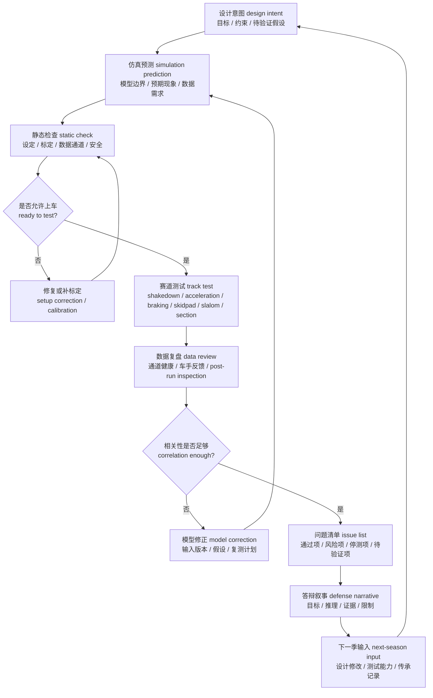

# 08 验证、测试、答辩与传承

## 本章解决的问题

验证 validation、测试 testing、答辩 defense 和传承 handover 是同一个闭环的不同阶段。悬架设计不能只停在计算表、K&C 曲线、整车仿真或结构云图里；它必须被装配状态、静态设定、实车工况、数据通道、车手反馈和赛后复盘逐步检验。快速预览层见 [08 验证与迭代](../08-validation-and-iteration.md)，本章进一步给出高级手册中的测试矩阵、数据相关性、停测条件、答辩叙事和下一季输入方式。

本章回答以下问题：

- 如何把 [01 设计目标](01-design-targets.md) 中的目标转成可测试、可记录、可答辩的证据链。
- 如何在测试前完成静态检查 static setup check、传感器标定 sensor calibration 和数据通道验证 data-channel validation。
- 如何规划 shakedown、加速、制动、skidpad、slalom、赛道片段和 endurance-style 检查。
- 如何区分车手反馈 driver feedback、工程推断 inferred cause 和数据证据 data evidence。
- 如何执行每轮只改一个主要变量 one-change-at-a-time testing，并把调校 setup 变化记录成可复盘的日志。
- 如何把实车数据回流到 [05 仿真、优化与相关性验证](05-simulation-optimization-correlation.md)，更新模型而不是追着单次结果过度拟合。
- 如何把验证结果组织成比赛答辩叙事，并沉淀为下一季设计输入。

本章讨论通用流程、字段模板、检查逻辑和保守的工程经验。原始数据文件、精确测试值、比赛记录、故障照片、历史车辆编号、源图表或能反推出某一年车辆参数的组合信息，应留在团队自己的工程资料中。

## 验证不是最后一步

验证不是“设计结束以后找时间跑一下车”，而是从目标定义时就要进入计划。一个合格的悬架目标应同时说明：预期现象、仿真证据、测试方法、数据通道、通过标准和未验证风险。否则，目标会变成口号，仿真会变成孤立图片，测试会变成没有因果关系的试跑。

验证应按风险从低到高逐步展开：

| 阶段 | 主要目的 | 典型证据 | 不能替代什么 |
| --- | --- | --- | --- |
| 设计评审 design review | 检查目标、约束、接口和安全边界是否清楚 | 目标表、接口表、包络检查、计算说明 | 不能证明实车装配和动态行为已经正确 |
| 台架 / 静态检查 static check | 检查车上状态是否与设计输入一致 | 车高、角重、toe / camber、胎压、行程、紧固、干涉 | 不能证明轮胎极限、车手手感或耐久可靠性 |
| 低速 shakedown | 检查车辆能否安全运行、制动转向是否基本正常 | 低速视频、制动感觉、转向回正、异常噪声、数据通道 | 不能直接用于性能结论 |
| 单项动态测试 event-style tests | 回答少量明确问题 | 加速、制动、skidpad、slalom、赛道片段数据和反馈 | 不能替代完整耐久和多场地复核 |
| 耐久式检查 endurance-style checks | 暴露热、磨损、松动、疲劳和维护问题 | 多轮运行、post-run inspection、温度、磨耗、故障记录 | 不能自动说明模型在所有工况都准确 |
| 相关性验证 correlation | 判断模型能解释哪些实车现象 | 仿真与实测趋势、差异解释、模型修正记录 | 不能用单次数据过度校准全部模型 |
| 答辩与传承 defense / handover | 说明目标、推理、证据、限制和下一步 | 证据包、风险清单、下一季优先级 | 不能掩盖未验证项或安全风险 |

验证纪律的核心是“先写问题，再跑测试”。每次测试前应说明本轮要回答什么，例如：制动时车辆是否保持方向稳定、skidpad 中稳态转向趋势是否与模型一致、slalom 中横摆响应是否过慢、赛道片段中悬架行程是否频繁触及限位。测试后只回答这些问题，不把偶然观察扩展成没有证据的结论。

## 测试前静态检查

测试前静态检查 static setup check 的目的，是确认“要验证的车”真的等于设计和仿真中假设的车。若静态状态没有记录，后续动态数据很难解释；若传感器没有标定，数据曲线再漂亮也可能只是错误单位或零点漂移。

最低检查项建议包括：

| 检查对象 | 记录内容 | 失效风险 |
| --- | --- | --- |
| 车辆设定 setup | 车高、角重、轮胎胎压、外倾 camber、前束 toe、主销相关可调件、弹簧预载、防倾杆状态、阻尼档位 | 数据无法回溯到具体车辆状态，调校因果链断裂 |
| 行程和限位 travel / stop | bump / rebound 行程、缓冲块、转向极限、摇臂和推杆 / 拉杆角度、阻尼器有效行程 | 动态测试中触底、顶死、机械干涉或传感器超量程 |
| 紧固与连接 fasteners / joints | 球头、杆端、螺栓、锁紧螺母、开口销、支座、轮毂、制动和转向连接 | 松动、脱落、载荷路径异常或安全事故 |
| 干涉和包络 clearance | 轮胎、轮辋、制动卡钳、转向拉杆、半轴、车身、地板、线束和油管 | 轮胎磨损、线束拉扯、转向卡滞或悬架运动受限 |
| 轮胎状态 tire state | 轮胎编号、位置、胎压、胎温、磨耗、热循环、安装方向 | 轮胎差异被误判为悬架调校差异 |
| 传感器标定 calibration | 加速度计、陀螺仪、方向盘角、轮速、制动压力、悬架位移、GPS / timing 的零点、量程、方向和单位 | 相关性验证出现符号错误、时序错误或数量级错误 |
| 数据通道 data channel | 通道命名、采样率、时间同步、文件命名、备份位置、缺失通道检查 | 测试后无法对齐仿真输入和实车输出 |

传感器标定应尽量在测试前用简单动作验证。例如方向盘角左右打满时符号是否符合定义；悬架位移在手动压缩和回弹时是否符合通道定义的符号约定，并在日志中写清压缩 compression 或回弹 rebound 哪个方向为正；轮速是否对应正确车轮；制动压力是否随踏板输入单调变化；IMU 静止时重力方向和零偏是否合理。若某个通道只做趋势参考，日志中应写清“仅趋势使用”，不要把它作为定量通过标准。

数据系统还应做一次端到端时间对齐检查 end-to-end alignment。可以用共享触发 shared trigger 或可识别事件，例如轻点制动 brake tap、方向盘左右 sweep、悬架 bounce、logger marker、视频 clap，确认数据记录器、视频、GPS / timing、IMU 和独立采集设备的时间戳对齐，并记录滤波 delay。没有完成对齐检查的数据，最多用于定性观察，不应直接做定量相关性验证。

静态检查不是一次性的。每次上车前做安全相关复查，每次下车后做 post-run inspection。若测试中出现撞锥、冲出路面、异常噪声、明显托底、制动跑偏、转向卡滞、温度异常或数据中断，应回到静态检查，不要把后续数据混入正常测试集。

## 测试矩阵

测试矩阵 test matrix 把“目标”翻译成“怎样测、看哪些通道、怎样判断、未验证风险是什么”。矩阵不是为了填表，而是为了限制一次测试只回答少量问题，并防止测试后用记忆补充条件。

建议使用以下字段。字段名可以直接进入测试计划；学习文档中给出结构和示例写法，具体阈值由团队依据车辆阶段和测试条件定义。

| 目标 | 仿真证据 | 测试方法 | 数据通道 | 通过标准 | 未验证风险 |
| --- | --- | --- | --- | --- | --- |
| 静态设定与装配状态符合设计输入 | 目标设定表、CAD 包络、K&C 行程检查、弹簧 / 防倾杆设定表 | 测试前静态检查、左右对称复测、极限转向和跳动包络检查 | 车高、角重、toe / camber、胎压、行程、照片或检查表 | 与设计设定一致或差异有解释；无安全相关干涉、松动和漏液 | 制造公差、测量误差、装配误差仍可能影响动态行为 |
| 低速 shakedown 可安全运行 | 简化载荷和转向 / 制动基本检查 | 低速直线、低速转弯、轻制动、转向回正、短距离返修检查 | 车速、方向盘角、制动压力、轮速、IMU、驾驶员语音 / 笔记 | 无不可控跑偏、卡滞、异常噪声、数据中断或安全故障 | 低速不能代表极限姿态、热状态和耐久可靠性 |
| 加速牵引趋势符合预期 | 纵向载荷转移、轮胎模型、驱动限制或整车模型趋势 | 直线加速或短距离重复加速，保持起步方式和胎压记录一致 | 轮速、车速、纵向加速度、悬架位移、驱动命令、胎压胎温 | 趋势可重复；无异常打滑、跳动、行程触限或连接异常 | 车手输入、路面摩擦、轮胎温度和控制策略可能主导结果 |
| 制动稳定性符合预期 | 制动载荷转移、俯仰模型、轮胎复合工况和前束变化检查 | 直线制动、逐步增加制动强度、制动后静态复查 | 制动压力、轮速、纵向加速度、方向盘角、yaw rate、悬架位移 | 车辆可重复保持方向；无不可解释跑偏、锁死模式异常或结构异常 | 制动系统、轮胎温度、路面坡度和车手踏板输入仍需单独解释 |
| Skidpad 稳态转向趋势可解释 | 稳态圆、侧倾刚度分配、轮胎模型和 K&C 姿态趋势 | 固定半径或八字，分左右方向记录并控制胎压胎温 | 横向加速度、yaw rate、方向盘角、车速、悬架位移、胎温胎压 | 左右差异可解释；趋势与仿真或预期一致；无持续托底和异常磨耗 | 单一场地和单一胎温窗口不能代表所有极限 |
| Slalom 瞬态响应可解释 | 转角阶跃 / 扫频、瞬态 yaw response、阻尼和轮胎松弛假设 | 连续绕桩或方向变化片段，保持桩距、速度区间和车手一致性 | 方向盘角、yaw rate、横向加速度、车速、悬架位移、车手反馈 | 响应滞后、过冲或摆振能被数据与反馈共同解释 | 车手节奏、视线、桩距和路面会影响可重复性 |
| 赛道片段 track-section 行为与模型边界一致 | 整车模型、G-G 趋势、关键弯角或组合工况预测 | 选择短片段，固定入口速度或驾驶任务，分段分析 | GPS / timing、IMU、方向盘角、轮速、制动压力、悬架位移、视频 | 关键片段趋势可重复；差异能追溯到输入、模型或驾驶 | 圈速不是唯一证据，交通、路线和风险边界会干扰判断 |
| Endurance-style 可靠性风险可控 | 结构校核、载荷路径、热和磨耗风险评审 | 多轮连续运行、分段冷却、每轮 post-run inspection | 温度、胎压、磨耗、紧固标记、噪声、行程、故障记录 | 无新增裂纹、松动、泄漏、分层、异常磨耗或不可解释接触痕迹 | 短测试不能证明长期疲劳寿命或所有制造批次可靠 |

矩阵中的“通过标准”应由团队依据规则、安全策略、车辆阶段和测试条件定义。本手册不提供通用阈值，因为阈值与车辆质量、轮胎、场地、传感器、车手水平和风险策略有关。若标准尚未建立，应写成“待验证：通过标准定义”，而不是用模糊词替代。

## 车手反馈与数据记录

车手反馈 driver feedback 是非常重要的输入，但它不是根因本身。测试记录应把反馈拆成三层：车手观察到的现象、工程师推测的原因、可以检查的数据或车辆状态。这样做可以避免把“推头”“不稳”“跳”“慢”“没信心”直接等同于某个硬点、弹簧或阻尼错误。

建议使用如下记录方式：

| 记录层级 | 写法 | 示例类型 |
| --- | --- | --- |
| 现象 phenomenon | 车手在什么位置、速度区间、输入动作下感到什么 | 入弯制动释放时车尾不安；弯中需要额外方向盘角；路肩后车身弹跳 |
| 推断 inferred cause | 工程师提出的可能原因，必须标为假设 | 可能是后轴阻尼回弹过快、前轮胎温不足、前束变化、制动偏差或路面输入 |
| 证据 evidence | 用哪些数据或检查验证 / 排除 | yaw rate、方向盘角、制动压力、轮速、胎温、悬架位移、post-run inspection |
| 决策 decision | 下一轮做什么、只改什么、不改什么 | 只调整一个阻尼方向；只改胎压；先复测传感器；暂停性能测试做安全检查 |

每次出车至少记录：

- 测试日期、场地、路面、天气、驾驶员、轮胎状态和安全负责人。
- 车辆设定：车高、角重、toe / camber、胎压、弹簧、阻尼、防倾杆、预载和关键可调件。
- 测试方法：加速、制动、skidpad、slalom、赛道片段、endurance-style 或 shakedown。
- 数据文件名、通道版本、采样率、异常事件、视频编号和备份状态。
- 车手反馈原话或结构化评分，并注明反馈发生的工况。
- 工程师解释、证据需求、下一轮变量和停测条件。

一轮测试只改变一个主要变量，是建立因果关系的基本纪律。可以改变的变量包括胎压、静态 toe、camber、防倾杆状态、阻尼档位、车高、弹簧、翼面或驾驶任务，但一次不要混改。若出于安全、天气或维修原因必须同时改变多个变量，应在日志中标注“弱结论 only weak conclusion”，避免把这轮数据当成强因果证据。

## 数据处理和模型修正

数据处理 data processing 的第一步不是画图，而是确认数据能不能用。若通道方向、单位、时间同步、零点、滤波和文件版本没有检查，后续相关性验证 correlation 可能只是在解释错误数据。

最低处理流程建议如下：

1. 检查文件完整性：确认本轮测试有对应日志、视频、车辆设定和数据文件。
2. 检查通道有效性：确认每个通道的单位、符号、采样率、零点、饱和、丢包和时间同步。
3. 检查端到端对齐：用 brake tap、steering sweep、suspension bounce、logger marker 或 video clap 等事件核对数据、视频和独立记录源的时间戳，并记录滤波延迟。
4. 标记异常区间：撞锥、冲出、明显误操作、数据中断、传感器脱落和返修前后分开处理。
5. 做基础派生量：按统一坐标系计算横向 / 纵向加速度、yaw rate、方向盘角、车速、轮速差、悬架位移、G-G 图和行程利用。
6. 对照测试问题：只回答本轮矩阵中的目标，不把无计划观察扩展成确定结论。
7. 与仿真对比：先比趋势、相位和数量级，再讨论绝对值。
8. 写差异解释：区分输入错误、传感器问题、测试条件变化、模型假设不足和车辆真实变化。
9. 决定模型修正：说明修正哪个输入、为什么修正、修正是否只对当前工况有效、下一轮如何复核。

模型更新 model update 应保守进行。常见可更新项包括质量和角重、质心假设、轮胎工作窗口、阻尼器实际曲线、静态设定、气动载荷假设、制动 / 驱动限制、转向输入、柔度和摩擦条件。不要为了让一条曲线贴合实测，就同时修改轮胎、阻尼、质量、气动和路面摩擦；这种做法会让模型失去可解释性。

相关性记录建议写成：

| 项目 | 记录内容 |
| --- | --- |
| 对比对象 | 例如 skidpad 稳态方向盘角与横向加速度，或制动时俯仰 / 轮速 / yaw rate |
| 仿真版本 | 模型层级、输入版本、边界假设、输出脚本 |
| 测试版本 | 车辆设定、测试方法、轮胎状态、传感器状态 |
| 一致处 | 哪些趋势、相位、符号或数量级可以解释 |
| 差异处 | 哪些现象超出模型，或数据质量不足 |
| 可能原因 | 按证据强弱排序，不把猜测写成事实 |
| 修正动作 | 更新输入、重测通道、补充测试、保留未验证风险 |
| 复核计划 | 下一轮用哪个测试确认修正没有过拟合 |

## RCD / RCVD 校准后的调校闭环

RCD / RCVD 中关于 set-up、driver feedback、轮胎工作窗口、载荷转移和 transient response 的内容，进入本仓库时应先校准成“可测、可改、可复测”的本地闭环。不要把书中的通用结论直接写成调校配方；更好的做法是把概念转成测试问题、可观察类别、setup change 和 correlation 记录。

- 车手反馈 driver feedback 先翻译成可观察类别：understeer / oversteer、ride、transient、braking stability、traction、response delay、oscillation 或 confidence issue；每一类都要写清发生工况、驾驶输入、速度区间、轮胎状态和可检查数据通道。
- 问题分类不能直接等于根因。弯中推头可能来自前轮胎温、前束、外倾、侧倾刚度分配、行程触限、车手任务或路面变化；需要用传感器数据、下车检查和复测把候选原因排序。
- 每个调校方案 setup change 都应记录 baseline、tire state、run condition、改变的单一变量、expected effect、result 和是否回退；如果同时改变多个变量，只能写成弱结论。
- 相关性检查 correlation 先比较趋势、相位、符号和数量级，再讨论绝对数值；如果模型无法解释测试结果，应优先检查输入版本、轮胎状态、传感器标定和场地条件，而不是急着改多个模型参数。
- 公开学习文档只保留闭环方法、字段和判断逻辑；具体调校配方、赛道分段、精确胎压、阻尼档位和原始数据留在团队工程资料中。

### 从可测通道反推载荷可信度

公开 Formula SAE 测试案例常把“能不能测到力”拆成两层：第一层是在 A 臂、pullrod、tie rod 或关键连接件上布置应变片、位移传感器和车辆状态通道；第二层是用几何、方向向量和静力 / 动力学假设，把杆件力或接地点力转换成可与仿真比较的量。这样做的价值不在于复制某个供应商系统，而在于提醒团队：载荷 correlation 需要传感器、模型和假设同时成立。

这类案例进入本章时，应转化为以下检查问题：

| 检查问题 | 需要记录 | 为什么重要 |
| --- | --- | --- |
| 测到的是哪个力学量？ | 应变、位移、轮速、方向盘角、制动压力、IMU、CAN 或视频；每个通道的单位、方向和采样率 | 避免把现象通道误当成直接载荷通道 |
| 传感器如何标定？ | 零点、量程、桥路、温度补偿、加载方向、重复性和安装状态 | 应变片或位移计方向错误会直接反转力学结论 |
| 几何模型如何把通道转成力？ | 杆件方向向量、特征点坐标、力矩平衡、自由体图和坐标转换 | 载荷反推必须能被自由体图解释 |
| 采用了哪些简化？ | 刚体假设、轴向受力假设、静平衡假设、忽略 bending / compliance 的范围 | 相关性数字必须和假设一起读 |
| 怎样和仿真对比？ | 相同工况、相同坐标、相同滤波、相同时刻和相同车辆设定 | 不能把不同测试轮次或不同设定混成一个 correlation |

若公开案例报告了某个相关性百分比，只能作为“该项目在该测试、该模型、该传感器质量下取得的结果”，不能写成 FSAE 载荷测试的通用标准。本手册更关心它背后的纪律：先定义载荷路径，再选择通道，再写简化假设，最后让仿真和实车在同一工况下对比。

## 问题分级与停测条件

测试计划必须包含 issue grading 和 stop condition。悬架涉及转向、制动、结构连接和轮胎接地，任何安全相关异常都应优先于性能目标。文档应使用保守语言：本手册不能替代规则检查、专业结构评审、现场安全负责人判断和实车测试流程。

接触 / 干涉 contact / interference 应默认按安全问题处理。凡涉及轮胎、轮辋、转向、制动、悬架杆件、载荷路径、液压 / 制动管路、关键线束或可脱落传感器安装件的接触，默认停测、检查、修复，并由安全负责人或指定评审人 sign-off 后才能继续动态测试。只有明确属于外观件、非载荷路径、不会扩大且不会影响操控 / 制动 / 结构 / 线束的轻微擦碰，才可降为 S1；任何降级测试都必须有安全负责人批准，并写清受限测试目的、速度 / 工况边界和复查条件。

建议分级：

| 等级 | 含义 | 示例 | 动作 |
| --- | --- | --- | --- |
| S0 安全停测 | 继续测试可能造成失控、结构失效或人身风险 | 转向卡滞、制动明显失效、球头 / 杆端松脱、裂纹扩展、轮胎严重损伤、悬架连接异常 | 立即停测，隔离车辆，完成检查和修复评审后才能恢复 |
| S1 结构 / 可靠性风险 | 当前能低速移动，但不适合继续性能测试 | 紧固标记位移、异常噪声、漏油、复材可疑分层、仅限外观件且非载荷路径的轻微擦碰 | 暂停动态测试，做 post-run inspection、返修；若降级测试，必须经安全负责人批准并限定目的 |
| S2 数据可信度风险 | 车辆可能安全，但本轮数据不能支撑结论 | 通道失效、时间不同步、轮胎状态未记录、设置日志缺失、天气突变 | 保留原始文件，标为不可用于定量结论，修复记录流程后复测 |
| S3 性能 / 调校问题 | 不影响安全，可进入调校或模型修正 | 推头、过度转向、响应迟滞、行程利用不足、胎温分布不理想 | 按测试矩阵选择一个变量调整，记录预期和复测方法 |

典型停测条件包括：

- 转向、制动、轮毂、upright、杆件、球头、杆端、支座或紧固件出现异常。
- 轮胎、轮辋、转向、制动、悬架杆件、载荷路径、液压 / 制动管路、关键线束或可脱落传感器安装件出现任何接触、干涉、磨损或固定异常。
- 出现不可解释的跑偏、摆振、卡滞、撞击声、持续托底或异常振动。
- 轮胎损伤、胎压快速变化、胎面异常磨耗或胎温状态超出团队安全策略。
- 阻尼器、制动、传动、线束、油管、传感器固定或复材表面出现安全疑点。
- 数据通道关键失效，导致本轮不能回答测试目标。
- 车手、测试负责人或安全负责人认为当前风险不可接受。

停测不是失败，而是验证闭环的一部分。停测记录应包含触发条件、现场证据、初步判断、修复动作、复测条件和是否影响答辩叙事。不能为了完成测试矩阵而继续采集低可信度或高风险数据。

## 调校记录

调校 setup tuning 的目标是建立“变量改变 -> 车辆响应 -> 数据证据 -> 下一步”的因果链。没有日志的调校只能算试车记忆，不能作为答辩证据，也不能可靠传承。

每一次调校记录至少包含：

| 字段 | 内容 |
| --- | --- |
| 测试轮次 | run 编号、时间、场地、驾驶员、轮胎状态 |
| 当前设定 | 车高、胎压、toe / camber、弹簧、防倾杆、阻尼、预载、翼面或其它相关设定 |
| 本轮变量 | 只写本轮主要变化，并说明变化方向 |
| 预期变化 | 例如更快响应、更稳定制动、更少弯中推头、更少触底或更均匀胎温 |
| 数据结果 | 对应数据通道、图表和关键观察；学习记录中可写趋势，项目资料中保存原始数值 |
| 车手反馈 | 保留现象描述，并与推断分开 |
| 下车检查 | 紧固、干涉、轮胎、温度、磨耗、漏液、裂纹、传感器状态 |
| 结论强度 | 强结论、弱结论、无结论、需复测 |
| 下一步 | 保持、回退、继续同方向微调、换变量、修车、补标定或停测 |

调校不应只追求单次圈速或单次主观评价。更可靠的判断来自重复性、趋势一致性、数据通道健康、车辆状态一致和车手任务一致。若调校后车辆变快但安全裕度变差、post-run inspection 出现异常、数据通道缺失或模型无法解释，应把它列为风险而不是直接采用。

本手册给出调校字段和判断逻辑；调校配方、比赛策略、精确胎压、阻尼档位组合、赛道分段成绩和原始日志由团队自行管理。

## 答辩叙事

答辩 narrative 不是把所有仿真图和测试图堆出来，而是让裁判理解：团队为什么设定这些目标，为什么选择这个方案，有什么证据，哪些已经验证，哪些还不确定，下一季会优先解决什么。好的答辩能承认限制，同时证明团队有工程闭环。

建议按以下叙事顺序组织：

1. 目标 target：今年悬架服务于哪些整车目标，例如可预测操稳、可靠完赛、可调校性、结构安全和测试可重复性。
2. 推理 reasoning：目标如何转成轮胎、几何、弹簧阻尼、侧倾、载荷和结构校核问题。
3. 证据 evidence：使用了哪些计算、仿真、结构评审、静态检查、动态测试和相关性验证。
4. 验证 validated：哪些假设已经被静态检查、shakedown、单项测试、post-run inspection 或相关性对比支持。
5. 限制 limitations：哪些输入来自估算，哪些传感器或测试条件限制了结论，哪些工况没有覆盖。
6. 不确定 uncertainty：哪些现象仍无法解释，哪些模型还需要更多数据，哪些通过标准还需要建立。
7. 下一季 priorities：哪些问题应进入下一季目标、设计修改、传感器改进、测试计划或软件工作流。

答辩时应避免三类说法：

- 把仿真通过说成实车已经通过。仿真是证据之一，不是最终验证。
- 把车手主观反馈说成根因。反馈是现象输入，根因需要数据、检查或复测支撑。
- 把未验证项包装成确定结论。更好的表达是“当前证据支持某趋势，但仍需在某工况下复核”。

答辩证据包可以包括目标分解、验证矩阵、测试流程、通道列表、对比图模板、问题分级、调校日志结构、模型修正记录和下一季问题表。具体数值属于项目答辩材料；学习手册更适合呈现方法、字段和证据组织方式。

## 下一季传承

下一季传承 handover 的核心不是“把文件夹交过去”，而是把设计判断、验证证据和未解决风险交过去。下一届需要知道哪些结论可信、哪些只是阶段性假设、哪些问题由于时间或数据限制没有闭合。

建议传承包至少包含：

| 传承项 | 应说明的问题 |
| --- | --- |
| 目标与约束版本 | 今年的目标从哪里来，哪些目标被验证，哪些目标下季应重写 |
| 车辆设定历史 | 哪些设定被测试过，哪些设定有效，哪些只有弱结论 |
| 数据和脚本索引 | 原始数据存放位置、处理脚本版本、通道定义、资料边界 |
| 模型相关性 | 哪些模型能解释实车，哪些输入被修正，哪些工况相关性不足 |
| 故障和停测记录 | 触发条件、修复方法、复测结果、下季设计注意事项 |
| 传感器和测试流程 | 哪些通道最有价值，哪些标定流程容易出错，哪些数据没有采到 |
| 答辩复盘 | 裁判追问、薄弱证据、解释困难、下季应提前准备的材料 |
| 下一季优先级 | 按安全、可靠性、性能、可制造性、数据能力排序，而不是只列愿望 |

传承文档应把“经验”写成可执行问题。例如不要只写“需要优化阻尼”，而要写“当前证据显示某类工况下响应和模型差异较大；下一季应先复测阻尼器曲线、检查悬架位移通道，再决定是否改变阻尼设定或模型输入”。不要只写“车手觉得推头”，而要写“该反馈发生在什么测试、什么输入动作、哪些数据支持或反驳、下一轮该改什么变量”。

传承材料可以分成学习模板和项目记录两层。前者保留结构、字段和经验类型；后者保存具体数据、故障照片、比赛记录、原始日志和文件索引。两者要分开维护，避免把项目证据误提交到仓库。

## 验证闭环流程图

这张流程图强调：设计意图、仿真预测、静态检查、赛道测试、数据复盘、模型修正、问题清单、答辩叙事和下一季输入之间应能追溯。任何一环缺失，结论的可信度都要降低。

## 软件实现路径

验证阶段的软件任务是把实车状态、车手反馈和传感器数据回流到模型，而不是只做漂亮图表。每个数据文件都应能追溯到车辆版本、测试轮次、通道定义、处理方法和下一步设计动作。

| 技术问题 | 推荐工具 | 输入 | 输出 | 传给下一步 | 验证方式 |
| --- | --- | --- | --- | --- | --- |
| 测试计划与通道定义 | 表格、Git / Markdown、数据采集软件 | 设计目标、仿真预测、传感器清单、通道单位、采样率和标定状态 | validation matrix、channel map、测试顺序和停测条件 | Race Studio / AIM、MATLAB / Python、赛道执行 | 通道方向、零点、时间同步和测试前静态检查 |
| 数据导出与清洗 | Race Studio / AIM、MATLAB / Python | 原始通道、测试日志、车辆版本、胎温胎压和车手反馈 | 清洗数据、滤波说明、时间对齐、异常段标注 | correlation report、调校记录 | 重复处理同一文件得到相同结果；保留脚本版本 |
| 仿真-实车相关性 | MATLAB / Python、Adams / CarSim 输出、表格 | 仿真曲线、实测曲线、相同工况、相同车辆设定 | 趋势一致处、差异处、原因排序和模型修正动作 | 轮胎模型、簧上参数、载荷工况 | 先比较符号、相位和数量级，再讨论绝对误差 |
| 调校记录 | 表格、Git / Markdown、数据分析脚本 | baseline、tire state、track condition、setup change、预期效果和数据结果 | setup log、下一轮变量、保留 / 退回理由 | 测试矩阵、答辩证据、下一季输入 | 一次只改少量变量；复测同一任务验证趋势 |
| 答辩证据包 | Markdown、图表脚本、版本化报告 | 目标、模型、测试、数据、修改记录和风险项 | 证据链、限制说明、未验证清单和下一步计划 | 设计答辩、传承文档、公开教程 | 所有图表能追溯输入、脚本、车辆状态和结论强度 |

## 输出物

完成验证、测试、答辩与传承后，至少应形成以下输出物：

| 输出物 | 最低内容 | 写法建议 |
| --- | --- | --- |
| 验证矩阵 validation matrix | 目标、仿真证据、测试方法、数据通道、通过标准、未验证风险 | 学习模板写字段结构和判断逻辑，项目记录保存精确值 |
| 静态检查表 static checklist | 设定、紧固、干涉、行程、胎压、传感器标定和数据通道 | 学习模板写检查逻辑，项目记录保存车辆专属设定 |
| 测试日志 test log | 测试方法、车辆状态、每轮变量、车手反馈、数据文件和异常 | 学习模板写日志结构，项目记录保存原始数据文件和现场记录 |
| 数据通道表 channel map | 通道名、单位、方向、采样率、标定状态、用途 | 学习模板写通用字段，项目记录保存硬件配置细节 |
| 相关性记录 correlation note | 仿真与实测一致处、差异处、原因排序、模型修正和复核计划 | 学习模板写方法，项目记录保存可识别历史车辆的数据图 |
| 调校记录 setup log | 本轮变量、预期、数据、反馈、下车检查、结论强度和下一步 | 学习模板写字段，项目记录保存比赛策略和调校配方 |
| 问题清单 issue list | 问题等级、触发条件、证据、动作、复测条件和责任人 | 学习模板写分级逻辑，项目记录保存故障材料 |
| 答辩证据包 defense pack | 目标、推理、证据、限制、已验证项、未确定项、下一步 | 学习模板写结构，项目记录保存比赛记录 |
| 下一季传承包 handover pack | 可信结论、失败假设、未验证风险、数据索引和优先级 | 学习模板写传承原则，项目记录保存原始文件路径和私有资料 |

## 常见错误

- 把验证当成最后一步，导致目标阶段没有测试方法和数据通道。
- 测试前没有静态检查，测试后无法判断问题来自设计、装配还是车辆状态。
- 传感器没有标定，却把错误符号、错误单位或时间错位的数据用于相关性验证。
- 一次改多个变量，然后用单次圈速或单次反馈做强结论。
- 把车手反馈直接当成根因，没有区分现象、推断和证据。
- 只保存原始数据文件，不保存车辆设定、轮胎状态、测试目的和异常事件。
- 测试后不做 post-run inspection，错过松动、裂纹、干涉、漏液和异常磨耗。
- 仿真和测试不一致时直接改模型，没有先检查输入版本、通道质量和测试条件。
- 为了答辩隐藏限制和未验证风险，反而让证据链更不可信。
- 传承只交文件，不交问题、假设、失败尝试和下一季优先级。

## 验证与评审

评审 validation review 应从证据链完整性出发，而不是只看某张曲线是否好看。建议每次评审至少问以下问题：

| 评审问题 | 合格表现 |
| --- | --- |
| 目标是否可验证 | 每个关键目标都有测试方法、数据通道、通过标准和未验证风险 |
| 静态检查是否闭合 | 车辆设定、紧固、干涉、行程、胎压和传感器标定有记录 |
| 测试是否受控 | 每轮只改一个主要变量，测试方法和车手任务清楚 |
| 数据是否可信 | 通道单位、方向、时间同步、零点、异常区间和备份状态已检查 |
| 反馈是否被拆分 | 车手现象、工程推断、数据证据和下一步动作分开记录 |
| 相关性是否诚实 | 说明一致处、差异处、可能原因、模型修正和复核计划 |
| 安全边界是否保守 | 有问题分级和停测条件，安全相关异常优先于性能测试 |
| 答辩是否完整 | 能讲清目标、推理、证据、限制、已验证项、未确定项和下一季输入 |
| 资料边界是否清楚 | 没有原始数据、精确测试值、内部记录、源图或可识别历史车辆信息 |

对安全相关结论要保持保守：本手册只能提供流程和检查逻辑，不能替代规则、现场安全流程、结构校核、制造质量控制和专业评审。若证据不足，正确做法是标记为待验证，而不是把“未发现问题”写成“已经证明安全”。

## 与其它章节的关系

本章是高级手册的闭环章节，负责把前面章节的设计和仿真结论带回实车，并把测试结果送回下一轮设计。

- 与 [01 设计目标](01-design-targets.md) 的关系：目标必须带有验证方法、数据通道和通过标准；测试结果会反过来更新目标和约束。
- 与 [02 轮胎与整车输入](02-tire-and-vehicle-inputs.md) 的关系：胎压、胎温、磨耗、轮胎模型边界和动态轮荷是解释测试数据的关键输入。
- 与 [05 仿真、优化与相关性验证](05-simulation-optimization-correlation.md) 的关系：仿真给出预测和待验证项，实车数据用于相关性验证和模型修正。
- 与 [10 评审清单](10-review-checklists.md) 的关系：本章的静态检查、测试矩阵、数据复盘、问题分级、答辩证据和传承包应进入最终评审清单。
- 与快速预览 [08 验证与迭代](../08-validation-and-iteration.md) 的关系：快速层帮助读者理解验证闭环，本章提供可执行的矩阵、日志、停测和答辩结构。

当团队不确定某个结论是否适合放进学习资料时，应优先保留流程、字段和通用判断，把原始数值、项目记录和可识别来源留在工程资料中。本章的目标是教会读者如何建立验证闭环，而不是复刻某支车队的测试档案。

## 本章公开来源

- [Dewesoft tire-road force analysis](https://dewesoft.com/blog/optimizing-formula-suspension-through-tire-road-force-analysis) 和 [Dewesoft suspension testing](https://dewesoft.com/blog/suspension-testing-on-formula-sae-racecar)，用于测试通道、应变片、悬架位移、IMU、滤波和载荷模型相关性。
- [Mantracourt FSAE validation case](https://www.mantracourt.com/case-studies/data-acquisition-in-formula-sae-suspension-and-steering-system-validation-tests/) 与 [HBK Bologna strain gauge case](https://www.hbkworld.com/en/knowledge/resource-center/case-studies/university-bologna-formula-sae-student)，用于说明载荷、转向力、弹簧阻尼选择和结构模型验证的可测证据。
- [Alex McCormick: Formula Student Suspension Validation](https://amccormick21.wordpress.com/2016/02/15/formula-student-suspension-validation/)，用于几何验证、CAD 装配、工具可达性、FEA 和多模型交叉检查。
- [FSAE Design Judging Score Sheet](https://www.fsaeonline.com/content/fsae%20design%20score%20sheet%20150pt.pdf) 与 [DesignJudges: A Field Guide to the Design Event](https://www.designjudges.com/articles/a-field-guide-to-the-design-event)，用于答辩证据包、设计报告、现场展示和评审理解。
- 完整章节索引见 [参考资料：章节引用索引](../references.md#章节引用索引)。
