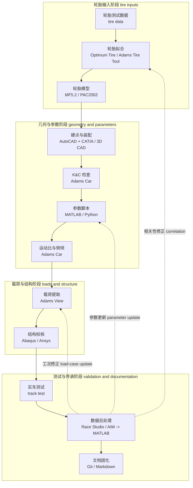
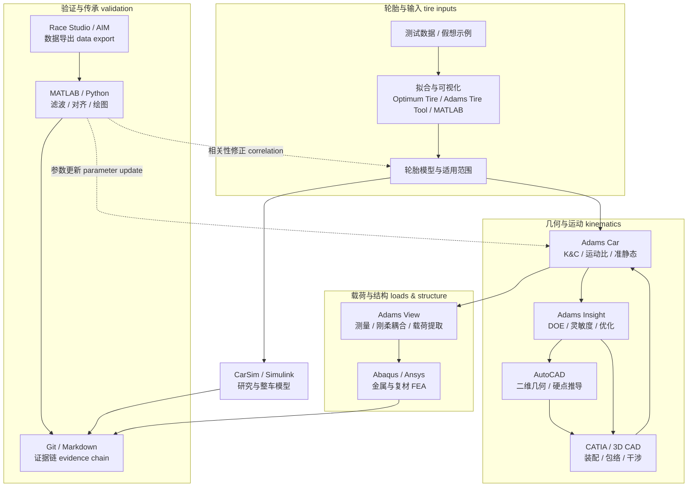
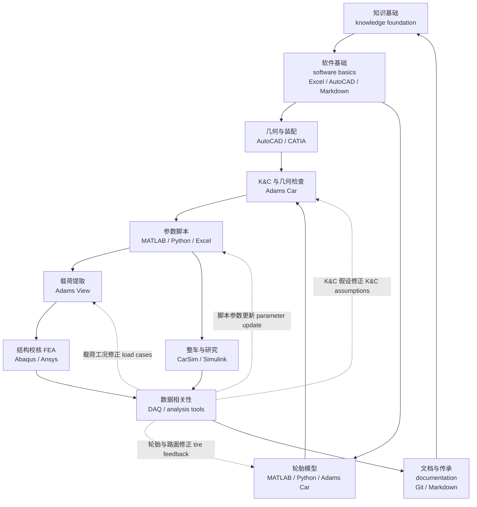

# 09 软件工作流与能力成长

## 本章解决的问题

本章面向已经读过快速预览 [09 软件路线](../09-software-roadmap.md) 的队员，进一步回答三个问题：

- 新队员应按什么顺序学习软件，才能真正服务悬架设计，而不是只会点菜单？
- 表格、CAD、多体动力学、FEA、脚本、整车仿真、数据采集和文档工具分别回答什么工程问题？
- 主力队员如何把软件输出转化为设计评审、结构校核、实车验证和比赛答辩证据？

本章讨论通用工作流和评审逻辑。内部模型文件、软件截图、精确参数设置、历史车辆编号、源数据、供应商资料或可反推出历史方案的配置组合，属于团队工程资料。所有软件建议都应回到 [01 设计目标](01-design-targets.md)、[02 轮胎与整车输入](02-tire-and-vehicle-inputs.md)、[03 几何与硬点](03-geometry-and-hardpoints.md)、[04 弹簧、阻尼、侧倾与车身姿态](04-spring-damper-roll-and-ride.md)、[05 仿真、优化与相关性验证](05-simulation-optimization-correlation.md)、[06 载荷与金属结构校核](06-loads-metal-structure.md)、[07 复合材料校核与制造风险](07-composites-and-manufacturing.md)、[08 验证、测试、答辩与传承](08-validation-testing-defense.md) 和 [10 评审清单](10-review-checklists.md)。

本章列出的商业软件是历史经验和行业常见示例，不是唯一推荐工具。开源软件、替代商业工具或自研脚本也可以使用，但必须接受同样的输入、输出、假设、版本、证据和资料边界检查。

## 学习阶段

悬架软件学习不应从“安装最多的软件”开始，而应从工程问题和输出物倒推。一个可执行的成长路线可以分成以下阶段：

| 阶段 | 目标 | 典型软件 | 合格输出 |
| --- | --- | --- | --- |
| 入组前知识 pre-entry knowledge | 补齐力学、车辆动力学、坐标系、单位、基础编程和工程制图概念 | 教材、公开课程、Excel 或其它 spreadsheet 工具 | 符号表、单位表、简单计算表、术语清单 |
| 知识体系建立 knowledge-system stage | 知道轮胎、几何、弹簧阻尼、载荷、结构和测试之间如何传递输入 | Markdown、表格、简化脚本 | 章节阅读笔记、输入输出关系图 |
| 软件初步学习 initial software stage | 会建立最小模型，并能解释输入、假设和输出 | Excel、AutoCAD、CATIA / 3D CAD、MATLAB/Python、Adams Car 入门模型 | 参数表、硬点草图、装配包络记录、第一版 K&C 曲线 |
| 轮胎阶段 tire stage | 理解轮胎数据限制、模型选择、拟合结果和整车输入 | MATLAB/Python、表格、轮胎拟合工具、Adams Car tire 数据接口 | 轮胎数据处理说明、模型适用范围、输入版本表 |
| 簧下硬点阶段 unsprung hardpoint stage | 从轮胎、轮辋、制动、转向和车架边界中确定轮端与硬点布置 | AutoCAD、CATIA / 3D CAD、Adams Car、表格 | 硬点版本、装配包络检查、K&C 指标对比 |
| 簧上布置阶段 sprung layout stage | 连接车架、减振器、摇臂、弹簧、稳定杆和车身姿态目标 | CATIA / 3D CAD、Adams Car、MATLAB/Python | 运动比、偏频、侧倾刚度和布置接口说明 |
| 全面软件阶段 full software stage | 在已理解原理后学习更复杂模型和流程，不用软件替代判断 | Adams View、Adams Insight、Abaqus/Ansys、数据处理工具 | 优化记录、载荷提取、结构校核、模型限制说明 |
| 参数设定阶段 parameter-setting stage | 把设计目标转化为可调参数、版本记录和验证计划 | Excel、MATLAB/Python、Git、Markdown | 参数设定表、敏感性分析、调校范围、评审记录 |
| 研究与整车选项 research / whole-vehicle options | 处理控制、整车动态、赛道仿真、相关性或下一代方案储备 | CarSim、Simulink、Adams full vehicle、Python 数据分析 | 研究问题定义、整车仿真结果、相关性计划 |
| 主力队员阶段 main-member responsibilities | 维护输入版本、审查模型、组织评审、准备答辩和传承材料 | Git、Markdown、报告模板、全部关键软件 | 设计证据包、答辩逻辑、下一季待验证清单 |

每个阶段都应有一个可交付物。没有输出物的学习容易变成教程浏览；没有验证的输出物容易变成不可追溯的“软件结果”。

原始学习路线强调先补齐教材中的系统知识，再进入软件训练。本手册建议把 Race Car Design、Race Car Vehicle Dynamics、Tune to Win 和 Competition Car Suspension 等资料作为可复核的学习入口；具体作者、版次和章节记录在 [references.md](../references.md)，不要把“看过教程”当作已经理解设计链路。

## 软件不是设计本身

软件能力的核心不是熟练操作，而是能回答以下问题：

- 输入来自哪里？单位、坐标系、正负号和版本是否清楚？
- 模型假设是什么？它覆盖的是运动学、动力学、强度、疲劳、制造、测试还是文档追溯？
- 输出能支持哪个设计决策？能否接到下一章的工作流中？
- 结果有没有被简化计算、独立软件、实车数据或设计评审复核？
- 如果结论被用于安全相关结构，是否保守表达，并指向进一步验证？

因此，本章把每类软件都拆成同一组字段：`工程问题`、`最低输入`、`可信输出`、`误导性用法`、`支持章节`。队员在学习任何软件前，先写清这五项，再决定是否值得投入更深的模型。

RCD / RCVD 应先被内化为工程问题，再决定使用哪种软件。也就是说，先问“这个概念在我们的车上要输入什么、输出什么、靠什么验证”，再选择表格、MATLAB/Python、MBD、FEA、数据分析或 CAD 工作流。AutoCAD 只承担二维几何和硬点草图，CATIA / 3D CAD 才承担三维包装、装配和干涉复核；软件分工不能反过来替代工程问题定义。

| RCD / RCVD 概念 | 软件任务 | 最低可评审输出 |
| --- | --- | --- |
| 轮胎行为 tire behavior | 轮胎拟合、绘图和候选对比 workflow | 数据覆盖说明、拟合残差趋势、模型适用窗口和待相关性验证项 |
| 载荷转移 / 横摆响应 load transfer / yaw response | 表格或 MATLAB/Python 计算 | 自由体图、单位和符号说明、敏感性图、与目标操稳问题的连接 |
| 运动学 / 柔度 kinematics / compliance | MBD / K&C 模型 | 刚体 K&C 曲线、柔度输入边界、异常曲线解释和复测计划 |
| 弹簧 / 侧倾 / 阻尼 spring / roll / damping | 参数 sweep 和整车模型 | 偏频、roll stiffness、motion ratio、阻尼区间、调校窗口和风险说明 |
| 结构载荷 structural loads | 力提取和 FEA boundary preparation | 载荷路径、坐标系、作用点、边界条件、网格与材料假设审查 |
| 验证 validation | 测试数据清理和 correlation report | 通道字典、滤波和时间对齐说明、仿真-实车差异、修正动作和复测计划 |

## 源文档软件工作总览

源材料中的软件路线不是“把软件名列出来”，而是把每个工具放进悬架设计链：先用教材和表格建立参数意识，再用 AutoCAD 画悬架二维几何，用 CATIA / 3D CAD 做装配包络和干涉检查，用 Adams Car 做硬点与 K&C，随后用 MATLAB / Python、Adams Insight、Adams View、Abaqus / Ansys 和实车数据形成计算、优化、载荷、结构与验证闭环。下表把这些经验整理成工作映射。

| 软件 | 手册中承担的具体工作 | 输入 | 输出 | 传给哪个设计环节 | 资料边界 |
| --- | --- | --- | --- | --- | --- |
| Excel / 表格 | 建立参数主版本、单位检查、方案对比、早期载荷与簧上参数估算 | 目标、整车参数、轮胎与弹簧阻尼假设、版本说明 | 参数总表、单位表、方案对比、计算摘要 | AutoCAD、CATIA / 3D CAD、Adams Car、MATLAB / Python、FEA | 学习模板使用假想值或范围，项目资料保存精确组合和公式表 |
| Optimum Tire | 清理轮胎测试数据、可视化轮胎特性、拟合 Magic Formula / Pacejka-style 模型、检查残差趋势 | 轮胎测试数据、坐标约定、拟合目标、模型版本 | 拟合质量说明、模型适用范围、轮胎候选对比 | 轮胎选择、Adams Car、CarSim / Simulink、整车输入 | 原始数据、精确模型参数、软件截图和授权信息由团队自行管理 |
| Adams Car Tire Data and Fitting Tool | 在 Adams 生态内完成轮胎模型拟合和接口导出，作为 Optimum Tire 不可用时的替代路线 | 格式化轮胎数据、模型类型、目标工况 | Adams 可读取的轮胎模型、拟合检查记录 | Adams Car K&C、准静态整车、后续整车模型 | 工具输出不能替代数据质量审查；内部模型文件留在项目资料中 |
| MATLAB / Python | 编写四分之一、纵向、侧向、简化整车和数据处理脚本；做偏频、阻尼、载荷转移、轮胎和测试数据分析 | 参数表、轮胎模型、减振器曲线、测试导出数据、假设说明 | 计算脚本、图表、敏感性分析、数据清洗与相关性记录 | 簧上参数、调校方向、整车验证、答辩证据 | 未授权数据、内部路径、可识别历史车辆的图表留在项目资料中 |
| AutoCAD | 画第一版悬架几何、主销几何、A 臂开角、转向拉杆几何和硬点推导 | 坐标系、轮胎 / 轮辋关键尺寸、目标几何参数、接口边界 | 二维几何草图、硬点推导、坐标说明 | Adams Car、CATIA / 3D CAD、硬点评审 | 精确点位、源图和内部草图留在项目资料中 |
| CATIA / 3D CAD | 建立三维装配，检查轮辋、制动、车架、车身、杆件、减振器、摇臂和维护空间的包络与干涉 | AutoCAD 硬点、轮胎轮辋模型、车架 / 制动 / 转向 / 传动 / 车身接口 | 装配包络、干涉检查、接口问题清单、制造与维护空间说明 | 硬点修正、结构支座、装配与制造 | 源 CAD、装配截图、精确坐标和可识别历史模型留在项目资料中 |
| Adams Car | 替换硬点、做平行轮跳、转向、侧倾与准静态整车仿真；查看 K&C、运动比、侧倾刚度趋势和稳态操稳趋势 | 硬点、轮胎模型、簧上参数、模板和工况定义 | K&C 曲线、硬点报告、运动比曲线、准静态整车趋势 | 几何优化、簧上系统、整车仿真与验证 | 内部模型、历史曲线和精确工况设置留在项目资料中 |
| Adams Insight | 基于参数化 Adams 模型做 DOE、响应面、灵敏度和硬点优化 | 设计变量、变量范围、目标函数、约束、已验证模型 | 变量影响排序、优化前后对比、拒绝方案理由 | 硬点优化、设计取舍、评审记录 | 内部权重、精确优化目标和可反推方案的结果留在项目资料中 |
| Adams View | 搭建通用多体模型、定义特殊连接、刚柔耦合、创建 measure 并提取连接点载荷 | 硬点、部件连接、轮胎受力、柔性体、坐标系和工况 | 载荷路径说明、连接点受力记录、边界条件说明 | 金属件 FEA、复合材料 FEA、结构设计修正 | 原始载荷记录、模型截图和未审查连接设置留在项目资料中 |
| Abaqus / Ansys | 做金属件与复合材料 FEA；Abaqus 还可生成柔性体并支持用户材料 / 子程序路线 | 载荷、边界、材料、连接、网格、铺层和失效准则 | FEA 评审、危险区域、位移 / 塑性 / 失效指标、修改建议 | 结构校核、制造复核、测试前 release review | 云图、材料私密值、子程序源码和状态变量编号留在项目资料中 |
| CarSim / Simulink | 做整车、控制、赛道和研究性模型；用于答辩增强和下一代技术储备 | 整车参数、轮胎模型、控制策略、路面与驾驶员假设 | 整车趋势、研究问题验证、与低阶模型 / 实车数据的对比 | 研究路线、答辩、控制协同、下一季方案 | 研究模型不能直接写成当年设计结论；整车模型留在项目资料中 |
| Race Studio / AIM 数据导出 | 读取实车采集数据并导出为表格或 MATLAB 可处理格式 | 通道字典、采样率、传感器标定、测试日志 | 清洗数据、滤波和对齐说明、仿真与实车对比 | 相关性验证、调校复盘、答辩证据 | 原始测试数据、车手视频、内部日志和可识别赛道记录留在项目资料中 |
| Git / Markdown | 固化参数来源、模型版本、评审意见、测试复盘和学习资料 / 项目资料分层 | 文档结构、忽略规则、提交规范、评审模板 | 设计证据链、变更记录、待验证清单、学习手册 | 全部章节、传承和开源发布 | 原始 PDF / DOCX、截图、数据和内部记录不进入仓库 |

这张表的重点是“软件输出会流向哪里”。例如 Adams View 的载荷输出如果没有坐标、单位、工况和连接定义，就不能直接进入 Abaqus；Race Studio 导出的数据如果没有通道字典和标定记录，也不能直接拿来修正 MATLAB 模型。软件之间的接口，比单个软件的菜单更重要。

## 按技术路线展开的软件工作链

### 轮胎阶段

轮胎阶段先回答“后续整车和悬架模型要用什么轮胎输入”。学习手册可以写清工具链和审查问题；原始测试数据和拟合参数应由团队自行管理。典型流程是：先检查测试数据覆盖范围、温度或热循环导致的差异、纯工况与联合工况是否一致；再选择 MF5.2、PAC2002 或其它 Pacejka-style 模型；随后在 Optimum Tire、Adams Car Tire Data and Fitting Tool 或 MATLAB / Python 中完成拟合、可视化和残差检查。

手册里的重要经验是：拟合工具不能消除数据边界。某些轮胎数据可能缺少纵向或联合工况，某些工况之间存在测试条件差异，软件拟合出来的曲线仍需要实车加速、制动、转向和轮胎磨耗结果来修正。因此模型说明应要求输出“模型适用范围”和“待相关性验证项”，而不是只写“轮胎模型已建立”。

### 簧下硬点阶段

簧下阶段从 AutoCAD、CATIA / 3D CAD 和 Adams Car 开始。AutoCAD 用来画第一版悬架几何、主销几何、A 臂开角和转向拉杆几何；CATIA / 3D CAD 用来把这些硬点放进三维装配，检查轮辋、制动、车架、转向、传动和车身包络是否干涉；Adams Car 用来替换硬点并进行平行轮跳、转向、侧倾等 K&C 检查。第一时间要看 CATIA 装配干涉、球铰摆角、转向拉杆路径、外倾 / 前束 / 侧倾中心 / 轮距变化是否在目标范围内。

进入优化时，Adams Insight 负责 DOE 和响应面，不负责替代工程判断。设计变量应来自结构和接口允许范围，目标函数应对应 camber、toe、roll center、anti-dive / anti-squat、track change、Ackerman 等明确指标。优化后仍要回到 CATIA / 3D CAD 装配包络、转向组接口、制动组输入、车架支座和制造限制，记录为什么接受或拒绝某个方案。

### 簧上布置阶段

簧上阶段把弹簧、阻尼、推杆 / 拉杆、摇臂、稳定杆和车身姿态目标接起来。表格负责统一参数版本，MATLAB / Python 负责偏频、阻尼、载荷转移、质心位移、轮胎相对动载和敏感性分析；Adams Car 负责检查运动比、等效轮端刚度、侧倾刚度随行程变化和机构运动；CATIA / 3D CAD 负责确认车身、车架、避震器、摇臂和维护空间能否放下、是否干涉。

手册里的经验可以整理成一个判断原则：偏频和阻尼不是孤立参数。提高偏频可能减小车身位移，却可能提高轮胎动载；阻尼调校方向应结合低速 / 高速区间、压缩 / 回弹比例、减振器可用档位和实车数据，而不是只追求某个脚本最优点。

### 全面软件阶段

全面软件阶段用于把已验证的几何和参数转成结构校核输入。Adams View 可以建立更通用的多体模型，加入特殊连接和柔性体，创建 measure 来提取连接点受力；Abaqus 可以生成柔性体供 Adams View 刚柔耦合使用，也可以对金属件和复合材料件做详细 FEA；Ansys 可作为金属结构校核的替代工具。

这里最容易出错的是“把复杂模型当可信证据”。流程文件应要求：Adams View 输出必须说明载荷方向、坐标、单位、工况、事件点和连接定义；Abaqus / Ansys 输入必须说明载荷来源、约束、网格、材料、接触、连接和失效指标。刚柔耦合可帮助理解系统载荷和柔度趋势，但局部结构强度仍要在独立 FEA、制造检查和测试后复核中评审。

### 参数设定与研究阶段

参数设定阶段强调 MATLAB / Python 和 Simulink 的长期价值。四分之一悬架模型适合看高频路面输入和轮胎相对动载，纵向模型适合看制动 / 加速下的偏频、阻尼和质心运动，侧向模型适合看侧倾刚度分配、稳态转向趋势和轮胎利用，8 自由度或更高阶模型适合做研究和答辩证据，但不应在输入不可靠时替代低阶模型。

Adams Car 准静态整车可用于检验前后侧倾刚度分配、静态外倾 / 前束设定、稳态转向趋势、方向盘力反馈和极限侧向能力的趋势判断。CarSim / Simulink 适合作为整车仿真、控制策略、赛道分析和科研路线，但应明确它是“研究与答辩增强”还是“当年设计闭环的一部分”。如果人手、参数版本和相关性证据不足，应把它写成储备路线。

### 测试与答辩阶段

测试阶段把软件结论带回实车。Race Studio / AIM 数据导出可把采集数据转成表格或 MATLAB 可读格式；MATLAB / Python 负责通道检查、单位确认、滤波、时间对齐、图表和仿真对比；Git / Markdown 负责记录调校版本、车手反馈、异常数据、复盘结论和下一轮验证计划。

答辩时，不应展示“我们用了很多软件”，而应展示“每个软件回答了哪个设计问题”。更清晰的证据链是：轮胎模型如何进入 Adams 和整车模型，悬架二维几何如何由 AutoCAD 推导，三维装配和干涉如何由 CATIA / 3D CAD 复核，K&C 如何由 Adams Car 确认，参数如何由 MATLAB / Python 与 Adams Car 交叉检查，载荷如何由 Adams View 进入 Abaqus / Ansys，实车数据如何反过来修正模型。

读图时按四个中文分组看：先把轮胎输入整理成可用模型，再把模型传给几何与参数阶段，随后把参数和工况传给载荷与结构校核，最后用实车测试和数据后处理反向修正轮胎、参数和载荷工况。

这张图不是软件清单，而是“数据怎么流动”的地图。中文分组表示工程阶段，英文用于软件、论文和搜索时常用的术语。

## 表格工具

表格工具包括 Excel、LibreOffice Calc、Google Sheets 或其它 spreadsheet 工具。它们不是“低级工具”，而是最适合早期统一参数、单位和版本的入口。

| 字段 | 内容 |
| --- | --- |
| 工程问题 | 设计参数如何被统一记录？单位、来源、版本和接口能否被别人复核？简单公式、方案对比和参数扫掠是否能在评审会上快速解释？ |
| 最低输入 | 参数名称、符号、单位、坐标系、来源、当前值、允许范围、更新时间、责任人和备注；关键公式应标明输入输出，不使用隐藏常数。 |
| 可信输出 | 参数总表、方案对比表、单位检查表、输入版本表、调校范围表、简化计算结果和可复制的图表。 |
| 误导性用法 | 公式被手工覆盖但没有标记；同一参数在 CAD、Adams Car、FEA 和脚本中存在多个版本；只保存最终值，不保存来源和修改原因；把未验证经验值写成确定结论。 |
| 支持章节 | [01 设计目标](01-design-targets.md)、[02 轮胎与整车输入](02-tire-and-vehicle-inputs.md)、[04 弹簧、阻尼、侧倾与车身姿态](04-spring-damper-roll-and-ride.md)、[05 仿真、优化与相关性验证](05-simulation-optimization-correlation.md)、[10 评审清单](10-review-checklists.md)。 |

最低练习：建立一张教学用悬架参数表，包含轮距、轴距、整车质量、簧上质量估计、轮胎半径、目标偏频、弹簧刚度、运动比和侧倾刚度分配等占位或假想参数。重点不是数值大小，而是单位、来源、版本和公式是否清楚。

## AutoCAD、CATIA 与硬点装配

AutoCAD 和 CATIA / 3D CAD 应承担不同层级的工作。AutoCAD 主要用于二维悬架几何推导：主销轴线、A 臂开角、转向拉杆几何、第一版硬点关系和坐标记录。CATIA / 3D CAD 主要用于三维装配：轮辋、制动、车架、车身、杆件、减振器、摇臂、紧固件和维护空间是否在真实包络中互相干涉。不要把 AutoCAD 二维草图当作三维干涉检查。

| 字段 | 内容 |
| --- | --- |
| 工程问题 | AutoCAD 回答几何关系是否画清楚、硬点是否可推导；CATIA / 3D CAD 回答硬点、杆件、轮辋、制动、转向、减振器、车架、车身和空气动力学包络是否能共同存在。 |
| 最低输入 | AutoCAD 需要统一坐标系、目标几何参数、轮心和关键接口；CATIA / 3D CAD 需要轮胎与轮辋模型、车架接口、转向与制动边界、目标离地间隙、轮跳行程、初始硬点表、可调结构边界和制造约束。 |
| 可信输出 | AutoCAD 输出几何草图、主销关系和硬点表；CATIA / 3D CAD 输出接口清单、静态和组合包络检查、减振器和摇臂布置草案、需要跨组确认的问题清单。 |
| 误导性用法 | 用 AutoCAD 二维图判断三维干涉；只检查 CATIA 静态装配姿态；不检查最大压缩加最大转向、回弹加转向、侧倾姿态和公差组合；坐标系与多体软件不一致；为了模型美观隐藏装配和维修空间；用未冻结的车架或轮辋边界继续优化硬点；把内部 CAD 截图或硬点精确位置写进学习资料。 |
| 支持章节 | [01 设计目标](01-design-targets.md)、[03 几何与硬点](03-geometry-and-hardpoints.md)、[04 弹簧、阻尼、侧倾与车身姿态](04-spring-damper-roll-and-ride.md)、[06 载荷与金属结构校核](06-loads-metal-structure.md)、[07 复合材料校核与制造风险](07-composites-and-manufacturing.md)。 |

最低练习：先用 AutoCAD 和假想坐标建立一套双横臂 double wishbone 轮端几何，标出上下摆臂、转向拉杆、主销轴线、减振器或推杆路径，并输出硬点表。随后在 CATIA / 3D CAD 中把这些硬点放入简化装配，做至少五类姿态检查：静态、最大压缩加最大转向、回弹加转向、侧倾姿态、制造与装配公差组合。

## Adams Car

Adams Car 适合用于悬架模板、硬点输入和 K&C 检查，但要区分刚体运动学 rigid kinematics 与柔度 compliance。硬点、模板、单位、轮跳行程和转向定义主要支持刚体运动学曲线；若要讨论 compliance 输出，还需要衬套和关节刚度、柔性部件、转向机或齿条柔度、轮胎垂向刚度假设，或来自实测 K&C 与相关性验证的数据。没有这些输入时，柔度结论应标为待补充或定性判断。

| 字段 | 内容 |
| --- | --- |
| 工程问题 | 当前硬点是否满足外倾 camber、前束 toe、主销 kingpin、后倾 caster、侧倾中心 roll center、bump steer 和轮距变化等刚体几何目标？如果要看柔度 K&C，支撑柔度的刚度和相关性证据是否齐全？ |
| 最低输入 | 刚体运动学至少需要坐标系说明、硬点表、轮胎半径与轮辋信息、基础模板、单位设置、轮跳和转向工况、输出变量定义、与 CAD 版本对应的模型编号；柔度输出还需要衬套和关节刚度、柔性部件、转向或齿条柔度、轮胎垂向刚度假设，或实测 K&C 数据。 |
| 可信输出 | 刚体 K&C 曲线、硬点报告、参数对比图、曲线趋势解释、异常曲线排查记录、与 [03 几何与硬点](03-geometry-and-hardpoints.md) 目标的逐项对照；柔度 K&C 只有在刚度输入和相关性证据明确时才作为定量输出。 |
| 误导性用法 | 把刚体 K&C 曲线称为完整 compliance 结论；模板不理解就直接套用；只看单点指标而忽略曲线趋势；用软件优化掩盖硬点输入错误；左右坐标或 toe 正负号弄反；没有测量或刚度依据却定量比较柔度；把精确模型设置和内部截图写进学习资料。 |
| 支持章节 | [02 轮胎与整车输入](02-tire-and-vehicle-inputs.md)、[03 几何与硬点](03-geometry-and-hardpoints.md)、[05 仿真、优化与相关性验证](05-simulation-optimization-correlation.md)、[08 验证、测试、答辩与传承](08-validation-testing-defense.md)。 |

最低练习：导入假想硬点，运行轮跳、转向和侧倾相关工况，导出刚体 camber gain、toe change、roll center migration 和 bump steer 曲线。每条曲线都写一句“它影响什么驾驶或结构问题”。如果没有衬套、关节、轮胎垂向刚度和实测 K&C 支撑，不把练习结果写成 compliance 结论。

## Adams View 与 Adams Insight

Adams View 和 Adams Insight 的职责不同。Adams View 更适合通用多体建模 general multibody modeling、特殊约束、刚柔耦合 rigid-flex coupling 和载荷输出；Adams Insight 更适合围绕已参数化模型管理 DOE、响应面 response surface、灵敏度 sensitivity 和优化 optimization。它们应在基础几何模型可信后使用，不应用来弥补输入混乱。

| 字段 | 内容 |
| --- | --- |
| 工程问题 | Adams View 回答特殊机构、刚柔耦合和连接点载荷如何表达；Adams Insight 回答参数化模型中的 DOE、响应面、灵敏度和优化结果是否支持设计取舍。哪些连接点载荷应传给结构校核？优化目标是否对应真实设计目标？ |
| 最低输入 | Adams View 至少需要已核对的几何模型、工况定义、轮胎或路面假设、载荷输出坐标系、单位、时间点或事件点、与结构模型一致的连接定义；Adams Insight 还需要清楚的参数化变量、设计空间、目标函数、约束、采样方案和输出指标。 |
| 可信输出 | Adams View 的可信输出包括载荷数据表、载荷路径说明、特殊约束解释、刚柔耦合假设和传递给 [06 载荷与金属结构校核](06-loads-metal-structure.md) 或 [07 复合材料校核与制造风险](07-composites-and-manufacturing.md) 的边界条件说明；Adams Insight 的可信输出包括 DOE 记录、响应面适用范围、灵敏度排序、约束激活情况、优化前后对比和未覆盖区域说明。 |
| 误导性用法 | 把 Adams View 的复杂模型当成输入可信的证据；只导出最大力而不说明方向、工况和坐标系；刚柔耦合模型很复杂但材料、连接和约束不可信；用 Adams Insight 在没有工程边界的设计空间里做数值优化；把响应面外推或局部最优点当成唯一方案；把内部载荷值或模型截图写进学习资料。 |
| 支持章节 | [03 几何与硬点](03-geometry-and-hardpoints.md)、[05 仿真、优化与相关性验证](05-simulation-optimization-correlation.md)、[06 载荷与金属结构校核](06-loads-metal-structure.md)、[07 复合材料校核与制造风险](07-composites-and-manufacturing.md)、[10 评审清单](10-review-checklists.md)。 |

最低练习：基于已验证的几何模型定义一个教学用假想极限工况，导出关键硬点反力，并写清载荷方向、单位、坐标系、适用范围和不能覆盖的工况。

## Abaqus 与 Ansys

Abaqus 与 Ansys 用于金属和复合材料结构检查。FEA 的价值不在于彩色应力云图，而在于能否把载荷、约束、材料、连接、网格和失效判断解释清楚。

| 字段 | 内容 |
| --- | --- |
| 工程问题 | 零件在定义载荷、材料和边界假设下是否存在明显强度、刚度、稳定性、制造或连接风险？高风险区域来自几何、材料、连接、制造还是边界条件？金属件、复合材料件和连接区需要怎样修改？ |
| 最低输入 | 载荷来源、坐标系、约束含义、材料参数、几何简化原则、连接方式、网格策略、接触或螺栓假设、评价指标、允许应力或失效准则来源；复合材料还需要铺层方向 ply orientation、层合板坐标系 laminate coordinate system、厚度、铺层顺序 stacking sequence、连接和嵌件 insert 假设，以及失效指数 failure index 的解释。 |
| 可信输出 | FEA 报告、网格和边界条件说明、位移与应力解释、安全系数或失效指标、奇异点判断、设计修改建议、需要试验或复核的风险清单。 |
| 误导性用法 | 约束过硬导致刚度虚高；只看最大应力而不判断奇异点；载荷来自未经审查的多体模型；复合材料按各向同性金属处理，或没有定义铺层方向、层合板坐标、厚度、铺层顺序、连接嵌件和失效指数解释；网格无收敛检查；把内部云图、载荷数据表或材料私密数据写进学习资料。 |
| 支持章节 | [06 载荷与金属结构校核](06-loads-metal-structure.md)、[07 复合材料校核与制造风险](07-composites-and-manufacturing.md)、[08 验证、测试、答辩与传承](08-validation-testing-defense.md)、[10 评审清单](10-review-checklists.md)。 |

最低练习：选择一个假想支架，用保守假想载荷做线性静力检查。报告中必须包含载荷路径、约束原因、网格检查、最大位移、危险区域、是否可能为奇异点、下一轮结构修改建议。

## MATLAB 与 Python

MATLAB 与 Python 用于可复现计算、数据处理、参数扫掠、绘图、轮胎数据理解、简化车辆模型和测试数据分析。它们连接“公式”和“工程判断”，也最适合沉淀为可维护脚本。

| 字段 | 内容 |
| --- | --- |
| 工程问题 | 参数选择是否有可复现依据？轮胎、偏频、阻尼、载荷转移、G-G 图、调校记录和测试数据能否被统一处理？结论能否通过图表和脚本复核？ |
| 最低输入 | 参数配置文件或表格、单位说明、坐标和符号约定、数据来源、滤波和插值方法、脚本版本、输出目录、图表标题和轴单位。 |
| 可信输出 | 计算脚本、可复现图表、敏感性分析、轮胎或整车数据处理记录、简化模型结果、输入版本快照、异常数据说明。 |
| 误导性用法 | 参数写死在脚本中且不记录来源；图表没有单位、工况和版本；过度拟合；用复杂模型掩盖基础假设不清；脚本结果无法复跑；把未经授权的数据打包进仓库。 |
| 支持章节 | [02 轮胎与整车输入](02-tire-and-vehicle-inputs.md)、[04 弹簧、阻尼、侧倾与车身姿态](04-spring-damper-roll-and-ride.md)、[05 仿真、优化与相关性验证](05-simulation-optimization-correlation.md)、[08 验证、测试、答辩与传承](08-validation-testing-defense.md)。 |

最低练习：写一个 MATLAB 或 Python 脚本，读取教学用假想参数表，计算轮端刚度、偏频和简单载荷转移趋势，并输出带单位的图。脚本开头写明输入、单位、假设和不能代表真实车辆的边界。

## CarSim 与 Simulink

CarSim 与 Simulink 适合整车行为、控制策略、赛道工况、驾驶员模型、动力系统接口和研究性验证。它们通常属于进阶或主力队员阶段，应服务明确研究问题，而不是替代基础设计闭环。

| 字段 | 内容 |
| --- | --- |
| 工程问题 | 整车响应、控制策略、赛道仿真、制动或驱动控制、横摆稳定性、不同悬架参数对整车性能的影响是否需要高层模型？研究结论能否反馈到当年设计或下一代方案？ |
| 最低输入 | 整车质量和惯量范围、轮胎模型版本、悬架等效参数、动力和制动输入、驾驶员或控制策略假设、路面与工况定义、低阶模型对照、输出指标。 |
| 可信输出 | 整车仿真结果、输入版本表、与低阶模型或实车数据的对比、研究问题是否成立的说明、后续测试和相关性计划。 |
| 误导性用法 | 在基础参数不可靠时追求整车复杂度；不同组输入没有版本控制；模型默认参数未审查；把研究性结论直接写成当年设计定论；把内部整车模型和精确设置写进学习资料。 |
| 支持章节 | [01 设计目标](01-design-targets.md)、[02 轮胎与整车输入](02-tire-and-vehicle-inputs.md)、[05 仿真、优化与相关性验证](05-simulation-optimization-correlation.md)、[08 验证、测试、答辩与传承](08-validation-testing-defense.md)。 |

最低练习：定义一个明确研究问题，例如“前后侧倾刚度分配变化是否影响稳态转向趋势”。先用简化脚本得到预期，再在 CarSim 或 Simulink 中建立教学用等效模型，比较趋势而不是追求私有实车数值。

## 数据采集与分析

数据采集工具 data acquisition tools 包括传感器、数据记录器、CAN 工具、IMU、位移传感器、温度和压力采集、圈速系统，以及与它们配套的数据导出和分析软件。数据工作连接 [08 验证、测试、答辩与传承](08-validation-testing-defense.md)，也是仿真相关性 correlation 的核心证据。

| 字段 | 内容 |
| --- | --- |
| 工程问题 | 实车是否按模型预测工作？车手反馈、传感器数据和仿真曲线是否能互相解释？调校改动是否留下可复核证据？ |
| 最低输入 | 测试目标、通道清单、采样率、传感器标定、时间同步、坐标方向、车辆状态、调校版本、天气和场地记录、数据权限边界。 |
| 可信输出 | 测试日志、通道字典、清洗后的数据集、滤波和对齐说明、关键图表、仿真与实车对比、异常数据标记、下一轮测试建议。 |
| 误导性用法 | 采样率不够却分析高频现象；传感器方向或零点错误；没有时间同步；只有截图却没有原始记录和处理脚本；把原始测试数据上传到仓库。 |
| 支持章节 | [05 仿真、优化与相关性验证](05-simulation-optimization-correlation.md)、[08 验证、测试、答辩与传承](08-validation-testing-defense.md)、[10 评审清单](10-review-checklists.md)。 |

最低练习：用一组示例 CSV 或自造数据，完成通道字典、单位检查、时间对齐、低通滤波、圈段切分和一页测试复盘。重点是流程可复跑，不是数据看起来漂亮。

## Git、Markdown 与版本化报告

Git、Markdown 和版本化报告工具负责把设计过程变成可追溯资产。它们不只服务代码，也服务学习文档、参数说明、脚本、评审记录、测试复盘和答辩证据包。

| 字段 | 内容 |
| --- | --- |
| 工程问题 | 参数来源、设计结论、评审意见、脚本、学习文档和测试复盘能否被追溯？下一位队员能否知道为什么这样改？学习材料与项目材料能否清楚分层？ |
| 最低输入 | 仓库结构、忽略规则、资料边界、提交信息规范、文档模板、参数和脚本版本、评审记录格式、导出报告的生成方法。 |
| 可信输出 | 清晰提交记录、Markdown 设计说明、版本化评审报告、可复跑脚本、变更日志、待验证项、可维护的说明文档。 |
| 误导性用法 | 只把最终 PDF 当作资料；把聊天记录当作唯一决策依据；提交原始数据、内部截图或私有模型；报告没有链接到参数版本、脚本和验证证据；提交信息无法说明工程变化。 |
| 支持章节 | [01 设计目标](01-design-targets.md) 到 [08 验证、测试、答辩与传承](08-validation-testing-defense.md) 的全部设计链，以及 [10 评审清单](10-review-checklists.md)。 |

最低练习：为一个假想设计改动写 Markdown 评审记录，包含背景、输入版本、改动内容、影响章节、验证证据、风险和下一步。用 Git 提交这份记录，并保证提交信息能让半年后的队员看懂。

## 软件能力路线图

下面的路线图强调软件之间的依赖关系：知识基础先于软件，硬点和轮胎模型先于整车复杂模型，载荷提取先于结构校核，数据相关性和文档沉淀贯穿整个循环。

一条健康的软件路线有三个闭环：

- 设计闭环：目标、轮胎、硬点、簧上参数、仿真和结构校核互相一致。
- 验证闭环：仿真输出、实车测试、车手反馈和数据分析互相解释。
- 传承闭环：输入版本、脚本、报告、评审问题和答辩证据被 Git 与 Markdown 固化。

## 输出物

软件工作流的交付物不应只是“模型文件已经做好”。建议每个阶段至少留下以下可复用或项目自管的输出：

| 输出物 | 用途 | 写法建议 |
| --- | --- | --- |
| 软件能力矩阵 | 说明每类工具回答的问题、输入、输出和责任人 | 学习模板写通用结构，项目资料保存软件截图和许可证信息 |
| 参数总表 | 统一设计参数、单位、来源和版本 | 学习文档使用假想值或范围，项目资料保存历史精确组合 |
| AutoCAD 几何与 CATIA 装配说明 | 连接二维几何、三维包络、接口和制造约束 | 学习文档解释检查方法，项目资料保存硬点精确位置、CAD 截图和源模型 |
| K&C 报告 | 检查刚体几何曲线和硬点修改影响；柔度 K&C 需额外说明刚度输入或实测相关性 | 学习文档解释曲线读法，项目资料保存可识别历史车辆的曲线、柔度参数或实测数据 |
| 载荷提取说明 | 把多体模型输出传给结构校核 | 学习文档写传递逻辑，项目资料保存原始载荷数据表和内部工况配置 |
| FEA 评审报告 | 解释边界条件、结果和修改建议；复合材料需包含铺层方向、层合板坐标、厚度、铺层顺序、连接嵌件假设和失效指数解释 | 学习文档写审查方法，项目资料保存供应商材料私密数据、内部云图和受限图像 |
| 数据处理脚本 | 让测试和仿真对比可复跑 | 脚本共享前清理路径、原始数据和私有字段 |
| 版本化设计报告 | 支撑设计评审、答辩和下一季传承 | 区分学习手册、项目报告和比赛材料 |

## 常见错误

- 先学高级软件，后补基础单位、坐标和物理假设，导致模型越复杂越难评审。
- 在 Excel、AutoCAD、CATIA、Adams Car、Abaqus/Ansys 和 MATLAB/Python 中维护多套参数，却没有主版本。
- 把软件默认模板当作工程判断，无法说明约束、轮胎、材料、接触和输出变量的含义。
- 只交截图，不交输入、版本、脚本、坐标系和可复核结论。
- 把 Adams Insight 的最优解、FEA 的最大应力或 CarSim 的圈速结果当作单独结论，不回到设计目标和验证计划。
- 把内部模型文件、源数据、软件截图、精确设置、历史车辆参数或未经授权的供应商资料提交到仓库。
- 主力队员只自己会操作软件，没有把最低工作流、检查问题和失败案例写成 Markdown 传承材料。

## 验证与评审

软件工作流评审应按“输入、模型、输出、传递、验证”五步进行：

| 评审项 | 检查问题 |
| --- | --- |
| 输入 | 参数来源、单位、坐标系、版本和责任人是否清楚？是否与目标、轮胎、AutoCAD、CATIA、仿真和结构章节一致？ |
| 模型 | 模型假设是否覆盖当前工程问题？是否存在默认设置、模板或边界条件未解释？ |
| 输出 | 输出变量是否能支持决策？图表是否有单位、工况、版本和曲线解释？ |
| 传递 | 输出如何传给下一环节，例如从 Adams View 到 FEA，或从测试数据到相关性修正？ |
| 验证 | 是否有简化计算、独立工具、试验数据、车手反馈或评审问题来交叉检查？ |

主力队员还应承担三类责任：

- 模型责任：维护参数主版本，明确哪些模型可信、哪些只是学习或探索。
- 评审责任：在设计冻结、结构校核、加工前、测试前和答辩前组织软件输出检查。
- 传承责任：把教程经验改写成任务式文档，保留失败案例、排查步骤和下一季待验证问题。

答辩准备时，不要展示“我会很多软件”。更有说服力的说法是：设计目标如何分解，哪个工具回答哪个问题，输入如何版本化，输出如何被结构和实车验证，哪些结论仍然保守或待验证。

## 与其它章节的关系

- 与 [../09-software-roadmap.md](../09-software-roadmap.md)：预览层说明软件类别和最小任务，本章展开字段化工作流、学习阶段和评审责任。
- 与 [01 设计目标](01-design-targets.md)：软件输入应从目标、规则、接口和约束出发，避免无目标建模。
- 与 [02 轮胎与整车输入](02-tire-and-vehicle-inputs.md)：轮胎模型、整车参数和数据限制决定 Adams Car、CarSim、Simulink 和脚本分析的可信边界。
- 与 [03 几何与硬点](03-geometry-and-hardpoints.md)：AutoCAD 负责硬点初始化和二维悬架几何推导，CATIA / 3D CAD 负责组合包络和装配干涉检查，Adams Car 负责刚体 K&C 对比；柔度 K&C 需要额外刚度输入或实测相关性。
- 与 [04 弹簧、阻尼、侧倾与车身姿态](04-spring-damper-roll-and-ride.md)：Excel、MATLAB/Python 和 Adams Car 支持偏频、阻尼、运动比、侧倾刚度和调校范围计算。
- 与 [05 仿真、优化与相关性验证](05-simulation-optimization-correlation.md)：Adams View 负责更通用的多体、刚柔耦合和载荷输出，Adams Insight 负责 DOE、响应面、灵敏度和优化管理；CarSim、Simulink 和数据分析工具应服从模型分层、优化边界和相关性验证。
- 与 [06 载荷与金属结构校核](06-loads-metal-structure.md)：Adams View 的载荷输出和 Abaqus/Ansys 的边界条件必须共享坐标、单位和工况定义；Adams Insight 只管理参数化模型结果的 DOE、响应面、灵敏度和优化，不作为载荷提取工具。
- 与 [07 复合材料校核与制造风险](07-composites-and-manufacturing.md)：复合材料 FEA 需要材料、铺层方向、层合板坐标系、厚度、铺层顺序、连接和嵌件假设、失效指数解释与制造假设，不应只套用金属件流程。
- 与 [08 验证、测试、答辩与传承](08-validation-testing-defense.md)：数据采集与分析把软件结果带回实车，Git 与 Markdown 帮助形成答辩证据和传承材料。
- 与 [10 评审清单](10-review-checklists.md)：本章的软件字段可转化为评审清单，检查每个模型是否有工程问题、最低输入、可信输出、误导性用法和支持章节。
