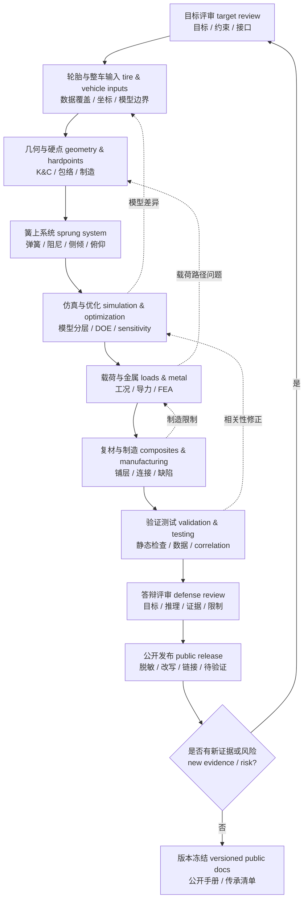

# 10 高级评审清单

## 本章解决的问题

快速预览层的 [10 检查清单](../10-checklists.md) 适合新队员建立评审顺序。本章把高级手册 [01](01-design-targets.md) 到 [09](09-software-workflows.md) 的证据要求整理成 review gates：每个阶段不仅问“做了吗”，还要问“证据是什么、风险在哪里、哪些内容不能公开、结论影响哪一章”。

本清单服务三个目标：

- 帮助团队在设计冻结、结构释放、测试前、答辩前和公开发布前做一致评审。
- 把目标、轮胎、硬点、簧上系统、仿真、载荷、复材、验证、软件和文档连接成同一条证据链。
- 保护公开仓库边界：发布改写后的工程逻辑，不发布原始数据、历史车辆识别信息、源截图、源文件名、复制段落、内部表格或能反推出具体赛车的参数组合。

本章不是安全认证，也不能替代规则审查、专业结构评审、制造质量控制、现场测试流程和团队内部 release decision。若证据不足，应写成“待验证”或“带风险通过”，而不是把未发现问题包装成已经证明。

## 如何使用本清单

建议把每次评审结论分成四类：`通过`、`带风险通过`、`退回修改`、`暂停公开`。`通过` 表示证据足以进入下一阶段；`带风险通过` 必须写清关闭条件；`退回修改` 说明当前输入或结论无法支撑下一步；`暂停公开` 表示内容可能包含私有数据、未授权图像、内部编号或来源暴露风险。

使用方式：

1. 先读快速版 [10 检查清单](../10-checklists.md)，确认整体顺序。
2. 对照本章每张表，逐项填写证据链接、负责人、版本和结论等级。
3. 若某项没有证据，不要用经验补空；写成待补充，并指向对应高级章节。
4. 若某项使用内部资料，只公开字段、流程和改写后的判断，不公开原始值、源图、源表和文件名。
5. 每次轮胎模型、硬点、质量、弹簧阻尼、载荷、制造或测试数据变化后，重新打开受影响章节。

## 目标与接口评审

| 问题 | 需要的证据 | 常见风险 | 不公开内容 | 对应章节 |
| --- | --- | --- | --- | --- |
| 悬架目标是否能追溯到整车目标、规则、车手反馈或上一轮验证问题？ | 目标分解表、规则版本、反馈现象记录、验证矩阵和更新触发条件 | 直接沿用旧车目标；把口号当成可验证目标；目标之间冲突但未记录取舍 | 历史成绩、车辆编号、内部目标数值、未脱敏车手记录 | [01 设计目标](01-design-targets.md)、[08 验证测试](08-validation-testing-defense.md) |
| 规则派生门槛是否已经进入目标表？ | 当前赛事规则版本、wheel travel / jounce、安装点可视性、wheelbase / track、ground clearance、wheel / tire / fastener 相关检查项 | 把规则最低值当性能目标；规则检查留到装车后；只看往年规则 | 内部 scrutineering 表、未确认规则解释、可识别车辆测量值 | [01 设计目标](01-design-targets.md)、[03 几何硬点](03-geometry-and-hardpoints.md)、[04 弹簧阻尼](04-spring-damper-roll-and-ride.md) |
| 目标、约束 constraint 和偏好 preference 是否分开管理？ | 每项目标的类型、单位、来源、负责人、验证方法和受影响章节 | 把熟悉的布置当成硬约束；用偏好压过规则、安全或制造边界 | 具体内部责任人、会议原始记录、可识别项目计划 | [01 设计目标](01-design-targets.md) |
| 跨组接口是否闭合？ | 车架、转向、制动、传动、气动、车身、制造、测试接口表；坐标系和单位说明 | 只和车架确认硬点；轮辋、制动或传动晚变更导致几何返工 | 精确硬点、未授权 CAD 截图、内部接口文件名 | [01 设计目标](01-design-targets.md)、[03 几何硬点](03-geometry-and-hardpoints.md) |
| 早期输入变化是否触发重新评审？ | 轮胎模型、质量、质心、轮距、车架节点、规则和测试结果的变更日志 | 上游输入更新后，偏频、载荷、硬点和仿真继续使用旧版本 | 内部版本库路径、原始变更表、历史参数组合 | [01 设计目标](01-design-targets.md)、[05 仿真优化](05-simulation-optimization-correlation.md)、[09 软件工作流](09-software-workflows.md) |

## 轮胎与整车输入评审

| 问题 | 需要的证据 | 常见风险 | 不公开内容 | 对应章节 |
| --- | --- | --- | --- | --- |
| 轮胎数据覆盖是否匹配设计工况？ | `F_z`、`alpha`、`kappa`、`camber`、胎压、温度、轮辋、速度和联合滑移覆盖矩阵 | 只看峰值侧向力；缺少联合滑移却做制动入弯定量结论 | 原始轮胎数据、私有曲线、具体型号对比表、供应商资料 | [02 轮胎输入](02-tire-and-vehicle-inputs.md) |
| 坐标、符号和单位是否统一？ | SAE / ISO-style 转换说明、左右轮镜像规则、单轮扫描和符号 sanity check | `F_y`、`M_z`、toe、camber 或 slip ratio 正负号反了 | 软件原始设置截图、内部转换脚本路径、源数据文件名 | [02 轮胎输入](02-tire-and-vehicle-inputs.md)、[09 软件工作流](09-software-workflows.md) |
| 轮胎模型的用途和边界是否写清？ | 模型形式、拟合残差、设计窗口、外推限制、版本、更新触发和 correlation 计划 | Magic Formula / Pacejka-style 拟合好看但设计窗口局部失真；模型被用于结构安全证明 | 模型拟合参数、原始残差图、授权受限模型文件 | [02 轮胎输入](02-tire-and-vehicle-inputs.md)、[05 仿真优化](05-simulation-optimization-correlation.md) |
| 整车输入是否与后续模型同版本？ | 质量、质心、轴距、轮距、角重、气动、制动 / 驱动边界和悬架参数版本表 | 轮胎、质量和硬点来自不同冻结状态；动态轮荷未进入簧上和载荷讨论 | 历史精确质量属性、内部角重表、比赛策略输入 | [02 轮胎输入](02-tire-and-vehicle-inputs.md)、[04 弹簧阻尼](04-spring-damper-roll-and-ride.md)、[06 载荷金属](06-loads-metal-structure.md) |

## 几何与硬点评审

| 问题 | 需要的证据 | 常见风险 | 不公开内容 | 对应章节 |
| --- | --- | --- | --- | --- |
| 坐标系、单位、左右镜像和硬点版本是否可追溯？ | 硬点表模板、CAD / K&C 版本、点位命名、来源和接口状态 | CAD、K&C、FEA 和测量各用一套坐标；左右镜像异常 | 硬点精确位置、源 CAD 截图、内部硬点文件名 | [03 几何硬点](03-geometry-and-hardpoints.md)、[09 软件工作流](09-software-workflows.md) |
| 规则相关几何包络是否已扫描？ | wheel travel / jounce、轮辋内 clearance、安装点 visibility、极限转向、bump / rebound 和含车手车高状态 | 只检查静态直行姿态；满足曲线目标但不满足技术检查或维护检查 | 车辆专属测量值、技术检查照片、内部整改记录 | [01 设计目标](01-design-targets.md)、[03 几何硬点](03-geometry-and-hardpoints.md) |
| 主销、正视、侧视和转向几何是否服务轮胎与整车目标？ | caster、KPI / SAI、scrub radius、mechanical trail、roll center、camber、toe、Ackermann、anti-dive / anti-squat 的目标来源 | 为单条曲线优化，破坏转向力、制动稳定、包络或载荷路径 | 历史目标值、内部曲线包、源图和可识别参数组合 | [02 轮胎输入](02-tire-and-vehicle-inputs.md)、[03 几何硬点](03-geometry-and-hardpoints.md) |
| K&C 工况是否覆盖组合姿态？ | 平行跳动、单轮跳动、转向、侧倾、制动、加速、组合极限姿态的曲线和解释 | 只看静态或平行跳动；bump steer、roll center migration 或极限转向干涉漏检 | 未脱敏 K&C 图、商业软件截图、精确模型设置 | [03 几何硬点](03-geometry-and-hardpoints.md)、[05 仿真优化](05-simulation-optimization-correlation.md) |
| 包络、制造、维护和结构路径是否一起评审？ | 轮辋 / 制动 / 转向 / 传动 / 气动 / 车架包络检查，杆端摆角和工具空间记录 | 曲线通过但车上装不下；支座不在合理节点；调校件赛场不可达 | 内部 CAD 截面、制造夹具尺寸、车辆专属孔位 | [03 几何硬点](03-geometry-and-hardpoints.md)、[06 载荷金属](06-loads-metal-structure.md) |

## 弹簧阻尼与侧倾评审

| 问题 | 需要的证据 | 常见风险 | 不公开内容 | 对应章节 |
| --- | --- | --- | --- | --- |
| 轮端刚度、弹簧刚度、轮胎刚度和偏频定义是否清楚？ | `k_s`、`k_w`、`k_t`、`k_eff`、`MR_x`、单角簧上质量、单位和模型约定 | 运动比定义倒置；把轮胎刚度混入 wheel rate 却不标注 | 历史弹簧参数、角重数值、源计算表 | [04 弹簧阻尼](04-spring-damper-roll-and-ride.md) |
| 阻尼目标是否落在真实工作区间？ | 阻尼器速度-力曲线、轮端速度换算、低 / 中 / 高速区间、压缩 / 回弹方向和台架或待验证说明 | 只给名义阻尼比；没有速度直方图；调节档位在轮端不可分辨 | 阻尼器私有曲线、具体档位配方、供应商数据 | [04 弹簧阻尼](04-spring-damper-roll-and-ride.md)、[08 验证测试](08-validation-testing-defense.md) |
| 侧倾刚度分配、俯仰和附加弹性元件是否与轮胎和气动目标一致？ | 前后侧倾刚度贡献、roll gradient、动态轮荷、anti-dive / anti-squat、第三弹簧或限位触发逻辑 | 只追求车身更稳；忽略轮胎动载和路面跟随；非线性限位无法解释 | 历史侧倾配方、第三弹簧垫片组合、比赛调校策略 | [02 轮胎输入](02-tire-and-vehicle-inputs.md)、[04 弹簧阻尼](04-spring-damper-roll-and-ride.md)、[05 仿真优化](05-simulation-optimization-correlation.md) |
| 行程、运动比、布置和可调范围是否可制造可测试？ | 全行程 motion ratio 曲线、减振器行程、pushrod / pullrod 载荷、摇臂支座、限位和维护记录 | 静态运动比合理但全行程突变；触底或顶死；换簧和调防倾杆不可重复 | 精确摇臂孔位、内部布置图、专用制造尺寸 | [03 几何硬点](03-geometry-and-hardpoints.md)、[04 弹簧阻尼](04-spring-damper-roll-and-ride.md) |
| 可用行程是否按规则状态实测或可测？ | 含车手状态、目标车高、胎压、bump / rebound、damper stroke、bump stop、spring stack 和测量方法 | 靠静态运动比推断可用行程；预载或限位提前吃掉 jounce | 实车专属行程数值、技术检查整改照片、内部调校表 | [04 弹簧阻尼](04-spring-damper-roll-and-ride.md)、[08 验证测试](08-validation-testing-defense.md) |

## 仿真、优化与相关性评审

| 问题 | 需要的证据 | 常见风险 | 不公开内容 | 对应章节 |
| --- | --- | --- | --- | --- |
| 仿真是否从明确设计问题出发？ | 设计问题、模型层级选择、模型边界、输入版本和预期输出 | 先建复杂模型再倒推用途；用高保真包装低可信输入 | 内部模型文件、软件截图、精确求解设置 | [05 仿真优化](05-simulation-optimization-correlation.md) |
| 数量级、符号、左右镜像和单位是否通过 sanity check？ | 手算或表格对照、自由体图、动画检查、通道符号说明和后处理脚本版本 | 图表平滑但力方向错；线性模型结果用于极限联合滑移 | 原始仿真结果表、源脚本路径、可识别图表 | [02 轮胎输入](02-tire-and-vehicle-inputs.md)、[05 仿真优化](05-simulation-optimization-correlation.md)、[09 软件工作流](09-software-workflows.md) |
| DOE、灵敏度和优化是否有工程边界？ | design variables、objective function、constraints、weights、变量范围、拒绝方案和原因 | 优化器找到不可制造、不可装配或超出数据覆盖的方案 | 精确权重、内部目标函数表、历史优化结果 | [03 几何硬点](03-geometry-and-hardpoints.md)、[05 仿真优化](05-simulation-optimization-correlation.md) |
| 公开资料交叉验证是否记录？ | 规则、SAE 论文摘要、公开项目页、开放论文或测试案例支持了哪些流程判断；访问日期和使用边界 | 用单一内部经验写成普遍规则；引用公开案例却照搬其参数或百分比 | 受版权保护全文、未授权图表、内部源文件名 | [05 仿真优化](05-simulation-optimization-correlation.md)、[../references.md](../references.md) |
| 实车相关性是否诚实记录？ | 测试版本、仿真版本、一致处、差异处、修正动作和复核计划 | 为贴合一次测试过度校准；没有先检查传感器和测试条件 | 原始测试数据、内部视频、精确分段成绩 | [05 仿真优化](05-simulation-optimization-correlation.md)、[08 验证测试](08-validation-testing-defense.md) |

## 载荷与金属结构评审

| 问题 | 需要的证据 | 常见风险 | 不公开内容 | 对应章节 |
| --- | --- | --- | --- | --- |
| 载荷工况是否覆盖真实事件场景？ | 纯制动、稳态转弯、制动入弯、出弯加速、路面冲击、维护 / 顶车等工况定义 | 只取纯工况；机械叠加不可能同时出现的峰值；漏掉维护误操作 | 历史载荷数据表、原始工况数值、内部测试峰值 | [06 载荷金属](06-loads-metal-structure.md) |
| 载荷来源、坐标和版本是否可追溯？ | 理论估算、多体导力、刚柔耦合或测试来源，作用点、方向、单位、峰值时刻和输入版本 | 手算、多体和测试载荷混表；局部坐标转换错误 | 多体原始输出、内部后处理脚本路径、源文件名 | [05 仿真优化](05-simulation-optimization-correlation.md)、[06 载荷金属](06-loads-metal-structure.md) |
| 载荷模型是否有实车相关性计划？ | 应变片、悬架位移、轮速、方向盘角、制动压力、IMU 或赛后物理检查的可测通道；标定和时间同步方案 | FEA 释放后才想起没有任何载荷证据；传感器只能看现象不能闭合载荷路径 | 原始通道数据、内部传感器布置照片、供应商私密信息 | [06 载荷金属](06-loads-metal-structure.md)、[08 验证测试](08-validation-testing-defense.md) |
| FEA 边界条件是否接近真实连接？ | ball joint、rod end、bearing、bracket、weld、fastener、contact、网格和材料说明 | 全固定真实铰接；单点力代替垫片或轴承分布载荷 | 源 CAD、FEA 云图、材料私密值、内部截图 | [06 载荷金属](06-loads-metal-structure.md)、[09 软件工作流](09-software-workflows.md) |
| 结果解释是否覆盖强度以外的风险？ | load path、位移、应力集中、singularity、plasticity indicator、PEEQ / 等效塑性应变、fatigue、buckling、fastener、weld、制造和设计修正记录 | 只看最大应力；把奇异点当失效或把真实热点当数值伪影；不解释屈服或塑性变量含义 | 历史应力值、安全系数表、未脱敏失效照片、未公开材料参数 | [06 载荷金属](06-loads-metal-structure.md)、[08 验证测试](08-validation-testing-defense.md) |

## 复合材料与制造评审

| 问题 | 需要的证据 | 常见风险 | 不公开内容 | 对应章节 |
| --- | --- | --- | --- | --- |
| 复材失效模式是否逐项识别？ | fiber tension / compression、matrix tension / compression、shear、delamination、local crushing、buckling、pull-out 风险表 | 把复材当各向同性金属；只看一个等效应力或 failure index | 私有铺层表、源公式、材料供应商值、历史失效图 | [07 复材制造](07-composites-and-manufacturing.md) |
| 材料、铺层和坐标系是否与制造一致？ | allowables 来源、折减策略、laminate coordinate system、ply angle、厚度、局部补强和镜像规则 | ply 方向翻转；左右件镜像错误；材料数据与实际工艺不匹配 | 历史铺层参数、材料批次私密信息、内部 coupon 数值 | [07 复材制造](07-composites-and-manufacturing.md)、[09 软件工作流](09-software-workflows.md) |
| 连接区和载荷引入是否单独评审？ | 螺栓孔、胶接、嵌件、碳管端部、硬点夹持、垫片、套筒和局部子模型说明 | 中间区域通过但硬点 delamination、crushing 或 pull-out 风险未覆盖 | 内部连接图、胶接配方、嵌件尺寸、未授权照片 | [06 载荷金属](06-loads-metal-structure.md)、[07 复材制造](07-composites-and-manufacturing.md) |
| 制造质量、coupon 和实车复查是否进入 release decision？ | 工艺记录、首件检查、缺陷分级、coupon / joint test、停用标准和赛后复查计划 | 仿真假设完美制造；发现压痕、分层、异响或松动后继续性能测试 | 原始试验数据、内部缺陷照片、供应商或工艺保密表 | [07 复材制造](07-composites-and-manufacturing.md)、[08 验证测试](08-validation-testing-defense.md) |

## 验证、测试与答辩评审

| 问题 | 需要的证据 | 常见风险 | 不公开内容 | 对应章节 |
| --- | --- | --- | --- | --- |
| 每个关键目标是否有验证路径？ | validation matrix、测试方法、数据通道、通过标准、未验证风险和测试顺序 | 目标阶段没有定义数据通道；测试后才补解释 | 精确测试阈值、内部原始日志、比赛策略 | [01 设计目标](01-design-targets.md)、[08 验证测试](08-validation-testing-defense.md) |
| 测试前静态检查是否闭合？ | 车高、角重、toe / camber、胎压胎温、行程限位、紧固、干涉、传感器标定和时间同步记录 | 车辆状态不等于仿真假设；通道方向、零点或时间错位 | 车辆专属设定值、内部检查照片、数据采集文件名 | [08 验证测试](08-validation-testing-defense.md) |
| 动态测试继续前，停测条件和恢复条件是否定义？ | S0-S3 或等效 issue grading、safety stop conditions、降级测试速度 / 工况边界、安全负责人 sign-off、修复后 restart / recovery criteria | 安全异常被降级成调校问题；没有负责人批准就继续动态测试；修复后未复查即恢复性能测试 | 内部事故记录、未脱敏故障照片、个人签字记录、现场原始日志 | [08 验证测试](08-validation-testing-defense.md) |
| 测试和调校是否支持因果判断？ | 每轮变量、预期变化、数据结果、车手现象、工程推断、下车检查和结论强度 | 一次改多个变量；把车手反馈直接当根因；只看单次圈速 | 车手个人记录、分段成绩、原始视频和未脱敏语音 | [08 验证测试](08-validation-testing-defense.md)、[05 仿真优化](05-simulation-optimization-correlation.md) |
| 答辩叙事是否诚实覆盖限制？ | 目标、推理、证据、已验证项、未确定项、风险关闭条件和下一季输入 | 堆软件图；隐藏未验证风险；把仿真通过说成实车证明 | 内部比赛记录、裁判反馈原文、私有证据包 | [08 验证测试](08-validation-testing-defense.md)、[10 检查清单](../10-checklists.md) |

## 软件与文档评审

| 问题 | 需要的证据 | 常见风险 | 不公开内容 | 对应章节 |
| --- | --- | --- | --- | --- |
| 每个软件输出是否有工程问题、输入、输出和边界？ | 软件能力矩阵、模型清单、参数主版本、输出变量说明和支持章节 | 只会操作软件，不知道它回答什么问题；默认模板未经审查 | 内部模型文件、商业软件截图、许可证或机器路径 | [09 软件工作流](09-software-workflows.md) |
| 参数、脚本和报告是否可复现？ | Git 提交、Markdown 记录、参数表、脚本版本、图表单位和生成方法 | 多套参数分散在 Excel、CAD、Adams、FEA 和脚本中 | 原始数据、内部绝对路径、源文件名、私有表格 | [05 仿真优化](05-simulation-optimization-correlation.md)、[09 软件工作流](09-software-workflows.md) |
| 文档是否把证据链连接到章节？ | 每个结论链接目标、轮胎、几何、簧上、仿真、结构、验证或软件章节 | 文档像资料堆叠；无法判断结论来自计算、仿真、测试还是经验 | 内部会议记录、聊天截图、原始评审表 | [01](01-design-targets.md)、[02](02-tire-and-vehicle-inputs.md)、[03](03-geometry-and-hardpoints.md)、[04](04-spring-damper-roll-and-ride.md)、[05](05-simulation-optimization-correlation.md)、[06](06-loads-metal-structure.md)、[07](07-composites-and-manufacturing.md)、[08](08-validation-testing-defense.md)、[09](09-software-workflows.md) |
| 公开资料是否转成章节问题，而不是链接堆？ | 每条来源说明它承担规则 gate、模型边界、流程对照、测试通道或待验证项中的哪一种角色 | 正文堆满来源名但没有回答工程问题；把案例结果当通用结论 | 受版权保护内容、供应商话术、未核对的二手结论 | [../references.md](../references.md)、[README](README.md) |
| 公开版和内部版是否分层维护？ | `.gitignore`、发布检查记录、公开改写说明、待验证标注和引用 / 来源处理说明 | 把内部 PDF、DOCX、数据、截图、源表或测试日志误提交 | 原始源材料、历史车辆编号、内部路径、未授权图片 | [09 软件工作流](09-software-workflows.md)、[../10 检查清单](../10-checklists.md) |

## 全流程评审门禁图



这张图的门禁含义是：每一关都能退回上游。仿真发现差异时回到轮胎和输入；结构载荷路径不合理时回到几何；复材制造不可控时回到载荷、连接和工艺；测试相关性不足时回到模型边界和输入版本；公开发布前发现私有信息时，暂停发布而不是弱化检查。

## 公开发布前检查

| 问题 | 需要的证据 | 常见风险 | 不公开内容 | 对应章节 |
| --- | --- | --- | --- | --- |
| 原始数据 raw data 是否完全留在内部？ | `git status`、忽略规则、发布清单和人工抽查记录 | CSV、MAT、xlsx、log、轮胎数据、测试数据或载荷数据表误提交 | 原始测试数据、轮胎原始数据、内部数据包、仿真导出表 | [02 轮胎输入](02-tire-and-vehicle-inputs.md)、[08 验证测试](08-validation-testing-defense.md)、[09 软件工作流](09-software-workflows.md) |
| 历史标识 historical identifiers 是否脱敏？ | 文档搜索、人工审读和公开版替代表达 | 车号、年份专属方案、内部代号、队员姓名、供应商项目名暴露 | 车辆编号、内部项目名、个人记录、未脱敏故障记录 | [01 设计目标](01-design-targets.md)、[08 验证测试](08-validation-testing-defense.md) |
| 源文件名 source filenames 是否未出现在 reader-facing / public artifacts？ | `rg` 搜索 `README.md`、`index.html`、`docs/**/*.md`、渲染导航和 asset alt text；本地维护说明另行保存 | 把原始 PDF / DOCX / 表格文件名写进公开正文、导航或图片说明，暴露来源链；同时把只供内部维护使用的提取说明误放入公开仓库 | 源文件名、内部路径、资料夹结构、模型文件名；只供本地维护使用的说明文件不进入公开仓库 | [09 软件工作流](09-software-workflows.md)、[../10 检查清单](../10-checklists.md) |
| 截图 screenshots 和未经授权图像是否已删除或重绘？ | 图片清单、授权记录、自绘 Mermaid / SVG 说明 | 直接发布 CAD、FEA、Adams、测试视频、聊天或内部报告截图 | 软件截图、CAD 截面、云图、测试照片、聊天记录 | [03 几何硬点](03-geometry-and-hardpoints.md)、[06 载荷金属](06-loads-metal-structure.md)、[07 复材制造](07-composites-and-manufacturing.md) |
| 复制段落 copied passages 是否已改写为原创教学内容？ | 抽样比对、短引用检查、[来源处理说明](../references.md) 和待验证标注 | 源文档长段照搬；旧队伍经验被写成普遍真理 | 源文档原句、长段落、未授权图表说明 | [references.md](../references.md)、[09 软件工作流](09-software-workflows.md) |
| 内部表格 internal tables 是否被替换为字段模板？ | 表格逐项审查：是否含真实硬点、载荷、铺层、材料、调校和测试值 | 表头公开安全但组合数值可反推出历史车辆 | 精确硬点表、载荷数据表、铺层表、材料表、调校表、测试结果表 | [03](03-geometry-and-hardpoints.md)、[04](04-spring-damper-roll-and-ride.md)、[06](06-loads-metal-structure.md)、[07](07-composites-and-manufacturing.md) |
| 公开结论是否保守且可验证？ | “待验证 / 工程经验 / 当前假设下”标注、章节链接和证据等级 | 用绝对语气声称安全、最快、最优或已证明 | 未覆盖工况的强结论、内部 release decision 原文 | [05 仿真优化](05-simulation-optimization-correlation.md)、[08 验证测试](08-validation-testing-defense.md) |

发布审查可先从公开 artifact 做轻量搜索，命令只用于发现风险线索，不能替代人工审读：

```bash
rg -n "\.(pdf|docx|xlsx|csv|mat|log)\b|内部路径|车辆编号|源文件名|原始数据|截图" README.md index.html docs
rg -n "!\[[^]]*(内部|源图|截图|screenshot|raw)" README.md index.html docs
```

发布前最低动作：

- 在 reader-facing / public artifacts 中搜索并删除原始数据、源文件名、内部路径、车辆编号、未授权截图和内部表格；只供本地维护使用的提取说明应留在公开仓库之外。
- 把具体数值改成字段、流程、单位说明、趋势和保守判断。
- 每个技术结论至少链接一个高级章节；无法公开验证的内容写成 `待补充` 或 `待公开资料验证`。
- 重新检查 [docs/advanced/README.md](README.md) 的公开边界是否与本章一致。

## 输出物

高级评审不只输出“通过 / 不通过”。建议至少保留以下公开安全的输出物：

- 评审门禁记录：每一关的结论、证据链接、未关闭风险和责任人，不公开内部原始记录。
- 公开版修改清单：哪些内容被改写、合并、删除或标注为待验证。
- 发布决策 release decision：说明本次可公开范围、保留在内部的资料类型和下一轮补充计划。

## 常见错误

- 把清单当成一次性勾选，而不是设计、仿真、结构、测试和发布之间反复退回的门禁。
- 用“有仿真图”替代证据链，没有说明输入、单位、边界条件、版本和验证状态。
- 在公开版中留下源文件名、内部表格、截图或可反推历史车辆配置的组合信息。
- 为了让文档显得完整，把未验证经验写成确定结论。

## 与其它章节的关系

| 章节 | 本清单如何使用它 |
| --- | --- |
| [快速版 10 检查清单](../10-checklists.md) | 提供轻量顺序和入门问题；本章提供高级证据表和公开门禁。 |
| [01 设计目标与约束分解](01-design-targets.md) | 提供目标、约束、偏好、接口和更新触发，本章把它们变成第一道评审门。 |
| [02 轮胎与整车输入](02-tire-and-vehicle-inputs.md) | 提供轮胎数据、模型边界和整车输入，本章检查其证据是否足够支撑后续设计。 |
| [03 悬架几何与硬点](03-geometry-and-hardpoints.md) | 提供硬点、K&C、包络和制造逻辑，本章检查几何是否可解释、可制造、可追溯。 |
| [04 弹簧、阻尼、侧倾与车身姿态](04-spring-damper-roll-and-ride.md) | 提供 wheel rate、motion ratio、damping、roll / pitch 逻辑，本章检查参数链和调校边界。 |
| [05 仿真、优化与相关性验证](05-simulation-optimization-correlation.md) | 提供模型分层、优化和 correlation 方法，本章检查模型是否服务决策并回到实车证据。 |
| [06 载荷与金属结构校核](06-loads-metal-structure.md) | 提供载荷工况、导力和金属件 FEA 评审，本章检查结构结论是否保守且可制造。 |
| [07 复合材料校核与制造风险](07-composites-and-manufacturing.md) | 提供复材失效、铺层、连接和制造质量逻辑，本章检查复材 release decision 的证据等级。 |
| [08 验证、测试、答辩与传承](08-validation-testing-defense.md) | 提供测试矩阵、数据相关、问题分级和答辩叙事，本章检查实车证据是否闭环。 |
| [09 软件工作流与能力成长](09-software-workflows.md) | 提供软件输入、输出、误导性用法和文档版本化方法，本章检查可复现性和公开边界。 |

最终评审记录建议保留三份版本：内部详细版、公开改写版和待验证问题版。内部版可以服务真实工程；公开版服务学习和开源传播；待验证版提醒下一次设计、测试或文档任务从哪里继续。
