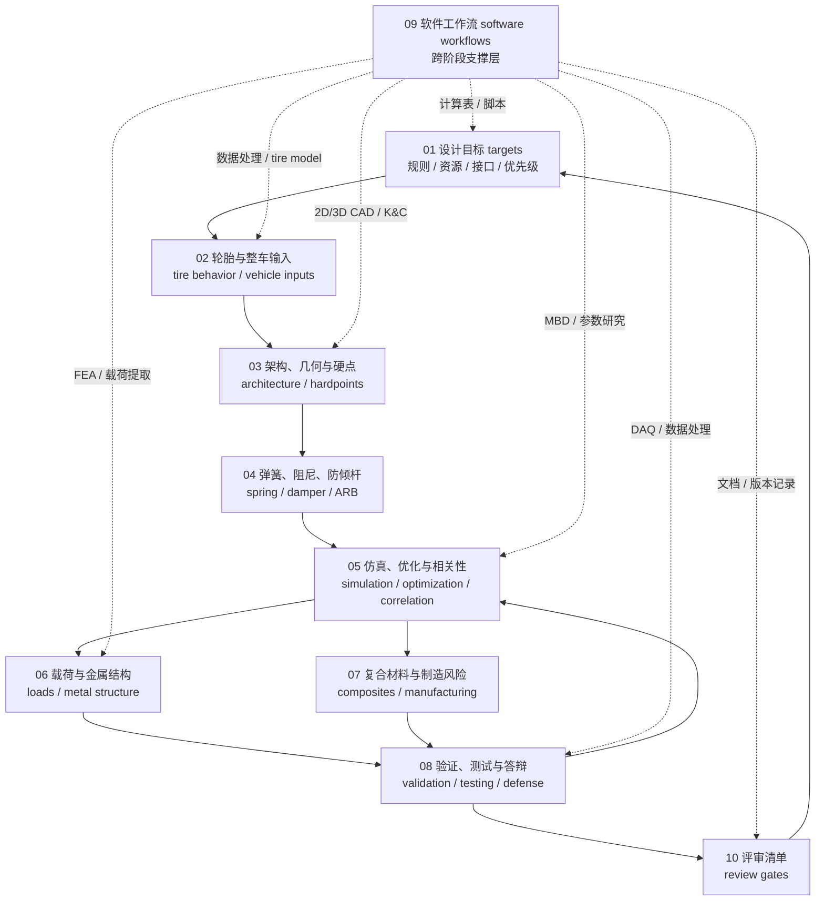

# 高级悬架工程手册

## 手册定位

本目录是公开悬架手册的详细层。`docs/00-10` 负责快速建立学习路线和阶段输出，advanced 层负责展开完整的工程推理链：目标如何进入轮胎、架构、硬点、弹簧阻尼、仿真、结构、验证、软件和最终评审。

高级手册不复刻某一年赛车的答案，也不把公开链接堆成文献综述。它要帮助读者判断一个结论靠什么成立、能否被复算或复测、哪些假设只适用于特定项目、哪些内容必须降级为工程经验或待验证。

## 公开来源如何进入 advanced 章节

公开来源先被转化为工程问题，再进入正文。规则资料进入章节时应成为 gate；教材、论文和公开案例进入章节时应成为方法边界；软件资料进入章节时应成为最小 workflow；工程经验进入章节时应写成有条件的判断。

| 来源角色 | 适合进入正文的形式 | 可以支撑 | 不能支撑 |
| --- | --- | --- | --- |
| 官方规则与评审文件 | 规则复核、提交物、设计答辩证据类型 | 合法性、评审口径、文档交付习惯 | 永久通用数值或跨赛区规则结论 |
| 教材、SAE 论文、大学论文 | 理论模型、变量定义、方法边界、验证思路 | 计算链、建模逻辑、常见简化假设 | 直接套用示例参数、图表或历史方案 |
| 软件官方资料 | 输入输出、模型结构、版本与 workflow | 最小可用软件流程、复现习惯 | 证明仿真结果已经被实车验证 |
| 公开车队报告与案例 | 报告组织、问题拆解、测试通道 | 案例对照和常见风险 | 本仓库车辆参数或通用调校方案 |
| Wiki、博客、评审文章 | 入门语言、术语桥接、评审视角 | 学习入口和风险提示 | 安全结论、结构放行或规则解释 |
| 工程经验 | 条件化建议、失败模式、交接习惯 | 适用边界内的判断 | 普遍定律或未经验证的强结论 |

公开来源的完整章节索引见 [参考资料：章节引用索引](../references.md#章节引用索引)。advanced 章节可以引用它的来源角色，但真正的正文应写成读者能执行、能检查、能复核的工程语言。

## 来源权威排序

当来源之间发生冲突时，按下面顺序处理：

1. 当年赛事官方规则、官方公告和提交物要求优先；不同赛区不能混用。
2. 教材、经同行评审的论文、SAE 论文和大学论文用于校准理论与方法，但仍需检查版本、假设和适用范围。
3. 软件官方资料用于确认工具能力、模型结构和版本依赖，不替代工程验证。
4. 公开团队报告和供应商案例用于理解组织方式、测试通道和风险，不提供通用通过阈值。
5. Wiki、博客和论坛只能作为入门语言或待核对背景。
6. 工程经验必须写清来源类型、适用阶段、验证方式和失败风险。

如果某个观点只能由低权威来源或单一案例支撑，章节应把它写成“可参考的做法”“工程经验”或“待验证”，而不是写成强制建议。

## 证据等级读法

advanced 章节中的判断应能被读者归入下列证据等级：

| 等级 | 读者应看到什么 | 写作要求 |
| --- | --- | --- |
| 规则 gate | 需要检查的规则、赛区、年份或提交物 | 不引用过期文件作为当前结论，提醒复核当年版本 |
| 可计算 | 公式、变量、单位、坐标系和简化假设 | 计算能复现，适用边界能追问 |
| 可仿真 | 模型类型、输入来源、版本、边界条件和输出指标 | 说明模型能回答什么，不能把仿真写成实车证明 |
| 可测试 | 测试目的、传感器、校准、数据处理和判读方式 | 说明数据质量和相关性限制 |
| 工程经验 | 适用条件、风险、推荐做法和反例 | 不能冒充规则、材料认证或结构放行 |
| 待验证 | 缺少的资料、测试或复核动作 | 不把缺口藏在肯定语气里 |

安全相关和结构相关内容应尽量落到规则、材料数据、仿真复核、测试或正式评审；只靠经验时必须保持保守表述。

## 设计链如何展开

这条链的关键不是“先后顺序永远固定”，而是每个阶段都要把输入、输出和证据交给下一阶段。设计目标不清，轮胎和几何会变成凭感觉；轮胎边界不清，硬点和 rate 优化会失去对象；仿真没有相关性，结构和调校就缺少可信输入；测试和评审不记录，下一代设计只能重复猜测。

## 推荐阅读顺序

| 顺序 | 章节 | 阅读目标 | 典型输出 |
| --- | --- | --- | --- |
| 1 | [01 设计目标](01-design-targets.md) | 把年度目标、规则、资源、接口和验证计划拆成悬架任务 | 目标分解表、接口清单、证据门槛 |
| 2 | [02 轮胎与整车输入](02-tire-and-vehicle-inputs.md) | 理解轮胎数据、模型选择和整车输入如何限制后续设计 | 轮胎假设表、模型边界、输入版本 |
| 3 | [03 几何与硬点](03-geometry-and-hardpoints.md) | 建立架构、硬点初始化、运动学检查和包装协同逻辑 | 几何目标、硬点版本、K&C 曲线和接口记录 |
| 4 | [04 弹簧、阻尼、侧倾与车身姿态](04-spring-damper-roll-and-ride.md) | 连接 wheel rate、ride frequency、motion ratio、ARB 和阻尼目标 | rate 计算表、调校范围、假设说明 |
| 5 | [05 仿真、优化与相关性](05-simulation-optimization-correlation.md) | 判断模型层级、参数研究、优化和实车 correlation 的边界 | 参数研究、模型边界、相关性日志 |
| 6 | [06 载荷与金属结构](06-loads-metal-structure.md) | 定义载荷工况、提取受力并审查金属件结构结论 | 载荷路径、边界条件、结构修改建议 |
| 7 | [07 复合材料校核与制造风险](07-composites-and-manufacturing.md) | 理解复材失效、材料/铺层假设、连接区和制造波动 | 材料假设、失效检查、制造风险清单 |
| 8 | [08 验证、测试与答辩](08-validation-testing-defense.md) | 把设计结论放进台架、shakedown、赛道数据和答辩证据包 | 测试计划、数据对比、答辩证据 |
| 9 | [09 软件工作流](09-software-workflows.md) | 按工程问题选择表格、脚本、2D CAD、3D CAD、MBD、FEA、DAQ 和文档工具 | 最小 workflow、输入输出约定、版本记录 |
| 10 | [10 评审清单](10-review-checklists.md) | 把整条链变成可复盘、可交接、可维护的 review gates | 阶段评审表、风险记录、待验证项 |

## 私有边界

advanced 手册只发布改写后的公共工程逻辑、自绘或授权图例、Mermaid 流程、可复核的公式框架和通用检查问题。以下内容不进入公开正文：

- 能还原历史赛车方案的几何、载荷、模型、测试或调校细节；
- 未授权图表、截图、数据表、供应商资料、内部评审记录和个人信息；
- 受限数据集、受版权保护的长段原文、可识别项目文件名或原始报告结构；
- 只在某个团队、某辆车或某个赛季成立，却没有写清边界的经验判断。

这些内容不是没有价值，而是属于团队内部工程包。公开手册的任务是把可迁移的推理、流程、检查问题和验证习惯写清，让读者不需要接触原始资料也能学习和复核。

## 如何使用本手册做评审

评审时先问目标：今年的车辆目标、规则、资源和接口是否足够明确。再问输入：轮胎数据、整车参数、坐标系和单位是否能支撑几何与 rate 决策。随后检查模型：K&C、MBD、FEA 和脚本分别回答什么问题，哪些输出只是趋势，哪些能进入结构或测试计划。

进入结构和测试阶段后，重点检查载荷路径、边界条件、材料假设、制造风险、传感器质量和数据相关性。最后用软件 workflow 与评审清单确认所有结论都能追溯到规则、计算、仿真、测试或明确边界内的工程经验；不能追溯的内容应进入待验证清单。

## 本章公开来源

- [参考资料：章节引用索引](../references.md#章节引用索引)，用于说明 advanced 章节如何被规则、教材、论文、软件资料、公开案例和测试案例塑形。
- RCD / RCVD，用于校准车辆动力学、轮胎、悬架几何、ride / roll、载荷、转向、柔度和测试的知识完整性。
- 官方规则与设计评审文件，用于组织 design / build / validation / understanding 的证据链。
- 软件官方资料、公开论文、大学报告和供应商测试案例，用于把模型边界、workflow 和相关性验证写成可审查的工程问题。
