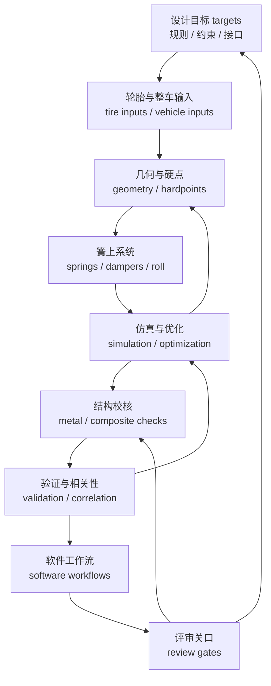
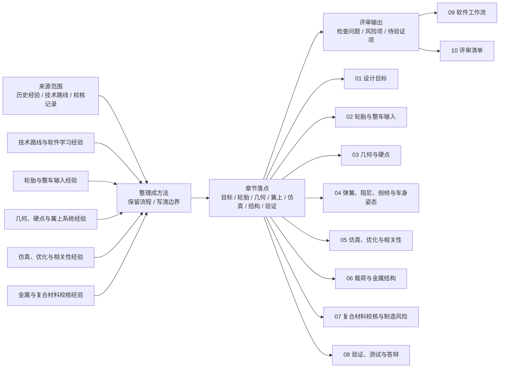

# 高级悬架工程手册

## 手册定位

本目录是公开悬架手册的详细层，面向已经读过快速预览、准备真正参与目标设定、建模、仿真、结构校核、测试和答辩的读者。`docs/00-10` 是快速预览和学习路线层，用来建立全局方向；本高级手册负责展开完整的工程推理链、评审逻辑和验证习惯。

高级手册不追求复刻某一年赛车的答案，而是把悬架工作拆成可检查的输入、假设、模型、输出、风险和证据。读者应能沿着目标、轮胎、几何、簧上系统、仿真、结构、复合材料、验证、软件和评审清单的顺序，理解一个方案为什么成立，以及它还需要哪些验证。

## 资料边界

本手册收录的是可复用的设计经验、方法论、公式框架、建模流程、评审问题、验证思路、通用软件工作流和假想示例。公式用于帮助读者理解力学关系和检查量纲；涉及实际项目时，还应在团队自己的工程资料中补齐适用假设、单位、坐标系和验证证据。

原始数据、可反推出历史赛车参数的组合信息、具体硬点点位、原始载荷值、模型拟合参数、未授权截图、车辆编号、供应商私密信息和项目评审记录，属于项目工程包的内容。本手册聚焦能独立阅读的工程逻辑；图例也应来自自绘、授权或经过审查的素材。不确定来源或验证状态时，正文应标注“待补充”或“待验证”。

## 公开资料如何进入章节

公开资料的作用不是让正文看起来“引用很多”，而是帮助读者判断一个工程结论靠什么成立。本手册写作时先把资料转成章节问题，再进入正文：规则资料变成不可违反的 gate，轮胎资料变成模型边界，论文和案例变成流程对照，测试案例变成可测通道和相关性问题。

| 来源角色 | 进入章节的方式 | 读者应看到什么 | 不应出现什么 |
| --- | --- | --- | --- |
| 规则 rule | 写成设计前必须检查的 gate | 规则版本、适用赛事、检查状态、谁负责复核 | 把某一年某赛事数值写成永久通用答案 |
| 轮胎数据 tire data | 写成模型边界和残差问题 | 数据覆盖、坐标 / 符号、设计窗口、外推限制 | TTC 原始曲线、模型参数、未经授权数据表 |
| 论文 paper | 写成方法或模型边界的交叉验证 | 它支持哪条流程、哪些假设被简化、哪些需要实车验证 | 摘要之外的受版权保护图表和长段文字 |
| 公开项目 / 案例 case | 写成工作流，而不是结果崇拜 | 输入、测试场景、传感器、输出和限制 | 直接照搬相关性百分比、车型参数或供应商话术 |
| 工程经验 experience | 写成条件化判断 | 适用阶段、验证方式、失败风险、待验证项 | 把旧队伍习惯写成普遍定律 |

## RCD / RCVD 全量审核矩阵

RCD / RCVD 在本手册中的作用不是替代原书，也不是提供扫描内容，而是作为悬架知识完整性和技术边界的审核基准。RCD 更适合校准赛车设计、结构布置、调校和测试的实践框架；RCVD 更适合校准车辆动力学、轮胎、坐标系、操稳、载荷、几何、弹簧阻尼和柔度的理论深度。

使用这张矩阵时，只能把 RCD / RCVD 转写成公开安全的工程问题、决策边界、检查输出和验证证据；正式引用、版次、页码和版权边界见 [参考资料](../references.md#rcd-rcvd)。如果某个概念暂时无法转成本项目可复核的判断，应写成待验证项，而不是把原书内容或示例结论直接搬进正文。

| 知识域 | RCD / RCVD 审核角色 | 当前公开落点 | 内化重点 |
|---|---|---|---|
| 设计目标 | RCD 校准整车设计取舍；RCVD 校准车辆动态目标如何影响悬架指标 | [01 设计目标](01-design-targets.md)、[快速版 02](../02-design-targets.md) | 把目标写成可验证输入，区分规则约束、性能目标和团队偏好 |
| 轮胎与整车输入 | RCVD 校准 tire behavior、slip angle、load sensitivity 和 tire data treatment | [02 轮胎与整车输入](02-tire-and-vehicle-inputs.md)、[快速版 03](../03-tire-and-vehicle-inputs.md) | 强化轮胎模型边界、残差评审、动态轮荷和模型用途 |
| 坐标系与几何 | RCVD 校准 axis systems、suspension geometry、steering geometry；RCD 校准结构布置直觉 | [03 几何与硬点](03-geometry-and-hardpoints.md)、[快速版 04](../04-geometry-and-hardpoints.md) | 强化坐标正负、roll center migration、bump steer、camber gain、K&C 和 3D 包络边界 |
| 弹簧阻尼与侧倾 | RCVD 校准 ride rate、roll rate、springs、dampers；RCD 校准 anti-roll bar 和调校实践 | [04 簧上系统](04-spring-damper-roll-and-ride.md)、[快速版 05](../05-spring-damper-and-roll.md) | 区分 spring rate、wheel rate、ride rate、roll stiffness、motion ratio 和阻尼工作区间 |
| 操稳、仿真与优化 | RCVD 校准 steady-state、transient、pair analysis、force-moment、g-g；RCD 校准测试解释 | [05 仿真优化](05-simulation-optimization-correlation.md)、[快速版 06](../06-simulation-and-optimization.md) | 把模型分成趋势判断、参数研究、整车仿真和相关性验证，不把仿真当实车证明 |
| 轮载与金属结构 | RCVD 校准 wheel loads、load transfer、braking / driving loads；RCD 校准结构设计约束 | [06 载荷与金属结构](06-loads-metal-structure.md)、[快速版 07](../07-loads-and-structure-check.md) | 强化载荷路径、工况组合、导力边界、FEA 约束和结果解释 |
| 复合材料与制造 | RCD 提供制造和结构实践边界；RCVD 仅补充载荷与车辆动态输入 | [07 复材与制造](07-composites-and-manufacturing.md)、[快速版 07](../07-loads-and-structure-check.md) | 保持保守验证，说明材料 allowables、铺层假设、连接区和制造缺陷风险 |
| 测试、调校与答辩 | RCD 校准 set-up and testing；RCVD 校准测试数据如何回到模型 | [08 验证测试](08-validation-testing-defense.md)、[快速版 08](../08-validation-and-iteration.md) | 把 driver feedback、数据通道、调校记录和模型修正连成闭环 |
| 软件工作流 | RCD / RCVD 校准软件回答的工程问题，而不是替代原理学习 | [09 软件工作流](09-software-workflows.md)、[快速版 09](../09-software-roadmap.md) | 每个软件都必须有输入、输出、可信边界和误用风险 |
| 评审清单 | 两本书共同校准“概念是否能变成证据” | [10 评审清单](10-review-checklists.md)、[快速版 10](../10-checklists.md) | 把知识点转成设计门槛、模型门槛、结构门槛、测试门槛和发布门槛 |

因此，正文里更推荐出现“这个资料支持我们把轮胎模型写成有边界的工具”，而不是“某资料也这么说”。当资料只能支持流程，章节就只写流程；当资料能支持规则或可复现实验，章节才写成更强的检查项。

## 推荐阅读顺序

| 顺序 | 章节 | 阅读目标 | 典型产出 |
| --- | --- | --- | --- |
| 1 | [01 设计目标](01-design-targets.md) | 把年度目标、规则、接口和约束拆成悬架可执行任务 | 目标分解表、接口清单、评审门槛 |
| 2 | [02 轮胎与整车输入](02-tire-and-vehicle-inputs.md) | 理解轮胎数据、模型选择和整车输入如何决定后续设计 | 轮胎选择说明、模型限制、输入参数清单 |
| 3 | [03 几何与硬点](03-geometry-and-hardpoints.md) | 建立悬架几何、硬点初始化、优化和 K&C 检查逻辑 | 几何目标、硬点版本、运动学曲线 |
| 4 | [04 弹簧、阻尼、侧倾与车身姿态](04-spring-damper-roll-and-ride.md) | 连接轮端刚度、运动比、阻尼、侧倾刚度和俯仰控制 | 参数计算表、调校范围、假设说明 |
| 5 | [05 仿真、优化与相关性](05-simulation-optimization-correlation.md) | 判断不同模型能回答哪些问题，并管理优化和相关性验证 | 参数研究、优化记录、模型边界 |
| 6 | [06 载荷与金属结构](06-loads-metal-structure.md) | 定义载荷工况、提取受力并审查金属件 FEA 结论 | 载荷路径、边界条件、结构修改建议 |
| 7 | [07 复合材料校核与制造风险](07-composites-and-manufacturing.md) | 理解复材失效、铺层假设、制造约束和仿真审查 | 铺层假设、失效检查、制造风险清单 |
| 8 | [08 验证、测试与答辩](08-validation-testing-defense.md) | 把仿真和设计结论放到实车测试、数据相关和比赛答辩中验证 | 测试计划、数据对比、答辩证据包 |
| 9 | [09 软件工作流](09-software-workflows.md) | 按工程问题选择表格、脚本、CAD、MBD、FEA 和文档工具 | 最小可用工作流、输入输出约定 |
| 10 | [10 评审清单](10-review-checklists.md) | 把设计过程变成可复盘、可交接、可长期维护的检查清单 | 阶段评审表、风险记录、待验证项 |

## 源文档覆盖摘要

本节只展示来源类别和章节落点。完整逐项覆盖审计属于维护记录，用于保存“来源知识点 -> 章节落点 -> 资料边界”的对应关系，不进入 GitHub Pages。

| 内容来源范围 | 覆盖章节 | 整理重点 | 避开的内容 |
| --- | --- | --- | --- |
| 技术路线与软件学习经验 | 本页、09、10 | 学习阶段、软件顺序、角色成长、比赛和答辩准备 | 个人或团队原始进度安排 |
| 历史悬架手册中的轮胎内容 | 02、05、08 | 轮胎数据限制、模型选择、轮胎力学、对比逻辑和模型更新 | 原始轮胎数据、模型拟合参数或可识别对比表 |
| 历史悬架手册中的几何内容 | 03 | 主销、侧视和前视几何、侧倾中心、硬点初始化、优化和 K&C 检查 | 硬点精确位置 |
| 历史悬架手册中的弹簧阻尼内容 | 04 | 平顺频率、阻尼、运动比、侧倾和俯仰模型、调校范围 | 历史弹簧、阻尼或调校参数 |
| 历史悬架手册中的操稳与优化内容 | 05 | 简化操稳模型、稳态和瞬态检查、G-G 思路、数值优化、整车模型限制 | 历史整车结果表 |
| 设计目标经验 | 01、10 | 年度目标分解、约束、接口、评审关口 | 历史性能目标或车辆编号 |
| 轮胎分析经验 | 02、05、08 | 模型替代、缺失数据处理、动态轮荷、整车模型输入 | 源数据值或源图曲线 |
| 理论设计经验 | 03、04、05 | 几何目标、硬点优化、K&C、弹簧阻尼参数、运动比 | 坐标表和参数表 |
| 金属结构校核经验 | 06、10 | 工况定义、载荷转移、多体动力学受力提取、FEA 边界条件、结果审查 | 原始载荷数据表和 FEA 结果值 |
| 复合材料校核经验 | 07、10 | 复材失效模式、Hashin-type 逻辑、铺层假设、仿真设置、制造风险 | 私有材料数据或照搬源公式 |

## 高级知识地图

这张图强调高级手册的主线：目标不是一次性写完参数表，而是在每一轮设计中检查输入是否可信、模型是否适用、输出是否能被结构和测试验证。

## 源材料到章节的映射

映射只说明经验进入章节的方向，不代表读者需要访问或拥有原始资料。各章节应能独立阅读，并把尚未确认的细节标注为待补充或待验证。

## 如何使用本手册做设计评审

先从 [01 设计目标](01-design-targets.md) 建立评审问题：今年的车辆目标、规则约束、接口条件和验证计划是否足够明确。随后按 [02 轮胎与整车输入](02-tire-and-vehicle-inputs.md)、[03 几何与硬点](03-geometry-and-hardpoints.md)、[04 弹簧、阻尼、侧倾与车身姿态](04-spring-damper-roll-and-ride.md) 检查设计输入与参数链条是否闭合。

进入仿真和结构阶段后，用 [05 仿真、优化与相关性](05-simulation-optimization-correlation.md) 检查模型假设、参数研究和相关性证据，用 [06 载荷与金属结构](06-loads-metal-structure.md) 与 [07 复合材料校核与制造风险](07-composites-and-manufacturing.md) 检查载荷路径、边界条件、材料假设、失效准则和制造风险。所有安全相关结论都应保守表述，并回到规则、材料数据、仿真复核和实车验证。

最后用 [08 验证、测试与答辩](08-validation-testing-defense.md) 准备测试计划和证据包，用 [09 软件工作流](09-software-workflows.md) 复核软件输入输出是否可重复，用 [10 评审清单](10-review-checklists.md) 记录通过项、风险项和待验证项。一次合格的评审不只是“参数看起来合理”，而是能说明每个关键结论来自计算、仿真、测试还是明确边界内的工程经验。

## 本章公开来源

- RCD / RCVD，用于建立 advanced 层的车辆动力学、轮胎、悬架几何、ride / roll、转向、柔度和测试基准。
- [FS Wiki](https://fswiki.us/Fswiki)、[DesignJudges](https://www.designjudges.com/)、SAE 论文摘要、学生 thesis / report 和公开测试案例，用于把外部知识分成规则 gate、模型边界、流程对照、测试通道和评审问题。
- [FSAE Design Judging Score Sheet](https://www.fsaeonline.com/content/fsae%20design%20score%20sheet%20150pt.pdf)，用于组织 advanced 手册的 design / build / validation / understanding 证据链。
- 完整章节索引见 [参考资料：章节引用索引](../references.md#章节引用索引)。
