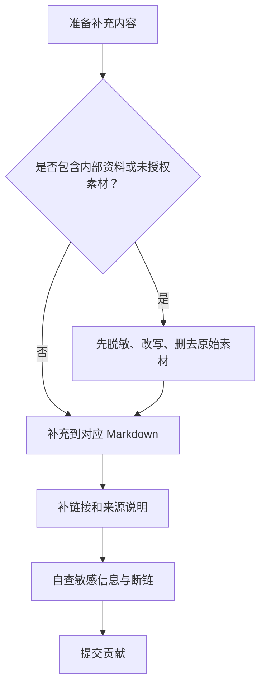

# 贡献指南

感谢你愿意帮助完善 FSAE 悬架学习路线。这个仓库的目标是让更多车队能获得清晰、可复用、可验证的学习资料。

## 贡献流程图




## 可贡献内容

- 更清晰的学习路线说明。
- 可公开的工程经验总结。
- 公开教材、软件官方文档或论文的阅读笔记。
- 检查清单、模板、示例计算和验证流程。
- 错误修正、术语统一、链接维护和排版改进。

## 不要提交

- 原始队内文档、表格、CAD、仿真文件或数据包。
- 未授权图片、截图、教材扫描页、供应商资料或比赛敏感文件。
- 具体车队历史参数、未脱敏测试数据、内部评审记录。
- 大段复制的书籍、论文、软件帮助或历史文档文字。

## 写作要求

- 中文为主，关键术语可保留英文括注。
- 写给认真学习的新队员，不要假设读者已经懂所有背景。
- 每条工程建议尽量写清楚适用条件、验证方式和风险。
- 区分资料来源：公开资料、工程经验、待验证。
- 涉及公式、参数和图表时写明单位、坐标系和符号约定。

## 提交流程

1. 确认新增内容不包含原始私有资料。
2. 在相关 Markdown 文件中补充内容。
3. 更新必要的交叉链接。
4. 检查链接是否有效。
5. 自查是否有未经授权图片、内部文件名、具体历史参数或大段原文。

## 引用格式

建议使用简单可读的引用方式：

```text
参考：书名或资料名，章节/页面，作者或来源，访问日期（如适用）。
```

如果资料不能公开访问，请不要把原文或截图放进仓库，只能写成通用经验，并说明为工程经验或待验证内容。
