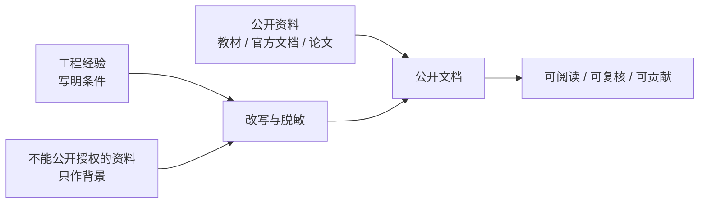

# 参考资料

## 目标读者

这篇文档面向希望继续深入学习、维护仓库或补充引用的读者。它的重点不是堆书单，而是说明哪些资料可以公开引用，哪些经验只能改写成通用工程指导。

## 学习目标

- 知道哪些公开资料适合补充悬架学习路线。
- 记录引用时保留足够来源信息，方便后续维护者复核。
- 区分公开资料、工程经验和不能公开分发的资料。
- 在贡献文档时避免把未授权内容带入公开仓库。

## 视觉总览

## 来源处理原则

本仓库公开文档来自公开资料、经过改写的工程经验，以及确认自有或授权、经过审查和脱敏的教学图例。无法确认授权或无法完成脱敏的资料只能作为写作背景，不能以原文、截图、表格或源文件形式进入仓库。

公开写作时请遵守：

- 可以引用公开教材、官方文档、公开论文、公开规则文件和允许引用的网页。
- 可以把个人或团队工程经验改写成通用判断，但要说明适用条件和验证方式。
- 可以发布已审查的自有图例，例如清理后的 FEA 云图、网格图、载荷路径示意和重绘流程图，但必须删除路径、账号、内部编号、真实载荷值、私有材料参数和可反推车辆的组合信息。
- 不要提交未授权图片、截图、表格、数据文件、源文件、长段原文或内部评审记录。
- 不要在面向读者的文档中暴露内部文件名、历史车辆编号、未经公开的参数、供应商私密信息或个人信息。
- 不确定能否公开时，先写成“待补充”或“待公开资料验证”，不要把原始材料放进仓库。

## 公开推荐书籍

| 资料 | 用途 | 引用时记录 |
| --- | --- | --- |
| [Race Car Design](https://www.bloomsbury.com/us/race-car-design-9781137030146/) | 建立赛车系统、悬架结构、调校和测试的基础设计概念 | Derek Seward、版次、章节、页码 |
| [Race Car Vehicle Dynamics](https://www.millikenresearch.com/rcvd.html) | 学习车辆动力学、轮胎、悬架、操稳、载荷和参数计算 | William F. Milliken / Douglas L. Milliken、版次、章节、页码 |
| Tune to Win | 理解调校思路和赛车工程经验 | 作者、版次、章节、页码 |
| Competition Car Suspension | 学习悬架结构、设计、制造和调校 | 作者、版次、章节、页码 |
| 汽车理论 | 补充中文车辆动力学基础 | 作者、版次、出版社、章节、页码 |
| 汽车系统动力学 | 补充系统建模和动力学分析 | 作者、版次、出版社、章节、页码 |

使用书籍时，必须在正式引用前确认具体作者、版次、章节和页码；不要只写书名。建议同时说明它支持哪一个工程问题。例如“解释载荷转移概念”比“参考某本书”更容易复核。

### RCD / RCVD 章节索引引用方式

[学习路线](01-learning-roadmap.md) 中的 RCD / RCVD 推荐章节用于帮助读者定位知识，不等于完整引用。公开文档可以写“建议阅读 RCVD Ch.2 Tire Behavior 以理解轮胎侧偏和载荷敏感性”，但如果某个公式、图表判断或技术论证依赖书中具体位置，贡献者必须补充自己所用版本的页码。

建议记录：

| 缩写 | 公开索引用途 | 正式引用要补充 |
| --- | --- | --- |
| RCD | 悬架结构、弹簧阻尼、防倾杆、前轮总成、转向、调校和测试的入门导航 | Derek Seward、书名、版次或出版信息、章节、页码 |
| RCVD | 轮胎、坐标系、操稳、ride / roll、悬架几何、轮载、转向、弹簧、阻尼和柔度的理论导航 | William F. Milliken / Douglas L. Milliken、书名、版次或出版信息、章节、页码 |

不要上传书籍扫描、截图、原表格、原图或长段文字。公开内容应写成原创学习建议、章节索引、工程问题说明和可复核的设计检查项。

## 公开交叉验证资料

本仓库在补充 FSAE / Formula Student 悬架内容时，不把公开资料堆成链接列表，而是先判断它能承担哪一种工程角色：规则门槛、轮胎模型边界、几何 / 仿真方法、测试相关性案例，或结构载荷检查线索。公开资料能提高理论正确性和知识完整性，但不替代当年赛事规则、团队内部工程评审和实车测试。

### 规则与合规边界

| 资料 | 可支持的问题 | 入章方式 | 使用边界 |
| --- | --- | --- | --- |
| [Formula Student Rules 2026 v1.0](https://www.formulastudent.de/fileadmin/user_upload/all/2026/rules/FS-Rules_2026_v1.0.pdf) | wheel travel / jounce、ground clearance、wheelbase、track、悬架安装点可见性等合规 gate | 写入 [01 设计目标](advanced/01-design-targets.md)、[03 几何硬点](advanced/03-geometry-and-hardpoints.md)、[04 弹簧阻尼](advanced/04-spring-damper-roll-and-ride.md) 的“必须先检查”项 | 规则每年和每个赛事可能变化；公开文档只引用检查逻辑，具体参赛必须核对当前规则 |
| [Formula SAE Rules 2026](https://www.fsaeonline.com/cdsweb/gen/DownloadDocument.aspx?DocumentID=278fd4d7-aa27-4e33-bc4a-090148e662a0) | 北美 Formula SAE 规则口径、术语和合规边界复核 | 与 FSG 规则并列，提醒读者不要把某一赛事规则写成全球通用值 | 下载链接和文件版本可能更新；正式参赛以赛事官方当前文件为准 |

规则资料进入正文时，应写成“先过门槛，再谈性能”。例如：以 FSG 2026 为例，悬架相关检查包含可工作的前后悬架、可用行程、技术检查可见性、轴距 / 轮距和离地间隙等边界；但这些数值不能被改写成所有赛事的永久标准。

### 轮胎数据与模型

| 资料 | 可支持的问题 | 入章方式 | 使用边界 |
| --- | --- | --- | --- |
| [Calspan FSAE Tire Test Consortium](https://calspan.com/automotive/fsae-ttc) | TTC-style 数据的来源、测试台架、典型测试速度、轮胎构型覆盖和对 Magic Formula / Pacejka-style 模型的支持 | 写入 [02 轮胎与整车输入](advanced/02-tire-and-vehicle-inputs.md) 的数据覆盖、坐标、拟合和边界声明 | TTC 原始数据和论坛内部内容不能公开再分发；公开文档只讨论数据类型、覆盖维度和评审方法 |
| [Formula SAE Tire Test Consortium](https://www.fsaettc.org/) | FSAE / Formula Student 轮胎数据组织与论坛入口 | 作为读者继续了解授权数据来源的导航 | 不发布、复刻或描述受限数据表、曲线和模型参数 |
| [Formula U Racing Tire Model Development](https://uen.pressbooks.pub/range26i1/chapter/cantrell/) | 轮胎选择、数据集边界、模型复杂度取舍、坐标 / 符号风险和残差评审思路 | 写入 [02](advanced/02-tire-and-vehicle-inputs.md) 的“模型不是万能真理”段落 | 学生项目报告可作流程参考，不应当作权威参数来源或通用轮胎结论 |
| [MathWorks: Magic Formula Tire Modeling in Formula Student](https://blogs.mathworks.com/student-lounge/2022/06/07/mf-tyre/) | Magic Formula / MF-Tyre 在学生整车仿真中的接口意义 | 支持 [02](advanced/02-tire-and-vehicle-inputs.md) 和 [09 软件工作流](advanced/09-software-workflows.md) 的软件任务说明 | 软件示例不能替代数据质量、坐标转换和实车 correlation |
| [Derek A. Moore: Tire Modeling](https://www.derekamoore.com/tire-modeling) | FSAE TTC 背景、spline model、Pacejka / Magic Formula-style model、轮胎比较和模型后续改进 | 支持快速学习路线和轮胎模型路线说明 | 具体公式、参数和数据仍需用授权资料或团队测试验证 |

轮胎资料进入正文时，优先转化为三个问题：数据覆盖了哪些 `F_z`、`alpha`、`kappa`、`camber`、胎压、温度和速度；模型在设计窗口内 residual 是否可接受；超出覆盖范围时结论如何降级。

### 几何、簧上系统与整车仿真

| 资料 | 可支持的问题 | 入章方式 | 使用边界 |
| --- | --- | --- | --- |
| [SAE 971584: Introduction to Formula SAE Suspension and Frame Design](https://saemobilus.sae.org/papers/introduction-formula-sae-suspension-frame-design-971584) | 新队伍悬架和车架设计的方法论入口 | 支持 [03 几何硬点](advanced/03-geometry-and-hardpoints.md) 的范围感和新队伍学习路线 | 摘要只能支持高层方法；不要复刻受版权保护正文、图表或数值 |
| [SAE 2002-01-3310: Design of Formula SAE Suspension](https://saemobilus.sae.org/papers/design-formula-sae-suspension-2002-01-3310) | 悬架几何、control arm、upright、spindle、hub 和 pullrod 等系统化设计范围 | 用于交叉验证 [03](advanced/03-geometry-and-hardpoints.md)、[06](advanced/06-loads-metal-structure.md) 的章节边界 | 不用于公开具体历史车辆参数 |
| [SAE 2002-01-3308: Design of Formula SAE Suspension Components](https://saemobilus.sae.org/papers/design-formula-sae-suspension-components-2002-01-3308) | 悬架部件设计中 safety、durability 和 weight 的权衡 | 支持 [06](advanced/06-loads-metal-structure.md) 和 [10](advanced/10-review-checklists.md) 的部件评审逻辑 | 不引用或上传受版权保护全文 |
| [SAE 2005-01-3994: Formula SAE Suspension Design](https://saemobilus.sae.org/papers/formula-sae-suspension-design-2005-01-3994) | 从规则分析、项目目标、轮胎行为、CAD 包络、多体模型到 ride / handling 调校的流程 | 支持“规则和目标先行、CAD/MBD/调校闭环”的主线 | 只取流程结构，不取具体历史车辆答案 |
| [SAE 2010-01-0311: Cooper Union FSAE Suspension Design Review](https://scholars.duke.edu/publication/1426694) | tire data、整车动力学目标、几何可变性与弹簧 / 阻尼 / 防倾杆并行设计 | 支持 [03](advanced/03-geometry-and-hardpoints.md)、[04](advanced/04-spring-damper-roll-and-ride.md) 的耦合写法 | 只引用公开摘要中的设计流程和约束类型 |
| [SAE 2018-36-0231: FSAE suspension development in virtual environment](https://saemobilus.sae.org/papers/fsae-suspension-development-virtual-environment-2018-36-0231) | 用虚拟环境测试 kinematics / dynamics，并改进 camber、caster、toe、KPI 和 shock absorber 参数 | 支持 [05 仿真优化](advanced/05-simulation-optimization-correlation.md) 的模型用途边界 | 不把仿真输出写成实车证明 |
| [Dynamic Handling Characterization and Set-Up Optimization for a Formula SAE Race Car via Multi-Body Simulation](https://www.mdpi.com/2075-1702/9/6/126) | 多体整车模型、PAC2002 轮胎模型、fixed / adjustable 参数、赛道事件优化和实车验证需求 | 写入 [05](advanced/05-simulation-optimization-correlation.md) 的模型边界、输入版本和 set-up 管理 | 论文案例中的具体参数和结果不泛化；仍需强调刚体 / compliance 简化和 correlation |
| [UNCA FSAE Suspension / Steering: Springs](https://sites.google.com/unca.edu/suspension/learning/vehicle-dynamics-basics/springs) | motion ratio、wheel rate、ride rate 和轮胎刚度串联的入门解释 | 支持 [04](advanced/04-spring-damper-roll-and-ride.md) 的入门桥接 | 公式必须写明运动比定义和单位 |
| [OptimumG: Of Springs and Dampers](https://optimumg.com/wp-content/uploads/2021/10/racecar-2020_11.pdf) | race car spring / damper 调校中的频率、轮胎接地、车身控制和工程取舍 | 支持 [04](advanced/04-spring-damper-roll-and-ride.md) 的调校逻辑 | PDF 内容应改写总结，不复制图表和长段文字 |
| [Jim Kasprzak: A Guide to Your Dampers](https://www.kaztechnologies.com/wp-content/uploads/A-Guide-To-Your-Dampers-Chapter-from-FSAE-Book-by-Jim-Kasprzak-Updated.pdf) | FSAE 阻尼器曲线、低 / 中 / 高速阻尼和调校理解 | 支持 [04](advanced/04-spring-damper-roll-and-ride.md)、[08](advanced/08-validation-testing-defense.md) 的阻尼测试语言 | 作为学习资料改写，不发布受版权保护图表或调校配方 |

### 测试、载荷与相关性

| 资料 | 可支持的问题 | 入章方式 | 使用边界 |
| --- | --- | --- | --- |
| [Dewesoft: Optimizing Formula SAE Suspension Through Tire-Road Force Analysis](https://dewesoft.com/blog/optimizing-formula-suspension-through-tire-road-force-analysis) | 用应变片、悬架位移、轮速、方向盘角、制动压力、IMU 和模型反推接地点力与杆件力 | 写入 [08 验证测试](advanced/08-validation-testing-defense.md) 的“可测通道 -> 力学模型 -> correlation”流程，也支持 [06](advanced/06-loads-metal-structure.md) 的载荷来源思路 | 供应商工具、通道配置和相关性百分比不能泛化成普遍标准 |
| [Analysis of Link Forces on a Formula Student Suspension System](https://www.diva-portal.org/smash/get/diva2:1033230/FULLTEXT01.pdf) | 悬架杆件力测试、模型和载荷路径分析 | 支持 [06](advanced/06-loads-metal-structure.md)、[08](advanced/08-validation-testing-defense.md) 的载荷验证问题 | 具体车型、布置和数值只作案例背景，不进入公开参数 |
| [University of Cincinnati Bearcats Motorsports Amesim project](https://www.ceas.uc.edu/research/centers-labs/siemens-simulation-technology-center/courses---projects/amesim/formula-sae/project.html) | 用相同赛道 / 场景对比仿真与实车数据，验证模型动态响应 | 作为 [05](advanced/05-simulation-optimization-correlation.md) 和 [08](advanced/08-validation-testing-defense.md) 的相关性工作流案例 | 不作为通用参数来源 |

引用这些来源时，建议在正文附近说明“本段由公开资料交叉验证”和“具体参赛需核对当年规则 / 团队数据”。如果不同来源说法不一致，应优先采用官方规则、公开教材、可复现实验或实车数据，并把争议写成待验证项。

## 软件与工具资料

| 类别 | 推荐查阅 | 适合支持的章节 |
| --- | --- | --- |
| CAD | 软件官方帮助、坐标系和参数化建模教程 | 04 几何与硬点 |
| Adams | Adams Car、Adams View、Adams Insight 官方文档和示例 | 04, 06, 07 |
| MATLAB / Simulink | MathWorks 官方文档、车辆动力学和信号处理示例 | 03, 05, 06, 08, 09 |
| Abaqus / Ansys | 官方帮助、材料模型、接触、复合材料和网格指南 | 07 |
| Python | NumPy、pandas、matplotlib、SciPy 官方文档 | 03, 05, 06, 08, 09 |
| 数据采集 | 车队实际使用设备的官方软件手册 | 08 |

软件资料最好和具体任务绑定：坐标系转换、硬点导入、K&C 曲线导出、载荷提取、网格收敛、数据滤波等，都比“学习某软件”更适合进入手册。

## 公开学习建议

- 优先查阅官方文档和教材，不要只依赖二手教程。
- 看软件教程时记录它解决的工程问题，而不只是按钮步骤。
- 公开引用时尽量给出书名、章节、软件版本和访问日期。
- 对视频教程保留标题、作者、平台和发布时间，避免链接失效后无法追溯。
- 对工程经验写明“适用于什么车、什么阶段、什么假设”，避免把经验写成普遍定律。

## 引用记录模板

| 字段 | 写法建议 |
| --- | --- |
| 资料名称 | 书名、论文名、官方文档标题或网页标题 |
| 来源类型 | 教材、论文、官方文档、规则、公开网页、工程经验 |
| 具体位置 | 章节、页码、版本、访问日期或链接 |
| 支持的问题 | 它回答了哪一个设计、仿真、校核或测试问题 |
| 使用方式 | 直接引用、改写总结、公式来源、验证依据或待确认背景 |
| 公开状态 | 可公开引用、需改写、待验证、不能公开 |

## 注意事项

- 不能确认授权的图片、表格、数据和长段文字不要提交。
- 无法公开访问的资料可以启发写作，但公开文档必须改写成通用经验。
- 资料推荐应说明用途，避免堆书单却不给学习路径。
- 安全相关和结构校核相关内容要保守表述，提醒读者回到规则、材料数据、仿真复核和实车验证。

## 本仓库来源说明

本仓库第一版结合了公开资料、公开软件资料类型，以及经过改写的悬架学习和设计经验。公开版本只保留通用学习结构、工程问题、检查逻辑、验证习惯和已清理的自有教学图例；不分发原始文件，不公开内部历史参数，不包含未授权图表。

后续贡献者如果基于不能直接公开的背景材料补充内容，应先完成脱敏、改写、图表登记和来源标注。无法确认授权的图片、表格、数据文件和整段文字不要提交到公开仓库。

## 实践任务

为你正在学习的一章或一个软件功能写一条参考记录，包含：

- 资料名称；
- 作者或来源；
- 章节、页面、版本或访问日期；
- 它回答的工程问题；
- 你在设计中如何使用；
- 是否可以公开引用。

## 参考来源

本页由公开教材书目、软件官方资料类型、开源文档维护规则和经过改写的工程经验整理而成。
