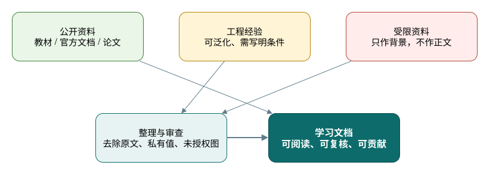
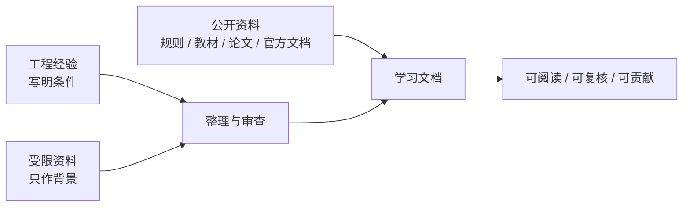

# 参考资料

## 目标读者

这篇文档面向希望继续深入学习、维护仓库或补充引用的读者。它的重点不是堆书单，而是说明不同资料在悬架设计文档中能承担什么角色，以及哪些内容必须留在验证、授权或团队内部边界之外。

## 学习目标

- 知道哪些公开资料适合支撑悬架学习路线、advanced 手册和软件工作流。
- 记录引用时保留足够来源信息，方便后续维护者复核。
- 区分官方规则、教材论文、软件资料、公开案例、评审文章和测试供应商案例的权威边界。
- 在贡献文档时避免把受限数据、未获授权的图表、内部代号或可反推出历史车辆的信息带入仓库。

## 视觉总览

## 来源处理原则

本仓库文档来自公开资料、整理过的工程经验，以及确认自有或授权的教学图例。授权或边界不清的资料只能作为写作背景，不能以原文、截图、表格或源文件形式进入仓库。

写作时请遵守：

- 可以引用公开教材、官方文档、公开论文、公开规则文件和允许引用的网页。
- 可以把个人或团队工程经验改写成通用判断，但要说明适用条件和验证方式。
- 可以发布已审查的自有图例，例如清理后的 FEA 云图、网格图、载荷路径示意和重绘流程图，但必须删除路径、账号、内部代号、未经整理的测试数据、私有材料参数和可反推历史车辆的信息。
- 不要提交未获授权的图片、截图、表格、数据文件、源文件、长段原文或内部评审记录。
- 不要在面向读者的文档中暴露内部文件名、未经公开的参数、供应商私密信息或个人信息。
- 来源和授权不清楚时，先写成“待补充”或“待验证”，不要把原始材料放进仓库。

## 公开来源分层

| 来源层级 | 适合支持什么 | 不适合支持什么 | 正文使用方式 |
| --- | --- | --- | --- |
| 官方规则与评审文件 | 合法性、技术检查、design event 证据类型 | 永久通用数值、未核对年份的规则结论 | 写成规则门槛，并提醒按当年规则复核 |
| 教材、SAE 论文与大学论文 | 理论框架、建模方法、验证逻辑 | 直接套用示例参数或受版权保护图表 | 改写成计算/建模/验证问题 |
| 软件官方资料 | 工具能力、输入输出、模型结构 | 替代实车验证或结构认证 | 写成最小可用 workflow |
| 公开车队报告 | 案例组织、报告结构、工程取舍 | 通用设计参数和性能承诺 | 写成案例对照和注意事项 |
| 评审文章、Wiki 与博客 | 入门语言、评审视角、常见误区 | 规则解释、结构安全和参数权威 | 写成检查问题或学习入口 |
| 测试供应商案例 | 传感器通道、采集链路、相关性思路 | 唯一硬件方案或通用通过阈值 | 写成可测证据类型 |

使用本页时，先查官方和当前来源，再用论文/书籍支撑方法，用公开案例做对照；镜像页、转载页和来源不明的页面不能作为正式引用依据。

最近一次链接检查只表示链接或来源存在，不等于技术结论永久正确。正式引用规则、评分表、软件功能或赛事要求前，仍要核对当年版本、发布者和适用赛区。

## 公开书籍与基础理论

| 来源链接 | 支持的工程问题 | 支持章节 | 采用边界 |
| --- | --- | --- | --- |
| [Race Car Design](https://www.bloomsbury.com/us/race-car-design-9781137030146/) | 赛车系统、悬架结构、调校和测试如何组成入门设计框架 | [01](01-learning-roadmap.md), [04](04-geometry-and-hardpoints.md), [05](05-spring-damper-and-roll.md), [10](10-checklists.md) | 用作学习导航；正式引用需补作者、版次、章节、页码，不复制图表或示例参数 |
| [Race Car Vehicle Dynamics](https://www.millikenresearch.com/rcvd.html) | 轮胎、坐标系、操稳、ride / roll、轮载和悬架参数如何计算 | [01](01-learning-roadmap.md), [03](03-tire-and-vehicle-inputs.md), [04](04-geometry-and-hardpoints.md), [05](05-spring-damper-and-roll.md), [06](06-simulation-and-optimization.md) | 用作理论导航；正文要转成自己的变量定义、单位和验证问题 |
| Tune to Win | 调校思路、赛车工程经验和试车观察如何组织 | [05](05-spring-damper-and-roll.md), [08](08-validation-and-iteration.md), [10](10-checklists.md) | 只作经验背景；不要把旧案例写成现代 Formula Student 通用目标 |
| Competition Car Suspension | 悬架结构、设计、制造和调校的通用语言 | [04](04-geometry-and-hardpoints.md), [05](05-spring-damper-and-roll.md), [07](07-loads-and-structure-check.md) | 需核对作者、版次和页码；不直接复用图表或数值建议 |
| 汽车理论 | 中文车辆动力学基础、载荷转移和操稳术语 | [01](01-learning-roadmap.md), [03](03-tire-and-vehicle-inputs.md), [06](06-simulation-and-optimization.md) | 用来补中文概念解释；悬架赛车应用仍需回到规则、轮胎和整车模型 |
| 汽车系统动力学 | 系统建模、动力学分析和整车响应解释 | [06](06-simulation-and-optimization.md), [09](09-software-roadmap.md) | 用作建模语言；软件实现和参数有效性需由本项目另行说明 |

### RCD / RCVD 章节索引引用方式

[学习路线](01-learning-roadmap.md) 中的 RCD / RCVD 推荐章节用于帮助读者定位知识，不等于完整引用。正文可以写“建议阅读 RCVD Ch.2 Tire Behavior 以理解轮胎侧偏和载荷敏感性”，但如果某个公式、图表判断或技术论证依赖书中具体位置，贡献者必须补充自己所用版本的页码。

| 缩写 | 公开索引用途 | 正式引用要补充 |
| --- | --- | --- |
| RCD | 悬架结构、弹簧阻尼、防倾杆、前轮总成、转向、调校和测试的入门导航 | Derek Seward、书名、版次或出版信息、章节、页码 |
| RCVD | 轮胎、坐标系、操稳、ride / roll、悬架几何、轮载、转向、弹簧、阻尼和柔度的理论导航 | William F. Milliken / Douglas L. Milliken、书名、版次或出版信息、章节、页码 |

把 RCD / RCVD 用作审核基准时，应先把书中概念转成仓库自己的工程问题、输入、输出、假设边界和验证证据，再写入正文。

## 官方规则与评审资料

| 来源链接 | 支持的工程问题 | 支持章节 | 采用边界 |
| --- | --- | --- | --- |
| [Formula SAE Series Resources](https://www.fsaeonline.com/cdsweb/gen/documentresources.aspx) | 当前规则、评分表和设计文档模板应从哪里复核 | [00](00-overview.md), [02](02-design-targets.md), [10](10-checklists.md), [高级 01](advanced/01-design-targets.md), [高级 10](advanced/10-review-checklists.md) | 写成“先查官方资源页”的维护习惯；不把某次下载文件当永久规则 |
| [Formula SAE Design Judging Score Sheet](https://www.fsaeonline.com/content/fsae%20design%20score%20sheet%20150pt.pdf) | design event 如何要求设计、制造、验证和理解证据 | [00](00-overview.md), [02](02-design-targets.md), [08](08-validation-and-iteration.md), [10](10-checklists.md) | 用作历史评分维度说明；分值和分类必须按当年文件复核 |
| [Formula Student UK 2025 Design Judging Score Sheet](https://www.imeche.org/docs/default-source/1-oscar/formula-student/2025/static-docs/2025-design-judging-score-sheet-pdf.pdf?sfvrsn=2) | 设计报告、总体概念、结构设计、仿真、测试和 margin 如何进入评审 | [02](02-design-targets.md), [07](07-loads-and-structure-check.md), [10](10-checklists.md), [高级 10](advanced/10-review-checklists.md) | 只作赛区对照；不能合并成 FSAE、FSG 或 FSC 的通用评分口径 |
| [FSG25 Engineering Design Event Announcement](https://www.formulastudent.de/fileadmin/user_upload/all/2025/important_docs/FSG25_Announcement_Engineering_Design_Event_sent.pdf) | 整车概念、目标资源、子系统理解、软件过程和车辆动力学证据如何被询问 | [02](02-design-targets.md), [06](06-simulation-and-optimization.md), [09](09-software-roadmap.md), [10](10-checklists.md) | 写成设计答辩证据类型；不把 FSG 2025 规则写成其他赛事要求 |

第三方规则 PDF 镜像不应作为公开文档的正式引用依据；读者应回到赛事官方资源页核对当前规则。FSC / 大学生方程式术语和入口需按当年官方发布渠道核对，本页不使用不稳定的 HTTPS 链接作为技术来源。

## 评审文章、Wiki 与学习入口

| 来源链接 | 支持的工程问题 | 支持章节 | 采用边界 |
| --- | --- | --- | --- |
| [DesignJudges: A Field Guide to the Design Event](https://www.designjudges.com/articles/a-field-guide-to-the-design-event) | 设计报告、现场答辩、证据包和跨系统理解应如何组织 | [00](00-overview.md), [08](08-validation-and-iteration.md), [10](10-checklists.md), [高级 08](advanced/08-validation-testing-defense.md) | 作为评审视角，不是官方规则；正文写成答辩准备问题 |
| [DesignJudges: Conceptual and Objective Design in FSAE](https://www.designjudges.com/articles/conceptual-and-objective-design-in-fsae) | 如何把整车概念、目标和方案筛选连到悬架设计 | [01](01-learning-roadmap.md), [02](02-design-targets.md), [高级 01](advanced/01-design-targets.md), [高级 05](advanced/05-simulation-optimization-correlation.md) | 用作目标设定逻辑；不把文章语气写成强制流程 |
| [DesignJudges: Setting Winning Priorities](https://www.designjudges.com/articles/setting-winning-priorities) | 可靠性、完赛、整车集成和局部性能收益如何排序 | [01](01-learning-roadmap.md), [02](02-design-targets.md), [10](10-checklists.md) | 写成优先级检查；不直接套用案例取舍 |
| [DesignJudges: Simple Kinematic Philosophies](https://www.designjudges.com/articles/simple-kinematic-philosophies) | 几何目标为什么要追求可用区间，而不是单点漂亮数值 | [04](04-geometry-and-hardpoints.md), [05](05-spring-damper-and-roll.md), [高级 03](advanced/03-geometry-and-hardpoints.md), [高级 10](advanced/10-review-checklists.md) | 写成 camber、toe、roll center 等检查问题；不变成唯一几何标准 |
| [FS Wiki: Suspension Geometry and Kinematics](https://fswiki.us/Suspension_Geometry_and_Kinematics) | track、wheelbase、camber、toe、kingpin、caster、roll center 等术语如何入门 | [04](04-geometry-and-hardpoints.md), [高级 03](advanced/03-geometry-and-hardpoints.md) | 用作术语桥接；规则数值和案例参数必须另行复核 |
| [FS Wiki: Tires](https://fswiki.us/Tires) | slip angle、load sensitivity、TTC 和拟合入口如何向新队员解释 | [03](03-tire-and-vehicle-inputs.md), [高级 02](advanced/02-tire-and-vehicle-inputs.md) | 用作入门语言；正式选型回到供应商、授权数据或团队测试 |
| [FS Wiki: Suspension Forces](https://fswiki.us/Suspension_Forces) | 自由体图、杆件方向向量和矩阵平衡如何解释 | [07](07-loads-and-structure-check.md), [高级 06](advanced/06-loads-metal-structure.md), [高级 10](advanced/10-review-checklists.md) | 仅作方法入口；结构安全必须靠工况、FEA、材料和测试验证 |

## 轮胎数据与模型来源

| 来源链接 | 支持的工程问题 | 支持章节 | 采用边界 |
| --- | --- | --- | --- |
| [Calspan Formula SAE Tire Testing Consortium](https://calspan.com/automotive/fsae-ttc) | 为什么轮胎数据要早于硬点、弹簧和整车模型决策 | [01](01-learning-roadmap.md), [03](03-tire-and-vehicle-inputs.md), [高级 02](advanced/02-tire-and-vehicle-inputs.md), [高级 README](advanced/README.md) | 只说明 TTC-style 数据价值和覆盖维度；不暗示成员资格，不发布受限数据 |
| [Formula SAE Tire Test Consortium](https://www.fsaettc.org/) | 授权轮胎数据组织、论坛和数据来源如何追溯 | [03](03-tire-and-vehicle-inputs.md), [高级 02](advanced/02-tire-and-vehicle-inputs.md) | 作为读者导航；数据表、曲线和拟合系数按授权条款管理 |
| [MathWorks: Magic Formula Tire Modeling in Formula Student](https://blogs.mathworks.com/student-lounge/2022/06/07/mf-tyre/) | Magic Formula / MF-Tyre 如何进入学生整车仿真流程 | [03](03-tire-and-vehicle-inputs.md), [06](06-simulation-and-optimization.md), [09](09-software-roadmap.md), [高级 09](advanced/09-software-workflows.md) | 写成“选模型、拟合、检查范围、导出、记录假设”的 workflow；不声称拟合精度 |
| [Formula U Racing: Construction of a Steady State, Semi-Empirical Tire Model](https://uen.pressbooks.pub/range26i1/chapter/cantrell/) | 轮胎选择、数据集边界、模型复杂度和残差评审如何写成公开报告 | [03](03-tire-and-vehicle-inputs.md), [高级 02](advanced/02-tire-and-vehicle-inputs.md), [高级 09](advanced/09-software-workflows.md) | 用作报告结构案例；不复用具体轮胎结论或参数 |
| [WUSTL: Tire Modeling and Data Analysis in the FSAE Context](https://openscholarship.wustl.edu/cgi/viewcontent.cgi?article=1311&context=mems500) | 轮胎项目如何说明载荷敏感性、工作范围和模型用途 | [03](03-tire-and-vehicle-inputs.md), [06](06-simulation-and-optimization.md), [高级 02](advanced/02-tire-and-vehicle-inputs.md) | 只取分析结构；不复制方程图表、曲线或拟合结果 |

轮胎资料进入正文时，优先转化为三个问题：数据覆盖了哪些 `F_z`、`alpha`、`kappa`、`camber`、胎压、温度和速度；模型在设计窗口内 residual 是否可接受；超出覆盖范围时结论如何降级。

## 几何、弹簧阻尼与整车仿真

| 来源链接 | 支持的工程问题 | 支持章节 | 采用边界 |
| --- | --- | --- | --- |
| [SAE 971584: Introduction to Formula SAE Suspension and Frame Design](https://saemobilus.sae.org/papers/introduction-formula-sae-suspension-frame-design-971584) | 新队伍如何理解悬架与车架设计的范围、约束和设计事件语境 | [01](01-learning-roadmap.md), [04](04-geometry-and-hardpoints.md), [高级 03](advanced/03-geometry-and-hardpoints.md) | 摘要支持高层方法；不复刻受版权保护正文、图表或旧数值 |
| [SAE 2002-01-3310: Design of Formula SAE Suspension](https://saemobilus.sae.org/papers/design-formula-sae-suspension-2002-01-3310) | control arm、upright、spindle、hub、pullrod 等系统边界如何组织 | [04](04-geometry-and-hardpoints.md), [07](07-loads-and-structure-check.md), [高级 03](advanced/03-geometry-and-hardpoints.md), [高级 06](advanced/06-loads-metal-structure.md) | 用作系统化设计范围；不公开具体历史车辆答案 |
| [SAE 2002-01-3308: Design of Formula SAE Suspension Components](https://saemobilus.sae.org/papers/design-formula-sae-suspension-components-2002-01-3308) | 悬架部件中 safety、durability 和 weight 如何平衡 | [07](07-loads-and-structure-check.md), [高级 06](advanced/06-loads-metal-structure.md), [高级 10](advanced/10-review-checklists.md) | 只取部件评审逻辑；不引用受版权保护全文 |
| [SAE 2005-01-3994: Formula SAE Suspension Design](https://saemobilus.sae.org/papers/formula-sae-suspension-design-2005-01-3994) | 从规则、目标、轮胎行为、CAD 包络、多体模型到调校的闭环如何搭建 | [03](03-tire-and-vehicle-inputs.md), [04](04-geometry-and-hardpoints.md), [05](05-spring-damper-and-roll.md), [06](06-simulation-and-optimization.md) | 只取流程结构，不取案例答案 |
| [Cooper Union FSAE Suspension Design Review](https://scholars.duke.edu/publication/1426694) | 轮胎数据、整车动力学目标、几何可变性和弹簧/阻尼/防倾杆如何并行设计 | [04](04-geometry-and-hardpoints.md), [05](05-spring-damper-and-roll.md), [高级 04](advanced/04-spring-damper-roll-and-ride.md) | 只引用公开摘要中的设计流程和约束类型 |
| [MIT DSpace: Optimization of a Formula SAE Vehicle's Suspension Kinematics](https://dspace.mit.edu/entities/publication/552bc5c1-9705-4a17-847d-9a9a9ff27b60) | 目标函数、roll-center movement 和 camber 行为如何组成优化问题 | [04](04-geometry-and-hardpoints.md), [06](06-simulation-and-optimization.md), [高级 03](advanced/03-geometry-and-hardpoints.md), [高级 05](advanced/05-simulation-optimization-correlation.md) | 用作优化方法案例；不套用硬点结果或目标权重 |
| [Will Harvey: Formula SAE Suspension Kinematics](https://wthprojects.com/fsae-kinematics) | 硬点约束聚合、WinGeo / CAD 迭代和几何冻结如何形成案例流程 | [04](04-geometry-and-hardpoints.md), [高级 03](advanced/03-geometry-and-hardpoints.md) | 个人项目页只作流程对照；不作为参数权威 |
| [Monash Motorsport suspension thesis collection](https://www.monashmotorsport.com/blog/2011suspensionthesis) | 悬架设计、制造、测试和报告结构如何连成项目案例 | [04](04-geometry-and-hardpoints.md), [05](05-spring-damper-and-roll.md), [08](08-validation-and-iteration.md), [高级 08](advanced/08-validation-testing-defense.md) | 只取工程组织方式；不复制图表或历史参数 |
| [Design of a suspension system for a Formula Student race car](https://skemman.is/bitstream/1946/31391/1/MSc_Ingi_Niels_Karlsson_2018.pdf) | 完整悬架项目如何连接背景理论、优化、制造约束和验证 | [04](04-geometry-and-hardpoints.md), [05](05-spring-damper-and-roll.md), [06](06-simulation-and-optimization.md) | 用作报告结构对照；不复制几何、目标或图件 |
| [Jim Kasprzak: A Guide to Your Dampers](https://www.kaztechnologies.com/wp-content/uploads/A-Guide-To-Your-Dampers-Chapter-from-FSAE-Book-by-Jim-Kasprzak-Updated.pdf) | motion ratio 定义、阻尼器行程、低/中/高速阻尼和调校语言如何解释 | [05](05-spring-damper-and-roll.md), [08](08-validation-and-iteration.md), [高级 04](advanced/04-spring-damper-roll-and-ride.md) | 改写为术语和检查点；不把某个比例或曲线当强制目标 |
| [OptimumG: Of Springs and Dampers](https://optimumg.com/wp-content/uploads/2021/10/racecar-2020_11.pdf) | wheel rate、ride frequency、轮胎刚度、sprung mass 和单位如何关联 | [05](05-spring-damper-and-roll.md), [高级 04](advanced/04-spring-damper-roll-and-ride.md), [高级 10](advanced/10-review-checklists.md) | 用作单位和 convention 提醒；不复制图表或调校配方 |
| [UNCA FSAE Suspension / Steering: Springs](https://sites.google.com/unca.edu/suspension/learning/vehicle-dynamics-basics/springs) | motion ratio、wheel rate、ride rate 和轮胎刚度串联如何向新队员解释 | [05](05-spring-damper-and-roll.md), [高级 04](advanced/04-spring-damper-roll-and-ride.md) | 入门桥接；公式必须在正文写清单位和运动比定义 |
| [Penske: Natural Frequency, Ride Frequency, and CPM](https://www.penskeshocks.com/blog/natural-frequency-ride-frequency-cpm-in-race-suspension) | aero load、动态 ride height 和平台控制为何会改变静态频率理解 | [05](05-spring-damper-and-roll.md), [高级 04](advanced/04-spring-damper-roll-and-ride.md) | 只作高下压力边界提示；不把产品或一般赛车建议写成 FS 必选方案 |
| [Dynamic Handling Characterization and Set-Up Optimization for a Formula SAE Race Car](https://www.mdpi.com/2075-1702/9/6/126) | MBD、PAC2002、fixed / adjustable 参数、事件优化和实车 correlation 如何组织 | [06](06-simulation-and-optimization.md), [08](08-validation-and-iteration.md), [高级 05](advanced/05-simulation-optimization-correlation.md) | 用作参数研究和 correlation 案例；不泛化单车 setup |
| [Modeling of Multibody Dynamics in Formula SAE Vehicle Suspension Systems](https://hammer.purdue.edu/articles/thesis/Modeling_of_Multibody_Dynamics_in_Formula_SAE_Vehicle_Suspension_Systems/12269003) | MBD 模型如何检查 camber、toe、motion ratio、roll-center 和 maneuver response | [06](06-simulation-and-optimization.md), [09](09-software-roadmap.md), [高级 05](advanced/05-simulation-optimization-correlation.md), [高级 09](advanced/09-software-workflows.md) | 用作模型搭建和敏感性检查案例；不复用团队参数 |

## 软件官方资料与最小工作流

| 来源链接 | 支持的工程问题 | 支持章节 | 采用边界 |
| --- | --- | --- | --- |
| [MathWorks: Formula Student Vehicle Modeling Using Simscape Multibody](https://www.mathworks.com/videos/formula-student-vehicle-modeling-using-simscape-multibody-1683608443602.html) | 全车 MBD 模型如何连接悬架、轮胎、maneuver、GGV 和参数变化 | [06](06-simulation-and-optimization.md), [09](09-software-roadmap.md), [高级 05](advanced/05-simulation-optimization-correlation.md), [高级 09](advanced/09-software-workflows.md) | 写成何时从计算表进入 Simscape 的 workflow；结果仍需测试相关性 |
| [MathWorks File Exchange: Formula Student Vehicle with Simscape](https://www.mathworks.com/matlabcentral/fileexchange/172279-formula-student-vehicle-with-simscape) | 可运行模板如何帮助理解模型结构、输入输出和版本依赖 | [06](06-simulation-and-optimization.md), [09](09-software-roadmap.md), [高级 09](advanced/09-software-workflows.md) | 作为学习模板；不代表本仓库车辆模型或验证结果 |
| [simscape/Formula-Student-Vehicle-Simscape](https://github.com/simscape/Formula-Student-Vehicle-Simscape) | 开源示例如何记录模型文件、依赖和复现实验入口 | [06](06-simulation-and-optimization.md), [09](09-software-roadmap.md), [高级 09](advanced/09-software-workflows.md) | 用作软件交付物组织参考；版本和许可需复核 |
| [MathWorks: Vehicle Dynamics Simulation Using MATLAB and Simulink for Student Competitions](https://www.mathworks.com/videos/vehicle-dynamics-simulation-using-matlab-and-simulink-for-student-competitions-1637351938976.html) | MATLAB / Simulink 如何支持赛道、纵横向动力学和学生竞赛建模 | [06](06-simulation-and-optimization.md), [09](09-software-roadmap.md), [高级 05](advanced/05-simulation-optimization-correlation.md) | 作为官方 workflow 示例；不把 MATLAB/Simulink 写成唯一工具 |
| [MathWorks: Virtual suspension design processes with McGill Formula Electric](https://blogs.mathworks.com/student-lounge/2021/08/27/virtual-suspension-design-processes-with-mcgill-formula-electric/) | 远程协作下 CAD、仿真、沟通和决策记录如何维护 | [01](01-learning-roadmap.md), [09](09-software-roadmap.md), [高级 09](advanced/09-software-workflows.md) | 写成团队交付物和版本管理习惯；不套用特定团队流程 |
| [MathWorks: Bringing Sensor Data to Simulation](https://www.mathworks.com/videos/bringing-sensor-data-to-simulation-1746112241217.html) | 传感器数据如何进入仿真，需要哪些坐标、同步、滤波和目标定义 | [08](08-validation-and-iteration.md), [09](09-software-roadmap.md), [高级 08](advanced/08-validation-testing-defense.md), [高级 09](advanced/09-software-workflows.md) | 写成 sensor-to-simulation 边界；不暗示导入数据就完成验证 |

软件资料最好和具体任务绑定：坐标系转换、硬点导入、K&C 曲线导出、载荷提取、网格收敛、数据滤波等，都比“学习某软件”更适合进入手册。Adams、Abaqus、Ansys、CATIA、AutoCAD、MATLAB / Python 等工具在正文中应按工程问题说明输入、输出、检查项和误用风险。

## 载荷、结构、测试与相关性

| 来源链接 | 支持的工程问题 | 支持章节 | 采用边界 |
| --- | --- | --- | --- |
| [An Approach to Using Finite Element Models to Predict Suspension Member Loads](https://vtechworks.lib.vt.edu/bitstream/handle/10919/34020/Borg_L_ETD_Copy_07-26-2009.pdf) | pinned members、truss 假设、steering 输入、articulation 和 FEA 假设如何影响载荷预测 | [07](07-loads-and-structure-check.md), [08](08-validation-and-iteration.md), [高级 06](advanced/06-loads-metal-structure.md), [高级 10](advanced/10-review-checklists.md) | 核心采用方法和假设审查；不导入具体载荷、构件结论或安全结论 |
| [Analysis of Link Forces on a Formula Student Suspension System](https://www.diva-portal.org/smash/get/diva2%3A1033230/FULLTEXT01.pdf) | ADAMS、MATLAB、应变测量和计划验证如何组成杆件力闭环 | [07](07-loads-and-structure-check.md), [08](08-validation-and-iteration.md), [高级 06](advanced/06-loads-metal-structure.md) | 用作仿真到测量的案例；若报告测试未完成，正文也必须说明验证边界 |
| [Oregon State: Vehicle dynamic validation and analysis from suspension forces](https://ir.library.oregonstate.edu/concern/graduate_thesis_or_dissertations/8049g827d) | 悬架力测量如何服务整车动力学验证和 setup 分析 | [07](07-loads-and-structure-check.md), [08](08-validation-and-iteration.md), [高级 08](advanced/08-validation-testing-defense.md) | 背景支持测力通道和 correlation 逻辑；不复制传感器设计或数据集 |
| [Dewesoft: Optimizing Formula SAE Suspension Through Tire-Road Force Analysis](https://dewesoft.com/blog/optimizing-formula-suspension-through-tire-road-force-analysis) | 应变、位移、轮速、方向盘角、制动压力、IMU 和模型如何反推接地点力与杆件力 | [07](07-loads-and-structure-check.md), [08](08-validation-and-iteration.md), [高级 06](advanced/06-loads-metal-structure.md), [高级 08](advanced/08-validation-testing-defense.md) | 作为供应商 instrumentation / correlation 案例；不把工具链或相关性结果泛化 |
| [Dewesoft: Suspension Testing on Formula SAE Racecar](https://dewesoft.com/blog/suspension-testing-on-formula-sae-racecar) | 应变片安装、悬架位移、IMU、静态/动态测试和滤波处理如何组织 | [08](08-validation-and-iteration.md), [高级 08](advanced/08-validation-testing-defense.md), [高级 10](advanced/10-review-checklists.md) | 写成测试流程和 checklist 支持；通道数量和设备可替换 |
| [Mantracourt: Data Acquisition in Formula SAE Suspension and Steering System Validation Tests](https://www.mantracourt.com/case-studies/data-acquisition-in-formula-sae-suspension-and-steering-system-validation-tests/) | 悬架/转向连杆载荷、wheel-load fluctuation 和 steering effort 如何成为可测证据 | [08](08-validation-and-iteration.md), [09](09-software-roadmap.md), [高级 08](advanced/08-validation-testing-defense.md), [高级 09](advanced/09-software-workflows.md) | 用作 DAQ channel planning 案例；不固化硬件、阈值或传感器品牌 |
| [HBK: University of Bologna Formula SAE / Student strain gauge case](https://www.hbkworld.com/en/knowledge/resource-center/case-studies/university-bologna-formula-sae-student) | 应变片如何用于识别悬架部件受力并支持结构模型验证 | [07](07-loads-and-structure-check.md), [08](08-validation-and-iteration.md), [高级 06](advanced/06-loads-metal-structure.md), [高级 08](advanced/08-validation-testing-defense.md) | 只取验证思路；不复制供应商图片或团队数据 |
| [Micro-Measurements: Validation of Analytical Model of Formula SAE Race Car](https://docs.micro-measurements.com/?id=9703) | 应变片、shock potentiometer、accelerometer、DAQ、校准和信号质量如何影响模型验证 | [07](07-loads-and-structure-check.md), [08](08-validation-and-iteration.md), [高级 08](advanced/08-validation-testing-defense.md), [高级 10](advanced/10-review-checklists.md) | 写成测量质量 caution；不声称案例已经给出普遍验证结论 |
| [University of Cincinnati Bearcats Motorsports Amesim project](https://www.ceas.uc.edu/research/centers-labs/siemens-simulation-technology-center/courses---projects/amesim/formula-sae/project.html) | 用相同赛道/场景对比仿真与实车数据，如何验证模型动态响应 | [06](06-simulation-and-optimization.md), [08](08-validation-and-iteration.md), [高级 05](advanced/05-simulation-optimization-correlation.md) | 只作相关性 workflow 案例；不作为通用参数来源 |

## 复合材料与制造风险来源

| 来源链接 | 支持的工程问题 | 支持章节 | 采用边界 |
| --- | --- | --- | --- |
| [Numerical and Experimental Analysis of the Suspension Connection Inserts](https://fenix.tecnico.ulisboa.pt/downloadFile/563345090417191/ExtendedAbstract%20Joao%20Formiga%20N79084.pdf) | insert / laminate 接口、delamination、ply failure 和局部应力集中如何影响悬架连接 | [07](07-loads-and-structure-check.md), [高级 07](advanced/07-composites-and-manufacturing.md) | 写成连接验证边界；不把单一 insert 设计当完整方案 |
| [ABD Composites: Composite Failure Criteria Explained](https://www.abdcomposites.com/docs/failure-criteria/) | fiber tension/compression、matrix tension/compression、shear、ply stress 和 allowables 如何区分 | [高级 07](advanced/07-composites-and-manufacturing.md), [高级 10](advanced/10-review-checklists.md) | 用作术语支持；不能替代材料测试或 FEA 官方文档 |
| [Conceptualization design and analysis of lightweight composite rims tailored to an electric Formula Student car](https://link.springer.com/article/10.1007/s42452-026-08456-w) | Formula Student 复材项目如何受概念开发、FEA、制造约束和验证策略影响 | [高级 07](advanced/07-composites-and-manufacturing.md) | 只作通用复材流程支持；轮辋案例不能直接套到悬架连杆 |
| [FSAE Monocoque Design and Composite Materials Testing](https://webthesis.biblio.polito.it/29896/1/tesi.pdf) | 复材结构为什么需要材料表征、测试依据、制造控制和规则文件 | [高级 07](advanced/07-composites-and-manufacturing.md), [高级 10](advanced/10-review-checklists.md) | 用作 coupon / material-property caution；不把单体壳体铺层选择搬到悬架 |

复材相关公开来源足够支撑谨慎框架：说明失效模式、铺层/材料假设、连接风险、制造变差和测试门槛。但它们不足以给出可直接照抄的 coupon 方案、制造验证流程或结构通过阈值；正文必须保持保守表述。

## 非核心或未纳入引用锚点的来源

以下来源类型可以帮助理解公开语境，但不作为本页的核心引用依据：

- provenance 风险较高的文档镜像、聚合页或二次上传页面；
- 论坛帖子、社交平台分享和没有原始发布者信息的图片帖；
- 专利记录中包含的具体结构、尺寸和图件；
- 只展示软件截图或参数结果、但没有方法和验证边界的文章。

如果必须提到这类资料，应写成“术语背景”“待核对来源”或“避免使用的来源类型”，不要把它们支撑到章节技术结论里。

## 章节引用索引

下表用于回答“每章由哪些公开知识塑形，以及还要注意什么”。来源只说明公开知识如何进入章节，不代表这些资料给出了可直接套用的车辆参数。

| 章节 | 核心来源角色 | 已吸收进章节的内容 | 剩余验证边界 |
| --- | --- | --- | --- |
| [00 如何使用本手册](00-overview.md) | 官方评审文件、DesignJudges、RCD / RCVD | 把手册定位为从目标到证据的学习路线，强调规则、模型、测试和答辩的证据链 | design event 文件版本会变；引用评分分类前需复核当前赛季 |
| [01 悬架学习路线](01-learning-roadmap.md) | 教材、FS Wiki、DesignJudges、软件官方资料 | 把学习阶段串成车辆目标、轮胎、几何、rates、载荷、测试、文档和软件练习 | 中文公开分享只作术语背景，不能支撑安全或参数结论 |
| [02 设计目标](02-design-targets.md) | 官方规则与评分表、DesignJudges、FSC 入口 | 把规则、整车优先级、可靠性、跨组接口和答辩证据转成目标表 | FSAE / FSG / FS UK / FSC 口径不同；具体赛区需按当年规则复核 |
| [03 轮胎与整车输入](03-tire-and-vehicle-inputs.md) | TTC、轮胎建模报告、MathWorks MF-Tyre、FS Wiki | 吸收数据覆盖、载荷敏感性、slip angle、模型选择、拟合流程和输入版本管理 | 公开资料很少包含完整受限数据；combined-slip、热效应和残差需要团队验证 |
| [04 几何与硬点](04-geometry-and-hardpoints.md) | SAE / 大学论文、FS Wiki、DesignJudges、公开项目页 | 吸收硬点初始化、K&C、roll center / camber / toe 取舍、包装和制造约束 | 公开案例常省略完整几何和验证上下文；不能复制坐标表或案例目标 |
| [05 弹簧阻尼与侧倾](05-spring-damper-and-roll.md) | RCD / RCVD、Jim Kasprzak、OptimumG、UNCA、Penske | 吸收 wheel rate、ride frequency、motion ratio、ARB、damping、pitch / aero-platform 边界 | 运动比定义和单位必须逐处写清；高下压力平台证据仍偏通用赛车材料 |
| [06 仿真与优化](06-simulation-and-optimization.md) | MathWorks / Simscape、MDPI MBD、大学论文、DesignJudges | 吸收 spreadsheet、K&C、MBD、full-vehicle、fixed / adjustable setup 和 correlation 层级 | 软件版本和模型简化会漂移；仿真输出不能替代实车验证 |
| [07 载荷与结构校核](07-loads-and-structure-check.md) | FBD / FEA 学位论文、FS Wiki、Dewesoft、HBK、Mantracourt | 吸收载荷路径、杆件导力、FEA 边界、应变测量和结构验证计划 | 公开载荷和安全系数多为团队特定；结构结论需材料、边界条件和测试复核 |
| [08 验证与迭代](08-validation-and-iteration.md) | Dewesoft、Mantracourt、HBK、Micro-Measurements、DesignJudges | 吸收静态检查、shakedown、DAQ 通道、校准、滤波、问题分级和答辩证据包 | 供应商案例展示通道价值，不提供通用硬件方案或通过阈值 |
| [09 软件路线](09-software-roadmap.md) | 软件官方资料、MathWorks / Simscape、DAQ 案例、TTC / MF-Tyre | 把软件写成工程问题到输入输出的链路：计算表、MATLAB/Python、2D CAD、3D CAD、MBD、FEA、DAQ、文档 | Adams、Abaqus、Ansys、CATIA、AutoCAD 等版本和团队许可需另行核对 |
| [10 检查清单](10-checklists.md) | 官方评分表、DesignJudges、公开来源分层、结构/测试案例 | 把目标、轮胎、几何、rates、仿真、结构、复材、测试、软件和发布要求转成门禁问题 | checklist 只能提示复核，不替代规则检查、材料数据、设计评审或测试签核 |
| [高级手册 README](advanced/README.md) | 来源分层、教材、规则、SAE / 大学论文、测试案例 | 说明 advanced 章节如何把公开来源与工程经验转成公开安全的技术手册 | 具体覆盖范围取决于后续章节维护；每次扩写都要回查本页公开来源表 |
| [高级 01 设计目标](advanced/01-design-targets.md) | 官方规则/评分、DesignJudges、公开车队报告 | 吸收年度目标、规则约束、资源、接口、优先级和设计分解 | 具体赛事、年份和队伍资源不同；目标表不能写成通用答案 |
| [高级 02 轮胎与整车输入](advanced/02-tire-and-vehicle-inputs.md) | TTC、MathWorks MF-Tyre、大学轮胎报告、FS Wiki | 吸收轮胎选择、数据限制、模型边界、拟合 workflow、动态轮荷和整车输入传递 | 数据授权、坐标/符号、温度和组合工况仍需团队级验证 |
| [高级 03 几何与硬点](advanced/03-geometry-and-hardpoints.md) | SAE、MIT / Monash / Will Harvey、FS Wiki、DesignJudges | 吸收几何目标、硬点初始化、优化、K&C、steering interface、CAD 包络和制造检查 | 公开几何案例不能变成 universal target；完整几何数据不进入公开文档 |
| [高级 04 弹簧、阻尼、侧倾与车身姿态](advanced/04-spring-damper-roll-and-ride.md) | RCD / RCVD、Jim Kasprzak、OptimumG、UNCA、Cooper Union、Penske | 吸收 wheel rate、ride / roll、ARB、阻尼曲线、motion ratio、pitch 和 aero-platform 语言 | 调校目标必须回到轮胎、质量、空气动力和测试；不能只凭文章给定数值 |
| [高级 05 仿真、优化与相关性](advanced/05-simulation-optimization-correlation.md) | Simscape / MATLAB 官方资料、MDPI MBD、Purdue、Cincinnati、MIT | 吸收模型层级、参数研究、事件指标、fixed / adjustable 参数、数据回灌和 correlation loop | 模型 fidelity、软件版本、driver model 和测量质量需在项目内复核 |
| [高级 06 载荷与金属结构](advanced/06-loads-metal-structure.md) | FEA / link-force 学位论文、FS Wiki、Dewesoft、HBK、Mantracourt | 吸收工况定义、FBD、矩阵导力、多体导力、边界条件审查、FEA 结果解释和测量校验 | 公开来源支撑方法，不支撑本车载荷值、材料裕度或结构放行 |
| [高级 07 复合材料与制造风险](advanced/07-composites-and-manufacturing.md) | 复材连接摘要、复材失效准则、Formula Student 复材案例、材料测试论文 | 吸收失效模式、ply/material 假设、insert / bond 风险、制造缺陷、coupon / component testing 的保守门槛 | 复材悬架公开证据较薄；不要写成 prescriptive coupon 方案或制造认证流程 |
| [高级 08 验证、测试与答辩](advanced/08-validation-testing-defense.md) | DAQ 供应商案例、设计评审文章、评分表、大学验证案例 | 吸收测试矩阵、可测通道、校准、滤波、模型修正、issue list、答辩和传承 | 公开案例很少给完整 raw datasets；相关性质量必须由本项目测试闭环确认 |
| [高级 09 软件工作流](advanced/09-software-workflows.md) | MathWorks / Simscape、MF-Tyre、MBD 论文、DAQ-to-simulation 案例、软件官方资料类型 | 吸收软件实现总线、最低可用 workflow、输入输出、版本记录、误导性用法和交付物评审 | 软件清单不是强制工具栈；每队应按许可、能力和验证链选择 |
| [高级 10 评审清单](advanced/10-review-checklists.md) | 官方评分表、DesignJudges、来源分层、轮胎/结构/测试/复材案例 | 吸收证据优先的目标、轮胎、几何、rates、仿真、结构、复材、测试、软件和发布 gate | 检查项需要随章节补充更新；不能替代工程负责人最终评审 |

## 学习建议

- 优先查阅官方文档和教材，不要只依赖二手教程。
- 看软件教程时记录它解决的工程问题，而不只是按钮步骤。
- 引用时尽量给出书名、章节、软件版本和访问日期。
- 对视频教程保留标题、作者、平台和发布时间，避免链接失效后无法追溯。
- 对工程经验写明“适用于什么车、什么阶段、什么假设”，避免把经验写成普遍定律。

## 引用记录模板

| 字段 | 写法建议 |
| --- | --- |
| 资料名称 | 书名、论文名、官方文档标题或网页标题 |
| 来源类型 | 教材、论文、官方文档、规则、公开网页、工程经验 |
| 具体位置 | 章节、页码、版本、访问日期或链接 |
| 支持的问题 | 它回答了哪一个设计、仿真、校核或测试问题 |
| 使用方式 | 直接引用、改写总结、公式来源、验证依据或待确认背景 |
| 使用状态 | 可直接引用、需改写、待验证、受限 |

## 注意事项

- 不能确认授权的图片、表格、数据和长段文字不要提交。
- 访问受限的资料可以启发写作，但正文应整理成通用经验。
- 资料推荐应说明用途，避免堆书单却不给学习路径。
- 安全相关和结构校核相关内容要保守表述，提醒读者回到规则、材料数据、仿真复核和实车验证。

## 本仓库来源说明

本仓库第一版结合了公开资料、常见软件资料类型，以及整理过的悬架学习和设计经验。正文关注学习结构、工程问题、检查逻辑、验证习惯和自有教学图例；原始文件、内部历史参数和未授权图表不属于仓库内容。

后续贡献者如果基于受限背景材料补充内容，应先完成授权检查、重写、图表登记和来源标注。无法确认授权的图片、表格、数据文件和整段文字不要提交到仓库。

## 实践任务

为你正在学习的一章或一个软件功能写一条参考记录，包含：

- 资料名称；
- 作者或来源；
- 章节、页面、版本或访问日期；
- 它回答的工程问题；
- 你在设计中如何使用；
- 是否适合引用。

## 参考来源

本页由公开教材书目、官方规则与评审资料、软件官方资料、公开论文/报告、测试供应商案例、开源文档维护规则和经过改写的工程经验整理而成。
